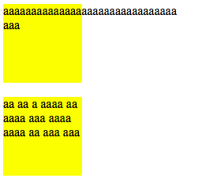
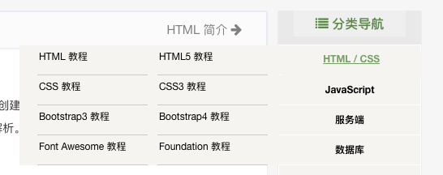
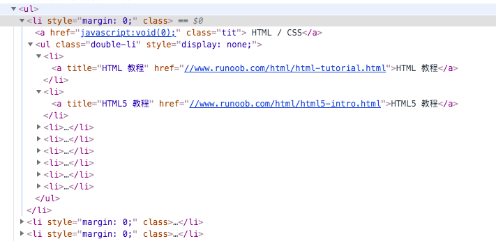
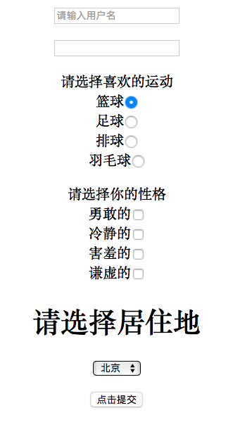

[TOC]

# 1、lang属性

- `<html lang="en">`
  - 告诉搜索引擎（如百度）爬虫，我们的网站是关于什么内容的，更方便它来抓取我们的网页内容
  - 这样写更符合搜索引擎的规范，网页靠前的概率也更大
  - 它是SEO（Search Engine Optimization，搜索引擎优化）技术的一部分
  - 其它SEO例子：
    - `<meta content="关键字" name="keywords">` 
    - `<meta content="关键字描述" name="description">`

# 2、容器div标签和span标签

- html里的容器是`<div>`和`<span>`标签
- 容器的作用：
  - 分块，使网站内容结构化、模块化
  - 捆绑操作，属于同一个容器的内容效果相同，这样操作更简单

# 3、空格符的作用

- 例子如下

  ```html
  <div style="width:100px; height:100px; background-color:yellow">
    aaaaaaaaaaaaaaaaaaaaaaaaaaaaaaaaaa
  </div>
  
  <div style="width:100px; height:100px; background-color:yellow">
    aa aa a aaaa aa aaaa aaa aaaa aaaa aa aaa aaa
  </div>
  ```

  - 效果如下

  

  - 可以看到第一个溢出了，而第二个没有溢出
  - 原因是空格符的一个作用是分隔单词，没有空格符，浏览器就将一串字符认作是一个单词
  - 通常情况下，不管写多少个空格，在浏览器上的效果都是一个空格，它的作用是文本分隔符

# 4、常用的三个html编码

- 空格符：`&nbsp;`    左尖括号：`&lt;`     右尖括号：`&gt;`
- `lt = less than`    `gt = great than`

# 5、有序列表ol标签补充

- `<ol>`标签的两个常用属性是`type`和`start`

- `type`属性用来定义有序列表的序号的表示形式（如数字、字母、罗马数字···）

- `start`属性用来决定列表从第几项开始

- 例子如下：

  <ol type="i" start="2">
    <li>第1项</li>
    <li>第1项</li>
    <li>第1项</li>
  </ol>
  <ol type="A" start="4">
    <li>第1项</li>
    <li>第1项</li>
    <li>第1项</li>
  </ol>

  - `type`属性的常用取值为`1（数字） a（小写字母） A（大写字母） i（小写罗马数字） I（大写罗马数字）`
  - `start`属性的取值为数字

# 6、无序列表ul标签补充

- `<ul>`标签只有一个可改变的属性，即`type`属性，它用来定义无序列表的符号，如下

  <ul type="disc">
    <li>第1项</li>
    <li>第2项</li>
    <li>第3项</li>
  </ul>
  <ul type="circle">
    <li>第1项</li>
    <li>第2项</li>
    <li>第3项</li>
  </ul>
  <ul type="square">
    <li>第1项</li>
    <li>第2项</li>
    <li>第3项</li>
  </ul>

- `<ul>`标签很重要，它有很好的父子结构

  - `<ul>`很适合展示一些大功能的子功能（这些子功能在形式上都差不多，差别比较微小）
  - 比如说该标签最重要的一个功能就是导航栏，例子如下

  

  

# 7、a标签补充

- `<a>`标签的作用如下

  - 超链接（href=hypertext reference）

  - 锚点

  - 移动端打电话/发邮件

    ```html
    <a href="tel:phone_number">链接</a>
    <a href="mailto:mail_address">链接</a>
    ```

  - 作协议限定符，比如在a标签里写JS代码，点击链接时就会执行代码

    ```html
    <a href="javascript:js_code">链接</a>
    ```

# 8、form标签

- 作用：发送数据，将前端的数据发送到后端

  ```html
  <form method="get" action="http://address">
    <!--输入文本框-->
    <p>
        <input 
        type="text" name="username" value="请输入用户名" style="color:#999"
        onfocus="if(this.value=='请输入用户名') 
                 {this.value=''; this.style.color='#424242'}"
        onblur="if(this.value=='') {this.value='请输入用户名'}">
    </p>
    <!--输入密码框-->
    <p>
        <input type="password" name="userpasswd">
    </p>
    <!--单选框-->
    <p>
        请选择喜欢的运动<br>
        篮球<input type="radio" name="hobby" value="basketball" checked="checked"><br>
        足球<input type="radio" name="hobby" value="football"><br>
        排球<input type="radio" name="hobby" value="volleyball"><br>
        羽毛球<input type="radio" name="hobby" value="badmiton">
    </p>
    <!--多选框-->
    <p>
        请选择你的性格<br>
        勇敢的<input type="checkbox" name="character" value="brave"><br>
        冷静的<input type="checkbox" name="character" value="calm"><br>
        害羞的<input type="checkbox" name="character" value="shy"><br>
        谦虚的<input type="checkbox" name="character" value="modest">
    </p>
  
    <!--下拉菜单-->
    <p>
      <h1>请选择居住地</h1>
  	<select name="address">
        <option value="1">北京</option>
        <option value="2">重庆</option>
        <option value="3">安徽</option>
      </select>
    </p>
  
    <!--提交按钮-->
    <p>
        <input type="submit" value="点击提交">
    </p> 
  </form>
  ```

  - `onfocus`属性用于定义鼠标聚焦时的动作

  - `onblur`属性用于定义鼠标离开时的动作

  - 展示效果如下

    

- `submit`类型用于提交表单，提交的方式是method，提交的对象是action
  - 提交数据需要：数据名和数据值
  - 成功提交后，浏览器的url会变化，如下
    - `http://address/username=user&userpasswd=passwd&hobby=football&character=on&character=modest&address=1`