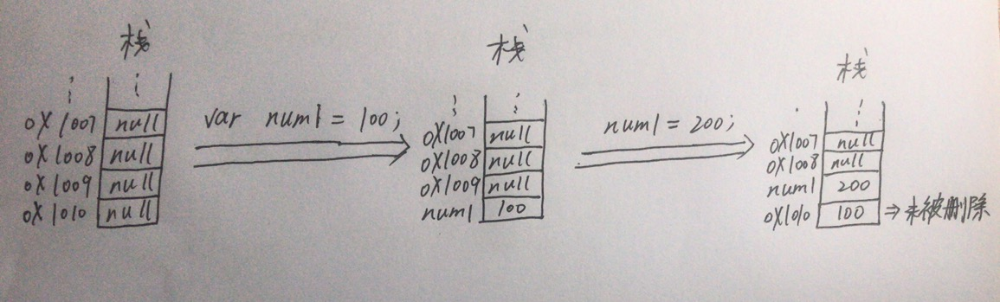
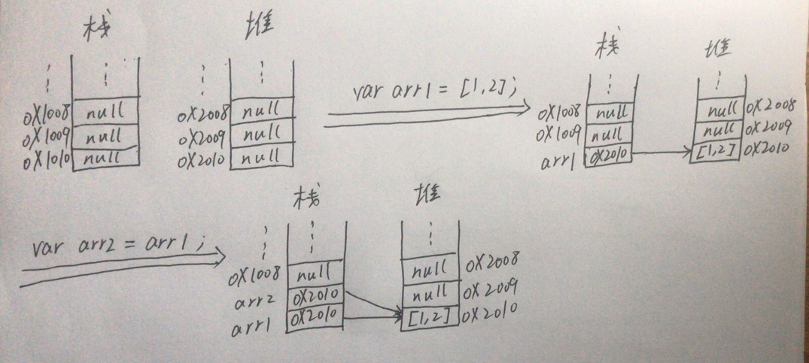

[TOC]

# 一、JavaScript简介

- js的历史
  - LiveScript==>JavaScript（Netscape被Sun收购后，蹭Java热度而改名）-->Netscape（网景公司）-->最开始用于前端验证	
  - JScript-->Microsoft（微软）-->在Netscape推出JavaScript后由微软推出，和JavaScript一样	
  - ECMAScript-->ES-->标准-->不同浏览器厂商对该标准会有不同的实现
- JavaScript构成
  - JavaScript = ECMAScript（ES） + DOM + BOM
- js特点：	
  - 解释型语言
  - 动态语言
  - 基于原型的面向对象
  - 单线程（时间片轮转执行代码）

# 二、JavaScript代码的引入

- 页面级引入：`<script type="text/javascript"> js_code </script>`

  - 这种引入方式可以写在html中的任意地方

- 从外部文件引入：`<script type="text/javascript" src="js_path"></script>`

- 内嵌于标签属性中

  ```html
  <button onclick=" alert('Hello World!'); ">  buttontest  </button>
  <a href=" javascript:alert('Hello World!'); ">  一个链接  </a>
  ```

- 注意：一个`<srcipt>`中不能同时使用前两种引入方式（一个页面可以引入多个js代码）

# 三、变量声明

- 注释

  - `// xxxx`    单行注释		
  - `/* xxxx */`    多行注释

- JS严格区分大小写

- JS每一条语句以分号结尾

- JS自动忽略空格和换行

- 字面量（即数据，不可变）与变量

  - 声明变量 ：使用`var`声明变量

  - 标准写法：单一var模式

    ```javascript
    var n1 = 100,
    	  n2 = 200,
    	  n3,
    	  n4;
    ```

- 标识符，变量名、属性名、函数名等等		

  - 标识符中可以含有字母、数字、_、$		
  - 标识符不能以数字开头		
  - 标识符不能是JS关键字和保留字（如class、enum···）		
  - 标识符一般采用驼峰命名			
    - 驼峰命名法：首字母小写，每个单词首字母大写，如clickButtonWarning		
  - JS底层使用utf-8编码

# 四、数据类型

- JS中一共有6种数据类型	

  - 基本数据类型（原始值）：`String  Number  Boolean  Null  Undefined`	

  - 引用数据类型（引用值）：`Object`，如`array  function`	

  - 区别：原始值赋值是值传递（变量的内容存在栈中），而引用值赋值是地址传递（变量的内容存在堆中）

    - 详细区别请见**目录五**

  - typeof检查数据类型，如

    ```javascript
    >>var a = 12;
    undefined
    >>typeof a;
    "number"
    ```

- 字符串（String）：使用` "string" `或`'string'`，可用转义字符 `\`

- 数值（Number）

  - Number包括整数和浮点数
  - `Number.MAX_VALUE` ==>最大值
    - 如果绝对数值超过`Number.MAX_VALUE`，则返回`Infinity / -Infinity`（无穷大）
  - `NaN`，即Not a Number，也是数值类型
  - 在js中浮点数运算可能不完全精确

- 布尔值（Boolean）：`true / false`

  - 所有类型均可转换为布尔类型
  - `undefined  null  NaN  ""  0` ==> `false`，其它的均为`true`

- Null和Undefined

  - null表示空对象，typeof检查null返回object	
  - undefined表示未定义

# 五、原始值和引用值具体区别

- 栈的数据结构：FILO（先进后出）

- 堆的基本属性：

- 原始值和引用值创建的过程都是先声明（申请空间），后定义（赋值）

- 引用值赋值过程

  - 原始值赋值过程

    

    - 栈中的原始值不可更改
    - 变量的值变化的本质：二次覆盖

  - 引用值赋值过程

    

  - 例子

    ```javascript
    >>var arr1 = [1, 2];
    undefined
    >>var arr2 = arr1;
    undefined
    >>arr1.push(3);
    3
    >>arr1;
    Array(3) [ 1, 2, 3 ]
    >>arr2;
    Array(3) [ 1, 2, 3 ]
    ```

# 六、运算符

- 和c语言基本相同：`+  -  *  /  %  ++  --  +=  -=  *=  /=  %=  >  >=  <  <=  ==  !=`

  - 一个小区别：`+`运算符用在字符串时表示连接

    ```javascript
    >>"a" + "b";
    "ab"
    >>"a" + 1;  // 这里有类型转换
    "a1"
    >>1 + 1 + "a" + 1;
    "2a1"
    ```

  - 一个特例

    ```javascript
    >>NaN == NaN;
    false
    ```

- 逻辑运算符：`&&  ||  !`

  - 逻辑与：从左到右判断值是否为`false`，一旦发现为`false`，返回***该值***，若无`flase`，则返回最后一个值

    ```javascript
    >>0 && 1;
    0
    >>1 && 2 && 3;
    3
    >>1 && undefined && 1;
    undefined
    ```

  - 逻辑货：和逻辑与类似，只是返回的是`true`的值

  - 应用1：短路语句

    - `<判断条件> && <执行语句>`
    - 这种语句是`if`语句的一种简化模式
    - 只有当判断语句的值（或者说返回值）为真时，才会执行后面的代码

  - 应用2：实现兼容

    - `var event = e || window.event;`
    - `e`为非IE浏览器的监听事件（假设如此定义），`window.event`是IE浏览器中的监听事件

  - 应用3：转换为布尔值，即`!! value`

    ```javascript
    >>!! 10;
    true
    >>!! "";
    false
    ```
  
- js中也有三目运算符：`(条件) ? (为真时返回的内容) : (为假时返回的内容)`


# 七、条件语句与循环语句

- 类似c语言

- 条件语句

  ```javascript
  // 第一种
  if (判断条件){
      执行语句;
  }
  
  // 第二种
  if (判断条件){
  	  执行语句1;
  } else {
  		执行语句2;
  }
  
  // 第三种
  if (判断条件1){
  		执行语句1;
  } else if (判断条件2){
  		执行语句2;
  } else if (判断条件3){
  		执行语句3;
  } else{
  		执行语句4;
  }
  
  // 第四种 switch () case语句
  // 也有break和continue
  ```

- 循环语句

  ```javascript
  // 第一种
  for ( var i = 0; i < = 10; i++){
  		执行语句;
  }
  
  // 第二种（底层也是for循环）
  while (判断条件){
  		执行语句;
  }
  ```

# 八、类型转换

## 1、显式类型转换

- 几个用于类型转换的函数，具体使用见例子

  - `Number()`    将字符串转换为数字，严格转换

    ```javascript
    >>Number("100")
    100
    >>Number("100.1")
    100.1
    >>Number("100a")
    NaN
    ```

  - `parseInt()`    将字符串转换为整型数字，匹配开头的数字

    ```javascript
    >>parseInt("123")
    123
    >>parseInt("123.55")
    123
    >>parseInt("123abc")
    123
    >>parseInt("a123abc")
    NaN
    >>parseInt(true)
    NaN
    ```

  - `parseFloat`    将字符串转换为浮点数，类似于`parseInt()`

    ```javascript
    >>parseFloat("12.32")
    12.32
    >>parseFloat("12.32aaa")
    12.32
    >>parseFloat("a12.32aaa")
    NaN
    >>parseFloat(true)
    NaN
    ```

  - `Boolean()`    转换为布尔值（所有空值均转换为`false`）

    ```javascript
    >>Boolean("")
    false
    >>Boolean(" ")
    true
    >>Boolean(0)  // 非0数值转换为true
    false
    >>Boolean(0.0)
    false
    >>Boolean(NaN)
    false
    ```

  - `String()`    将所有非字符串转换为字符串

    ```javascript
    >>String(123)
    "123"
    >>String(123.123)
    "123.123"
    >>String(true)
    "true"
    >>String(NaN)
    "NaN"
    >>String(aaa)
    VM830:1 Uncaught ReferenceError: aaa is not defined
        at <anonymous>:1:8
    ```

  - `toString()`    将数组/布尔值转换为字符串

    ```javascript
    >>[12, 34, 56].toString()
    "12,34,56"
    >>[12, 34, "aaa"].toString()
    "12,34,aaa"
    >>true.toString()
    "true"
    ```

## 2、隐式类型转换

- 各种运算符导致的隐式类型转换其实内部都是调用了显式类型转换
- 如`isNaN()`就是先调用`Number()`转换为数字，再判断是不是NaN
- 注意：`==`会发生隐式类型转换，`===`不会发生隐式类型转换


