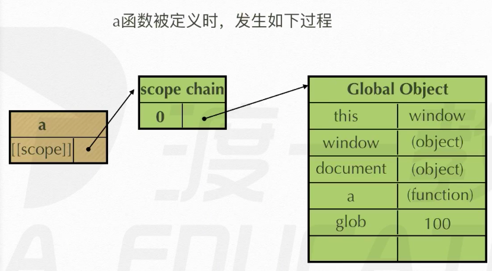
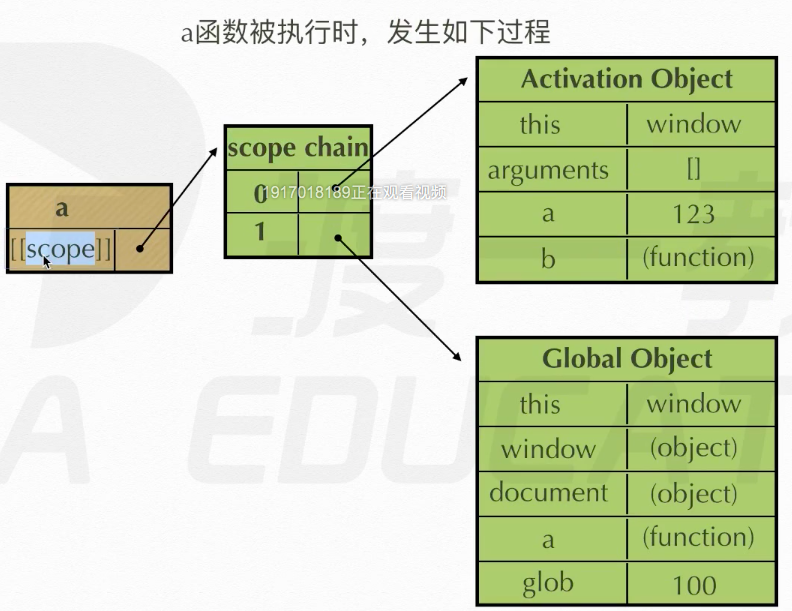
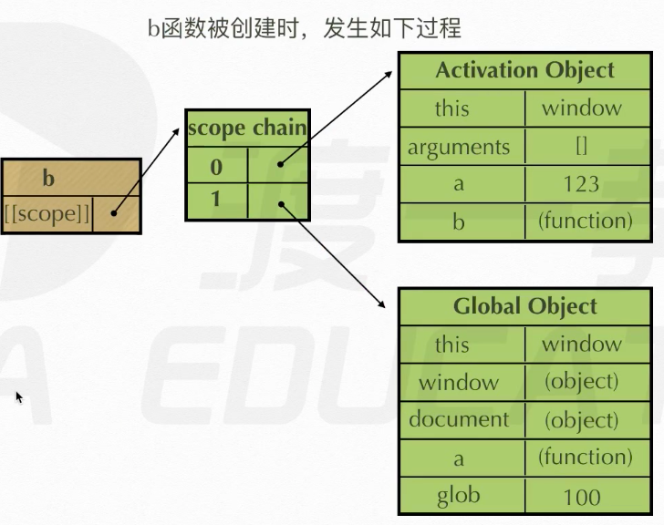
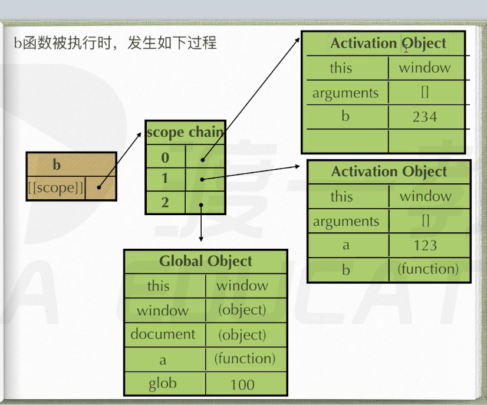

[TOC]

# 一、基本内容

## 1、定义函数

- 定义函数有两种方法，如下

  - 第一种方法是函数声明

    ```javascript
    function demo(){
        console.log("hello");
    }
    demo()
    >> hello  // 函数里的语句执行效果
    ```

  - 第二种方法是函数表达式赋值给变量

    ```javascript
    var test1 = function () {}  // 这是一个匿名函数表达式，常使用这种
    var test2 = function demo() {}  // 这是一个命名函数表达式
    test1.name  // 二者的区别在于函数变量的name属性的值
    >> "test1"
    test2.name
    >> "demo"
    
    // 还有一种，本质上也是函数表达式
    var test3 = new Function ("console.log('hello')") 
    test3()
    >> hello
    ```

## 2、参数（实参和形参）

- js中函数实参和形参个数可以不匹配

- 在每个函数中都有一个实参列表，装着所有实参的值

  ```javascript
  function test(p1, p2) {
      console.log(p1, p2);
      console.log(arguments);
  }
  test(1)
  >> 1 undefined  // 可以看到由于第二个实参没有，所以输出为undifined
  >> Arguments [1, callee: ƒ, Symbol(Symbol.iterator): ƒ]
  test(1, 2)
  >> 1 2
  >> Arguments(2) [1, 2, callee: ƒ, Symbol(Symbol.iterator): ƒ]
  test(1, 2, 3)
  >> 1 2
  >> Arguments(3) [1, 2, 3, callee: ƒ, Symbol(Symbol.iterator): ƒ]
  ```

- 看实参和形参的个数

  ```js
  function test(p1, p2) {
      console.log(arguments.length);  // 看实参个数
  }
  test(1, 2)
  >> 2
  test(1, 2, 3, 4)
  >> 4
  test.length  // 看形参个数
  >> 2
  ```

- 实参和形参的映射规则

  - 形参和arguments互相绑定，同时变化

    ```javascript
    function test(a) {
        a = 2;
        console.log(arguments[0]);
        arguments[0] = 3;
        console.log(a);
    }
    test(10)
    >> 2  // arguments[0]随着a变化而变化
    >> 3  // a随着arguments[0]变化而变化
    ```

  - 注意：只有当实参和形参对应时，才会有映射

## 3、返回值

- 函数遇到`return`终止，若不写，系统会自动加上

- 不能返回多个值，但是返回多个值不报错，如下

  ```javascript
  function test() {
      return 0, 1, 2;  // 仅会返回最后一个值
  }
  test()
  >> 2
  function test() {
      return 0, 1, "abc";
  }
  test()
  >> "abc"
  ```

# 二、预编译

## 1、js运行过程以及全局变量

- 浏览器执行js文件的过程如下

  - 第一步：语法分析，在执行解释之前，会通篇扫描一遍
  - 第二步：预编译
  - 第三步：执行，js是解释型语言，执行的过程是解释一句执行一句

- 以下两种变量为全局变量

  - 第一种：任何未声明就赋值的变量为全局变量（称为暗示全局变量，即`imply global`）
  - 第二种：全局中声明/未声明的变量都是全局变量

- 全局变量即`window`对象的属性，如下

  ```javascript
  a = 10
  >> 10
  window.a
  >> 10
  var b = 100
  window.b
  >> 100
  function test() {
      var num1 = num2 = 1000;
  }
  test()
  window.num1  // num1是在函数内部声明的，所以num1是test的局部变量
  >> undefined
  window.num2  // num2未声明，所以是全局变量
  >> 1000
  ```

- 全局中不能访问局部变量，局部中可以访问全局变量

## 2、预编译过程

- 预编译的作用如下（理解即可，重点在于预编译的过程）

  - 函数声明整体提升
  - 变量声明提升（注意：仅提升变量声明，未提升变量的定义/赋值）
  - 提升的含义：在执行语句之前，即预编译的过程中，把所有的函数声明和变量（无论该变量是全局变量还是局部变量）声明都提升到最前面

- 函数的预编译过程（预编译发生在函数执行的前一刻）

  - 第一步：创建一个AO对象（Activation Object），也叫执行期上下文

  - 第二步：找函数形参和函数里的变量声明，将形参和变量作为AO的属性，赋值为`undefined`

  - 第三步：将实参和形参统一，即把实参的值赋给AO对象的对应的形参属性

  - 第四步：在函数体里面找到函数声明（即函数里的函数），将该内部函数的名字作为AO对象的属性，值为该函数的函数体

  - 具体例子：

    ```javascript
    function test(a) {
        console.log(a);  // 此时a为函数
        var a = 100;  // 在预编译中被提前
        console.log(a);  // 因为执行了a = 100，所以此时a为100
        function a() {}  // 在预编译中被提前
        console.log(a);  // a仍为100
        var b = function() {}  // b的声明和函数的声明都在预编译中被提前
        console.log(b);  // b经过预编译后为函数
    }
    
    test(1)
    >> ƒ a() {}
    >> 100
    >> 100
    >> ƒ () {}
    // 分析一下函数预编译的过程
    // 首先，创建AO对象，如下
    // 第二步过程：
    // AO {
    //   a: undefined,
    //   b: undefined
    // }
    // 第三步过程：
    // AO {
    //   a: 1,
    //   b: undefined
    // }
    // 第四步过程：
    // AO {
    //   a: function a() {},
    //   b: function() {}
    // }
    ```

- 全局的预编译过程

  - 预编译的过程不仅发生在函数中，也发生在全局中
  - 类似地，全局预编译也会创建一个GO（Global Object），而且`GO === window`
  - GO对象的创建过程与AO对象的创建过程类似，且先生成GO，后生成AO

  - 例子如下

    ```javascript
    function test() {
        console.log(b);
        if (a){
            var b = 100;
        }
        console.log(b);
        c = 200;
        console.log(c);
    }
    var a;
    test()  // 此时a还是undefined
    >> undefined
    >> undefined
    >> 200
    
    a = 10  // 这里a的值变为10
    console.log(window.c)  // 为什么全局中能访问到c，因为c未声明便定义，所以c是全局变量
    >> 200
    
    // 分析过程
    // 首先是GO的创建，最终结果（预编译完成后，执行语句之前）如下
    // GO {
    //   a: undefined,
    //   test: function () {函数体}
    // }
    // AO的内容如下（预编译完成后，执行函数之前）
    // AO {
    //   b: undefined  无论声明在何处，都会被提前
    // }
    ```


# 三、作用域

## 1、执行期上下文

- 当函数执行时，会创建一个称为执行期上下文的内部对象，一个执行期上下文定义了一个函数执行时的环境，函数每次调用时，对应的执行期上下文都是独一无二的，所以多次调用一个函数会创建多个执行期上下文，当函数执行完毕时，它所产生的执行期上下文被销毁

## 2、作用域链

- 每个js函数也是一个对象，即函数也有属性和方法，
- 属性分为两种
  - 可访问的属性，如`function.name`
  - 不可访问的属性，如`fucntion.[[scope]]`
- 不可访问的属性，仅供javascript引擎存取，`[[scope]]`就是其中一个，也即所谓的作用域，其中存储了执行期上下文的集合
- 作用域链：`[[scope]]`中所存储的执行期上下文对象的集合，这个集合呈链式结构，称为作用域链

## 3、作用域链的例子

- 例子1的代码如下

  ```javascript
  function a() {
    function b() {
      var b = 234;
    }
    var a = 123;
  }
  
  var glob = 100;
  a();
  
  过程如下：
  1、a被定义时：a.[[scope]] == 0: GO
  2、a被执行时：a.[[scope]] == 0: a的AO, 1: GO
  	 // 重点：查找变量时，从作用域链的顶端自上而下查找，这也是为什么，在函数内部查找变量找不到时，会到全局作用域中查找
  3、b被定义时：b.[[scope]] == 0: a的AO, 1: GO
  	 // 重点：b被创建时，由于函数b在函数a的内部被定义，所以b一开始的作用域链是a的作用域链（引用），这也是为什么作用域越内层的可以访问的变量越多，可以理解为站在巨人的肩膀上
  4、b被执行时：b.[[scope]] == 0: b的AO, 1: a的AO, 2: GO
  5、函数执行完毕后，函数a的AO被销毁（实际上是函数a到a的AO的引用被销毁，若函数b被保存下来，b的[[scope]]中还是有a的AO的引用，这就是闭包的原理，但是在本例子中，a执行完以后，b未被执行，所以b的[[scope]]未被保存，那么就无法拿到a的AO了）
  ```
  
- 过程如下
  









- 例子2的代码如下

  ```javascript
  function a() {
    function b() {
      function c() {
      }
      c();
    }
    b();
  }
  
  a();
  
  
  过程如下
  1、a 定义 a.[[scope]] == 0: GO
  2、a 执行 a.[[scope]] == 0: a的AO, 1: GO
  3、b 定义 b.[[scope]] == 0: a的AO, 1: GO  // b定义时拿的是a的[[scope]]
  4、b 执行 b.[[scope]] == 0: b的AO, 1: a的AO, 2: GO
  5、c 定义 c.[[scope]] == 0: b的AO, 1: a的AO, 2: GO  // c定义时拿的是b的[[scope]]
  6、c 执行 c.[[scope]] == 0: c的AO, 1: b的AO, 2: a的AO, 3: GO
  ```

# 四、闭包

## 1、立即执行函数

- 立即执行函数：普通的函数被定义后，会保存到内存中，调用时函数语句被执行，直到函数执行完以后，被该函数占用的内存空间才被释放；特别地，有一种函数叫做立即执行函数，这种函数只被执行一次，执行完以后立即被销毁，这种函数常用于做初始化功能
- 两种常用的立即执行函数
  - `(function (形参) {} (实参));`     这种事w3c建议的
  - `(function (形参) {}) (实参);`
- 立即执行函数也可以有返回值，如`var t = (function () {} ());`

## 2、立即执行函数的原理

- 实际上，立即执行函数并不是一种新语法，而是一种原本语法的应用
- 下面用几个例子来说立即执行函数的原理
  - 例子一：`var test = function () {} ();`
    - `function () {}`本来是函数声明，只是一个普通函数，但是加上赋值语句后，这个就变成了一个函数表达式，于是该函数可以立即执行
  - 例子二：`!(function () {}) ()`
    - 原理同上，也是将函数声明变成一个函数表达式
  - 例子三：`(funciton () {} ())`
    - 外面的括号（这个括号是数学表达式）使里面的声明变成了表达式
- 总结：被执行符号（如`! + -`）执行的函数表达式会被忽略名字，变成立即执行函数

## 3、闭包简单介绍

- 闭包：当内部函数被保存到外部时（有点像python中的高阶函数），将会生成闭包，闭包会导致原有作用域链不释放，造成内存泄漏

- 内存泄漏：即内存被占用，也就是可用的内存变少

- 代码如下

  ```javascript
  function a() {
    function b() {
      var bbb = 234;
      console.log(aaa);  // 当b()执行到这一句时，会从b到[[scope]]中找aaa，由于b的AO中并没有aaa，便会到a的AO中去找aaa（查
      				   // 找变量时是从[[scope]]自上向下查找），于是在a的AO找到了aaa，这是闭包的一个效果——本来a函数执行完
      				   // 以后，是不能再访问到a的作用域中的变量，但是通过闭包，可以保存a的AO
    }
    var aaa = 123;
    return b;
  }
  
  var glob = 100;
  var demo = a();
  	// a执行完后，a的作用域链不再指向a的AO，但是由于a返回了b函数给demo，所以b的执行期（指向了a的AO）上下文被保存到demo的
    // [[scope]]中
  demo();
  	// 在执行demo()时，即执行b()，此时b.[[scope]] == 0: b的AO, 1: a的AO, 2: GO
  ```

## 4、闭包的作用

- 实现共有变量

  ```javascript
  function eater(){
      var food = '';  // 共有变量
      var obj = {
          eat: function (){
              console.log('I have ate ' + food);
              food = '';
          },
          push: function (myFood){
              food = myFood;
          }
      }
      return obj;
  }
  
  var eater1 = eater()
  eater1.push('apple')
  eater1.eat()
  >> I have ate apple
  
  ```

- 可做缓存

- 实现封装，属性私有化

- 模块化开发，防止污染全局变量

## 5、闭包可能导致的问题

- 例子如下

  ```javascript
  function test(){
      var arr = [];
      for (var i = 0; i < 10; i++){
          arr[i] = function (){
              console.log(i + ' ');
          }
      }
      return arr;
  }
  
  var A = test()
  for (var j = 0; j < 10; j++){
      A[j]();
  }
  >> 10 10 10 10 10 10 10 10 10 10  
  ```

  - 理论上应该打印1～9，但是却打印了10个10，这就是闭包导致的
  - test函数抛出了arr数组，该数组保存了test函数的AO对象，里面就有变量i，执行完test函数后，i的值变为10

- 使用立即执行函数解决闭包问题

  ```javascript
  function test(){
      var arr = [];
      for (var i = 0; i < 10; i++){
          (function (j){  // 使用立即执行函数把i当前的值传递给内部的function
              arr[j] = function (){
                  console.log(j + ' ');
              }
          }(i));
      }
      return arr;
  }
  
  var A = test()
  for (var j = 0; j < 10; j++){
      A[j]();
  }
  >> 0 
  >> 1
  >> 2
  >> 3
  >> 4
  >> 5
  >> 6
  >> 7
  >> 8
  >> 9
  ```

  


