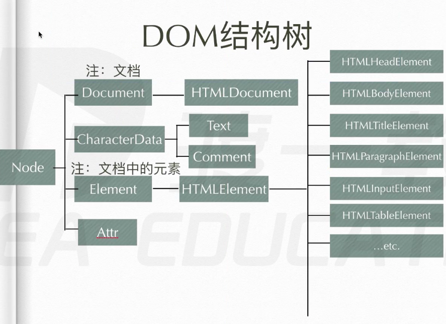
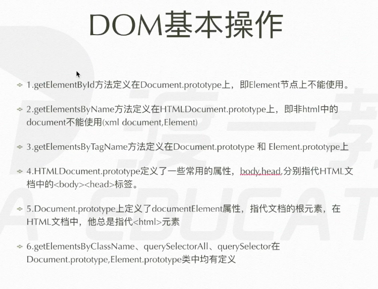

[TOC]

# 1、DOM简介

- DOM：Document Object Model
- js中通过DOM对HTML文档进行操作，Document：HTML文档，Object：网页的每一个节点都转换为了对象，Model：面向对象，用模型来管理对象
- DOM是对HTML和XML的标准编程接口，DOM定义了表示和修改文档所需要的方法，DOM对象即为宿主对象，由浏览器厂商定义，是用来操作html和xml功能的一类对象的集合

- DOM不能改变CSS，这里的CSS指的是样式表，但是可以修改元素节点（也就是标签）的style属性，即可以通过js间接修改样式

# 2、DOM结构树



- 上图中，展示了DOM的结构，图示的树里面的节点都是构造函数，如下

  ```javascript
  Node
  >> function ()
  Document
  >> function ()
  HTMLDocument
  >> function ()
  ```

- 上面的树表示了一种继承关系，即树中的子节点构造函数的原型的`__proto__`指向其父节点构造函数的原型，如下

  ```
  Node.prototype === Document.prototype.__proto__
  >> true
  Document.prototype === HTMLDocument.prototype.__proto__
  >> true
  ```

  - 以document节点对象为例，document是由HTMLDocument构造的，那么document就继承了Document和Node的原型身上的属性和方法，如下

    ```javascript
    document.__proto__.constructor.name
    >> "HTMLDocument"
    document.__proto__.__proto__.constructor.name
    >> "Document"
    document.__proto__.__proto__.__proto__.constructor.name
    >> "Node"
    ```

# 3、DOM基本操作

## （1）节点介绍

- DOM中把html中的标签、注释、文本等等都统称为节点，节点又分为以下几类

  - 元素节点（element）：指的是标签
  - 属性节点（attribute）：指的是标签里的属性
  - 文本节点（text）：指的是两个标签之间的文本
  - 注释节点（comment）：指的是html中的注释
  - document：指的是html文档
  - DocumentFragment

- 例子如下

  ```
  <div>
  		<span></span>
  		<!--这是注释-->
  		<p></p>
  </div>
  ```

  - 在这个div元素节点下面，一共有7个节点，分别如下
    - `<div>`和`<span>`之间：这是一个文本节点
    - `span`标签：这是一个元素节点
    - `</span>`和`<!--这是注释-->`之间：这是一个文本节点
    - `<!--这是注释-->`：这是一个注释节点
    - `<!--这是注释-->`和`<p>`之间：这是一个文本节点
    - `p`标签：这是一个元素节点
    - `</p>`和`</div>`之间：这是一个文本节点

- 节点身上有四个属性和一个方法

  - `nodeName`    元素节点的标签名，只读
  - `nodeValue`    文本节点和注释节点的内容，可读写
  - `nodeType`    节点的类型，该属性的值是一个数字，含义如下
    - `nodeType == 1`    表示该节点为元素节点
    - `nodeType == 2`    表示该节点为属性节点
    - `nodeType == 3`    表示该节点为文本节点
    - `nodeType == 8`    表示该节点为注释节点
    - `nodeType == 9`    表示该节点为document
    - `nodeType == 11`    表示该节点为DocumentFragment

  ```javascript
  nodes = document.childNodes
  nodes.length
  >> 3
  nodes[1].nodeType  // 说明是一个元素节点
  >> 1
  nodes[1].nodeName
  >> "HTML"
  nodes[2].nodeType  // 说明是一个注释节点
  >> 8
  nodes[2].nodeName
  >> "#comment"
  nodes[2].nodeValue  // 注释的内容
  >> "20200622 19:00:15"
  ```

## （2）查找节点

- 首先说一下兼容性的问题，IE9及以上和其它说有浏览器基本一样，没有什么兼容性的问题，主要是IE8及以下有部分兼容性问题

### <1> 查找元素节点

- 查找元素节点一般使用document对象的上的方法查找
  - `document.getElementById()`    通过标签的id属性的值获取该标签
  - `document.getElementsByTagName()`    通过标签的标签名（如div）获取一组标签（为类数组）
  - `document.getElementsByName()`    通过标签的标签名（这个具体指name标签）获取一组标签
  - `document.getElementsByClassName()`    通过标签的属性名获取一组标签
  - `document.querySelector()`    通过css选择器获取一个标签
  - `document.querySelectorAll()`    通过css选择器获取一组标签
- `querySelector`和`querySelectorAll`有一个缺点：它们获取到的内容是静态的，不是实时的
- 上面几个方法中`getElementById, getElementsByName, getElementsByClassName`用的很少

### <2> 遍历节点树

- 遍历节点树找的是所有节点，包括文本节点、元素节点等等
- 这些方法是通过节点之间的关系来查找的，下面的这些都是节点的属性 
  - `parentNode`    找该节点的父节点（最顶端的节点为`#document`）
  - `childNodes`    子节点们
  - `firstChild`    第一个子节点
  - `lastChild`    最后一个子节点
  - `nextSibling`    下一个兄弟节点
  - `previousSibling`    上一个兄弟节点

### <3> 基于元素节点的遍历

- 下面的节点的属性也是通过节点之间的关系查找的，但是只返回元素节点
- 这些属性IE8及以下都不兼容（除了children属性）
  - `parentElement`    父元素节点
  - `children`    子元素节点们
  - `firstElementChild`    第一个子元素节点
  - `lastElementChild`    最后一个子元素节点
  - `nextElementSibling`    下一个兄弟元素节点
  - `previousElementSibling`	上一个兄弟元素节点

### <4> 补充



## （3）修改节点

### <1> 增加节点

- `document.createElement()`    创建一个元素节点
- `document.createTextNode()`    创建一个文本节点
- `document.createComment()`    创建一个注释节点
- `document.createDocumentFragment()`

### <2> 插入节点

- `appendChild()`    插入一个子节点

  - 父节点调用该方法，任何一个元素节点都有该方法
  - 这个方法是一种剪切操作，即原节点会消失，插入是push操作（插入到最后一个）

- `insertBefore(a, b)`    在b节点前面插入a节点（即insert a before b）

  - 该方法也是由父节点调用

  - 自己写一个`insertAfter(a, b)`方法

    ```javascript
    div = document.createElement("div")
    p1 = document.createElement("p")
    p2 = document.createElement("p")
    div.appendChild(p1)
    div.appendChild(p2)
    
    div
    >> <div>
    	 		<p></p>
    	 		<p></p>
    	 </div>
    
    Element.prototype.insertAfter = function (targetNode, afterNode){  // 在原型链上编程
        var beforeNode = afterNode.nextElementSibling;
        if (beforeNode == null){
            this.appendChild(targetNode);
        }
        else {
            this.insertBefore(targetNode, beforeNode);
        }
    }
    
    var span = document.createElement("span")
    div.insertAfter(span, p1)
    div
    >> <div>
    			<p></p>
    			<span></span>
    			<p></p>
    	 </div>
    ```

### <3> 删

- `removeChild()`     删除子节点
  - 该方法由父节点调用
- `remove()`     删除自己
  - 该方法由要删除的节点自身调用，该方法是es5新增的

### <4> 替换

- `replaceChild(new, old)`    用new节点替换old节点
  - 该方法由父节点调用

### <5> 元素节点上的一些属性和方法

- 属性

  - `innerHTML`    元素节点内的内容（全部内容）

  - 该属性可以读、写，写操作是完全覆盖原有内容

    ```javascript
    div
    >> <div>
    			<p></p>
    			<span></span>
    			<p></p>
    	 </div>
    div.innerHTML
    >> "<p></p><span></span><p></p>"
    ```

  - `innerText`    该元素节点内的文本内容（只有文本内容）

  - 该属性也是读、写（覆盖全部内容）操作，使用该方法时一定要注意该元素内部是否有元素节点

  - 在老版本火狐浏览器里该属性为`textContent`

    ```javascript
    div
    >> <div>
    	 		<p>p1**</p>
    	 		<span>hello</span>
    	 		<p>p2**</p>
    	 </div>
    div.innerText
    >> "p1**hellop2**"
    ```

- 方法

  - `setAttribute()`    给元素节点设置属性

    ```javascript
    div
    >> <div></div>
    div.setAttribute("id", "div1")
    div
    >> <div id="div1"></div>
    ```

  - `getAttribute()`    获取元素节点属性

    ```javascript
    div
    >> <div id="div1"></div>
    div.getAttribute("id")
    >> "div1"
    ```

    