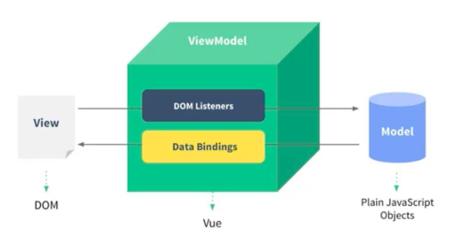

[TOC]

# 1、vuejs安装与引入

- 方式一：直接CDN引入

  ```html
  <!--开发环境版本-->
  <script src="https://cdn.jsdelivr.net/npm/vue/dist/vue.js"></script>
  <!--生产环境版本-->
  <script src="https://cdn.jsdelivr.net/npm/vue"></script>
  ```

- 方式二：下载到本地再引入

  - 下载地址（开发环境）：https://vuejs.org/js/vue.js
  - 下载地址（生产环境）：https://vuejs.org/js/vue.min.js

- 方式三：NPM安装

  - 通过webpack和CLI使用

# 2、几个简单例子

- vuejs是声明式开发，数据和界面完全分离

- 例子1：基本使用

  ```html
  <body>
  	<div id="app"></div>
  
  	<script src="./vue.js"></script>
  	<script>
  		const app = new Vue({
  			el: '#app',  // 用于挂载要管理的元素
  			data: {  
  				message: 'hello, world',
  			}
  		})
  	</script>
  </body>
  </html>
  ```
  
  - 这里重点是创建Vue对象后，`#app`这个元素就交给常量`app`管理了
  - 另外，vuejs是响应式的
  
- 例子2：列表的展示

  ```html
  <body>
  	<div id="app">
  		<ul>
  			<li v-for="item in movies">{{item}}</li>
              <!--获取下标-->
              <li v-for="(item, index) in movies" v-bind:key="index">{{item}}</li>
  		</ul>
  	</div>
  
  	<script src="./vue.js"></script>
  	<script>
  		const app = new Vue({
  			el: '#app',  // 用于挂载要管理的元素
  			data: {  
  				movies: ['海王', '指环王', '霍比特人'],
  			}
  		})
  	</script>
  	
  </body>
  </html>
  ```

  - `v-for`指令只对交给vuejs管理的元素生效

- 例子3：计时器小案例

  ```html
  <body>
  	<div id="app">
  		<h1>计数值：{{counter}}</h1>
  		<!-- <button v-on:click="counter++">+</button> -->
  		<!-- <button v-on:click="counter--">-</button> -->
  		<!-- 可以用@click替代v-on:click -->
  		<button v-on:click="add">+</button>
  		<button v-on:click="sub">-</button>
  	</div>
  
  	<script src="../vue.js"></script>
  	<script>
  		const app = new Vue({
  			el: '#app',
  			data: {
  				counter: 0,
  			},
  			methods: {
  				add: function () {
  					this.counter++;
  				}, 
  				sub: function () {
  					this.counter--;
  				},
  			}
  		})
  	</script>
  </body>
  </html>
  ```
  
  - v-on的语法糖形式：`@click="functionName"`
  - 另外一种添加监听函数的方法：`@click="functionName(parameters)"`，这种写法会直接调用函数
  
- 例子4：vuejs中的proxy（代理）

  ```html
  <body>
  	<div id="app">
  		<h1>计数值：{{counter}}</h1>
  		<button v-on:click="add">+</button>
  		<button v-on:click="sub">-</button>
  	</div>
  
  	<script src="../vue.js"></script>
  	<script>
  		const obj = {
  			counter: 0,
  		}
  		const app = new Vue({
  			el: '#app',
  			data: obj,
  			methods: {
  				add: function () {
  					this.counter++;
  				}, 
  				sub: function () {
  					this.counter--;
  				},
  			}
  		})
  	</script>
  </body>
  </html>
  ```
  
  - vuejs可以实现自动代理

# 3、vue中的MVVM

- MVVM：Model View ViewModel

  - ViewModel是Model和View通信的桥梁

- MVVM结构如下

  
  - View：视图层，展示数据
  - Model：数据层，js中的数据或从服务器请求的数据
  - DOM Listeners监听事件（回调函数）
  - Data Bindings绑定数据（实现响应式）

# 4、创建Vue实例时传入的参数

- el：类型为string或HTMLElement，用于决定管理的元素

- data：类型为Object或Function

- methods：类型为Object，里面定义了一些属于vue的方法

- vue的生命周期

  

  - 生命周期：就是创建Vue实例时经历的事情（如初始化操作等）

  - 生命周期的意义：举个例子，在创建Vue实例时，需要传递el参数，那么有些操作在el未传入时就不能做

  - 生命周期作用：当我们在创建Vue实例时传入的options里有函数，那么在生命周期的某个时间就会调用我们传入的函数（比如下例中的beforeCreated和created函数，那么Vue里面会自动调用这两个函数，并且beforeCreated函数会在created函数之前被执行）
  
    ```javascript
    new Vue({
        el: '#app',
        data: {},
        methods: {},
        beforeCreated: function () {},
        created: function () {},
  })
    ```
  
    - 一般在created函数做一些网络请求
    - 这些被回调的函数也被称为钩子函数

# 5、插值操作

- mustache语法也叫大括号语法

- 例子：在mustache语法中可以写变量和表达式

  ```html
  <body>
  	<div id="app">
  		{{lastName + '-' + firstName}} <br>
  		{{num * 2}}
  	</div>
  
  	<script src="./vue.js"></script>
  	<script>
  		const app = new Vue({
  			el: '#app',  // 用于挂载要管理的元素
  			data: {  
  				firstName: 'dream',
  				lastName: 'xzj',
  				num: 100,
  			}
  		})
  	</script>
  </body>
  </html>
  ```

# 6、指令的使用

- 例子1：v-once

  - 作用：取消响应式，即后端数据改变，前端显示的数据不变（元素和组件只渲染一次，不会随着数据的改变而改变）

  ```html
  <div id="app">
  	<h2 v-once>这里面的数据不是响应式的：{{msg}}</h2>	
  </div>
  <script src="./vue.js"></script>
  <script>
      const app = new Vue({
          el: '#app',  // 用于挂载要管理的元素
          data: {  
              msg: 'hello',
          }
      })
  </script>
  ```

- 例子2：v-html

  - 作用：解析字符串为html

  ```html
  <div id="app">
  	<h2 v-html="url">{{url}}</h2>
  </div>
  <script src="./vue.js"></script>
  <script>
      const app = new Vue({
          el: '#app',  // 用于挂载要管理的元素
          data: {  
              url: '<a href="http://www.baidu.com">百度一下</a>'
          }
      })
  </script>
  ```

- 例子3：v-text

  - 作用：类似mastache，就是显示文本

  ```html
  <div id="app">
  	<h2 v-text="msg"></h2>	
  </div>
  <script src="./vue.js"></script>
  <script>
      const app = new Vue({
          el: '#app',  // 用于挂载要管理的元素
          data: {  
              msg: 'hello',
          }
      })
  </script>
  ```

- 例子4：v-pre

  - 作用：原样显示内容而不做解析

  ```html
  <div id="app">
  	<h2 v-pre>这里面的内容原封不动地显示：{{msg}}</h2>	
  </div>
  <script src="./vue.js"></script>
  <script>
      const app = new Vue({
          el: '#app',  // 用于挂载要管理的元素
          data: {  
              msg: 'hello',
          }
      })
  </script>
  ```

- 例子5：v-cloak

  - 作用：防止vue的js代码解析阻塞，导致用户看到源码 

  ```html
  <!DOCTYPE html>
  <html lang="en">
  <head>
  	<meta charset="UTF-8">
  	<meta name="viewport" content="width=device-width, initial-scale=1.0">
  	<title>Document</title>
  	<style>
  		[v-cloak] {
  			display: none;
  		}
  	</style>
  </head>
  <body>
  	<div id="app" v-cloak>
  		在vue解析之前，有属性v-cloak；在vue解析之后，删除属性v-cloak
  	</div>
  	<script src="./vue.js"></script>
  	<script>
  		// vue代码
  	</script>
  </body>
  </html>
  ```


# 7、v-bind指令

- 作用：动态绑定标签的属性（如a标签的href属性，img标签的src属性）

- 例子1

  ```html
  <body>
  	<div id="app" v-cloak>
  		<a v-bind:href="linkUrl">百度一下</a>
          <!--语法糖（简写）形式如下-->
          <a :href="linkUrl">百度一下</a>
  	</div>
  	<script src="./vue.js"></script>
  	<script>
  		const app = new Vue({
  			el: '#app',
  			data: {
  				linkUrl: 'https://www.baidu.com'
  			}
  		})
  	</script>
  </body>
  </html>
  ```

- 例子2：v-bind动态绑定class属性（绑定的不是字符串，而是一个对象）

  ```html
  <!DOCTYPE html>
  <html lang="en">
  <head>
  	<meta charset="UTF-8">
  	<meta name="viewport" content="width=device-width, initial-scale=1.0">
  	<title>Document</title>
  	<style>
  		.active {
  			color: red;
  		}
  		.hide {
  			display: none;
  		}
  	</style>
  </head>
  <body>
  	<div id="app" v-cloak>
  		<div v-bind:class='{active: isActive, hide: isHide}'>
  			hello
  		</div>
  		<button v-on:click='btnEvent'>点击变色</button>
  	</div>
  	<script src="./vue.js"></script>
  	<script>
  		const app = new Vue({
  			el: '#app',
  			data: {
  				isActive: true,
  				isHide: false,
  			},
  			methods: {
  				btnEvent: function () {
  					this.isActive = !this.isActive;
  				},
  			},
  		})
  	</script>
  </body>
  </html>
  ```

  - 这种绑定方式叫做对象语法（绑定的是一个对象）
  - 注意：vue中的动态绑定class属性不会覆盖静态的class属性，而是合并动态的和静态的

- 例子3：动态绑定class（绑定一个函数）

  ```html
  <!DOCTYPE html>
  <html lang="en">
  <head>
  	<meta charset="UTF-8">
  	<meta name="viewport" content="width=device-width, initial-scale=1.0">
  	<title>Document</title>
  	<style>
  		.active {
  			color: red;
  		}
  		.hide {
  			display: none;
  		}
  	</style>
  </head>
  <body>
  	<div id="app" v-cloak>
  		<div v-bind:class='getClasses()'>
  			hello
  		</div>
  	</div>
  	<script src="./vue.js"></script>
  	<script>
  		const app = new Vue({
  			el: '#app',
  			data: {
  				isActive: true,
  				isHide: false,
  			},
  			methods: {
  				getClasses: function () {
  					return {active: this.isActive, hide: this.isHide}
  				},
  			},
  		})
  	</script>
  </body>
  </html>
  ```

- 例子4：动态绑定style，即css属性（组件化开发常用）

  - 对象语法

    ```html
    <body>
    	<div id="app">
            <!--注意：CSS属性名只能用驼峰命名-->
    		<h2 :style="{fontSize: '50px'}">hello</h2>
    		<h2 :style="{fontSize: size}">hello</h2>
    	</div>
    	<script src="./vue.js"></script>
    	<script>
    		const app = new Vue({
    			el: '#app',
    			data: {
    				size: '100px',
    			},
    		})
    	</script>
    </body>
    </html>
    ```

  - 数组语法

    ```html
    <body>
    	<div id="app">
    		<h2 :style="[style1, style2,]">hello</h2>
    	</div>
    	<script src="./vue.js"></script>
    	<script>
    		const app = new Vue({
    			el: '#app',
    			data: {
    				style1: {
    					fontSize: '100px',
    					color: 'red',
    				},
    				style2: {
    					backgroundColor: 'blue',
    				},
    			},
    		})
    	</script>
    </body>
    </html>
    ```

# 8、计算属性

- 计算属性即在创建Vue对象时，通过computed定义一些属性

- 基本使用

  ```html
  <body>
  	<div id="app">
  		<div>{{fullName}}</div>
  	</div>
  	<script src="./vue.js"></script>
  	<script>
  		const app = new Vue({
  			el: '#app',
  			data: {
  				firstName: 'aaa',
  				lastName: 'bbb',
  			},
  			computed: {
  				fullName: function () {
  					return this.firstName + '.' + this.lastName;
  				}
  			}
  		})
  	</script>
  </body>
  </html>
  ```

- 高级使用

  ```html
  <body>
  	<div id="app">
  		<div>总价格为 {{totalPrice}} 元</div>
  	</div>
  	<script src="./vue.js"></script>
  	<script>
  		const app = new Vue({
  			el: '#app',
  			data: {
  				books: [
  					{id: 100, name: '001', price: 100},
  					{id: 101, name: '002', price: 132},
  					{id: 102, name: '003', price: 321},
  				],
  			},
  			computed: {
  				// totalPrice: function () {
  				// 	let totalPrice = 0;
  				// 	for (let i in this.books) {
  				// 		totalPrice += this.books[i].price;
  				// 	}
  				// 	return totalPrice;
  				// }
                  // ES6的写法
  				totalPrice: function () {
  					let totalPrice = 0;
  					for (let ele of this.books) {
  						totalPrice += ele.price;
  					}
  					return totalPrice;
  				}
  			}
  		})
  	</script>
  </body>
  </html>
  ```
```
  
- 例子3：计算属性的真实写法

  ```html
  <body>
  	<div id="app">
  		<div>总价格为 {{totalPrice}} 元</div>
  	</div>
  	<script src="./vue.js"></script>
  	<script>
  		const app = new Vue({
  			el: '#app',
  			data: {
  				books: [
  					{id: 100, name: '001', price: 100},
  					{id: 101, name: '002', price: 132},
  					{id: 102, name: '003', price: 321},
  				],
  			},
  			computed: {
  				totalPrice: {
  					// 一般不写，因为计算属性是只读属性
                    // 当我们改变计算属性（这里就是totalPrice）时，就会调用set方法  
  					set: function () {
  
  					},
  					// 实际上是调用了get方法
  					get: function () {
  						let totalPrice = 0;
  						for (let ele of this.books) {
  							totalPrice += ele.price;
  						}
  						return totalPrice;
  					}
  				}
  			}
  		})
  	</script>
  </body>
```

  - `set: function (newVal)` 需要参数，当改变计算属性时，等式右边的值就会传入，如 `app.totalPrice = 100` 时，就会调用`set: function (100)`

- 计算属性与methods的对比（计算属性的缓存机制）

  - methods的性能比computed差，后者只会执行一次get方法（当computed里的属性，如totalPrice改变时也会执行）

  - 例子如下：多次调用methods和计算属性对比

    ```html
    <body>
    	<div id="app">
    		<!-- 这里使用methods调用了四次方法 -->
    		<div>总价格为 {{getTotalPrice()}} 元</div>
    		<div>总价格为 {{getTotalPrice()}} 元</div>
    		<div>总价格为 {{getTotalPrice()}} 元</div>
    		<div>总价格为 {{getTotalPrice()}} 元</div>
    		<!-- 这里同样使用了四次计算属性 -->
    		<div>总价格为 {{totalPrice}} 元</div>
    		<div>总价格为 {{totalPrice}} 元</div>
    		<div>总价格为 {{totalPrice}} 元</div>
    		<div>总价格为 {{totalPrice}} 元</div>
    	</div>
    	<script src="./vue.js"></script>
    	<script>
    		const app = new Vue({
    			el: '#app',
    			data: {
    				books: [
    					{id: 100, name: '001', price: 100},
    					{id: 101, name: '002', price: 132},
    					{id: 102, name: '003', price: 321},
    				],
    			},
    			computed: {
    				totalPrice: {
    					// 一般不写，因为计算属性是只读属性
    					set: function () {
    
    					},
    					// 实际上是调用了get方法
    					get: function () {
    						console.log("this is computed");
    						let totalPrice = 0;
    						for (let ele of this.books) {
    							totalPrice += ele.price;
    						}
    						return totalPrice;
    					}
    				}
    			}, 
    			methods: {
    				getTotalPrice: function () {
    					console.log("this is methods");
    					let totalPrice = 0;
    					for (let ele of this.books) {
    						totalPrice += ele.price;
    					}
    					return totalPrice;
    				}
    			}
    		})
    	</script>
    </body>
    ```

  - 输出结果如下

    ```j
    this is methods
    this is methods
    this is methods
    this is methods
    this is computed
    ```

    

