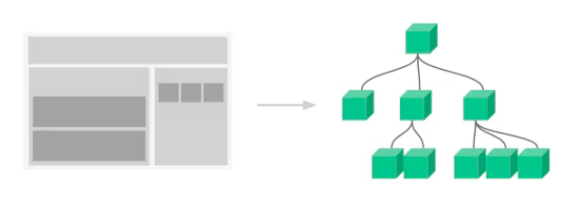
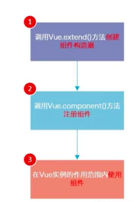

[TOC]

# 1、组件化介绍

- vue组件化的思想：将一个应用分解为多个组件，构成一个组件树，如下

  

- 组件使用的基本步骤

  - 创建组件构造器
  - 注册组件
  - 使用组件

  

- 例子：基本使用

  ```html
  <body>
  	<div id="app">
  		<!-- 3、使用组件 -->
  		<my-cpn></my-cpn>
  	</div>
  
  	<script src="./vue.js"></script>
  	<script>
  		// 1、创建组件构造器对象
  		const cpnConstructor = Vue.extend({  // Vue.extend返回一个组件构造器
  			// ES6中可以反引号代替单引号
              // 注意，当模版中有多个同级标签时，必须有一个root标签包裹这些标签
  			template: `  
  				<div>
  					<h2>标题</h2>
  					<p>内容</p>		
  				</div>
  			`, 
  		});
  		// 2、注册组件
  		Vue.component('my-cpn', cpnConstructor);
  
  		// 组件要在Vue的实例范围内才有作用
  		const app = new Vue({
  			el: '#app',
  			data: {},
  		});
  	</script>
  </body>
  ```

  - 注意：创建构造器和注册组件必须在`new Vue`之前

# 2、组件基本知识

## （1）全局组件和局部组件

- 全局组件：可以在Vue实例里面使用，注册全局组件方法即上面的例子

- 局部组件：只能在一个Vue实例里使用，注册局部组件的方法如下（在实例化的时候注册）

  ```html
  <body>
  	<div id="app">
          <!-- 注意：组件名不区分大小写 -->
  		<my-cpn1></my-cpn1>
  		<my-cpn2></my-cpn2>
  	</div>
  
  	<script src="./vue.js"></script>
  	<script>
  		const cpnConstructor = Vue.extend({
  			template: `
  				<div>
  					<h2>标题</h2>
  					<p>内容</p>		
  				</div>
  			`, 
  		});
  		// Vue.component('my-cpn', cpnConstructor);  // 全局组件
  
  		const app = new Vue({
  			el: '#app',
  			data: {},
  			components: {  // 这里面注册局部组件
  				'my-cpn1': cpnConstructor,
  				'my-cpn2': {
  					template: `
  						<div>
  							<h2>标题</h2>
  							<p>内容</p>		
  						</div>
  					`, 
  				},
  			},
  		});
  	</script>
  </body>
  ```

  - 注意：Vue组件名（即这里的my-cpn1和my-cpn2）不区分大小写，所以最好不要用驼峰命名法

## （2）父组件和子组件

- 例子：

  ```html
  <body>
  	<div id="app">
  		<my-cpn2></my-cpn2>
  	</div>
  
  	<script src="./vue.js"></script>
  	<script>
  		// 子组件
  		const cpnC1 = Vue.extend({
  			template: `
  				<div>
  					<h2>标题1</h2>
  					<p>内容1</p>	
  				</div>
  			`, 
  		});
  		// 父组件：在父组件里可以使用子组件
  		const cpnC2 = Vue.extend({
  			template: `
  				<div>
  					<my-cpn1></my-cpn1>
  					<h2>标题2</h2>
  					<p>内容2</p>		
  				</div>
  			`, 
  			components: {
  				'my-cpn1': cpnC1,
  			},
  		});
  
  		const app = new Vue({
  			el: '#app',
  			data: {},
  			components: {
  				'my-cpn2': cpnC2,
  			},
  		});
  	</script>
  </body>
  ```

  - 可以将new Vue实例的对象看成root组件

## （3）注册组件语法糖

- 例子

  ```html
  <body>
  	<div id="app">
  		<my-cpn1></my-cpn1>
  		<my-cpn2></my-cpn2>
  	</div>
  
  	<script src="./vue.js"></script>
  	<script>
  		// 全局注册语法糖
  		Vue.component('my-cpn1', {
  			template: `
  				<div>
  					<h2>标题1</h2>
  					<p>内容1</p>	
  				</div>
  			`, 
  		})
  
  		const app = new Vue({
  			el: '#app',
  			data: {},
  			// 局部注册语法糖
  			components: {
  				'my-cpn2': {
  					template: `
  						<div>
  							<h2>标题2</h2>
  							<p>内容2</p>	
  						</div>
  					`, 
  				}
  			},
  		});
  	</script>
  </body>
  ```

## （4）组件模版template分离

- 例子

  ```html
  <body>
  	<div id="app">
  		<my-cpn1></my-cpn1>
  		<my-cpn2></my-cpn2>
  	</div>
  
  	<!-- 1、组件模版分离的方法一 -->
  	<script type="text/x-template" id="cpn1">
  		<div>
  			<h2>标题1</h2>
  			<p>内容1</p>
  		</div>
  	</script>
  
  	<!-- 2、组件模版分离的方法二 -->
  	<template id="cpn2">
  		<div>
  			<h2>标题2</h2>
  			<p>内容2</p>
  		</div>
  	</template>
  
  	<script src="./vue.js"></script>
  	<script>
  		Vue.component('my-cpn1', {
  			template: '#cpn1', 
  		});
  		Vue.component('my-cpn2', {
  			template: '#cpn2', 
  		});
  
  		const app = new Vue({
  			el: '#app',
  			data: {},
  		});
  	</script>
  </body>
  ```
  
- 实际项目开发中，是不改动index.html，即index中只有一个标签用于Vue实例挂载（这里即#app），而把index里的内容写成template，并且放到Vue实例里，如下

  ```javascript
  const app = new Vue({
      el: '#app',
      template:`
  		<div>
  			<h2>{{title}}</h2>
  			<p>{{msg}}</p>
  		</div>
  	`,
      data: {
      	title: "标题",
          msg: "内容",
  	},
  });
  ```

  - Vue源码中会把#app用template替换掉，所以最终生成的html中是没有#app的

## （5）组件访问Vue实例的数据data

- 组件是不能直接访问顶层Vue实例里的data数据的

- Vue组件有自己保存数据的地方，即创建组件传入的参数里有一个保存组件数据的地方

- 组件也有data属性，同样也有methods等属性（实际上Vue实例是继承了Vue.extend的）

- 例子1：基本使用

  ```html
  <body>
  	<div id="app">
  		<cpn></cpn>
  	</div>
  
  	<template id="cpn">
  		<div>
  			<h2>{{title}}</h2>
  			<p>{{content}}</p>
  		</div>
  	</template>
  
  	<script src="./vue.js"></script>
  	<script>
  		Vue.component('cpn', {
  			template: '#cpn', 
  			data: function () {
  				return {
  					title: '标题',
  					content: '内容',
  				};
  			},
  		});
  
  		const app = new Vue({
  			el: '#app',
  			data: {},
  		});
  	</script>
  </body>
  ```

  - 注意：组件的data属性必须是函数，且函数返回值必须是一个对象

- 解释：为什么组件的data属性要使用函数而不是对象

  - 因为组件是可以复用的，在复用时，所使用的数据很可能不同
  - 函数有自己的作用域，这样每一个组件实例化都会有自己独立的数据，相同组件之间互不干扰

# 3、组件通信

- 首先，子组件是不能直接访问父组件或者Vue实例的数据的
- 其次，在开发中，又经常有这样的数据请求的需求，所以需要组件通信（往往是数据从上层传递到下层）
- Vue进行组件通信的方法
  - 通过props向子组件传递数据（pass props）
  - 通过事件父组件发送消息（emit event）

## （1）父传子：props基本用法

- 例子1：传递的props为数组

  ```html
  <body>
  	<div id="app">
  		<!-- 注意：v-bind绑定数据不要写到模版template里，而是写到调用组件的地方 -->
  		<cpn :title="title" :content="content"></cpn>
  	</div>
  
  	<template id="cpn">
  		<div>
  			<h2>{{title}}</h2>
  			<p>{{content}}</p>
  		</div>
  	</template>
  
  	<script src="./vue.js"></script>
  	<script>
  		// 此时app相当于父组件
  		const app = new Vue({
  			el: '#app',
  			// 这里的data是父组件的数据
  			data: {
  				title: '标题',
  				content: '内容',
  			},
  			// 这里是app的子组件
  			components: {
  				'cpn': {
  					template: '#cpn', 
  					// 父组件传给子组件的数据（注意要加引号）
  					props: ['title', 'content'],  
  				}
  			}
  		});
  	</script>
  </body>
  ```

- 例子2：传递的props为对象（可以进行类型验证、默认值设置等）

  ```html
  <body>
  	<div id="app">
  		<!-- 注意：v-bind绑定数据不要写到模版template里，而是写到调用组件的地方 -->
  		<cpn :title="title" :content="content"></cpn>
  	</div>
  
  	<template id="cpn">
  		<div>
  			<h2>{{title}}</h2>
  			<p>{{content}}</p>
  		</div>
  	</template>
  
  	<script src="./vue.js"></script>
  	<script>
  		// 此时app相当于父组件
  		const app = new Vue({
  			el: '#app',
  			// 这里的data是父组件的数据
  			data: {
  				title: '标题',
  				content: '内容',
  			},
  			// 这里是app的子组件
  			components: {
  				'cpn': {
  					template: '#cpn', 
  					// 父组件传给子组件的数据（注意要加引号）
  					// props: ['title', 'content'],   // 数组类型
  					// 1、可以进行类型验证
  					// props: {
  					// 	title: String,
  					// 	content: [String, Number],  // 匹配多种数据类型
  					// }
  					// 2、其它操作（如设置默认值）
  					props: {
  						title: {
  							type: String,
  							default: '没有传标题',
  						},
  						content: {
  							type: String,
  							default: '没有传内容',
                              require: true,  // 加上这个则表示必须传值
  						},
  					}
  				}
  			}
  		});
  	</script>
  </body>
  ```

  - 注意：所传值为数组或对象时，默认值必须是一个函数

- 注意点：父传子通信中props驼峰标识

  - 子组件的props可以使用驼峰命名
  - v-bind绑定数据时，需要把props里的驼峰命名转成横杠分割的形式（如`myMsg`转成`my-msg`）
  - 原因是html不区分标签的大小写

## （2）子传父：自定义事件

- 子传父的逻辑如下

  - 子组件通过v-on绑定事件函数
  - 在子组件绑定的事件函数里发送信号（即通过emit实现）给父组件
  - 父组件自定义事件接收子组件发送过来的信号，并给这个自定义事件绑定事件函数

- 关键点：v-on不仅可以监听DOM的原生事件，也可以监听我们的自定义事件

- 例子

  ```html
  <body>
  	<div id="app">
  		<!-- 父组件监听自定义事件 -->
  		<cpn @movie-click="cpnClicked"></cpn>
  	</div>
  
  	<template id="cpn">
  		<div>
  			<!-- 子组件监听原生事件 -->
  			<button v-for="movie in movies" @click="btnClicked(movie.name)">
  				{{movie.name}}
  			</button>
  		</div>
  	</template>
  
  	<script src="./vue.js"></script>
  	<script>
  		const cpn = {
  			template: '#cpn',
  			data: function () {
  				return {
  					movies: [
  						{id: 0, name: '火影忍者'},
  						{id: 1, name: '海贼王'},
  						{id: 2, name: '死神'},
  					],
  				};
  			},
  			methods: {
  				// 这个是绑定的按钮点击事件（子组件绑定原生事件）
  				btnClicked: function(movie) {
                      // 在子组件的事件函数里发送信号给父组件
  					// emit第一个参数是指定触发的父组件的自定义事件，第二参数是父组件自定义事件函数的参数
  					this.$emit('movie-click', movie)
  				}
  			}
  		}
  
  		const app = new Vue({
  			el: '#app',
  			data: {},
  			components: {
  				cpn: cpn,
  			},
  			methods: {
  				cpnClicked: function (movie) {
  					console.log("cpn " + movie + " has been clicked");
  				},
  			},
  		});
  	</script>
  </body>
  ```


## （3）注意事项

- 父子组件实现双向绑定时，子组件不能跨过父组件直接修改父组件的数据，若子组件要修改父组件数据，应该按照如下步骤
  - 首先，子组件v-model绑定的数据应该是data（通过data返回props的数据），而不是props（实现子绑定父）
  - 再者，子组件应该通过emit发送信号给父组件通知父组件修改数据（实现父绑定子）

# 4、父子组件访问

- 父组件访问子组件：使用`$children / $refs`

- 子组件访问父组件：使用`$parent`（不建议这样做）

- `$children`是一个数组（因为可能不止一个子组件），一般不用children访问子组件，而是用refs。例子如下

  ```html
  <body>
  	<div id="app">
  		<!-- 使用组件时给组件标签添加一个ref属性即可在父组件中通过refs访问该子组件 -->
  		<cpn ref="child"></cpn>
  		<button @click="btnCilck">按钮</button>
  	</div>
  
  	<template id="cpn">
  		<div>
  			{{msg}}
  		</div>
  	</template>
  
  	<script src="./vue.js"></script>
  	<script>
  		const app = new Vue({
  			el: '#app',
  			data: {},
  			components: {
  				cpn: {
  					template: '#cpn',
  					data: function () {
  						return {
  							msg: '我是子组件',
  						};
  					}
  				},
  			},
  			methods: {
  				btnCilck: function () {
  					// 通过$refs访问子组件
  					console.log(this.$refs.child);
  				},
  			}
  		});
  	</script>
  </body>
  ```

- 补充：访问根组件使用`$root`

# 5、插槽

- 作用：组件的插槽是为了让我们封装的组件更加有扩展性，让使用者可以决定组件内部的一些内容到底展示什么

- 使用：抽取一类组件的共性，保留不同处为插槽，以便复用 

- 例子1：插槽的基本使用

  ```html
  <body>
  	<div id="app">
  		<cpn> <button>按钮是插槽</button> </cpn>
  		<cpn> <input type="text" value="输入文本框是插槽"> </cpn>
          <cpn> 
              <button>按钮是插槽</button> 
              <input type="text" value="输入文本框是插槽">
          </cpn>
  	</div>
  
  	<template id="cpn">
  		<div>
  			<h2>组件</h2>
  			<slot></slot>  <!--slot标签会被cpn标签里的内容（即 <button>按钮是插槽</button> ）替代-->
  			<!-- <slot> <button>这个是插槽默认值</button> </slot> -->
  		</div>
  	</template>
  
  	<script src="./vue.js"></script>
  	<script>
  		const app = new Vue({
  			el: '#app',
  			data: {},
  			components: {
  				cpn: {
  					template: '#cpn',
  				},
  			},
  		});
  	</script>
  </body>
  ```

- 例子2：具名插槽

  ```html
  <body>
  	<div id="app">
  		<cpn> <button slot="left">按钮是插槽</button> </cpn>
  		<cpn> <input slot="right" type="text" value="输入文本框是插槽"> </cpn>
  	</div>
  
  	<template id="cpn">
  		<div>
  			<slot name="left"> <span>左边的插槽</span> </slot>
  			<slot name="right"> <span>右边的插槽</span> </slot>
  		</div>
  	</template>
  
  	<script src="./vue.js"></script>
  	<script>
  		const app = new Vue({
  			el: '#app',
  			data: {},
  			components: {
  				cpn: {
  					template: '#cpn',
  				},
  			},
  		});
  	</script>
  </body>
  ```

- 例子3：作用域插槽

  - 父组件替换插槽的标签，但是内容由子组件提供

  ```html
  <body>
  	<div id="app">
		<cpn></cpn>	
  		<cpn>
  			<!-- 通过slot-scope取到子组件作用域里的数据（这里是获取data） -->
  			<div slot-scope="slot">
  				<span v-for="item in slot.data">*{{item}}   </span>
  			</div>
  		</cpn>
  	</div>
  
  	<template id="cpn">
  		<div>
  			<!-- data属性可以随便取，data则指向cpn组件作用域的arr -->
  			<slot :data="arr">
  				<ul>
  					<li v-for="item in arr">{{item}}</li>
  				</ul>
  			</slot>
  		</div>
  	</template>
  
  	<script src="./vue.js"></script>
  	<script>
  		const app = new Vue({
  			el: '#app',
  			data: {},
  			components: {
  				cpn: {
  					template: '#cpn',
  					data: function () {
  						return {
  							arr: ['python', 'js', 'html', 'css'],
  						};
  					},
  				},
  			},
  		});
  	</script>
  </body>
  ```
  
  


