[TOC]

# Traditional Knowledge Tracing Models

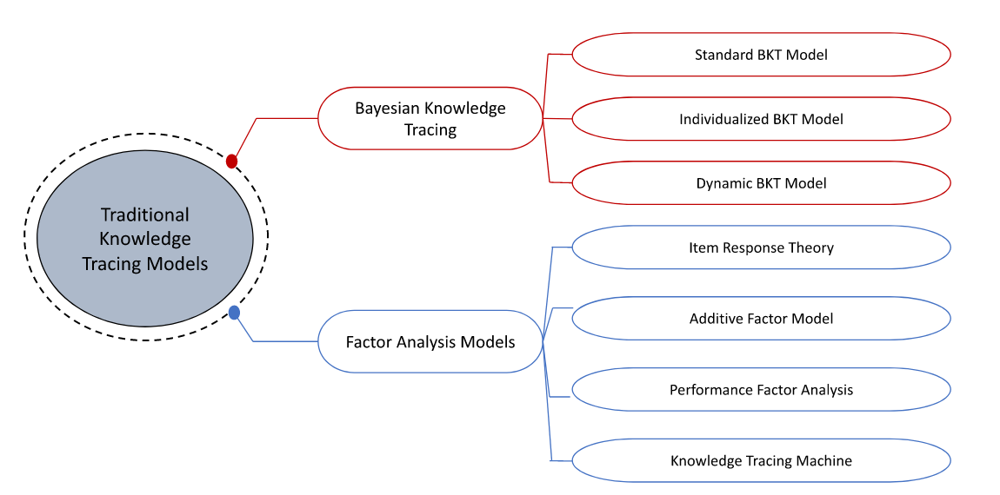

## Bayesian Knowledge Tracing

- 底层模型：概率图模型，如
  - **Hidden Markov Model** [*Ryan Shaun Joazeiro de Baker, Albert T. Corbett, and Vincent Aleven. 2008. More accurate student modeling through contextual estimation of slip and guess probabilities in Bayesian knowledge tracing. In ITS, Vol. 5091. 406–415*]
  - **Bayesian Belief Network** [*Michael Villano. 1992. Probabilistic student models: Bayesian belief networks and knowledge space theory. In ITS, Vol. 608. 491–498*]

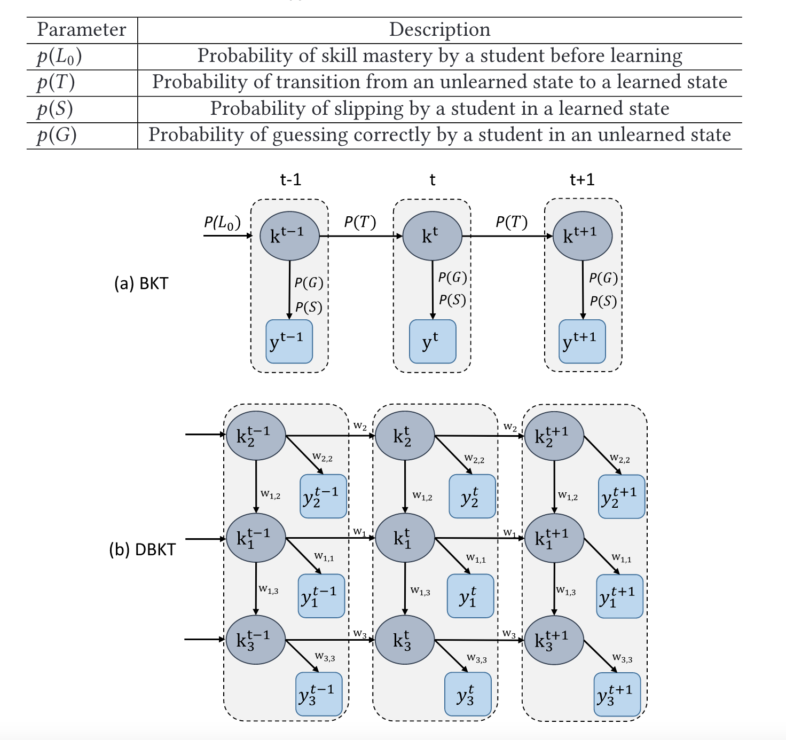

### Standard BKT Model

- 思想
  - 学生在每个知识点的底层知识状态抽象为一个二元变量 {unlearned, learned}
  - 只考虑知识状态从unlearned到learned的转移，不考虑遗忘，即learned到unlearned的转移概率为0
  - 考虑“粗心做错”和“猜对”两种概率

### Individualized BKT Model

- 思想
  - 动机：标准BKT模型假设所有学生在知识点上的先验掌握概率P(L~0~)都相同，并且每个学生的各项能力也相同，不具有个性化
  - 添加个性化参数，提升模型个性化建模学生的能力

- Knowledge tracing: Modeling the acquisition of procedural knowledge；为每个学生个性化标准BKT模型的4个参数
- Modeling individualization in a Bayesian networks implementation of knowledge tracing；启发式地为为每个学生个性化设置其在各个知识点上的先验掌握概率P(L~0~)
- The impact on individualizing student models on necessary practice opportunities；为每个学生个性化标准BKT模型的4个参数

# AKT

- 提出问题
  - 现有的模型/方法不能同时在预测效果和可解释度上都做得很好
    - BKT和基于sigmoid的方法（如IRT）依赖于专家的标注，并且使用专家设计的函数来模拟知识状态的演化和认知诊断，在可解释性上做得很好，但是预测精度却比较低

    - 深度知识追踪模型，比如DKT、DKVMN、SAKT，因为使用了深度神经网络，有非常强的拟合数据能力，在预测精度上做得非常好，但是却不能提供可解释度（如为什么预测学生不能做对某道题，学生在每个知识点上的掌握状态到底如何）

- 具体模型

  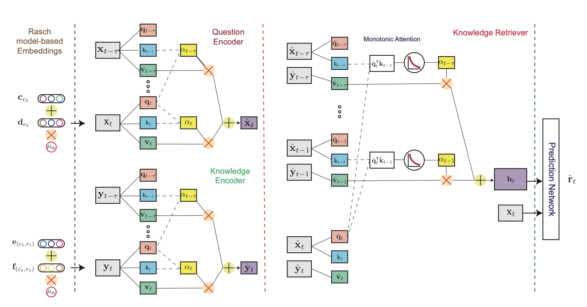

  - 符号解释
    - C表示知识点的数目、Q表示习题的数目、D表示embedding的维度

    - $c_{c_t} \in \mathbb{R}^D$是指t时刻做的习题对应知识点的embedding

    - $d_{c_t} \in \mathbb{R}^D$: a vector that summarizes the variation in questions covering this concept

    - $e_{(c_t,\ r_t)} = (c_{c_t} + g_{r_t}) \in \mathbb{R}^D$，其中$g_{r_t}$表示response的embedding

    - $\mu_{q_t}$是习题的难度系数

- 和SAKT的区别

  - SAKT直接使用原始的embedding（question和question-answer）作为输入，AKT使用的是context-aware的embedding，即在原始的embedding基础上考虑context，使用修改后的embedding作为输入
  - SAKT计算attention score时使用的是dot-scale production，没有考虑遗忘因素，AKT在计算attention score时加入了对时间的指数衰减，并且在计算“时间间隔”时考虑知识点

- 代码

  - loss：交叉熵损失 + rasch部分loss，后者是所有习题难度（scalar）的平方和乘以一个很小的数（代码中是乘的0.00001）


# LPKT

- 提出问题
  1. 现有模型过于追求预测准确率，忽视了学生知识状态变化过程和学习过程的一致性，例如当学生做错了一道知识点a的习题，模型便认为学生在知识点a上的掌握程度下降，这样是不符合认知诊断理论的，因为学生即使做错了题目，也有可能学到东西
- 问题分析：直接在学生学习过程上建模来追踪知识状态有以下问题
  1. 如何将学生的学习过程构建为模型能理解的格式
  2. 学生知识增长和下降的过程是隐式和变化的
- 贡献
- 相关工作
  - 学习增长（learning gain）
    - NLG：$learning\ gain = \frac{post - pre}{1-pre}$，pre是过去的分数，post是现在的分数，两个值均小于1。问题：如果学生pre的分数很高，那么一旦post有一点下降，就会得到非常大的负面learning gain
    - QLG：learning gain只有两种情况，即HIGH和LOW。基于分数将学生分为3组（low/medium/high performance），从low到high为HIGH learning gain，其它情况为LOW learning gain
- 模型所使用的embedding
  - 答题时间**at**和间隔时间**it**
    - 答题时间按秒离散化，间隔时间按分钟离散化（超过一个月按一个月算）
    - $\mathcal{at} \in \mathbb{R}^{d_{at} \times d_k},\ \mathcal{it} \in \mathbb{R}^{d_{it} \times d_k}$
  - learning embedding
    - 即$(e_t, at_t, a_t)$的embedding，其中e表示习题、at表示答题时间、a表示学生回答
    - $e \in \mathbb{R}^{J \times d_e}$，$a \in \mathbb{R}^{d_a}$是全为0或全为1的向量
    - learning embedding通过e、at、a的embedding拼接后送入MLP得到，即$l_t \in \mathbb{R}^{d_k} = W[e_t, at_t, a_t] + b$
  - knowledge embedding
    - $h \in \mathbb{R}^{M \times d_k}$表示学生的知识状态，M表示知识点数目
  - Q-matrix：LPKT所使用的是enhanced Q-matrix，即对于习题e~j~，即使不包含知识点k~m~，Q-matix第j行第m列的值q~jm~不为0，而是一个很小的正值

- 模型结构

  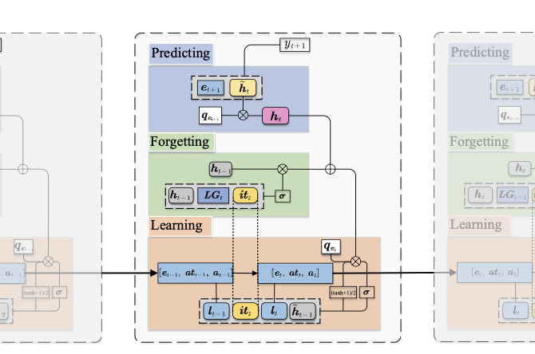

  - Learning Process中使用$(tanh+1) / 2$的原因是要把输出拉到(0,1)之间
  - $lg_t = \frac{tanh(W[l_{t-1},\ it_t,\ l_t\ ,\widetilde{h}_{t-1}] + b)+1}{2}$表示学习的内容
  - $LG_t = lg_t \cdot \sigma(W[l_{t-1},\ it_t,\ l_t\ ,\widetilde{h}_{t-1}] + b)$学生从学习到的内容中能够吸收的部分
  - $\widetilde{LG_t} = q_{e_t}\cdot LG_T$表示相关知识点的学习增长
  - $h_{t-1} \cdot \sigma(W[h_{t-1},\ LG_t,\ it_t] + b)$表示的是过去的知识状态经过遗忘后还剩下的部分
  - $\widetilde{h}_{t-1} = q_{e_t}h_{t-1}$表示对应知识点的状态
  - 代码具体含义
    - 学生t时刻的知识状态$h_t$是矩阵(num_concept * dim_k)
    - 图中forgetting时，是将$LG_t$和$it_t$的维度1重复num_concept次，即从(batch_size, dim_k)变成(batch_size, num_concept, dim_k)，具体含义表示每个知识点遗忘程度相同
    - 图中$\widetilde{h}_{t-1}, \widetilde{h}_{t}$分别表示的是从$h_t$中取出对应$e_t，e_{t+1}$知识点的状态

- 存在的问题

  - 知识衰减速度太快
  - 没有考虑学生已经完全掌握知识点这种情况，即学生对于完全彻底掌握的知识点，遗忘概率是非常小的

- 代码

  - 如果不使用forgetting，就不使用it，反之使用it，即forgetting和it是绑定的


# GIKT

- 提出问题

   1. 现有模型多数是基于学生-知识点建模的（前提的假设是学生对知识点的掌握程度能反映该学生做对该知识点下题目的概率），并没有考虑习题本身的信息（比如习题的难度）
   2. 由于数据集里相当一部分习题只有少部分学生做过，以及相当一部分学生只做过少量习题，所以存在数据稀疏问题，尤其是针对习题建模（如学习习题的表征），数据稀疏是一个比较大的挑战
   3. 对于那些考察相同知识点（有一部分知识点相同，比如题目1考察知识点1、2、3，题目2考察知识点2、3、4）的题目来说，只是简单的增强题目信息（如习题难度），不考虑习题与习题之间、知识点与知识点之间的关系是不够的，会损失一些信息

- 针对部分问题已提出的解决方案

   1. 问题1：使用习题的特征属性作为补充信息和知识点信息一起输入到模型中（如\[5\][^5]）
   2. 难以从长序列中精确捕捉到学生的知识状态（如DKT[^1]和DKVMN[^2]）：**SKVMN[^3]** (hop-LSTM architecture)和**EERNNA[^4]** (attention mechanism)

- 贡献

   1. 使用GCN（习题-知识点的二分图，这个图不是学出来的，是先验知识）来提取习题和知识点之间的高阶关系，以更好地学习习题表征。解决的问题：**数据稀疏**
   2. 提出了Recap module，更好地建模学生对新习题以及该习题相关知识点的掌握程度。解决的问题：**RNN处理长序列时会遗忘信息以及更侧重于最近的隐状态**

- 模型

   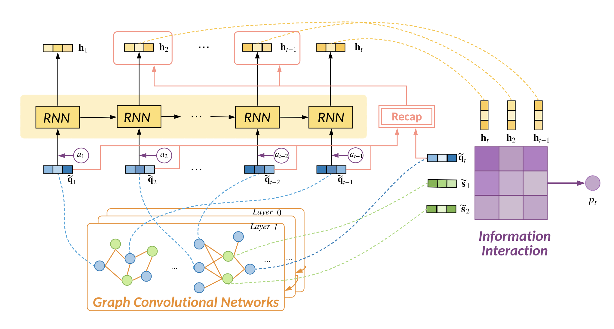

   1. 符号解释

      - $\widetilde{q} \in \mathbb{R}^d,\widetilde{s} \in \mathbb{R}^d$ 通过GCN学出来的习题和知识点的embedding
      - $h_t$ 学生在t时刻的知识状态
      - $a_t \in \mathbb{R}^d$ 学生在t时刻的回答的embedding

   2. 模型各模块解释

      - GCN：图（习题和知识点的二分图）的构建是先验知识，节点（习题和知识点）的embedding更新公式如下
        $$
        x_i^l = \sigma(\frac{1}{|\mathcal{N}_i|} \sum_{j\ \in\ \mathcal{N}_i \cup \{i\}}  w^lx_i^{l-1} + b^l) \nonumber
        $$

      - RNN (LSTM)：输入是$\widetilde{q}$和$a$的拼接投影（公式如下）
        $$
        e_t = ReLU(W_1([\widetilde{q}_t,\ a_t]) + b_1) \nonumber
        $$

      - Recap

        - 出发点：长序列，学生练习相同或者相关习题的时间可能不是连续的，而是分散在整个历史记录里
        - 问题：LSTM处理长序列时会有遗忘以及侧重于最近的输入的问题
        - 解决办法：从学生的历史状态中选择和当前习题相关的知识状态
        - 找相关的知识状态
          - 硬选择：选择和当前习题有共同知识点的习题对应的练习记录，即在二分图中和当前习题节点为两跳关系的节点
          - 软选择：使用attention计算出当前习题和历史练习习题的attention score，选择值最大的k个

      - 预测做对当前习题$q_t$的概率$p_t$
        $$
        \begin{align*}
        p_t & = \sum\limits_{f_i\ \in\ I_h \cup \{h_t\}} \sum\limits_{f_j\ \in\ \tilde{N}_{q_t} \cup \{\tilde{q_t}\}} \alpha_{i,j} g(f_i,f_j) \\
        \alpha_{i,j}  & = Softmax(W^T[f_i,\ f_j] + b)
        \end{align*}
        $$

        - $I_h$是Recap的结果，$\widetilde{N}_{q_t}$是当前习题在图上的邻居节点（知识点），$g$是向量的内积函数，$\alpha$是attention score

- 代码细节（以assist2009为例）

   - `adj_list`：二维数组，前167个列表表示123个知识点对应的习题id，167之后的列表表示习题对应的知识点id
   - `question_neighbors`：形状为(17904, 4)的numpy数组，每道习题对应的知识点（从对应知识点中随机抽取，如果一道习题对应知识点数目小于4，则可以重复抽取，大于等于4则不能重复抽取）
   - `skill_neighbors`：形状为(167, 19)的numpy数组，同理
   - `model.get_neighbors(n_hop, question_index)`：输入是跳数（找几跳的邻居）以及这一个batch（比如bs为64，seq-len为200）的习题id（那么question_index的形状为`(64, 199)`），第1跳找的是skill节点（根据`question_neighbors`找），第2跳找的是question节点（根据`skill_neighbors`找）

- 不足之处：使用二分图构建底层知识点、习题之间的关系图，我认为忽略了习题本身之间的关系，和知识点本身之间的关系。

# GKT

- **Graph-based Knowledge Tracing: Modeling Student Proficiency Using Graph Neural Network**, IEEE WIC ACM International Conference on Web Intelligence (WI), 2019 

  - 作者以及研究团队

    - **Hiromi Nakagawa (The University of Tokyo)**
    - Yusuke Iwasawa (The University of Tokyo)
    - Yutaka Matsuo (The University of Tokyo)

- 提出问题：过去的知识追踪方法/模型没有引入图结构

- 问题分析

  - 引入图结构存在的困难：数据集中没有提供将知识点构建为图的先验知识

- 贡献

  - 将知识追踪任务视为图卷积网络的应用
  - 预测性能提升
  - 可解释度提高，能够解释学生在各个知识点上熟练程度的变化过程（对知识点的理解和所需的时间）
  - 提出了几种构建图结构的方法

- 具体模型

  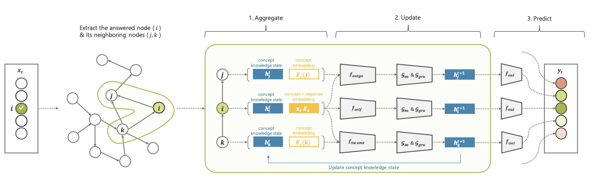

  - 当学生在t时刻回答了一个知识点i的习题，将会发生如下过程

  - 聚合
    $$
    {h'}^t_k = \left\{
    \begin{array}{rcl}
    [h_k^t,\space x^tE_x] \quad , \quad k=i \\
    [h_k^t,\space E_c(k)] \quad , \quad k\neq i 
    \end{array}
    \right. \nonumber
    $$

    - $h_k^t$表示学生t时刻在知识点k上的状态
    - $x^t \in \{0,1\}^{2N}$是输入向量，表示t时刻对应的练习题是否做对，N是知识点的数目，也即图中节点的数目
    - $E_x \in \mathbb{R}^{2N \times e}$是知识点概念索引和习题解答结果的嵌入矩阵，其中e是embeding的维度
    - $E_c \in \mathbb{R}^{N \times e}$是知识点概念索引的嵌入矩阵，$E_c(k)$是该矩阵的第k个行向量
    - $x^tE_x和E_c(k)$分别是interaction和concept的embedding
    
  - 更新
    $$
    \begin{align*}
    m_k^{t+1} & = \left\{
    \begin{array}{rcl}
    f_{self}({h'}^t_k) \quad , \quad k=i \\
    f_{neighbor}({h'}^t_i,\space{h'}^t_k) \quad , \quad k\neq i 
    \end{array}
    \right.  \\
    \widetilde{m}_k^{t+1} & = \mathcal{G}_{ea}(m_k^{t+1}) \\
    h_k^{t+1} & = \mathcal{G}_{gru}(\widetilde{m}_k^{t+1}, h_k^{t}) 
    \end{align*}
    $$

    - $f_{self}$是MLP，$f_{neighbor}$是任意的信息传递函数，代码中是
    - $\mathcal{G}_{ea}$是DKVMN中的erase-add gate，$\mathcal{G}_{gru}$是GRU中的gate，即GKT先用erase-add gate修改知识状态，然后再用GRU更新状态
    - erase-add gate
    
      ```python
      # self.erase和self.add都是Linear(feature_dim, feature_dim)，self.weight是nn.Parameter(torch.rand(num_c))
      erase_gate = torch.sigmoid(self.erase(x))  # [batch_size, num_c, feature_dim]
      tmp_x = x - self.weight.unsqueeze(dim=1) * erase_gate * x
      add_feat = torch.tanh(self.add(x))  # [batch_size, num_c, feature_dim]
      res = tmp_x + self.weight.unsqueeze(dim=1) * add_feat
      ```
    
      
    
  - 预测
    $$
    y_k^{t+1} = \sigma(W_{out}h_k^{t+1}+b_k) \nonumber
    $$

  - 构建图

    - 基于统计的方法：$f_{neighbor}({h'}_i^t, {h'}_j^t) = A_{i,j}f_{out}([{h'}_i^t,\space {h'}_j^t]) + A_{j,i}f_{in}([{h'}_i^t,\space {h'}_j^t])$，其中A是邻接矩阵，f~out~和f~in~是MLP
      - Dense graph：$A_{i,j} = \frac{1}{|V| - 1},\ if\ i \neq j,\ else\ A_{i,j} = 0$
      - Transition graph：$A_{i,j} = \frac{n_{i,j}}{\sum_kn_{i,k}},\ if\ i \neq j,\ else\ A_{i,j} = 0$，其中n~i,j~是练习记录中知识点i和知识点j相继被回答（i在前，j在后，中间不间隔）出现的次数
      - DKT graph：基于DKT计算知识点之间的关系
      
    - 基于学习的方法
      - Parametric adjacency matrix (PAM)：在一定的约束条件下，如满足邻接矩阵的属性条件下，将图的邻接矩阵A中的值当作可学习的参数，随模型优化过程一起学出来
      
      - Multi-head Attention (MHA)：基于节点的特征值，使用multi-head attention推断出两个节点之间的边的属性，两个节点之间边的属性值计算公式如下
        $$
        f_{neighbor}({h'}_i^t,\ {h'}_j^t) = \frac{1}{K} \sum_{k \in K} \alpha_{ij}^k f_k({h'}_i^t,\ {h'}_j^t) \nonumber
        $$
      
        - K是head的个数，$\alpha_{i,j}^k$是i节点（query）和j节点（key）对应head的attention score，$f_k$是第k个head的神经网络（？这里没懂）
      
      - Variational autoencoder (VAE)：假设边的属性是离散值（K种类型，其中一种为“non-edge”），通过解优化问题——最小化最大似然函数和KL散度，求出边的属性值，公式如下
        $$
        f_{neighbor}({h'}_i^t,\ {h'}_j^t) = \sum_{k \in K} z_{ij}^k f_k({h'}_i^t,\ {h'}_j^t) \nonumber
        $$
      
        - $z_{ij}^k$是从Gumbel–Softmax分布中采样出来

- 可解释度分析

  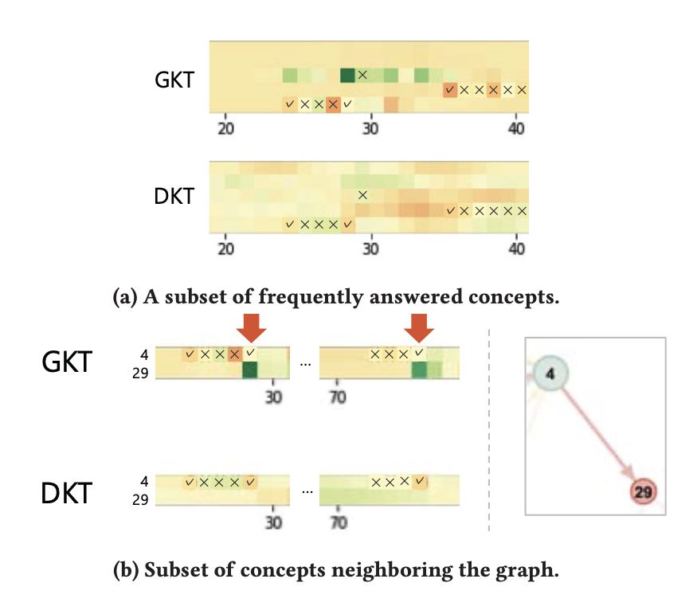

  - 上图中，横轴表示时间，纵轴表示知识点的索引，格子（如坐标为`(28,29)`）的颜色表示在t=28时刻，该学生对知识点29掌握程度的变化，绿色表示掌握程度增加，红色表示掌握程度降低，格子里的符号（✅或❌）表示在该时刻回答对应知识点题目结果
  - 图（a）
    - GKT在更新学生知识点状态时，只更新和此刻回答的问题相关的知识点（题目所直接对应知识点以及和该知识点相关的其它知识点）。从图中可以明显看出第3个知识点和第5个知识点相关，如t=24和t=28时刻，该学生都做对了第5个知识点的题目，模型就认为学生在第3个知识点上的掌握程度也有所增加，而且其它无关的知识点就没有变化
    - DKT在更新学生知识点状态时，不仅会更新直接相关的知识点，其它无关的知识点状态也会被更新，即DKT在更新学生知识点状态时含义不明确。
  - 图（b）：左边图的含义和（a）图类似，右边的图是模型学出来的图（从图中可以看出知识点4和知识点29相关）。可以看出来GKT确实能根据底层的知识点图结构更新学生对应的知识点状态，但是DKT就不行

- 实验效果

  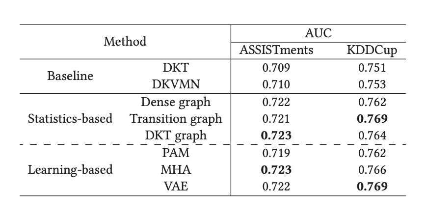

- 不足之处：从实验结果中可以看出，基于统计和基于学习的构建图的方法效果基本一样，作者给出的解释是在估计边的属性时，引入的一些限制条件导致了效果差异。但是这一点我不太认同，因为基于学习的方法效果和Dense graph（将所有边的权值设为一样）差不多，这显然是反直觉的，我认为更有可能的是这几种构建图的方法并没有比较好地捕捉到知识点之间的关系。而且从可解释度分析那里可以看出DKT学出来的知识状态是基本不可解释的，那么依赖于DKT（先修关系）学出来的图自然也不可靠


# JKT

-  **JKT: A joint graph convolutional network based Deep Knowledge Tracing**, Information Sciences(Elsevier), 2021
  - 作者以及研究团队
    - **Xiangyu Song (Deakin University)**
    - Jianxin Li (Deakin University, Corresponding author)
    - Yifu Tang (Deakin University)
    - Taige Zhao (Deakin University)
    - Yunliang Chen (China University of Geosciences)
    - Ziyu Guan (Xidian University)
- 提出问题
  - 现有方法使用one-hot或者multi-hot表征习题，忽略了习题之间，知识点之间的关系，当判断学生在一道包含未做过知识点的习题上的表现时，不能很好推理
  - 现有方法可解释度低
- 贡献
  - 提出使用GCN学习习题和知识点的embedding。之前的方法使用one-hot或者multi-hot来表征习题，存在高纬稀疏的问题，而使用GCN学出来的embedding是含有丰富语义信息（习题之间关系、习题-知识点之间关系、知识点之间关系）的低纬度向量
  - 提出了Exercise subgraph和Concept subgraph，基于这两个subgraph，JKT可解释度高
- 构建习题图和知识点图的方法：根据统计信息
  -  习题图：两个习题之间是否有边，通过公式$E^q_{i,j}$ = co-correctness~i,j~ / co-occurring~i,j~，其中分母是习题i和习题j同时（i在前）出现的次数，分子是同时做对的次数（即GKT里的transition，但是在这篇文章里，只去找同一知识点下的习题之间的关系，跨知识点的习题间的关系通过知识点子图学习）
  -  知识点图：同理为$E^c_{i,j}$  = co-correctness~i,j~ / co-occurring~i,j~

# BI-CLKT

- 提出问题

  - 现有kt和GNN结合的工作存在问题
    - 主要是研究node（习题、知识点）之间的关系，没有提取更高层次的语义信息
    - 不能够有效地捕捉到节点之间复杂的关联关系
    - 仅使用习题或知识点信息，没有同时使用这两个信息
  - 传统Deep KT存在的问题
    - 无法处理有多知识点的题目，只能将这些题目拆分为多个单知识点的习题，基于知识点建模
    - 有些工作利用了习题本身的信息，但是由于存在数据稀疏问题（习题数量太多，相当一部分习题的练习人数很少），简单的添加习题信息无法捕捉习题与习题之间，习题与知识点之间的关系
    - 对未做过的习题不能很好预测
  - 对于像EERNNA（EKT）这样的模型，问题是难以收集到习题的文本信息

- 贡献

  - 采用自监督模型，解决了数据标签不准确的问题
  - 使用对比学习构建图，能提取E2E和C2C的关系
  - 传统图对比学习方法只能学到全局（图）或局部（节点）的表征，但是Bi-CLKT可以同时学习到全局（C2C）和局部（E2E）的关系表征

- 思想

  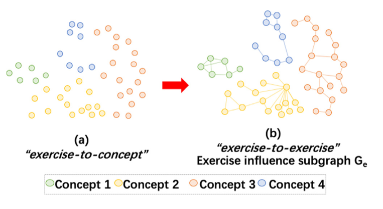

  - 节点是习题，考察同一知识点的习题被连在一起作为一个子图，子图表征同一知识点习题之间的关系，子图之间的关系表征知识点之间的关系

- 模型

  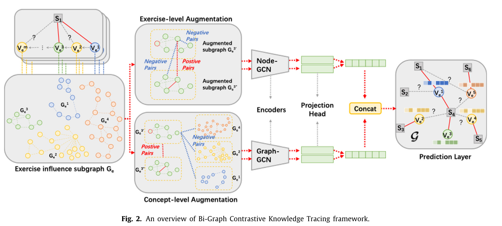

  - 构建习题图：$Q^{ij}_e = \frac{f^c(\mathcal{V}^i_e, \mathcal{V}^j_e)}{\sum_m f^o(\mathcal{V}^i_e, \mathcal{V}^m_e)}$，其中Q^ij^~e~就是节点i（习题）到节点j的关联程度，当这个值大于一个阀值$\tau$时，认为这两个节点之间有边。（有向或者无向？）f^c^表示数据集中做对习题i，然后做对习题j出现的次数，f^o^表示数据集中做了习题i，然后做习题m出现的次数。（前者是co-correctness，后者是co-occurrence）
  - 习题增强：使用random和pagerank方法计算出节点和边的重要性，根据这些重要性随机消除节点或者边（重要性越低的被消除的概率越大）

# ATKT

- 动机：现有DNN在KT任务上存在过拟合的风险，尤其是在小数据集上，其泛化性较差；对抗训练通过在原始干净的输入上添加干扰生成对抗样本，和原始样本一起训练模型，能有效提高模型对干扰输入的鲁棒性，进而提升模型的性能

- 贡献

  - 使用对抗训练来训练样本，提高模型的泛化性
  - 提出了KHS（knowledge hidden state）attention module，有效聚合过去KHS信息，同时重点突出当前KHS，二者结合来预测学生在未来习题上的表现

- 模型

  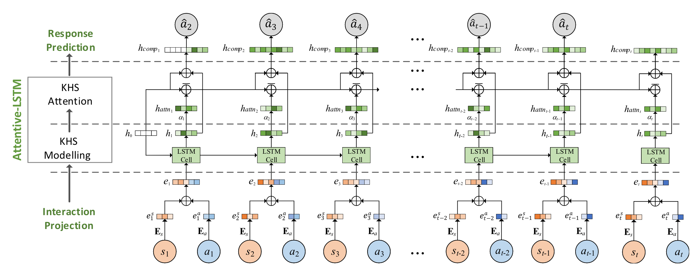

  - 输入s和a分别是skill和answer的embedding，e是s和a的拼接（如果答对，s在前面，否则a在前面）
  - $h_{comp_{t-1}} = [h_0 + \sum\limits_{i=1}^{t-2}h_{attn_{i}},\ h_{t-1}],\ h_{attn_{t}} = \alpha_th_t$
    - 论文中$\alpha_t = \frac{exp(u_t^Tu_t)}{\sum_{i=1}^texp(u_t^Tu_i)}, u_t=tanh(Wh_t+b)$
    - 代码里计算$\alpha_t=softmax(linear(u_t))$，其中linear输出的向量维度为1
  - 对抗训练AT
    - 思想：$\mathop{min}\limits_\theta \mathbb{E}_{(x,y)\backsim \mathcal{D}}[\mathop{max}\limits_{\vartriangle x \ \in\  \Omega}\ L(x+\vartriangle x,\ y;\ \theta)]$，具体含义是在扰动空间$\Omega$中找到让loss最大的扰动，将这个扰动添加到干净输入上，再根据此时添加了扰动的输入以及标签计算出的loss更新参数，目的是学到构建足够强的对抗样本，但是又使得输入的分别尽可能接近原始分布（具体到这篇论文来说就是让添加了扰动的skill和answer embedding有意义，所以才能学到更加鲁棒的embedding）
    - 生成对抗样本扰动的公式：$x' = x + r,\ r=\epsilon\frac{g}{||g||_2},\ g=\bigtriangledown_{emb}loss(x,y;\theta)$
    - 用于更新参数的loss为：$loss(x,y;\theta) + \beta loss(x+\vartriangle x,y;\theta)$

- 实验设置

  - 5折交叉验证，训练集：验证集：测试集=3:1:1
  - 序列长度超过500的被截断
  - 超参数
    - dim of skill: 256
    - dim of repsonse: 96
    - LSTM: 单向，dim of cell and hidden state are both 80
    - 学习率：0.001，每50个epoch衰减一半
  - 训练轮数：最大150个epoch，采用early stop方式，如果20个epoch内验证集效果没有提升就停止训练


# IEKT

- 动机：之前的工作没有考虑学生的认知水平以及知识获取能力，即对于相同的一道题，只依赖习题表征和学生知识状态无法准确预测学生能否做对，另外即使做了同一道题（结果也一样），每个人的知识获取程度也不应该相同

- 贡献：加入CE（Cognition Estimation）和KASE（Knowledge Acquisition Sensitivity Estimation）模块，实现个性化的知识追踪
  - CE：用于预测过程，结合学生的认知程度、知识状态与习题表征进行预测
  - KASE：用于状态更新过程，结合学生的知识获取能力、知识状态、习题表征、做题结果与模型预测结果进行状态更新

- 模型

  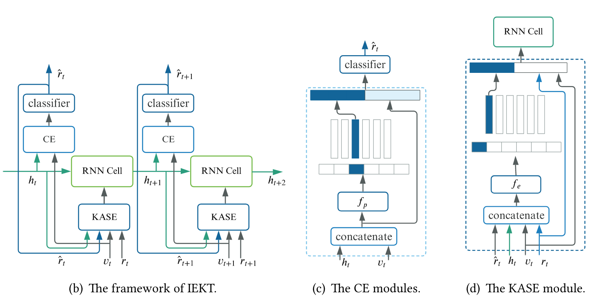

  - $v_t=[e_t^q,\ \bar{e}_t^c]，其中e_t^q是习题embedding，\bar{e}_t^c是相关知识点embedding的平均值$
  - $f_p([h_t,\ v_t])$是一个映射函数，其输出是一个index，根据index从cognition matrix M取出对应的认知向量$m_t$与$[h_t,\ v_t]$拼接，然后送入分类器里进行预测
  - $v_p = [h_t,\ v_t,\ 0]\ if\ \hat{r}_t \ge 0.5\ else\ [0,\ h_t,\ v_t],\ \ v_g=[h_t,\ v_t,\ 0]\ if\ r_t = 1\ else\ [0,\ h_t,\ v_t]$
  - $f_e([v_p,\ v_g])$是一个映射函数，其输出是一个index，根据index从knowledge acquisition sensitivity matrix S取出对应的知识获取向量$s_t$与$v_t$拼接（$[v_t,\ s_t]\ if\ r_t=1\ else\ [s_t, v_t]$）送入RNN中，和$h_{t-1}$一起更新知识状态
  - KASE中同时使用预测和真实值的原因是：学生有可能猜对答案或者粗心做错，使用这两个信息可以减少噪声
  - M和S都是训练出来的
  - 使用强化学习中的policy gradient来辅助训练
  
- 实验设置

  - 5折交叉验证，80%的数据用于训练和验证，20%的数据用于测试
  - 序列长度超过200的被截断，丢弃长度小于10的序列

# CoKT

- 动机：现有方法只利用了学生自己的历史信息来预测，没有利用具有相似做题经历的学生的信息，这样当预测学生在一道关于没接触的知识点的习题上的表现时，可以参考其他有类似练习经历的同学的表现

- 贡献
  - 同时显式考虑intra-student信息（学生历史练习记录）和inter-student信息（具有类似练习经历的学生）
  - 设计了一个与模型无关的类似练习记录（检索类似序列）检索器
  
- 预测时，检索相似序列（有类似练习记录的其他学生）的定义/要求
  - 要预测的是同一题目，或者相同知识点的习题
  - 两个学生要都练习过一样的习题或者相同知识点的习题
  
- 定义
  
  - 学生：用u表示，如$r^u_t$表示学生u在t时刻的练习记录
  - 知识状态：$h_t \in \mathbb{R}^{d_h}$，学生在t时刻知识状态
  - 练习记录：$r_t = (q_t, C_t, y_t)$，学生在t时刻的练习记录，C表示集合
  - 历史交互：$\mathcal{X}_{t-1} = {(q_0, C_0, y_0), (q_1, C_1, y_1), ..., (q_{t-1}, C_{t-1}, y_{t-1})}$
  - 练习记录上下文：$h_t^v \in \mathbb{R}^{d_h}$，即历史交互的向量表征
  - Similar Peer Record：对任意一个$r^u_t = (q_t, C_t, NA)$，数据集中其它的记录$r^{\bar{u}}_{t'} = (q,C,y)$只要满足：1、$q=q_t$或者$C\ \cap \ C_t \neq \empty$；2、$\bar{u} \neq = u$；3、$\mathcal{X}^u_{t-1}$和$\mathcal{X}^\bar{u}_{t'-1}$中间的习题和知识点有重合，那么$r^\bar{u}_{t'}$就是$r^u_t$的Similar Peer Record，所有的Similar Peer Record记为集合$R^u_t = \{r^\bar{u}_{t'}\}^{|R|}$
  - Similar Peer Sub-sequence：任意$r^\bar{u}_{t'}$的历史交互$\mathcal{X}^\bar{u}_{t'-1}$记为$r^u_t$的similar peer sub-sequence，其集合记为$S^u_t = \{\mathcal{X}^\bar{u}_{t'-1}\}^{|R|}$
  - 那么，这篇论文的任务就是预测学生u的$P(y_t = 1\ |\ q_t, C_t, \mathcal{X}^u_{t-1}, S^u_{t}, R^u_t)$
  - 习题embedding和知识点embedding的维度分别为d~q~和d~c~
  
- 模型

  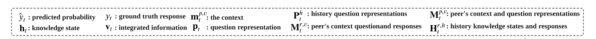

  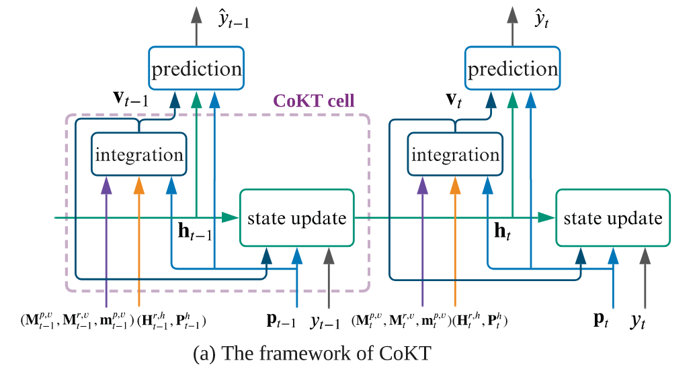

  - integration module：融合inter-student和intra-student信息

    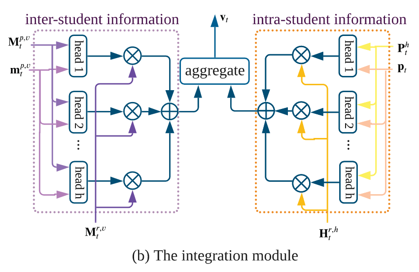

    - 定义相似序列（即找Similar Peer Record，用的是BM25算法）：对于任意一个练习记录$r_t^u$，将其历史交互中的习题和知识点字符串拼接起来得到一个historical string，定义historical string的相似度为$score(s^u_t, s^\bar{u}_{t'}) = \sum\limits_{i=1}^n IDF(k_i)\frac{tf(k_i, s^\bar{u}_{t'})\cdot (b_1+1)}{tf(k_i, s^\bar{u}_{t'}) + b_1(1-b_2+b_2\cdot \frac{|s^\bar{u}_{t'}|}{L})}$，其中score的两项就是两个historical string，k~i~是$s^u_t$中的关键词（习题ID和知识点ID）；IDF是逆文档频率，公式为$ln(\frac{N-n(k_i) + 0.5}{n(k_i) + 0.5} + 1)$，N是练习记录总数，n(k~i~)是包含k~i~的练习记录数量；$tf(k_i, s^\bar{u}_{t'})$是k~i~在$s^\bar{u}_{t'}$中的频率，L是所有练习记录的historical string的平均长度，$|s^\bar{u}_{t'}|$是该historical string的长度，b~1~和b~2~是超参数，在论文中设置为1.2和0.75

    - 理解BM25算法：就是求query（由多个key组成）和文档d的相似度，IDF计算的是每个key的权重，另一部分计算的就是key和d的相关性（当b~1~为0时，就是二元模型，即d中有或者没有key），一般b~1~取1.2～2，b~2~取0.75

    - 对一个interaction的编码：将习题embedding和知识点平均embedding拼接得到$p \in \mathbb{R}^{d_q+d_c = d_p}$，然后如果做对，interaction的embedding为$z = [p, \vec{0}] \in \mathbb{R}^{2d_p}$，反之为$z = [\vec{0}, p] \in \mathbb{R}^{2d_p}$，然后将interaction通过GRU获取知识状态，如下图所示，也就是获取inter-student的information，其中的$M_t^{p,v}$就是我们想要获取的和$h_t^v$（学生u在t时刻的知识状态）相似的$h_{t'}^v$（其他学生在某一时刻的知识状态）的集合

      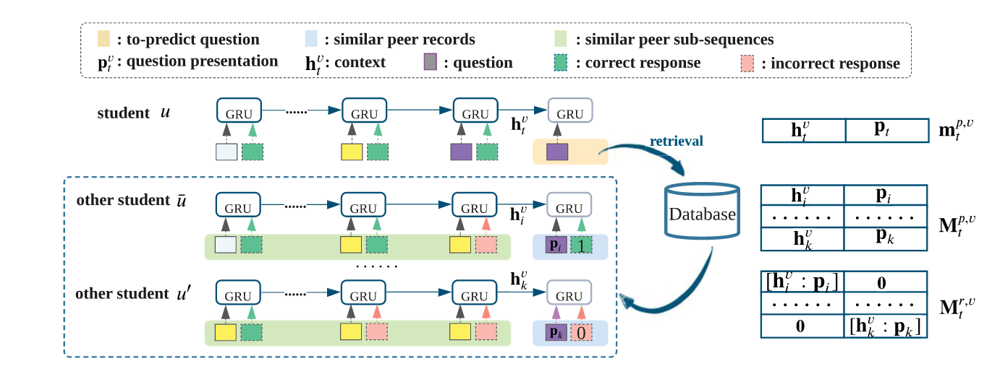

    - 上图中的$M_t^{p,v}$是一个$|R| \times d_m$的矩阵，$d_m = d_h + d_p = d_h + d_q + d_c$，用作attention的K；$M_t^{r,v}$是一个$|R| \times 2d_m$的矩阵，其中每行表示对于习题q，在特定的知识状态下做对或做错习题q（做对把0向量放后面，做错把零向量放前面），用作attention的V；$m_t^{p,v}$就是attention的Q。（其实就是AKT那套）

    - 论文中使用的是multi-head attention去获得inter-student的信息，记为$v_t^v$

    - intra-student information就正常通过GRU和attention获取（类似AKT，习题序列作为Q和K，交互序列作为V，同样使用multi-head attention），记为$v_t^h$

    - 融合：$v_t = softmax(w_r) [v_t^h, v_t^v]$，其中w~r~是一个二维的参数向量，用于获取inter和intra之间的相关性，即求inter和intra的权重

- 质疑：模型能对学生表现做预测，其实就是学习习题和习题之间、知识点和知识点之间的关系，然后结合历史信息来预测，当模型判断学生在没接触过的知识点上的习题的表现时，也是利用了知识点之间的关系（这种关系就是从所有学生的练习记录中学来的），本质上和这篇文章的思想一样，只是过去的模型没有显式地学习，而是隐式地学习学生之间的关系

# DIMKT

- 动机：早期的方法没有地探索习题难度对学生学习的影响，最近的有些工作虽然引入了习题难度（如AKT、RKT等），但是只是将习题难度加入习题表征中来改进模型性能，并没有探索习题难度对于学生更新知识状态的影响（比如已经基本掌握知识点1的学生，练习几道关于知识点1的简单习题，对这个学生来说，他在知识点1上的掌握程度并不会有明显提升，但是对于那些还未掌握知识点1的学生来说，如果能做对几道知识点1的简单习题，那么应该判断他们在知识点1上的掌握程度有明显提升）。该文章还提到了一点：学生做对于他们来说过难的习题，会降低其兴趣。此外，之前的工作也都没有考虑知识点难度对习题难度有影响，因此忽略了知识点的难度

- 贡献

  - 分析了习题难度对于学生学习在三个阶段的影响：练习前对习题难度的主观感受；练习过程中个性化的知识获取；练习后的知识状态评估
  - 设计了ASNN（Adaptive Sequential Neural Network）来建立练习过程中学生知识状态和习题难度之间的关系
  - 模型可解释性强

- 具体细节

  - 习题和知识点难度计算：对于习题e，其难度定义为该题的正确率乘一个常数（例如100，表示有100个等级的难度），对于知识点k同理，其难度定义为包含该知识点的习题的正确率乘一个常数。此外，习题和知识点难度的embedding也是由此计算
  - 知识状态使用向量表示，不使用矩阵表示知识状态的原因有两点：1、知识点之间的关系复杂，很难区分开来（比如一位数除法是两位数除法的先修知识点，后者要比前者难，但是二者是同一知识点）；2、手动打上的标签可能有错误
  - 习题embedding和做题结果embedding是常规设置，知识点embedding采用one-hot（不能处理多知识点习题）

- 模型

  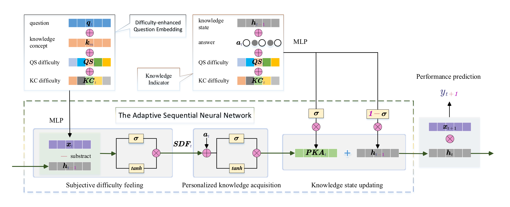

  - 思想：直接将习题表征和知识状态拉到同一纬度比较
  - ASNN设计的出发点：习题的难度对学生的学习过程的影响有3个阶段需要评估，做题前学生对于该题难度的“主观感受”（实际上是模型认为这道题对学生来说的难度）、做题过程中该题对学生的提升程度（越难的题提升程度越高）、做完后学生的知识状态如何变化（当学生做对了一道难题时，应该明显提升其知识状态，如果做错了一道简单题，则不应该认为其知识状态有提升）。ASNN包含的三个模块：(1) subjective difficulty feeling, (2) personalized knowledge acquisition, and (3) knowledge state updating.
  - $SDF_t = MLP1_{sigmoid}(x_t-h_{t-1}) \cdot MLP2_{tanh}(x_t-h_{t-1})$，前者表示主观感受的直接输出，包含特定知识状态下的习题认知难度，后者是一个gate，用于选择并保留重要的特征
  - $PKA_t = MLP3_{sigmoid}([SDF_t,\ a_t]) \cdot MLP4_{tanh}([SDF_t,\ a_t])$，该过程类似求SDF，其中a是做题结果的embedding
  - $h_t = \Gamma_t^{KSU} \cdot h_{t-1} + (1 - \Gamma_t^{KSU}) \cdot PKA_t,\ \Gamma_t^{KSU}=MLP([h_{t-1},\ a_t,\ QS_t,\ KC_t])$，其中QS和KC是难度的embedding

- 实验设置

  - 5折交叉验证，最终效果取的是5个模型在测试集上的效果的均值
  - 序列长度：100
  - 丢弃回答次数小于30次的习题
  - 知识点和习题难度等级都为100
  - 所有向量维度都设置为128
  - 学习率为0.002，每5个epoch衰减一次，衰减幅度为50%

- 存在的问题

  - 从图5来说，第2、3和最后1个习题之间的相似度非常高，原因是它们的习题难度和知识点难度接近，但是它们考察的不是相同的知识点或者相关的知识点（分别对应知识点为全等、最小公倍数和多项式基本知识），直觉上来说不应该这么接近。我认为难度的影响过大。

# MFDAKT

- 动机：主要是针对知识追踪在factor analysis model这类方法上发展的不足

  - 现有的factor analysis model不能突出在最近一段时间中最相关习题的影响（有些方法加上了一个时间窗，但是窗内每次练习对预测的影响权重都是一样的，并且不能灵活地选择合适的窗口长度）
  - 现有的factor analysis model忽略了习题的信息，包括习题相关性和难度信息
  - Thirdly, factor analysis models fail to differentiate contributions of factors and factor interactions in different practice records. In fact, factors and factor interactions should not equally contribute to the final prediction in different records [12].

- 贡献

  - 设计了current factor用于重点突出最近练习过的与预测目标最相关的习题
  - 使用预训练模型获取习题表征，并且通过一项关于习题难度的正则项来微调
  - 使用一个双向注意力机制来进行预测，以区分factor和factor interaction的作用

- 模型

  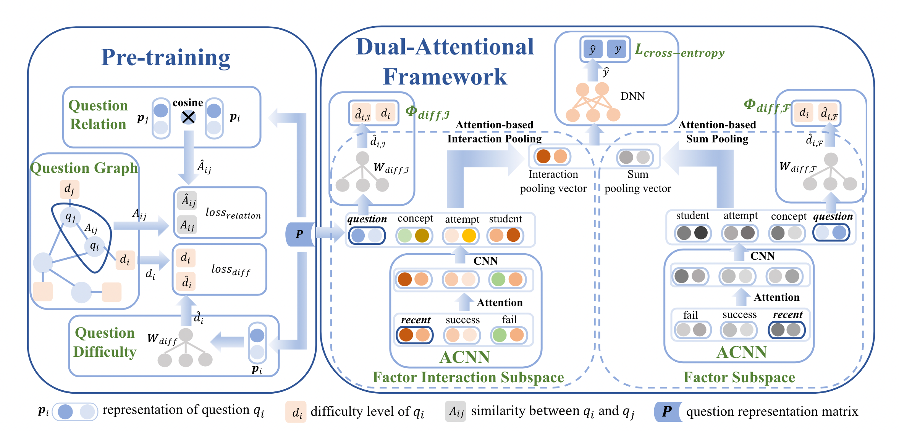

  - 特征工程

    - Student、Question、Concept Factor：one-hot、one-hot、multi-hot

    - Success and Fail Factor：都是N~c~维的multi-hot，N~c~是知识点的数目。具体例子如下，假设有3个知识点，学生在t=2时刻的success factor和fail factor分别表示该学生在此前是否做对或做错过该知识点的题目，为0表示未做过

      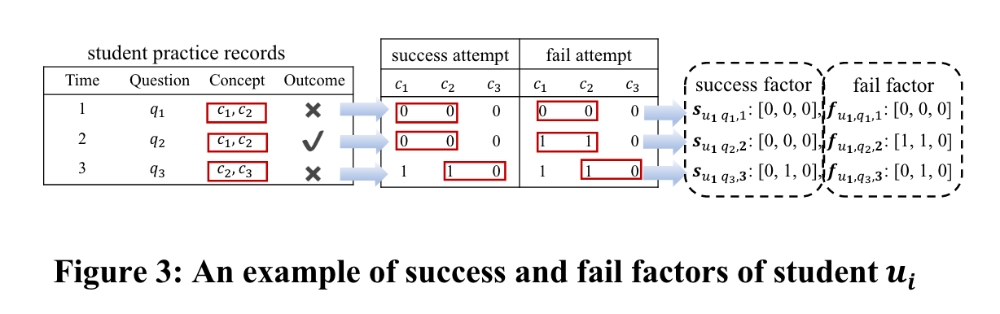

    - Recent Factor：3N~c~维向量，表示学生最近在目标习题相关知识点上的表现，具体公式为

      $r_{u_i,\ q_j,\ T} = \sum\limits_{c_k \in C_{q_j}} r_{u_i,\ c_k,\ T}$ 

      其中u和q分别表示学生和习题，T表示时刻，C~k~表示和习题q~j~相关的知识点集合，加和的内容是下图中所示向量，具体含义（以下图所示）是学生在知识点2上最近的表现，其中计算x时用到的$\mathcal{F}$函数（输入是上一次练习知识点2到T的时间间隔）表示遗忘程度，$\mathcal{F}(\cdot) = e^{-\theta_{c_k}\cdot \triangle_t}$，$\theta_{c_k}$是可学习的参数，表示遗忘因素对每个知识点的影响程度

      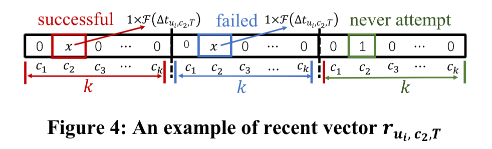

    - 习题间相似度（关联度）计算公式：$A_{ij} = \frac{|C_{q_i}\ \and\ C_{q_j}|}{max(|C_{q_i}|,\ |C_{q_j}|)}$，其中$|\cdot|$表示集合的元素个数，$C_k$表示习题k对应的知识点集合。该值用来构建习题的graph（代码中是min，不知道为什么）

    - 习题难度：即习题正确率

  - 预训练：使用两个损失函数来约束预训练网络以得到能体现习题相关性和难度的习题表征向量，两个损失函数分别是

    $loss_{relation} = \sum\limits_{i,j}^{N_q} (\hat{A}_{i,j} - A_{i,j})^2,\quad loss_{diff} = \sum\limits_{i=1}^{N_q} (\hat{d}_i - d_i)^2$

    其中N~q~表示习题的数目，A~i,j~和d~i~分别表示习题的关联和难度（上面的公式计算），$\hat{A}_{i,j}$表示由习题表征p~i~和p~j~计算出来的习题相似度，用的是余弦相似度，$\hat{d_i}$表示习题表征p~i~经过一个MLP计算出来的难度表征

    综上，预训练的损失函数是$L_{pre-train} = \lambda_1loss_{relation} + \lambda_2loss_{diff},\quad \lambda_1, \lambda_2 \in [0, 1]$

  - 输入factor：question、concept、student、attempt

    - question factor：为了区分factor和factore interaction的作用，将预训练得到的习题表征通过两个MLP分别投影到两个子空间（Factor Subspace和Factor Interaction Subspace），即Dual-Attentional Framework中的question
    - attempt factor：由recent、success、fail三个factor通过attention和1d-convolution计算出来
    - concept factor：
    - student factor：

- 实验设置

  - 丢弃长度小于等于3的序列

# HawkesKT

- 动机：现有的考虑“时间”因素的方法主要是加入手工设计的时间相关特征（比如练习间隔时间）或者使用时间衰减函数来全局捕捉时间对知识点掌握度的影响，但是没有考虑不同的历史事件（在不同知识点上的练习）对目标知识点的影响——skill-cross effect——是不一样的，且随时间变化

- 贡献

  - 在数据集上验证了temporal cross-effects的存在
  - 提出基于点过程的HawkesKT，第一次将Hawkes过程引入知识追踪，显式地对每一次历史练习的temporal cross-effect进行建模，来捕捉不同的cross-effect的时间变化

- 验证temporal cross-effects

  - 定义条件互信息：$CMI(a_i,a_j|c) = \sum\limits_{a_i\in \{0,1\}} \sum\limits_{a_j\in \{0,1\}} P(a_i,a_j)log\frac{P(a_i,a_j)}{P(a_i)P(a_j)}$

  - c是条件，给定条件c以后，在所有学生序列中找到所有满足条件的interaction pair (x~i~, x~j~)，将其对应的做题结果a~i~和a~j~视为随机变量，那么CMI表示的就是pre-interaction和post-interaction（即x~i~和x~j~）在条件c下的依赖程度，或者说相关程度，CMI为零则表示不相关。上式中的概率P用频率表示。

  - 首先看知识点之间的关联，下面右图中y轴是pre，x轴是post

    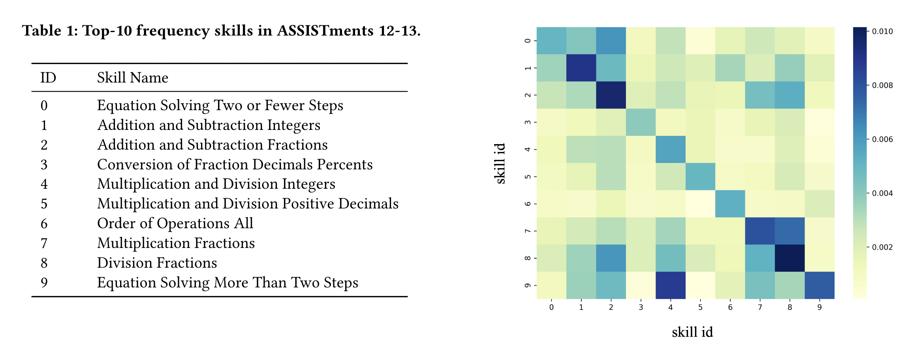

  - 下图是时间间隔的影响，比如log~2~(delta t) = 2, skill 8 -> 8 表示的是条件c为时间间隔为4，pre和post interaction分别为知识点8

    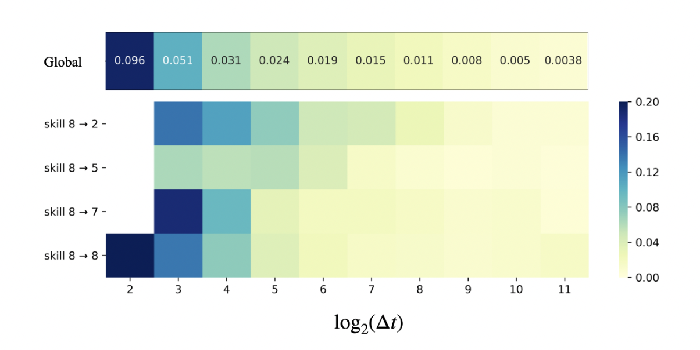

- 霍克斯过程结合知识追踪
  - 随机点过程的强度函数定义为$\lambda(t)dt = Pr\{event\ in\ [t,t+dt)|S_t\}$，其中event在知识追踪可以用(question, response)表示，S~t~是学生的历史信息，即{(q~1~, r~1~, T~1~), (q~2~, r~2~, T~2~), ..., (q~t~, r~t~, T~t~)}
  - 如果选择使用霍克斯过程建模，那么$\lambda(t) = \lambda_0 + \sum\limits_{T_i < t}\alpha\kappa(t-T_i)$，$\lambda_0$是基础强度，T~i~表示时间i发生的时间，k是核函数，最常见的核函数是指数核函数，即$\kappa(t)=e^{-\beta t}$
  - 霍克斯过程的假设是历史发生的所有事件都对未来事件的发生有一个正的激励（即核函数的值大于0），其中激励又分为自激励和互激励
  
- 模型
  - 仿照霍克斯过程的强度函数，为kt任务设计了类似的强度函数：$\lambda(x_i) = \lambda_0^{x_i} + \sum\limits_{x_j \in S_{t_i}} \alpha_{x_j,x_i}\cdot\kappa_{x_j, x_i}(t_i - t_j)$
  - 第一项是基本强度，x~i~是指目标interaction，即(student, q~i~, t~i~)。基本强度的物理含义是习题以及该习题对应知识点的难度，也就是$\lambda_0^{x_i} = \lambda_0^{q_i} + \lambda_0^{s(q_i)}$
  - $S_{t_i}$表示学生S在t~i~之前的练习（历史事件），将（知识点，回答结果）作为一个事件，则对于一个数据集，其共有2 * |S|个事件，|S|是知识点的数目
  - $\alpha_{x_j,x_i}$表示的是cross-skill effect，即过去的事件x~j~对现在的事件——预测目标——x~i~的影响，那么对于一个数据集，总共就有2 * |S| * |S|个cross-skill effect
  - 第二项考虑不同cross-skill effect对目标skill的影响，包含了时间因素（即遗忘），其中核函数$\kappa_{x_j,x_i}(t_j - t_i) = exp(-(1 + \beta_{x_j, x_i}) log(t_j - t_i))$就是考察的时间函数。为了更细粒度地研究不同cross-skill effect在时间上的衰减，每一个cross-skill effect都有一个衰减因子$\beta_{x_j,x_i}$。此外，这里使用了log函数是考虑到数据集中的时间间隔存在长尾现象
  - 最后预测的公式是$\hat{y}_i = Pr\{a_i = 1\} = \frac{1}{1 + e^{-\lambda(x_i)}}$
  
- 求模型参数的方法：矩阵分解（协同过滤：相似的历史事件对应的未来相似）
  - 需要求解的参数包括$\lambda_0,\ A\in\mathbb{R}^{2|S|\times|S|},\ B\in\mathbb{R}^{2|S|\times|S|}$，其中A中的元素是$\alpha$，B中的元素是$\beta$
  - 使用矩阵分解的方法，即构建4个Embedding表，分别是$P_A\in\mathbb{R}^{2|S|\times D}, Q_A\in\mathbb{R}^{|S|\times D}, P_B\in\mathbb{R}^{2|S|\times D}, Q_B\in\mathbb{R}^{|S|\times D}$
  - 则$A = P_A Q_A^T$，其它的同理
  - 选择矩阵分解而不是直接求解的原因如下
    - D << |S|的情况下能降低参数量
    - 直接求解的话，不同的事件对（即(x~j~,x~i~)）是相互独立，那么会降低模型的泛化性
    - 使用矩阵分解，即为每个interaction x学习一个embedding，有利于提高泛化性
  - 使用交叉熵学习参数
  
- 实验设置
  - 丢弃序列长度小于5的，每个学生只取前50次练习记录
  - 对于assist2009数据集，假设两次练习时间时间间隔固定为1s

# simpleKT

- 动机：现有的方法越来越复杂，但是从方法论上来说差别却不大：设计不同的网络来建模遗忘行为和捕捉上下文信息；引入各种辅助信息加强习题表征，包括习题难度、习题文本等；加入学生表征，增强个性化

- 贡献：设计了一个简单的基于注意力机制（dot-production）的模型，直接使用attention和MLP从交互（做题记录）中提取知识状态
  - 对比AKT：AKT先使用encoder去提取习题和交互的表征，再将这两个表征送入attention中提取知识状态；simpleKT直接将习题和交互的表征（embedding）送入attention中提取知识状态
  - 对比SAKT和SAINT：SAKT和SAINT不考虑习题难度，将考察相同知识点的习题视为相同的item
  
- 模型：就是AKT的模型基础上改的，具体如下

  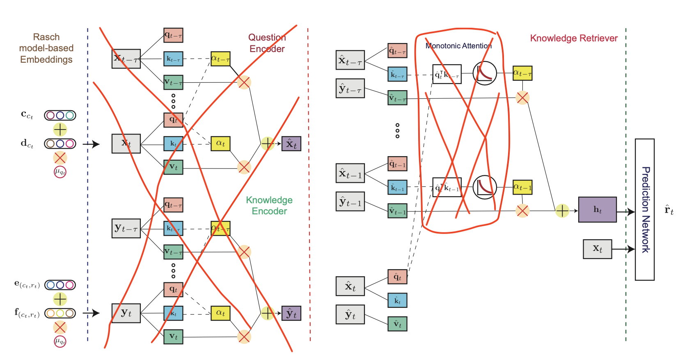


# CL4KT

- 动机：存在数据稀疏（习题）问题，提取的学生知识状态很可能过拟合（根据统计信息预测）

- 贡献：使用对比学习来提取习题表征（代理任务是序列——习题序列和交互序列——相似度），对比学习时Question Encoder和Interaction Encoder使用双向的attention，预测时两个Encoder使用单向的attention

- 模型

  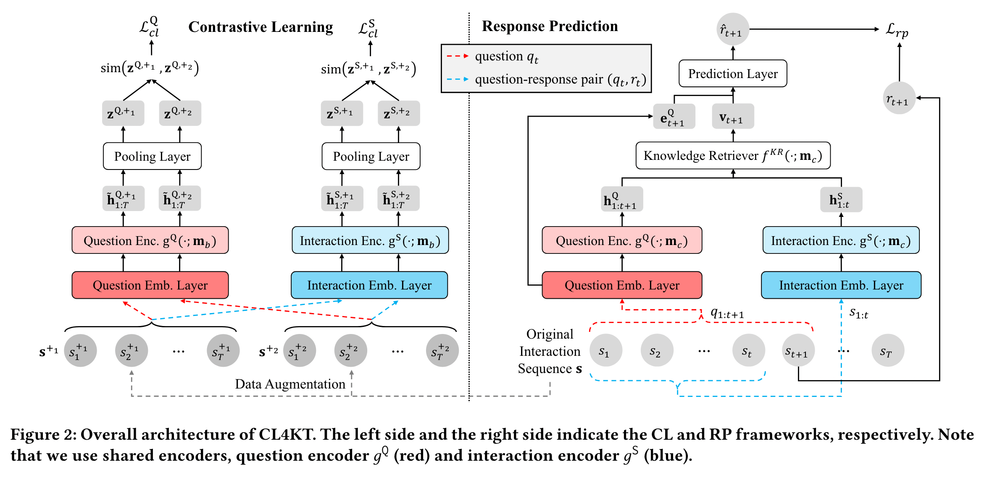

  - m~b~是mask，b表示bidirectional

  - $h^Q_{1:t}$是key，$h_{t+1}^Q$是query，$h_{1:t}^S$是value，使用AKT的attention机制得到$v_{t+1}$

  - Contrastive Learning

    - 数据增广

      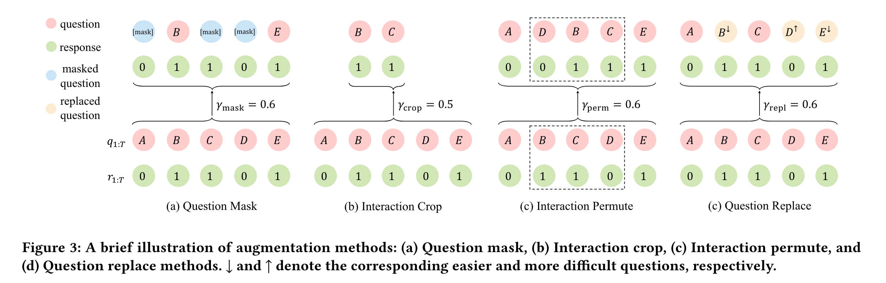

      - 关于打乱顺序：论文给出的解释是在给定学生的练习记录后，学生的知识水平是确定，这个时候让学生做10道题，这10道题学生能做对哪些和题目顺序无关。该假设是有道理的，但是在数据增广时，如果要打乱顺序，应当只打乱一段时间的，比如在t=10到t=15这一段时间，学生连续做了6道关于知识点1的习题，那么这6道题打乱顺序是可以；如果按照论文中随机选一个起始点打乱50%的数据顺序，是不合理的
      - 关于习题难度的判别，直接用训练集中习题的正确率作为习题难度不太合理，难度大的题目做的人少，难度小的题目做的人多，所以还要考虑习题的练习次数
      - 关于question replace：对于response为1的习题，以一定概率替换为更简单的题，反之替换为更难的题（出发点就是能做对难题的学生，大概率能做对简单题目）	
      - hard negative samples of learning history：对一个原始的序列，随机选取一段，将repsonse取反

    - 提取history (question and interaction)的表征：使用两个双向的Transformer来分别得到习题和交互的表征，再将习题和交互表征的序列送入Pooling Layer得到习题历史和交互历史的表征，用于对比学习

    - 对比损失使用的就是InfoNCE：$-log\ \{ e^{sim(z^{Q,+1}, z^{Q,+2})} / [e^{sim(z^{Q,+1}, z^{Q,+2})} + \sum_{z^{Q,-}\in Z^{Q,-}} e^{sim(z^{Q,+1}, z^{Q,-})}] \}$和$-log\ \{ e^{sim(z^{S,+1}, z^{S,+2})} / [e^{sim(z^{S,+1}, z^{S,+2})} + \sum_{z^{S,-}\in Z^{S,-}} e^{sim(z^{S,+1}, z^{S,-})}] \}$，其中Q和S分别表示习题历史和交互历史，+1和+2表示正样本，-表示负样本（将同一batch里其它序列产生的增广序列视为负样本）

    - pooling layer：问题序列的表征取平均值作为question history的表征

- 4.6 Quality of Representations (RQ5) 没看懂：主要是这篇文章里的内容，Understanding contrastive representation learning through alignment and uniformity on the hypersphere
- 实验设置
  
  - 丢弃长度小于5的序列，丢弃没有知识点id的interaction
  - 多知识点的习题，将其知识点的组合设置为一种新的知识点
  - 5折交叉验证，每一折中训练集取10%数据作为验证集
  - 每个序列只取最后100个interaction，为了学到更好的表征
- 代码：还是基于知识点层面建模的，即Question Encoder编码的是知识点
  - 计算相似度：`cos([128,1,64], [1,128,64]) / temp (temp == 0.05, dim_cos = -1)`
  - 数据增广：对原始序列按mask、replace、permute、crop的顺序进行augment

# HGKT

- 动机：现有知识追踪方法存在两个问题：1、简单地将学生练习记录视为习题序列，导致不能捕捉到习题里存在的“丰富信息”（就是忽略了习题内容文本信息），EKT第一次将习题文本信息引入KT中，但是EKT只是简单将文本送入双向的LSTM中提取习题表征，不能挖掘习题更深层次的语义信息；2、忽略了习题间存在的层次关系，GKT第一次将GNN引入KT任务中，一定程度上构建了习题间的层次关系，但是将习题语义信息和层次结构结合起来的工作还没有被研究过

- 如何定义习题层次信息：该论文将习题之间的关系定义为support和indirect support

  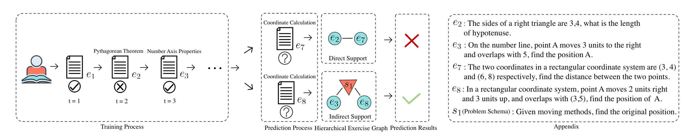

- 需要注意的是，该论文只考虑单知识点的习题

- 贡献

  - 引入习题层次的概念（direct and indirect support），使用基于贝叶斯的方法挖掘direct support关系，使用一种语义的方法挖掘indirect support关系

  - 提出了problem schema（用于总结一组具有相似解决方法的习题），并设计了一种HGNN的方法来学习problem schema的表征，如下图所示，考察相同知识点的习题可能属于不同的problem schema（由于习题难度不同），考察不同知识点的习题也可能属于同一schema（由于解题方法相似）

    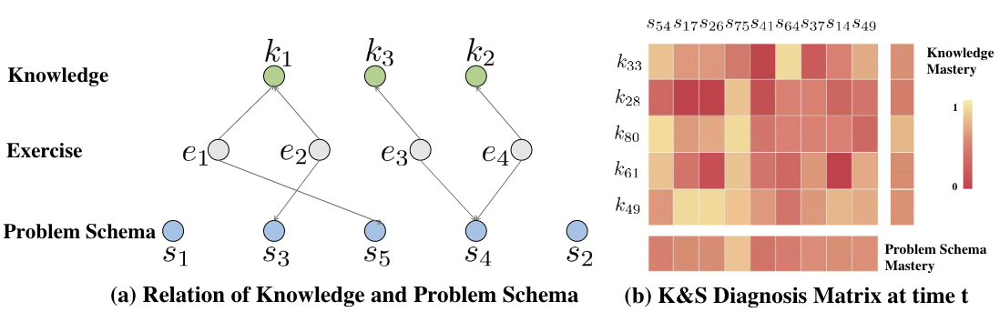

- 模型

  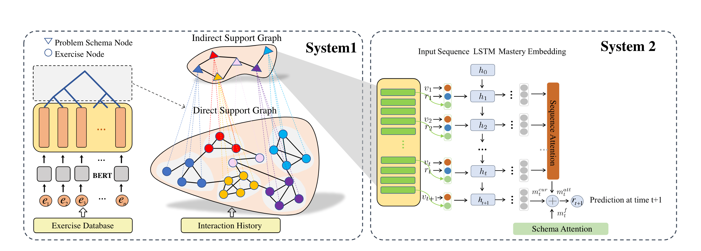

  - Direct Support Graph中的节点是习题，Indirect Support Graph中的节点是problem schema

  - 两个graph中存在3种edge：1、exercise2exercise，表示的是direct support关系；2、exercise2problem-schema，表示的是indirect support关系；3、problem-schema2problem-schema，表示的是相似的problem-schema关系

  - 构建Direct Support Graph：使用贝叶斯推断

    - $P(R_{e_1}|R_{e_2}) > P(R_{e_1}|R_{e_2},W_{e_2}),\quad P(W_{e_2}|W_{e_1}) > P(W_{e_2}|R_{e_1},W_{e_1})\quad if \ Sup(e_1 \rightarrow e_2) > 0$ 
    - Sup(e~i~ -> e~j~)表示习题e~i~对习题e~j~对direct support的程度
    - R表示做对，W表示做错，所以$R_{e_i}, W_{e_j}$表示两个事件，即学生做对和做错习题e~i~
    - $P(R_{e_1}|R_{e_2},W_{e_2})$表示学生在做过习题e~2~（不知道做对做错）后，做对习题e~1~的概率，其它同理
    - Sup的计算公式：$Sup(e_1 \rightarrow e_2) = max(0, ln\frac{P(R_{e_1}|R_{e_2})}{P(R_{e_1}|R_{e_2},\ W_{e_2})}) + max(0, ln\frac{P(W_{e_2}|W_{e_1})}{P(W_{e_2}|R_{e_1},\ W_{e_1})})$
    - $P(R_{e_1}|R_{e_2}) = \frac{Count((e_2,e_1) =(1,1)) + 0.01}{\sum^1_{r_1=0} Count((e_2,e_1) =(1,r_1)) + 0.01}, P(R_{e_1}|R_{e_2},W_{e_2}) = \frac{\sum_{r_2=0}^1 Count((e_2,e_1) =(r_2,1)) + 0.01}{\sum_{r_2=0}^1\sum^1_{r_1=0} Count((e_2,e_1) =(r_2,r_1)) + 0.01}$
    - 前者表示后修做对的条件下，先修做对的概率，后者表示先修做对的概率
    - 同理还有先修做错的条件下，后修做错的概率，以及后修做错的概率
    - $Count((e_i,e_j) = (r_i,r_j))$表示：the number of exercise sequences that reply e~i~ with an answer r~i~ before e~j~ with an answer r~j~
    - 然后用Sup > w作为判断条件决定Direct Support Graph的邻接矩阵

  - 构建Indirect Support Graph：使用Bert、层次聚类

    - 用Bert提取每道习题文本的表征，用层次聚类对提取到的习题表征进行分类（设置阀值$\lambda$来决定聚类的蔟数）

  - 获取exercise2problem-schema：即获取每一道习题和所有problem-schema的关系，使用DiffPool获取一个分配矩阵S~e~，该矩阵是(0,1)矩阵，矩阵的行是习题，列是problem-schema

  - HGNN获取problem-schema的embedding：给定(A~e~, A~s~, F, S~e~)，即（Direct Support Graph邻接矩阵，Indirect Support Graph邻接矩阵，每道习题的特征矩阵，分配矩阵），计算embedding的过程如下
  
    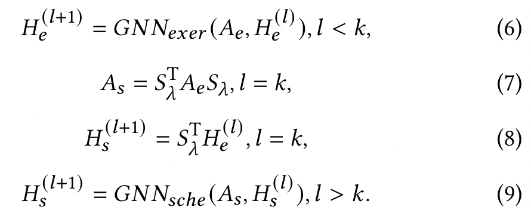
    
    - H是节点的特征矩阵
    - 计算出A~e~，习题的初始embedding，习题的分类
    - ？A~s~如何得到：猜测类似DiffPool，用习题分类的结果得到每道习题属于哪类problem-schema，即分配矩阵S，然后就可以计算A~s~
    - 用公式6得到最终习题的embedding，用公式9得到最终problem-schema的embedding
    
  - System2
  
    - 输入是v（知识点embedding）、s（problem-schema embeding）和r（answer embedding）
    - 用LSTM提取知识状态h，作为interaction attention的输入
    - （类似AKT）用加窗口的attention得到融合历史信息的interaction embeding sequence和problem-schema embeding sequence，前者就是图中的Sequence Attention，后者是Schema Attention
  
- 获取t时刻学生在知识点i上的掌握程度$R_i^k=\sum\limits_j R^{ks}_{i,j}d^k_{i,j},\ d^k_{i,j}=\frac{q_{i,j}}{\sum_j q_{i,j}}$，其中$R_{i,j}^{ks}$是t时刻学生K&S Diagnosis Matrix中第i行第j列第值，实际上就是模型最终输出的值，$q_{i,j} = |{e(k_i,s_j)}|$表示考察知识点k且属于problem schema s的习题数目。由此可以看出计算知识点i的掌握程度就是加权知识点在不同problem schema上的值

- 使用的工具：1、获取习题文本表征（jina-ai），2、层次聚类：https://docs.scipy.org/doc/scipy/reference/cluster.hierarchy.html

  - jina: `https://console.clip.jina.ai/get_started`
  - jina-ai token：`fead2d5a52b86434bb83eb7684a63ddb`

  ```python
  from clip_client import Client
  
  c = Client('grpcs://api.clip.jina.ai:2096',
              credential={'Authorization': 'undefined'})
  
  r = c.encode(
      [
          'First do it',
          'then do it right',
          'then do it better',
          'https://picsum.photos/200',
      ]
  )
  print(r.shape)
  # (4, 768)
  ```

- 实验相关
  - 构建Direct Support Graph：使用w=2.3
  - 构建Indirect Support Graph：使用层次聚类的阀值为9获得1136种problem schema
  - Direct Support Graph是3层GNN，Indirect Support Graph是1层GNN

# DGMN

- 动机：现有方法存在以下问题

  - 没有或者没能很好地针对记忆遗忘建模
  - 不能够从观察到的“问题-回答”序列中获取有效的知识点之间的关联信息

- 创新

  - 在“知识点空间”内建模遗忘，即考虑知识点之间的相互作用（之前的方法都是针对每个知识点进行遗忘建模）
  - 为每个学生学习一个动态的知识点图，来反映学生的知识状态
  - 引入遗忘门机制来衡量遗忘的效果

- 模型

  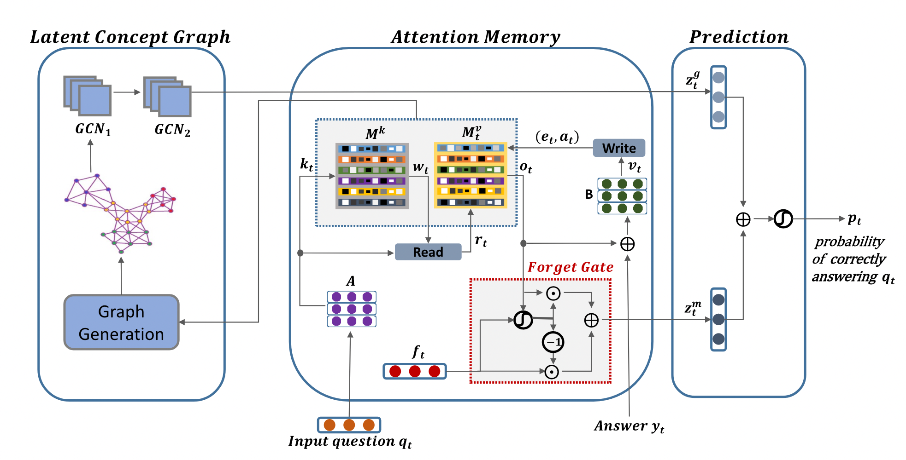

  - $A \in \mathbb{R}^{|Q| \times d_k}$：习题的Embedding表
  - $k_t \in \mathbb{R}^{d_k}$：习题q~t~对应的embedding
  - $M^k \in \mathbb{R}^{|C| \times d_k}$：知识点的Embedding表
  - $w_t \in \mathbb{R}^{|C|} = softmax(M^k \cdot k_t)$：每一维度表示该习题和对应知识点的关联
  - $M_t^v \in \mathbb{R}^{|C| \times d_v}$：每个学生在t时刻的知识记忆矩阵
  - $r_t \in \mathbb{R}^{d_v} = \sum\limits_{i=1}^{|C|}w_t(i)M_t^v(i)$：反映学生对考察知识点的掌握程度
  - $o_t \in \mathbb{R}^{|C|} = tanh(W[r_t, k_t] + b)$：o~t~同时考察知识点和习题
  - f~t~：首先有一个矩阵$F_t \in \mathbb{R}^{|C| \times 2}$，假设习题q~t~对应的知识点是1和2，那么F中向量的第一个维度表示最近一次练习（涉及知识点1和知识点2）到t时刻的时间间隔，第二个维度表示过去总共练习知识点1和知识点2的次数，则$f_t = tanh(W \cdot f_{in} + b)$，其中f~in~就是F~t~拉平，即$F_t \in \mathbb{R}^{2|C|}$
  - 如何判断一道习题和一个知识点相关：$w_t(i) > \tau$则认为知识点i和习题相关
  - 注意：图中送入红框的$f_t \in \mathbb{R}^{|C|}= f_t\ \odot \ w_t$，将其命名为$fs_t$
  - 红框中非线性输出（就是$o_t$和$fs_t$的输出）为$gw_t \in \mathbb{R}^{|C|} = sigmoid(W_1o_t + W_2fs_t)$
  - 红框的输出为$z_t^m \in \mathbb{R}^{|C|} = gw_t\ \odot \ o_t + (1-gw_t)\ \odot\ fs_t$
  - $B \in \mathbb{R}^{2|Q| \times d_v}$：交互的Embedding表
  - $e_t \in \mathbb{R}^{d_v} = sigmoid(W[v_t^q,\ o_t] + b) $，其中$v_t^q$表示的是交互的embedding，a~t~的计算同理
  - 更新$M_t^v$：$M_{t+1}^v(i) = M_t^v(i)[1-w_t(i)e_t] + w_t(i)a_t$
  - GCN中，使用的是带自环的邻接矩阵和度矩阵，即$H^{i+1} = ReLu(\hat{D}^{-\frac{1}{2}}\hat{A}\hat{D}^{-\frac{1}{2}}H^iW^i)$，其中H是特征矩阵（即每行是节点的embedding），i表示GCN的层数，W是线性层参数，H^0^=M^k^，$\hat{A}=A+I, A_{ij} = relu(w(M^k(i), M^k(j)),\  \mu), A \in \mathbb{R}^{|C| \times |C|}$，其中w可以选择使用余弦相似度函数，度矩阵同理
  - $z_t^g = tanh(W(\sum\limits_{i=1}^{|C|}w_t(i)H(i))^T + b)$
  - $p_t = sigmoid(W[z^m_t,\ z_t^g] + b)\cdot \delta(q_t)$，其中W是|Q| * 2|C|的矩阵，$\delta(q_t)$是习题的one-hot向量
  - question ranking technique：用于衡量习题重要程度的，每个习题的重要程度计算公式为$\gamma(q_j) = \sum\limits_{i = 1}^{|C|}w_j(i)\hat{D}_{i,i}$，其中w~j~就是图中的w~t~，表示该习题和各个知识点的关联程度，D~i,i~是带自环的度矩阵中的值，可以表示每个知识点的重要程度

- 实验细节
  - 5折交叉验证，30%测试集，70%训练集（从中选20%做验证集）
  - 使用zero-mean random Gaussian distribution初始化Embedding，使用Glorot uniform random initialization初始化网络参数
  - 超参数设置：d~k~=50, d~v~=100, tau=0.8, mu=0.25
- 文章提出的一些可改进地方
  - 目前的数据集知识点信息是已知的，考虑未知的情况
  - 引入GCN后，增加了计算复杂度（相比DKVMN），为了尽可能减小计算复杂度，使用DKVMN训练出来的embedding作为节点的embedding
  - 目前使用的是无向图，无法捕捉知识点之间的先修关系
- 我认为可以改进的地方
  - LCG的邻接矩阵是根据concept embedding生成的，也就是动态变化的，实际情况中知识点之间的关系应该是固定的（论文中消融实验使用固定的图来验证动态的图效果更好，但是它所做的对比实验中图是用GKT方法——利用统计信息——构建的，从GKT的结果就可以看出这种依据统计信息构建的图并不准确）

# PEBG

- 动机

  - 现有工作大多基于知识点建模，而不是直接对习题建模，导致忽略了习题本身的属性（比如习题的难度，习题与习题之间的关系）；使用了习题信息的工作也仅仅是利用习题的难度、习题和知识点之间的关系，没有考虑习题之间的关联
  - 直接基于习题建模存在数据稀疏问题

- 贡献

  - 利用二分图来获取习题表征，习题的表征里包含了习题自身的属性（如难度）、习题和知识点之间的关系
  - 即插即用

- 模型

  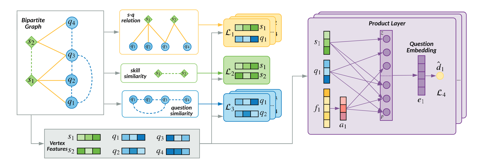

  - 输入
    - $s \in \mathbb{R}^{d_v}$：知识点embedding
    - $q \in \mathbb{R}^{d_v}$：习题embedding
    - $f$：习题的属性，用于学习习题难度表征，包括连续值（平均用时）和离散值（题目正确率），前者用scalar，后者用one-hot，拼接在一起表示习题属性
    - $d$：习题的难度标签，即习题的正确率
  - 二分图
    - s-q relation：ground trouth是习题和知识点的关系$r_{ij}^{qs}$，用知识点的embedding和习题的embedding的点乘做为相似度$\hat{r}_{ij}^{qs}$，使用BCE来约束知识点和习题embedding的学习
    - q-q relation：ground trouth是习题和习题的关系$r_{ij}^{q}$（如果两道习题有共享的知识点，则认为这两道习题之间的r为1），用习题的embedding的点乘做为习题相似度$\hat{r}_{ij}^{q}$，同样使用BCE来约束习题embedding的学习
    - s-s relation：ground trouth是知识点和知识点的关系$r_{ij}^{s}$（如果两个知识点对应了相同的习题，则认为知识点之间的r为1），用知识点的embedding的点乘做为知识点相似度$\hat{r}_{ij}^{s}$，同样使用BCE来约束知识点embedding的学习
  - Product Layer
    - 对于一道习题，输入为：1、它对应的知识点表征平均值s'，2、它的节点embedding（即q），3、它的难度属性（即f）
    - $a = Linear(f)$
    - 线性部分输入：$Z=[z_1^T, z_2^T, z_3^T] = [q^T, {s'}^T, a^T] \in \mathbb{R}^{3 \times d_v}$
    - 非线性部分输入：$P=[p_{ij}] \in \mathbb{R}^{3 \times 3},\quad p_{ij} = <z_i, z_j>$
    - 线性部分输出：$l_z^{(k)} = W_z^{(k)} \odot Z$，这里的$\odot$就是矩阵对应元素相乘求和，$k \in {1,2,...,d}$
    - 非线性部分输出：$l_p^{(k)} = W_p^{(k)} \odot P$，因为P为对称矩阵，所以W~p~也可以认为是一个对称矩阵，并且秩为1，那么就有$W_p^{(k)} = \theta^{(k)} {\theta^{(k)}}^T$，所以$W_p^{(k)} \odot P = \sum\limits_{i=1}^3 \sum\limits_{j=1}^3 \theta^{(k)} {\theta^{(k)}}^T <z_i, z_j>$
    - 定义$l_z = [l_z^{(1)}, ..., l_z^{(d)}], l_p = [l_p^{(1)}, ..., l_p^{(d)}]$
    - 最终习题的embedding是$e = relu(l_z + l_p + b)$
    - $d' = Linear(e)$是一个scalar
    - product layer使用MSE约束，ground truth是习题难度（正确率）d，预测值是d'
  - 联合训练
    - 定义二分图的三个损失分别为$\mathcal{L}_1, \mathcal{L}_2, \mathcal{L}_3$
    - 定义product layer的损失为$\mathcal{L}_4$
    - 总的损失为$\lambda (\mathcal{L}_1 + \mathcal{L}_2 + \mathcal{L}_3) + (1-\lambda) \mathcal{L}_4$

- 实验设置

  - 对于assist2009数据集：remove records without skills and scaffolding problems
  - For ASSIST09 and ASSIST12 datasets, average response time and question type are used as attribute features. For the EdNet dataset, average response time is used as an attribute feature.

- 代码细节

  - assist2009
    - 丢弃了scaffolding习题，所以习题数量和样本数都比正常情况少
    - 习题的特征有7个值，第一个值是平均用时（归一化），最后一个值是平均正确率，中间5个值是one-hot，表示5种类型习题
    - 只截断每个序列的前200个值，不把超出200的部分当成新的数据

# RKT

- 动机：知识追踪任务就是从学生历史练习记录中挖掘出每一次练习对学生知识状态的影响，这个影响包括两方面：1、习题之间的关系；2、学生的遗忘行为。现有的方法没有同时考虑这两个影响来建模（有一些单独考虑某一个影响的工作）
- 贡献：提出通过对习题之间关系（从上下文——习题的练习顺序——和学生表现中提取，类似AKT）和时间遗忘行为建模，从而获取一个relation coefficients，这个系数能反映历史的练习记录对未来练习的影响

# IKT

- 动机
  - 传统方法（BKT系列）将各个知识点视为独立的因素，忽略了知识点之间的关联，因此预测准确度不高
  - 基于深度学习的知识追踪方法（DLKT）虽然预测准确度高，但是却是黑盒模型（将学生的知识状态抽象为向量或者矩阵，不能显式表示学生在各知识点上的掌握程度，以及学生知识迁移的能力），可解释度低，不能提供心理学上有意义的解释（psychologically meaningful explanations），这一点对于认知诊断理论来说很重要
  - 假设：学生即使熟练掌握知识点，也可能做不对考察该知识点的某些习题，原因有两个，（1）学生没能理解习题的意思，即误解习题（2）未能正确使用相关知识点解答习题
- 贡献
  - 提出新的学生模型，使用3个有丰富含义的潜特征来预测：individual skill mastery of a student, ability profile (across skills) and problem difficulty
- 特征工程
  - 知识追踪：提取学生对每个独立知识点的掌握程度，使用BKT实现
  - 能力画像：获取学生迁移知识点的能力，受启发于DKT-DSC
    - 每20个timestep评估一次学生的ability profile
    - 首先计算$d^i_{1:z} = [R(x_1)_{1:z},\ R(x_2)_{1:z},\ ...,\ R(x_n)_{1:z}]$，其中i表示学生，z表示某一时刻，$R(x_j)_{1:z} = \sum\limits_{t=1}^z \frac{x_{jt}}{|N_{jt}|}$表示学生在z时刻，回答知识点j的正确率（$x_{jt}$即学生t时刻是否回答对知识点j，$|N_{jt}|$表示学生t时刻回答过多少次知识点j）。如果学生在z时刻之前没做过知识点j，那么$R(x_j)_{1:z}$赋值为0.5
    - 对所有学生的$d_{1:z}$使用K-means算法做一次K聚类
    - $ability\ profile(ab_z) = \mathop{arg\ min}\limits_{C} \sum\limits_{c=1}^K \sum\limits_{d_{1:z-1} \in C_c} ||d_{1:z-1} - \mu_c||$，其中$\mu_c$是聚类中心
    - 每个学生在前20个时刻内，其$ab_z$视为1
    - 实现上，K=7，$ab_z=1$是初始状态
    - 也就是根据每个学生在各个知识点上的正确率对学生的能力分类
  - 习题难度：将所有习题的难度分为11个等级
    - $difficulty\ level(p_j) = \delta(p_j)\ if\ |N_j| \ge 4\ else\ 5,\quad \delta(p_j) = \lfloor \frac{\sum_i^{|N_j|} O_i(p_j)}{|N_j|}\cdot 10 \rfloor$
    - $|N_j|$是做过习题$p_j$的学生数
    - $O_i(p_j)$表示学生i第一次做习题$p_j$正确与否
    - 对于测试集中未见过的习题，或者被练习次数少于4的习题，统一认为习题难度为5
- TAN（Tree-Augmented ）算法搜索NB（Naive Bayes）
  - 目标是构造贝叶斯网络，在本文中共有5个节点，分别是correctness、skill_ID、ability_profile、problem_difficulty和skill_mastery，选择correctness为根节点
  - 首先通过特征工程得到样本，每一个样本的格式是(skill_ID, skill_mastery, ability_profile, problem_difficulty, correctness)
    - skill_ID取值：{0,1,2,...,n}，n为知识点数目
    - skill_mastery取值：0～1之间的连续值，表示学生在skill_ID这个知识点上的掌握程度，通过BKT得到
    - ability_profile取值：{0,1,2,3,4,5,6,7}，通过聚类算法得到
    - problem_difficulty取值：{0,1,2,3,4,5,6,7,8,10}，通过数据集计算得到
    - correctness：{0,1}

  - 有了样本后就可以计算各个属性之间的条件互信息，这里的条件就是correctness。例如计算skill_ID（记为X）和skill_mastery（记为Y）在correctness（记为C）为1的条件下的互信息，即$I(X;Y|C=0) = \sum\limits_{x\in X,\ y \in Y}p(x,y,C=0)log\frac{p(x,y\ |\ C=0)}{p(x\ |\ C=0)p(y\ |\ C=0)}$
  - 两个属性之间条件互信息的加权就可以视为这两个属性对应节点之间的无向边的权重
  - 根据构造出来的无向图，选择correctness为根节点，构造最小加权生成树，即最终的贝叶斯网络，具体过程如下（使用普利姆算法，Prim）
    - 标记根节点为已达，初始化未达节点到树的距离为到根节点的距离
    - 从未达节点中选择到树距离最短，标记为已达，更新未达节点到树的距离
    - 重复步骤到所有节点已达

- 实验：根据训练数据学习TAN（Tree-Augmented Naive Bayes Method），在测试数据上预测，训练和测试都使用WEKA（The MWST algorithm, Minimum Weighted Spanning Tree, is applied in this research by using the data mining toolkit Weka）

# AdaptKT

- 动机：知识追踪目前存在两个和domain相关的问题（domain可以是学校、学科、年级）
  - 在某些domain上，可用的数据太少
  - 目前的方法不能做迁移，即在domain A上训练的模型，不能在domain B上使用，这样以来，就需要为每个domain训练一个模型，耗时耗力
  - 如果要解决DAKT（Domain Adaptation for Knowledge Tracing）问题，需要解决的问题：（1）
- 关于域自适应（DA，Domain Adaptation）
  - 迁移学习的目标是将在有标签的大数据集上学习到的潜在表征（latent representation）迁移到无标签的小数据集上。域自适应是迁移学习的一个分支，而在域自适应中，一个研究方向是最小化源域和目标域之间特征空间分布的差异。在这个方向上，最常用的用于衡量两个分布之间差异的就是MMD（maximum mean discrepancy）
  - 域自适应假设源域的特征空间和标签空间与目标域一致，即$\mathcal{X}_S = \mathcal{X}_T, \mathcal{Y}_S= \mathcal{Y}_T$，同时满足$\mathcal{Q}_S(\mathcal{Y}_S\ |\ \mathcal{X}_S) \neq \mathcal{Q}_T(\mathcal{Y}_T\ |\ \mathcal{X}_T)\quad or \quad \mathcal{P}_S(\mathcal{X}_S) \neq \mathcal{P}_T(\mathcal{X}_T)$，我理解其含义是：（1）特征空间一致指源域和目标域样本的特征都是相同含义的，比如源域样本是A城市的人，目标域样本都是B城市的人，两个城市的人的特征都是在同一空间的（如身高、体重、年龄）；（2）标签空间一致是指任务一致，源域和目标域都是在做相同的任务，比如判断是否可以给一个人发放贷款；（3）条件分布或者边缘分布至少有一个不相同表示源域和目标域是有区别的，源域上的模型不能直接迁移到目标域上
  - 域自适应：给定源域数据$\mathcal{D}_S$和目标域数据$\mathcal{D}_T$，希望利用$\mathcal{D}_S, \mathcal{D}_T$学习$f:x_T \mapsto y_T$
- DAKT问题：给定源域交互序列$\mathcal{I}_S$和少量目标域有标签数据$\mathcal{I}_{TL}$，希望利用$\mathcal{I}_S, \mathcal{I}_{TL}$学习一个知识追踪模型
- 模型

  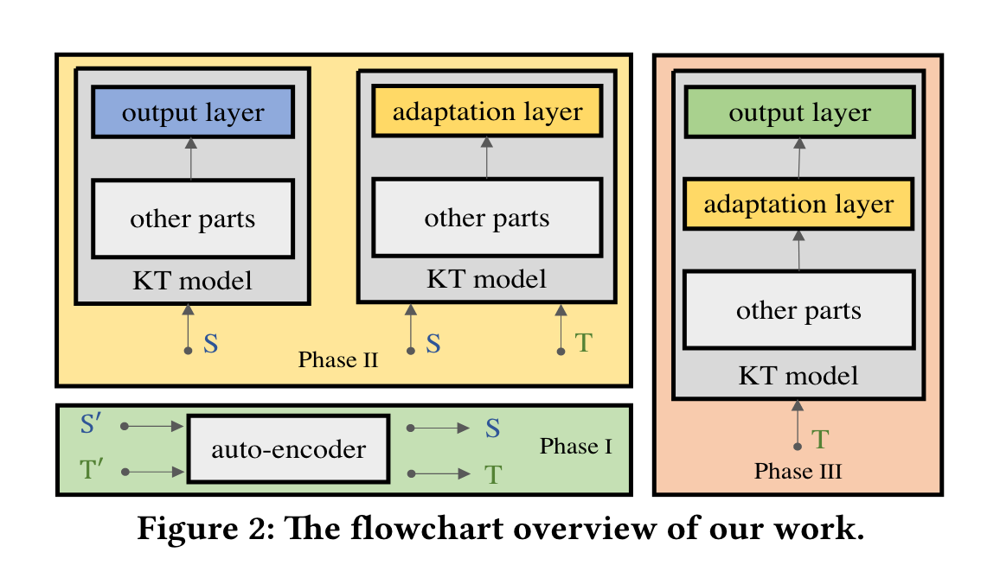

  - 流程：3个阶段
    - 阶段1：$S'$和$T'$是源域和目标域习题的文本，S和T是找出来的相似习题文本的embedding
    - 阶段2：用S训练一个知识追踪模型，然后去掉输出层，加上一个自适应层，再用S和T联合训练，优化是MMD
    - 阶段3：微调，在自适应层后面加一个符合目标域的输出层，使用T进行微调（冻住输出层以前的参数）

  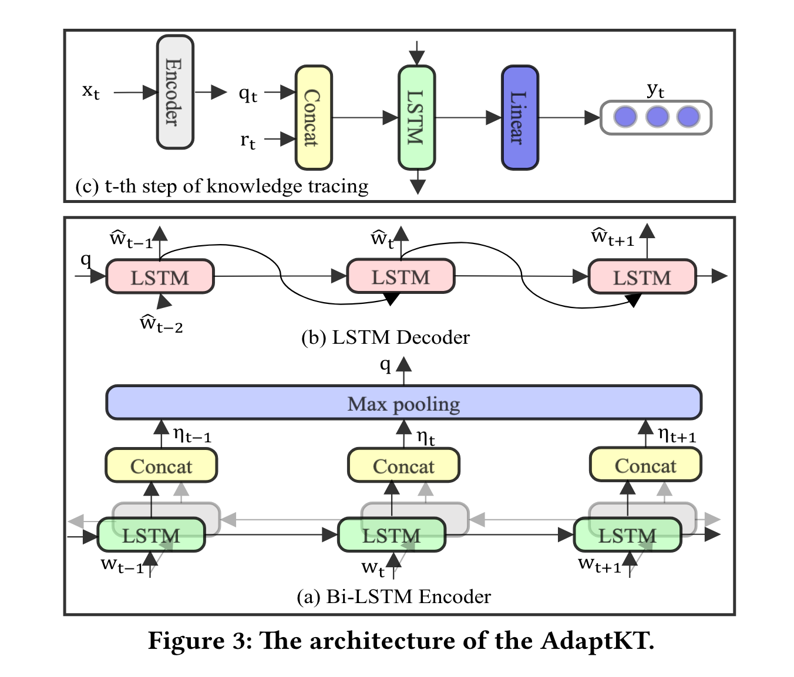
  
  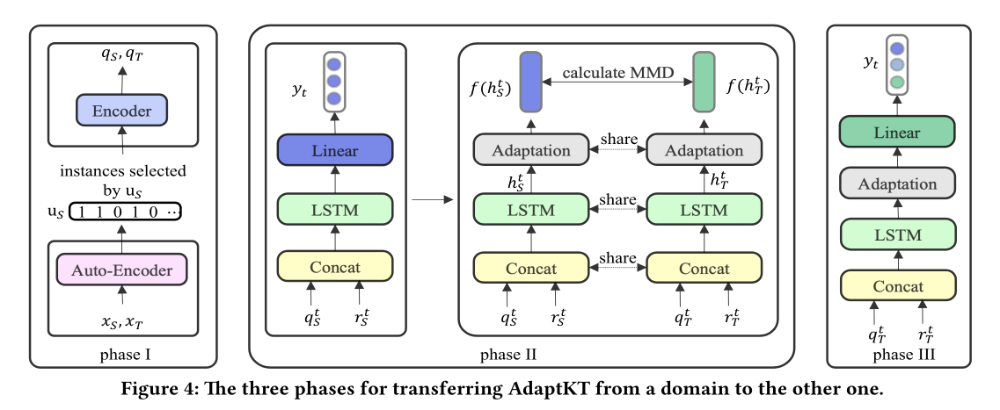
  
  - 阶段1：instance selection
    - 训练一个autoencoder，编码器是双向的LSTM，解码器是单向的LSTM
    - 输入是文本的word embedding序列，通过Word2Vec得到
    - 图3中Encoder里Concat的是两个方向的hidden state，即$\eta_t = [\overrightarrow{h_t},\ \overleftarrow{h_t}]$
    - 图3中Encoder里Max Pooling是对一个序列中的所有$\eta$每个维度做max操作，假设文本长度为L，hidden state维度为n，则q的第i维度值为$q_i = max\{\eta_0^i, \eta_1^i, ..., \eta_L^i\}$
    - 图3中Decoder里的$\hat{w}$就是重构出来的word embedding
    - 解码器的重构损失为$\mathcal{R}(\hat{x_i}, x_i) = \frac1L \sum\limits_{t=1}^L ||\hat{w_t} - w_t||_2^2$
    - $u_S$用于选择源域的习题，它是$\{0, 1\}^{n_S}$，$n_S$表示源域习题数
    - autoencoder的损失函数就是$\mathcal{J}_E(\pi_e, \pi_d, u_S) = \frac1{n_S} \sum\limits_{i=1}^{n_S}u_S^i\mathcal{R}(\hat{x}^i_S, x_S^i) + \frac1{n_T} \sum\limits_{i=1}^{n_T}\mathcal{R}(\hat{x}^i_T, x_T^i) + -\frac{\lambda}{n_S}\sum\limits_{i=1}^{n_S}u_S^i$，最后一项是正则项，防止$u_S$全为0
    - 训练策略：固定$u_S$时使用损失函数更新autoencoder的参数，固定autoencoder的参数时，根据$\mathcal{R}(\hat{x}^i_S, x_S^i)$更新$u_S$，具体就是若$\mathcal{R}(\hat{x}^i_S, x_S^i) < \lambda$，则更新$u_S^i$为1，否则为0
  - 阶段2：Domain Discrepancy Minimizing
    - 最小化域间差异的目标是学生的知识状态，即源域学生的知识状态分布和目标域学生的知识状态分布
    - 首先用源域数据训练一个DKT
    - Maximum Mean Discrepancy（MMD），评估两个分布距离的指标：$\mathcal{MMD}(\omega, \mathcal{P}, \mathcal{Q}) = sup_{f \in \omega}(\mathbb{E}_{\tau \in \mathcal{P}}[f(\tau)] - \mathbb{E}_{v \in \mathcal{Q}}[f(v)])$
      - $\mathcal{P}, \mathcal{Q}$是两个分布
      - $\omega$是函数空间
      - 含义就是找到一个映射函数f，使得两个分布样本映射后的期望相差最大，则将这个期望差视为两个分布之间的距离
    - 之后就是min这个MMD，也就是min max思想
    - 具体到本文的KT任务，就是将知识追踪模型的最后一层替换为Adaptation Layer（就是MLP，维度不变）
    - 图3中阶段2右边的图中，Adaptation输入是知识状态，更新Adaptation Layer，用的损失函数是$\gamma\mathcal{MMD}^2(h_S, h_T)$
  - 阶段3：Fine-tuning of the Output Layer
    - 在阶段2训练出来的模型后面加一层MLP（输出维度为目标域知识点数目），然后冻住输出层前面的网络，在目标域上进行微调

# Stable Knowledge Tracing using Causal Inference

- 动机

  - 现有的非因果推断知识追踪方法存在事实和预测不一致的问题，即模型预测结果和学生练习记录相矛盾，例如练习记录显示学生在知识点a上已经基本掌握（做对了多数考察知识点a的习题），但是模型依然预测学生无法做对知识点a的习题。另一方面这些方法也存在不稳定的问题，主要是指当学生反复练习同一知识点时，模型提取的学生关于这个知识点的状态会有很明显的波动起伏，这与学生知识状态应该是平稳渐进的理论相违背

  - 现有的因果推断框架将所有变量视为混杂因子（confounder），而忽略调整变量（adjustment variable），导致因果效果估计的方差变大，此外这种框架下需要知道一些先验知识（whether a variable is an outcome or not），这不适合知识追踪任务
  
- 目的：1) to investigate how to achieve stable knowledge tracing using causal inference. 2) to investigate the use of learning algorithms of convolutional neural networks to construct autoencoder models with theoretical analysis.

- 贡献

- 本文所使用的因果推断框架：潜在结果框架（potential outcome framework）或者鲁宾因果模型（Rubin causal model），该框架的主要目标是估计不同干预下的潜在结果（包括反事实结果），以估计实际的干预效果。具体采用的是重加权方法（Re-weighting methods）下的混杂因子平衡，其和一般的重加权方法区别是将变量分为混杂因子、调整变量和无关变量（一般的重加权方法将所有变量视为混杂因子），如下图所示

  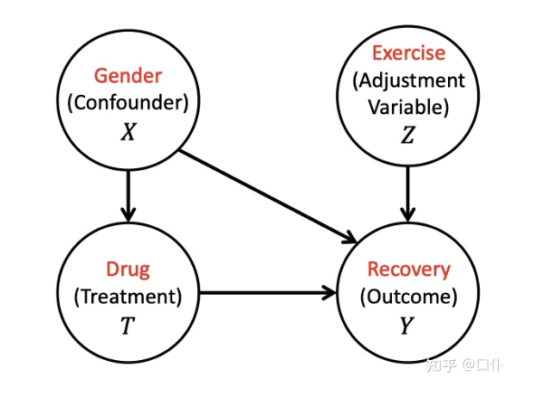

  - 平衡分数$b(x)$，一种通用的权重分数（倾向评分是其特例），满足$W \bot \!\!\! \bot x \ |\ b(x)$，其中x是背景变量，W是干预分配
  - 混杂因子平衡：为了区分混杂因子与调整变量的不同影响，同时消除无关变量，研究者们提出了一种数据驱动算法（Data-Driven Variable Decomposition），即$Y^*_{D^2VD} = (Y^F - \phi(Z)) \frac{W - p(x)}{p(x)(1-p(x))}$
    - $Y^F$：事实结果
    - $\phi(Z)$：
    - $W$：干预，对于二元干预来说就是0和1
    - $p(x) = P(W=1|X=x)$是倾向评分（Propensity Score），其实就是在观测数据中，condition X时W=1的频率，作为一个权重分数。倾向评分可以表明在给定一个观测协变量集合的情况下，单元被分配到特定干预的概率

- 符号和假设

  - $Y(n),n \in \{0,1\}$是一个学生做一道习题的结果，即该习题对应知识点$K=n$的结果，$K=1$表示学生掌握该知识点，反之亦然

  - 一个样本$Y_i(K_i)$是一次interaction，假设样本总数为m，对于第i个样本，即为3元组$(K_i, Y_i(K_i),U_i)$

    - 一个interaction里包含的元素有：学生、习题、习题对应知识点、结果
    - $K_i$：这个interaction中习题对应的知识点
    - $Y_i(K_i)$：事实结果或者观察结果
    - $U_i$：所有变量，理解为该学生的所有特征

  - $Y_i(K_i) = K_iY_i(1) + (1-K_i)Y_i(0)$：这就是假设的因果关系，$Y_i(1)$表示对第i个样本的习题，如果掌握对应知识点，做对的概率，$Y_i(0)$同理；$K_i$即表示第i个样本的学生是否掌握对应知识点

    ```
    K --> Y
          ^
          |
          U_Y
    ```

  - $Y(n)$表示学生对于一道习题，掌握或者没掌握该习题对应的知识点（n=0或1，表示掌握或者没掌握对应知识点）时，对应的潜在结果，为0表示做错，为1表示做对

  - 三个假设

    - 假设1，Stable Knowledge Concept Value：对应于**稳定单元干预值假设（Stable Unit Treatment Value Assumption, SUTVA）**，即任意单元的潜在结果都不会因其他单元的干预发生改变而改变，且对于每个单元，其所接受的每种干预不存在不同的形式或版本，不会导致不同的潜在结果。对应于知识追踪，就是说每个习题结果受到特定知识点的影响，学生在特定知识点之外知识点上的掌握程度不会影响学生对习题的解答
    - 假设2，Unconfoundedness：对应**可忽略性假设（Ignorability）**，即给定背景变量X（本文是所有变量U），干预的分配W独立于潜在结果，也就是$K\ \perp\!\!\!\perp\ (Y(0),Y(1))\ |\ U$。
    - 假设3，Separateness：将可观测变量U分为3组，即X、Z、I。X是混淆变量/因子，同时影响K和Y；Z是调整变量/因子，直接影响Y；I是无关变量/背景变量，本文不考虑I
    - 因果图如下：对于特定的习题$q$，假设其对应知识点集合为$K=\{k_{q,1}, k_{q,2}, ...\}$，其它知识点集合为$K_{-q}$

      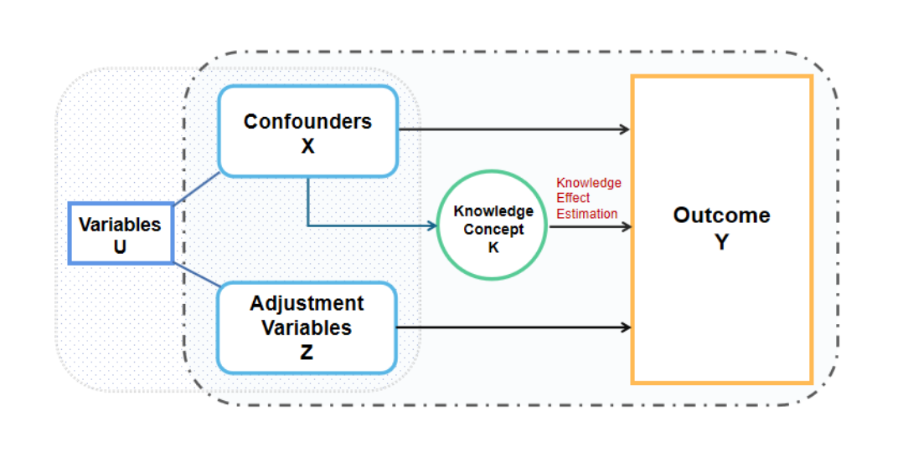

- 论文模型

  - $Y^+ = (Y_i(K_i) - \phi(Z)) \frac{K - e(X)}{e(X)(1-e(X))}$表示
    - $Y_i(K_i)$，事实结果
    - $e(X) = P(K=1|X) = \frac{1}{1+exp(-X\beta)}$，即condition 混杂变量，学生掌握知识点K的概率，其中$\beta$是系数向量
    - $\phi(Z) = Z\alpha$，减小调整因子对Y的影响，$\alpha$是系数向量
    - 估计器：$\hat{E}(Y^+) = E((Y_i(K_i) - \phi(Z)) \frac{K - e(X)}{e(X)(1-e(X))})$

# Incremental Knowledge Tracing from Multiple Schools

- 研究内容：使用SAKT连续在多个数据集（跨学校不跨学科/习题）上训练，可以达到直接在多个数据集上训练的同样效果
- 贡献：探索了连续学习在知识追踪上的可行性
- 实验：在assist2009数据集上选出3个学校的子数据集（1、2、3），按照1->2->3和3->2->1的顺序分别连续训练SAKT，发现首先在大的数据集上进行训练，模型会有更好更稳定的性能

# MRT-KT

- 动机

  - 对interaction（question-response pair）做更细粒度的建模一直没有被探索过。目前的方法主要是考虑两种类型的interaction：（1）adjacent interaction，多数应用场景为RNN系列模型，即每个interaction和当前interaction对应的concept与当前interaction的response有关，也就是RNN的输入为interaction embedding；（2）target-dependent interaction，多数应用场景为attention系列模型，即每个interaction和该学生历史时刻的interaction、当前interaction对应的concept、当前interaction的response有关，也就是AKT中的knowledge encoder，对interaction sequence做self-attention，以提取包含上下文信息的interaction embedding；（3）non-adjacent interaction，也就是当前interaction，和该学生历史练习记录与当前interaction无关的interaction，无关包括无concept共享和response不一样

  - 现有方法大多数忽略了第三种interaction的建模，RNN系列模型大多只对第一种interaction建模，像AKT这一类attention系列的模型同时考虑第一种和第二种interaction建模，但是忽略第三种interaction（除了SAINT+）

    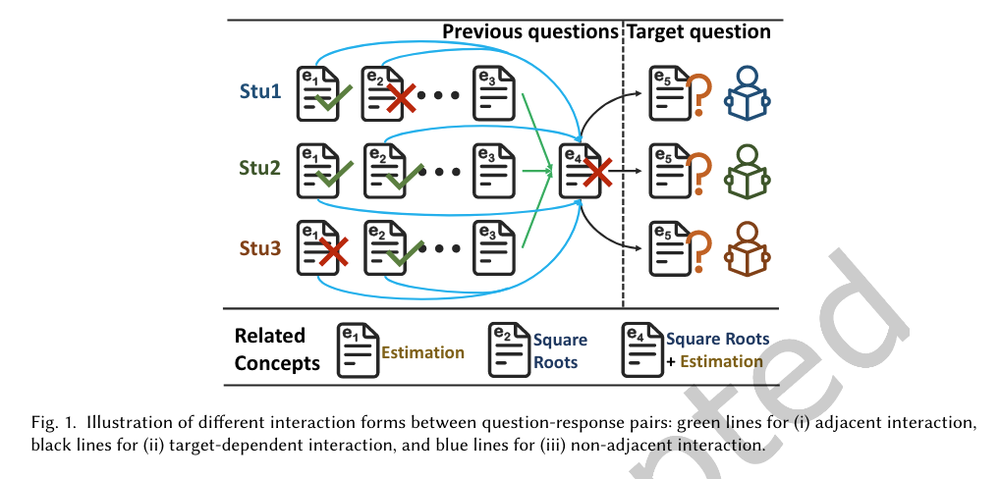

- 分析

  - 使用$\phi$系数分析不同类型interaction之间的cross effect，其中二元变量（有两个变量，两个变量取值为0或1）的公式为 $coef\ \phi = \frac{n_{11}n_{00} - n_{01}n_{10}}{\sqrt{n_{1\cdot}n_{0\cdot}n_{\cdot0}n_{\cdot1}}}$
  - n~11~表示两个变量值都为1的个数，其它情况类似
  - 具体到论文中的分析，两个变量表示两个interaction之间（论文中分别分析了间隔时刻为1、2、3、4的两个interaction）的关系（是否有至少一个共享知识点，是否结果相同）
  - 论文分析的第1种cross effect是Cross Effect between Concept and Performance，在这种设置下，第一个变量为1表示两个interaction至少共享一个知识点，第2个变量为1表示两个interaction的response相同，即都对或者都错
  - 论文分析的第2种cross effect是Cross Effect between Performance (when not sharing concepts)，在这种设置下，只考虑那些没有共享知识点的interaction，n~11~表示第1个和第2个interaction的response都对，n~10~表示前一个interaction为对，后一个为错，其它类似
  - 论文分析的第3种cross effect是Cross Effect between Performance (when sharing concepts)，在这种设置下，只考虑那些共享知识点的interaction，其它和第2种类似
  - 论文图中红线表示共享知识点的interaction之间存在正相关关系，即前面做对或做错相同知识点习题，对后面有影响，体现的是知识掌握程度对做题的影响，即knowledge mastery
  - 论文图中蓝线表示不共享知识点的interaction之间也存在正相关关系，即前面做对或做错一道习题（和后面习题无共享知识点），对后面有影响，体现的是学生学习状态对做题的影响，即学生做题的能力（这一点有点扯）
  - 论文图中紫线表示
  - 结论：不同的interaction之间有不同类型的relation

- 方法

  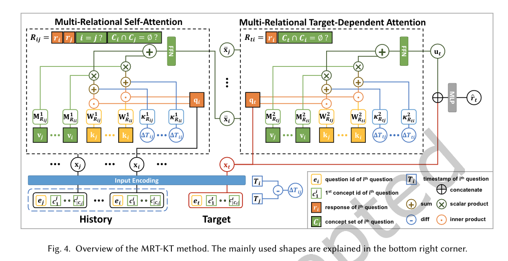

  - Multi-Relational Self-Attention: 这一部分就是AKT的knowledge encoder，即对历史的interaction使用transformer编码，让其有上下文信息
  - Multi-Relational Target-Dependent Attention: aggregating an overall dynamic student representation
  - 时间衰减或者遗忘建模都嵌入到了Multi-Relational Self-Attention和Multi-Relational Target-Dependent Attention中，即图中的$\triangle T$
  - 输入
    - $e_i \in \mathbb{R}^{\frac d2}$：embedding of i^th^ question
    - $c_i \in \mathbb{R}^{\frac d2}$: embedding of i^th^ concept
    - $x_i = [e_i,\ \sum\limits_{c_k \in C_i}c_k]$
  - Multi-Relational Self-Attention
    - $R_{ij}$是一个4 bit的code，第1个bit表示第i个interaction的response，第2个bit表示第2个interaction的response，第3个bit表示这两个interaction的response是否相同，第4个bit表示这两个interaction是否共享知识点
    - $R_{ij} = (r_i\ |\ r_j\ |\ int(r_i==r_j)\ |\ int(C_i \cap C_j == \empty))_2$，具体含义是将一个4位的二进制字符串转换为10进制的一个值
    - 也就是说$R_{ij}$里包含了correct的信息
    - $x_j$通过一个MLP得到key，$x_i$通过两个MLP分别得到value和query
    - $a_{ij}^1 = \frac{q_i^T W_{R_{ij}}^1 k_j}{\sqrt{d}}$是图中$\odot$的输出，其中$W_{R_{ij}}^1$是一个d*d的可学习参数矩阵
    - 时间衰减影响$b_{ij}^1=\kappa_{R_{ij}}^1(\triangle T_{ij})=-w_{R_{ij}}^1 log(\triangle T_{ij} + 1) + \beta_{R_{ij}}^1$是图中$\kappa_{R_{ij}}^1$的输出
    - 注意：不同的参数下标中的R~ij~表示这个参数是专门用于关系为R~ij~的两个interaction的，也就是说总共有10种关系（理论上4 bit应该对应16种，但是当第3个bit对前两个bit有限制），那么在Multi-Relational Self-Attention中所有的可学习参数就有10种
  - Multi-Relational Target-Dependent Attention
    - $R_{ij}$是一个2 bit的code，因为target的response是未知的；此外，$x_t$只作为query，key和value来自$\bar{x}$
    - 其它的和Multi-Relational Self-Attention一样
    - 目的是得到和target question相关的学生表征$u_t$
  - 如何获取学生在各个知识点上的掌握程度：（同EKT），将target x~t~替换为$\hat{c} = [0,\ c]$，其中0是d/2维的0向量，c是想要了解的知识点的embedding，这样模型的输出就是学生在知识点c上的掌握程度
  
- 具体设置

  - 对于assist2009数据集，假设两次练习时间时间间隔固定为1s（同HawkesKT）
  - 序列长度固定为50，长度低于5的丢弃，时间间隔按秒计算
  - Early stop策略的metric是AUC和ACC的乘积
  

# DataAugmentation

- 具体方法
  - replacement
    - 随机选择是否替换序列中习题id（替换习题和原习题在知识点上有交集），但是不改变回答结果
    - 正则损失为$\mathcal{L}_{reg-rep}=\mathbb{E}_{t \notin R}[(p_t - p_t^{rep})^2]$，其中p是模型预测分数，R是指被替换点的位置，即不计算被替换点的损失
  - insertion
    - 随机插入interaction（只插入做对或者做错的习题），后续的预测分数会增加/减少，保持单调性
    - 插入correct为1的习题的正则损失为$\mathcal{L}_{reg-cor\_ins}=\mathbb{E}_{t \in [T]}[max(0, p_t-p_{\sigma(t)}^{ins})]$，T是原序列的时间步，$\sigma(t)$是原序列时间步到增前后序列时间步的映射，如原序列为$\{(q_1, 1), (q_2, 1), (q_3, 0)\}$，增强后序列为$\{(q',1), (q_1,1), (q_2,1), (q'',1), (q_3,0)\}$，那么$\sigma(t)=\{1,2,3\}\ to\ \{2,3,5\}$
    - 插入correct为0的习题的正则损失为$\mathcal{L}_{reg-incor\_ins}=\mathbb{E}_{t \in [T]}[max(0, p_{\sigma(t)}^{ins}-p_t)]$
  - deletion
    - 随机删除interaction（只删除做对或者做错的习题），后续的预测分数会减少/增加，保持单调性
    - 删除correct为1的习题的正则损失为$\mathcal{L}_{reg-cor\_del}=\mathbb{E}_{t \notin D}[max(0, p_{\sigma(t)}^{del} - p_t)]$，D是指原序列中未被删除的时间步，$\sigma(t)$是D从原序列中到增强后序列的映射，如原序列为$\{(q_1, 1), (q_2, 1), (q_3, 0), (q_4, 1), (q_5, 1)\}$，增强后为$\{(q_3, 0), (q_4, 1), (q_5, 1)\}$，那么$\sigma(t)=\{3,4,5\}\ to\ \{1,2,3\}$
    - 删除correct为1的习题的正则损失为$\mathcal{L}_{reg-incor\_del}=\mathbb{E}_{t \notin D}[max(0, p_t - p_{\sigma(t)}^{del})]$

# AT-DKT

- 动机
  - 现有方法没有很好地探索习题和知识点内在关联建模
  - 已有的一些利用图网络的方法存在问题，因为数据集中习题与知识点之间的关联数据太稀疏（多数数据集中一道习题对应知识点数量太少，而习题数目又太多，具体见论文table 1）
  - 现有方法没有显式地建模学生个性化的能力，如知识获取能力和学习速率（不认同，IEKT做过，IKT也做过）
- 贡献
  - 提出QT task（Question Tag prediction task）和IK task（Individualized prior knowledge prediction task）来辅助KT任务。前者预测习题是否包含某个知识点，后者预测学生的知识水平（prior knowledge that is hidden in students’ historical learning interactions）

- 模型

  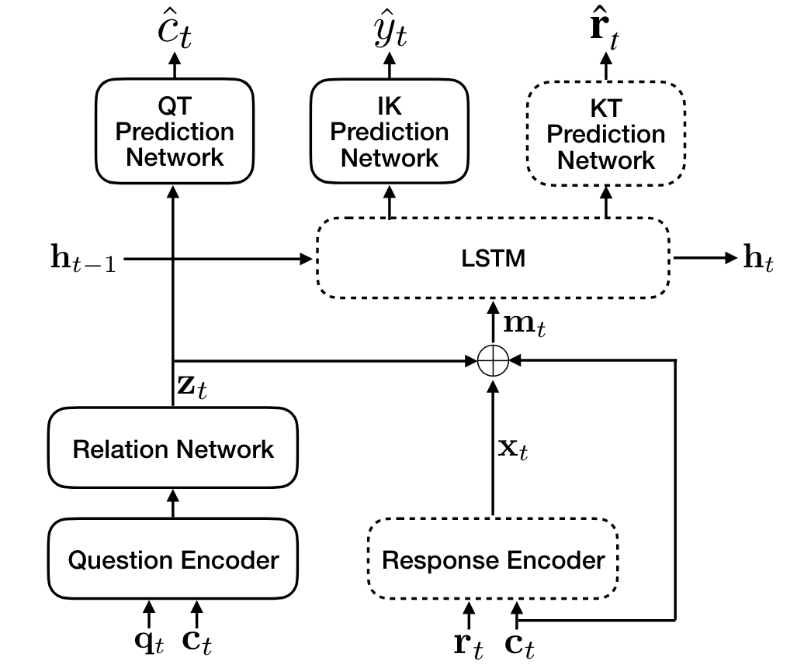

  - $q, c, r \in \mathbb{R}^d$
  - Question Encoder：dot product based multi-head transformer encoder，用于获取当前习题的表征
  - Relation Network：MLP
  - $z \in \mathbb{R}^{\frac d2}$
  - QT Prediction Network：MLP
  - $\hat{c}_t$：习题$q_t$包含知识点$c_t$的概率
  - QT loss：BCE
  - IK理论支持：学生做题的准确率可以视为学生总体知识水平的反映
  - IK Prediction Network：2-layers MLP，输入是$h_t$
  - $\hat{y}$：预测的学生历史做题准确率
  - IK loss：MSE，$\mathcal{L}_{IK} = \sum I(t > \delta)(y_t-\hat{y}_t)^2$，其中$y_t=[\sum\limits_{j=1}^t I(r_j==1)] / t$；$\delta$是超参数，用于控制网络不被开始时刻的loss约束；这里的r是基于习题的
  - $m_t = [z_t,c_t,x_t]$
  - KT Prediction Network：2-layers MLP，输入是$h_t$

- 实验设置：同PYKT

# DEGKT

- 动机：

  - 已有的一些方法将习题embedding和回答embedding拼接到一起送入网络预测，研究（DKT）已证明练习和答案的单独嵌入可能不兼容并降低性能
  - 图知识追踪研究的一个主要局限性是关注单一类型的关系信息（习题和知识点），而忽视了练习通过各种关系（如学生与习题的交换，学生之间的关系）广泛连接的事实
  - 本文研究的图节点是学生的交互（回答的问题以及结果）

- 贡献：

  - 基于学生的交互建立了对偶的图结构，并分别通过超图建模和有向图建模捕捉习题-知识点关系以及交互转移关系
  - 引入在线知识蒸馏来将图模型集成到知识追踪去，因为知识追踪的目的是预测学生能否做对一道题（可能对应多个知识点），但是训练的时候却是每道题只对应单个知识点

- 相关工作：知识蒸馏

  - 将信息从一个网络传输到另一个网络，同时进行训练的一种技术
  - 传输信息的模式：response-based knowledge, feature-based knowledge, or relation-based knowledge
  - 离线模式：teacher model是预训练好的，用于在蒸馏过程中知道student model训练
  - 在线模式：通过互相学习训练一组student models，以peer-teaching的形式

- 灵感：It is intuitively plausible that closely related learning interactions are more likely to reflect students’ similar knowledge levels.

- 模型

  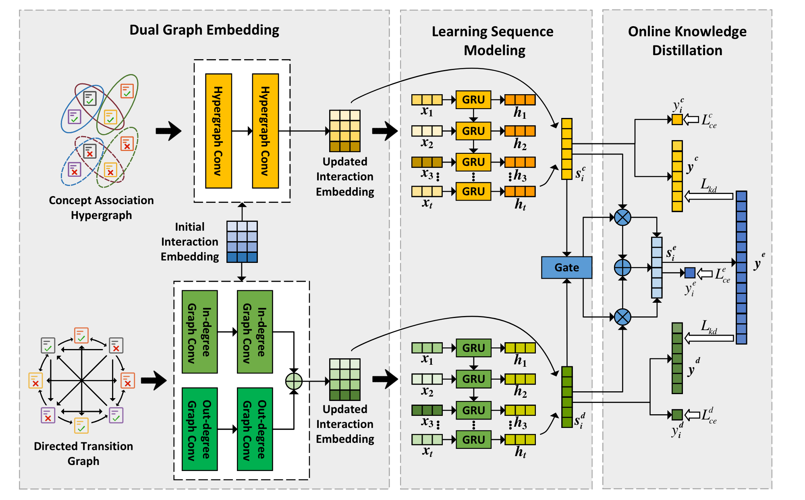

  - 代码
    - 首先获取CAHG和DTG的邻接矩阵，都是`2Q*2Q`的tensor，里面的值可以为小数，因为做了归一化，且DTG有两个，一个入，一个出
    - forward时首先取出所有node的embedding进行GCN，对于CAHG直接GCN，得到聚合后的interaction embedding；对于DTG从两个方向进行GCN，每个interaction有2个embedding，拼接起来作为该interaction最终的embedding
    - 然后用聚合的interaction embedding序列通过GRU，得到h，h通过预测层得到`(bs, seq_len, num_question)`的logits
    - KD过程：上一步得到的两个logits（即$s_i^c,s_i^d$）分别通过一个MLP然后相加得到g，$s_i^e=g \odot s_i^c + (1-g)\odot s_i^d$。训练过程中，温度T=0.5
    - 细节：预测损失是CAHG、DTG和ensemble的预测损失之和
  - 基本说明：n道习题，m个知识点，一道习题可能关联多个知识点
  - CAHG, Concept Association Hypergraph——$\mathcal{G}_c = (\mathcal{V}, \mathcal{E}_c)$
    - 节点是interaction，所以有2n个节点，即$\mathcal{V} = \{v_{1+}, v_{1-}, v_{2+}, v_{2-}, ..., v_{n+}, v_{n-}\}$
    - 里面有2m个子图（也是超边，即hyperedge），即$\mathcal{E}_c = \{\mathcal{H}_{1+}, \mathcal{H}_{1-}, \mathcal{H}_{2+}, \mathcal{H}_{2-}, ..., \mathcal{H}_{m+}, \mathcal{H}_{m-}\}$，每个子图对应该知识点下习题的interaction
    - 定义$\mathcal{U}_i = \{\mathcal{H}_j | v_i \in \mathcal{H}_j\}$，于是i节点的度$d_i = |\mathcal{U}_i|$
    - $\mathcal{H}_j$的度$g_j = |\mathcal{H}_j|$
  - CAHG节点更新：hypergraph convolutional networks
    - $x_i^{(l)} = \phi(\sum\limits_{\mathcal{H}_j\ \in\ \mathcal{U}_i} \frac{1}{g_j} \sum\limits_{v_q \in \mathcal{H}_j}\frac{1}{\sqrt{d_id_q}}W^{(l)}x_q^{(l-1)} ) $
    - 物理含义：习题interaction i的邻居节点是其对应的知识点子图下的节点
  - DTG, Directed Transition Graph——$\mathcal{G}_d=(\mathcal{V}, \mathcal{E}_d)$
    - 节点同CAHG
    - $\mathcal{E}_d$表示边，如果$v_i$指向$v_j$（用$(v_i,v_j)$表示），说明在所有学生的练习记录中出现过interaction j紧跟着interaction i
    - 转移概率$A_{i,j}^{(in)}=\frac{n_{j,i}}{\sum_{k}n_{k,i}}$，如果$(v_i,v_j) \in \mathcal{E}_d$，否则为0，物理含义是$(v_j, v_i)$出现的频率（interaction i作为后一个）
    - 同理$A_{i,j}^{(out)}=\frac{n_{i,j}}{\sum_{k}n_{i,k}}$
    - 包含self-loop，即$A_{i,i}^{(in)}=1,\ A_{i,i}^{(out)}=1$
    - 节点的入度和出度为$d_i^{(in)} = \sum_k A_{i,k}^{(in)},\ d_i^{(out)} = \sum_k A_{i,k}^{(out)}$
  - DTG节点更新：
    - GCN：从两个方向更新节点，公式如下
  - Learning Sequence Modeling
    - 使用GRU获取知识状态
    - 输入是interaction的embedding，输出是h
    - 如果预测$e_i$，则将$s_i = [h,x_{i+},x_{i-}]$送入MLP，得到做对的概率
    - 损失函数是BCE
  - online KD (Knowledge Distillation)
    - 为什么要使用知识蒸馏：BCE损失在每个时刻只约束了和预测习题相关的参数，并没有优化模型在其它习题预测上的能力（送入模型进行最终预测的是学生在预测习题$e_i$上的知识状态$[h,x_{i+},x_{i-}]$）。
    - 使用集成模型（Ensemble Model）作为教师模型，来指导学生模型训练。注意该教师模型也是在不断更新的，所以是在线知识蒸馏
    - Gate: MLP，输入是$[s_i^c,s_i^d]$，输出是$g$，$s_i^e=g \odot s_i^c + (1-g)\odot s_i^d$
    - $y^e,y^c,y^d$是通过公式$\frac{1}{1+e^{-z/\gamma}}$计算出来的soft label（hard label是one-hot），$\gamma$是温度系数，该值越大，输出的logits越平滑；如果是多分类，soft label的公式就是$\frac{e^{z_i/T}}{\sum_i^n e^{z_i/T}}$，同样T越大，输出的logits越平滑。目的是从软标签中学习到其它信息，如对于一张狗的图片，模型给狗的logits可能为10，给猫的logits可能为2，给鸟的logits可能为0.01，所以logits中也是有信息的，不选择用最后的概率分布原因是softmax会抑制负标签，如上例得到的概率分布可能为0.98，0.01，1e-10，就损失了一些信息。这也是为什么计算蒸馏损失时要调大T，就是为了让softmax输出更平滑，这样学生模型可以从教师模型那里学到更多东西
  - 损失
    - $\mathcal{L} = L_{ce}^c + L_{ce}^d + L_{ce}^e + \lambda L_{kd}$
    - $L_{ce}^c,L_{ce}^d,L_{ce}^e$都是BCE，是预测损失
    - $L_{kd}$是soft label的MAE，是蒸馏损失（选择使用MAE而不是KL散度原因：This is supported by the recent finding that the L1-norm distance is a tighter bound on the classification error probability）

# OKT

- 动机：现有知识追踪模型只利用学生回答对错（二元信息）来追踪学生的知识状态，没有利用学生回答的内容，这样会丢失很多信息，尤其是对应开放性习题来说

- 目的：用语言模型来追踪学生的知识

- 数据集：计算机编程习题，主观题，学生需要编写简短的程序来满足习题要求

- 挑战

  - KE（Knowledge Estimate）：`First, as students learn through practice, their knowledge on different programming concepts is dynamic; students can often learn and correct their errors given instructor-provided feedback or even error messages generated by the compiler. Therefore, we need new KE models that can effectively trace time-varying student knowledge throughout their learning process.`
  - RP（Response Prediction）：`Second, student-generated code is often incorrect and exhibits various errors; there may also exist multiple correct responses that capture different lines of thinking among students. This intricacy is not covered by program synthesis models, since their goal is to generate correct code and they are usually trained on code written by skilled programmers. Therefore, we need new RP models that can generate student-written (possibly erroneous) code that reflects their (often imperfect) knowledge of programming concepts.`

- 模型

  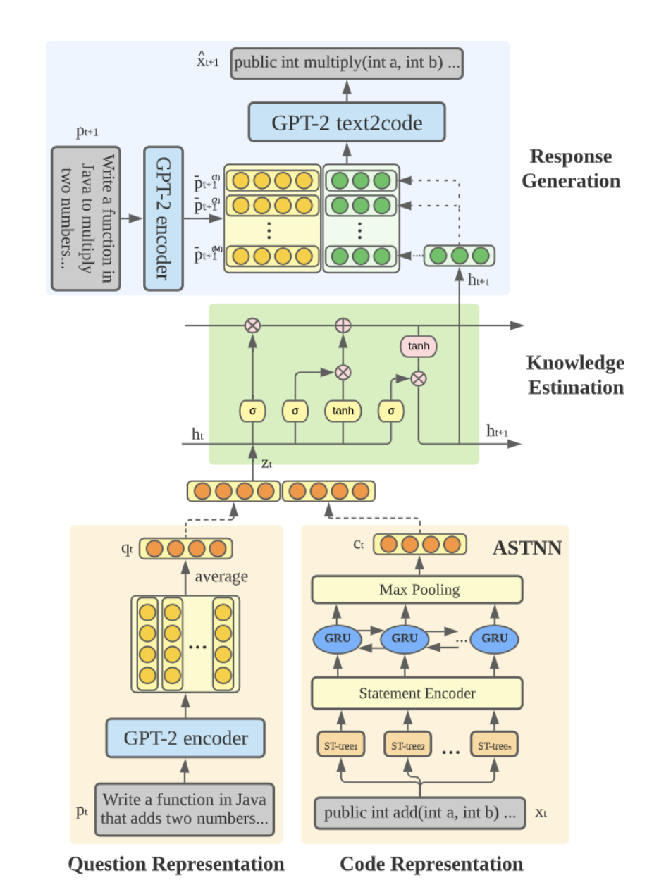

  - Question Representation
    - 习题文本 --> token sequence --> token embedding (GPT2 encoder) sequence --> avegare --> question embedding $q \in \mathbb{R}^{768}$
  - Code Representation
    - code --> AST --> `We then split each full AST into a sequence of non-overlapping statement trees (ST-trees) through preorder traversal.` --> ST-tree sequence --> RNN --> statement embedding sequence --> bRNN --> Max Pooling（dimension-wise） --> code embedding $c$
  - Response Generation
    - 目的：生成开放的回答，对应本文来说，就是生成预测的学生代码
    - 通过在text-to-code数据集上微调GPT2实现
    - 关键难点：如何使用KE模块生成的知识状态$h$控制生成的代码
    - 实现：通过对齐函数来对齐$h_{t+1}$和文本embedding序列（即$\{\bar{p}_1, \bar{p}_2, ..., \bar{p}_M\}$），实现将学生知识状态注入到代码生成器
    - 对齐函数：$\{p_1, p_2, ..., p_M\}=\{f(\bar{p}_1, h_{t+1}), f(\bar{p}_2, h_{t+1}), ..., f(\bar{p}_M, h_{t+1})\}$
      - $p_m = \bar{p}_m + h_{t+1}$
      - $p_m = (\bar{p}_m + h_{t+1}) /2$
      - $p_m = \bar{p}_m + \alpha \cdot h_{t+1}$，加一个可学习的权重
      - $p_m = \bar{p}_m + A h_{t+1} + b$，加一个Linear做仿射变换
  - GPT2微调数据集：Funcom dataset，`Recommendations for datasets for source code summarization.`
  
- 数据集

  - CSEDM Data Challenge (CSEDM), Challenge: https://sites.google.com/ncsu.edu/ csedm-dc-2021/. The dataset is called “CodeWorkout data Spring 2019” in Datashop (pslcdatashop.web.cmu.edu).
  - Hour of Code dataset, Adish Singla and Nikitas Theodoropoulos. 2022. From {Solution Synthesis} to {Student Attempt Synthesis} for block-based visual programming tasks. arXiv preprint arXiv:2205.01265.

- 指标

  - 第一类：measure OKT’s ability to predict student code on the test set after training
  - CodeBLEU：CodeBLEU: a Method for Automatic Evaluation of Code Synthesis.
  - test loss
  - 第二类：measure the diversity of predicted student code
  - dist-N metric (N=1)：A diversity-promoting objective function for neural conversation models
