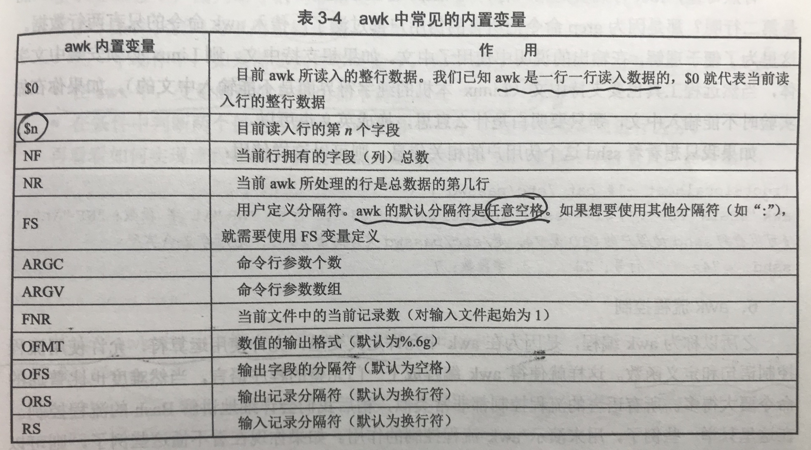
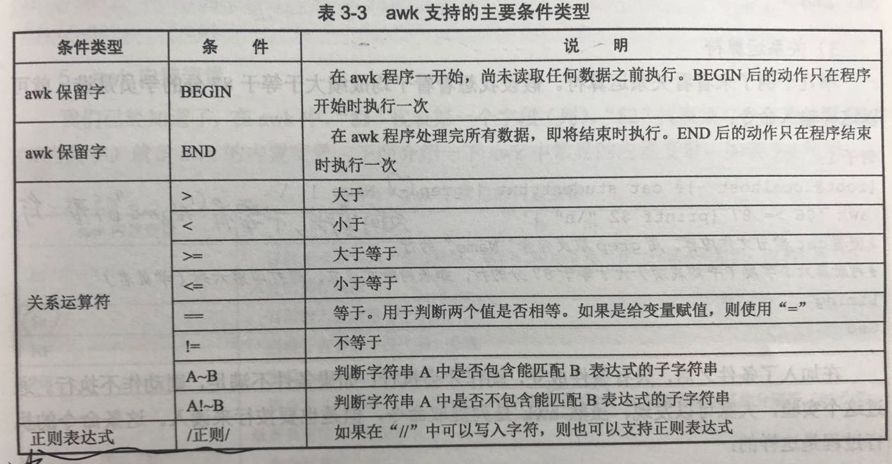

[TOC]

# 1、cat

- 全名：catenate

- 用途：显示文件内容

- 常用选项

  ```shell
  cat <选项> [fiel_name] 
  ```

  - `-n`：同时显示行数

- tac命令也是显示文件内容

- 例子：显示行数

  ```shell
  dream:2_线性表（链式存储） dream$ cat -n main.c
       1	#include <stdio.h>
       2	#include <stdlib.h>
       3	#include <stdbool.h>
       4	
       5	typedef int Element;
       6	typedef int Position;
       7	typedef struct LinkNode *PtrLNode;
  		...
  ```

# 2、more

- 全名：more
- 用途：分页显示文件内容，空格或f翻页，回车换行，q或Q退出

# 3、less

- 全名：less
- 用途：分页显示文件内容，可向上翻页，还可以进行搜索
- 使用less命令后，可以按`/<匹配字符串>`进行搜索

# 4、head

- 全名：head
- 用途：不指定参数时显示文件前10行

- 常用选项

  ```shell
  head [选项] <file_name>
  ```

  - `-n`：指定参数显示文件前n行

- 例子：显示前5行

  ```shell
  dream:2_线性表（链式存储） dream$ head -n 5 main.c
  #include <stdio.h>
  #include <stdlib.h>
  #include <stdbool.h>
  
  typedef int Element;
  ```

# 5、tail

- 全名：tail

- 用途：不指定参数显示文件后10行

- 常用选项

  ```shell
  tail [选项] <file_name>
  ```

  - `-n`：指定行数
  - `-f`：动态显示，可用于监控 

# 6、grep

- 全名：grep

- 用途：在输入数据中提取和匹配条件符合的字符串行，可作为输入数据的有文件内容，其它命令输出等等

- 常用选项：比较常用的是将其它命令的输出通过管道符`|`作为`grep`的输入数据来查找

  ```shell
  grep [选项] "搜索内容" <文件名>
  ```

  - 选项：
    - `-A n`    列出符合条件的行，并列出后续的n行
    - `-B n`    列出符合条件的行，并列出前面的n行
    - `-c`    统计找到的符合条件的字符串的次数
    - `-i`    忽略大小写
    - `-n`    连行号一起输出
    - `-v`    反向查找（即查找和条件不匹配的行）
    - `--color=auto`    搜索出的关键字用颜色显示

- 例子

  ```shell
  dream:tmp dream$ cat test.txt 
  name  age  class  grade
  xzj   20   10     90
  wy    21   10     92
  lq    19   8      95
  wjy   20   10     94
  ll    22   8      90
  dream:tmp dream$ cat test.txt | grep -n "xzj"
  2:xzj   20   10     90
  dream:tmp dream$ cat test.txt | grep -nv "xzj"
  1:name  age  class  grade
  3:wy    21   10     92
  4:lq    19   8      95
  5:wjy   20   10     94
  6:ll    22   8      90
  ```

  - `|`    管道符用于连接两个命令，即将前一个命令输出作为后一个命令输入
  - 注意：管道符要求前面的命令必须正确    

- grep有一个常用用法

  ```shell
  dream:tmp dream$ ps aux | grep bash          # 查看进程时不加后面的grep -v grep
  dream            26126   0.0  0.0  4296240   1732 s001  S+    8:17下午   0:00.03 -bash
  dream            12342   0.0  0.0  4296240   1368 s000  S    五09下午   0:00.70 -bash
  dream            26852   0.0  0.0  4267752    816 s000  S+    9:25下午   0:00.01 grep --color=auto bash
  dream:tmp dream$ ps aux | grep bash | grep -v grep
  dream            12342   0.7  0.0  4296240   1372 s000  S    五09下午   0:00.71 -bash
  dream            26126   0.0  0.0  4296240   1732 s001  S+    8:17下午   0:00.03 -bash
  ```

# 7、sort

- 全名：sort

- 用途：依据不同的数据类型来进行排序

- 常用选项

  ```shell
  sort [选项] <file>
  ```

  - `-f`    忽略大小写
  - `-b`    忽略每行前面的空白部分
  - `-n`    以数值类型进行排序，默认使用的是字符串类型
  - `-r`    反向排序
  - `-u`    输出重复行
  - `-t`    指定分隔符，默认为分隔符
  - `-k n[,m]`    按照指定的字段范围来排序，从第n个字段开始，到第m个字段结束，默认到行尾

- 例子

  ```shell
  dream:tmp dream$ cat test.txt 
  name  age  class  grade
  xzj   20   10     90
  wy    21   10     92
  lq    19   8      95
  wjy   20   10     94
  ll    22   8      90
  dream:tmp dream$ cat test.txt | grep -v name | sort -k 4
  # 可以看到并没有按最后一个字段排序，因为不是使用的按数值类型排序
  ll    22   8      90
  lq    19   8      95
  xzj   20   10     90
  wy    21   10     92
  wjy   20   10     94
  dream:tmp dream$ cat test.txt | grep -v name | sort -n -k 4
  # 按数值类型排序
  ll    22   8      90
  xzj   20   10     90
  wy    21   10     92
  wjy   20   10     94
  lq    19   8      95
  ```

# 8、uniq

- 全名：unique
- 用途：取消重复行，同`sort -u`

# 9、wc

- 全名：word count

- 用途：用于统计文本的行数、单词数或字符数，输入可为文件或其它命令输出

- 常用选项：

  ```shell
  wc [选项] <file>
  ```

  - `-l`    只统计行数
  - `-w`    只统计单词数
  - `-m`    只统计字符数

- 例子

  ```shell
  dream:tmp dream$ wc /etc/passwd 
       108     294    6774 /etc/passwd
  dream:tmp dream$ ls | wc -w        # 查看当前目录下有多少文件和目录
        13
  ```

- 使用wc命令统计服务器上有多少个正常连接

  ```shell
  dream:tmp dream$ netstat -an | grep ESTABLISH 
  tcp4       0      0  192.168.1.12.60945     104.84.122.120.443     ESTABLISHED
  tcp4       0      0  192.168.1.12.58060     163.177.81.141.8080    ESTABLISHED
  tcp4       0      0  192.168.1.12.57507     17.188.166.16.5223     ESTABLISHED
  tcp4       0      0  192.168.1.12.57502     17.57.144.116.5223     ESTABLISHED
  dream:tmp dream$ netstat -an | grep ESTABLISH | wc -l
         4
  ```

# 10、awk

## （1）awk介绍

- awk编程用于在Linux/UNIX下对文本和数据进行处理，处理的数据可以来自标准输入、一个或多个文件，或者其它命令的输出
- awk的机理：逐行扫描数据，寻找匹配特定条件的行，并在这些行上进行指定动作
- gawk是awk的GNU版本，在Linux中，awk已经被链接到gawk
- awk的基本语法和c语言类似

## （2）awk基本使用

- printf格式化输出	

  - 在awk中可以识别print输出和printf输出（print会自动加换行符，而printf不会），但是在Bash中只能识别标准格式化输出printf

    ```shell
    printf '<输出类型|输出格式>' <输出内容>
    ```

    - 输出类型：
      - `%ns`    输出字符串，表示输出n个字符（不加n默认为输出一个字符串）
      - `%ni`    输出n个整数数字
      - `%m.nf`    输出浮点数，m表示整数位数，n表示小数位数
    - 输出格式：即转义字符

  - 注意，printf只能输出具体数据，不能输出文件内容或使用管道符

  ```shell
  [dream@192 ~]$ printf 'hello, word!\n'
  hello, word!
  
  [dream@192 ~]$ printf '%s\n' $(date)      # 将date的输出作为printf的输入
  2020年
  03月
  08日
  星期日
  00:24:00
  CST
  ```

- awk的内置变量

  

- awk命令格式

  ```shell
  awk '条件1{动作1} [条件2{动作2} ...]' <文件名>
  ```

  - 条件：一般使用关系表达式作为条件，如下

    

  - 动作：格式化输出/流程控制语句
  - 例子：下面两个例子都没有设定条件，所以是每一行都执行了动作

  ```shell
  [dream@192 tmp]$ cat test.txt 
  1 aaaa 123
  2 bbb  456
  3 ccccc 78
  [dream@192 tmp]$ awk '{printf $1 "\t" $3 "\n"}' test.txt 	# 输出第1列和第3列第内容
  1		123
  2		456
  3		78
  
  [dream@192 tmp]$ df -h | awk '{printf $1 "\t\t" $3 "\n"}'  # 使用管道符将其它命令输出作为输入
  文件系统		已用
  /dev/mapper/centos-root		4.7G
  devtmpfs		0
  tmpfs		0
  tmpfs		18M
  tmpfs		0
  /dev/sda1		179M
  tmpfs		4.0K
  tmpfs		32K
  # 该语句和 df -h | awk '{print $1 "\t\t" $3}' 效果相同，print语句会自动换行
  ```

## （3）awk的条件使用

- `BEGIN`和`END`的使用

  ```shell
  dream:~ dream$ df -h | awk 'BEGIN{print "磁盘使用"} {print $1 "\t\t" $3} END{print "结束!"}'
  磁盘使用
  Filesystem		Used
  /dev/disk1s1		96Gi
  devfs		335Ki
  /dev/disk1s4		4.0Gi
  map		0Bi
  map		0Bi
  结束!
  ```

  - BEGIN和END只会执行一次

- 关系运算符的使用

  ```shell
  dream:tmp dream$ cat test.txt 
  name  age  class  grade
  xzj   20   10     90
  wy    21   10     92
  lq    19   8      95
  wjy   20   10     94
  ll    22   8      90
  dream:tmp dream$ cat test.txt | grep -v name | awk '$4>92 {print $0}'
  # grep -v是反向查找，这里是去除有name的一行
  # $n(n不为0)表示第n列，而$0表示awk当前读入的一整行数据
  # awk是一行一行扫描数据，这里就是awk对输入的数据一行一行比较第4列，符合条件的就执行动作{print $0}
  lq    19   8      95
  wjy   20   10     94
  ```

## （4）awk流程控制

- awk中可以写一些复杂的语句

  ```shell
  dream:tmp dream$ cat test.txt 
  name  age  class  grade
  xzj   20   10     90
  wy    21   10     92
  lq    19   8      95
  wjy   20   10     94
  ll    22   8      90
  dream:tmp dream$ awk 'NR==2{n1=$4} 
  NR==3{n2=$4} 
  NR==4{n3=$4} 
  NR==5{n4=$4} 
  NR==6{n5=$4; sum=n1+n2+n3+n4+n5; avarage=sum/5; print "the avarage is "avarage}' test.txt 
  the avarage is 92.2
  ```

  - 多个条件{动作}可以使用空格分隔，也可以使用回车分隔
  - 在一个动作中，若有多条语句，使用`;`分开
  - 在awk中，变量的赋值与调用都不用加`$`

## （5）awk函数

- awk中可以自定义函数，如下

  ```shell
  function <func_name> (parameters){
  	fucn_body
  }
  ```

  - 例子如下

    ```shell
    dream:tmp dream$ cat test.txt 
    name  age  class  grade
    xzj   20   10     90
    wy    21   10     92
    lq    19   8      95
    wjy   20   10     94
    ll    22   8      90
    dream:tmp dream$ awk 'function output(name, grade){print name":"grade} NR>=2{output($1, $4)}' test.txt   # 函数一般定义在最开头
    xzj:90
    wy:92
    lq:95
    wjy:94
    ll:90
    ```

## （6）awk中脚本调用

- 当把awk语句写入脚本中，调用脚本时使用`-f`选项来将文件读入脚本，例如

  ```shell
  dream:tmp dream$ cat test.txt 
  name  age  class  grade
  xzj   20   10     90
  wy    21   10     92
  lq    19   8      95
  wjy   20   10     94
  ll    22   8      90
  dream:tmp dream$ cat test.awk 
  #!/bin/bash
  
  BEGIN{print "hello----"}
  NR==2{n1=$4}
  NR==3{n2=$4}
  NR==4{n3=$4}
  NR==5{n4=$4}
  NR==6{n5=$4; sum=n1+n2+n3+n4+n5; avarage=sum/5; print "the avarage is "avarage}
  END{print "end!!!!!!"}
  dream:tmp dream$ chmod 755 test.awk 
  dream:tmp dream$ awk -f test.awk test.txt 
  hello----
  the avarage is 92.2
  end!!!!!!
  ```

  

