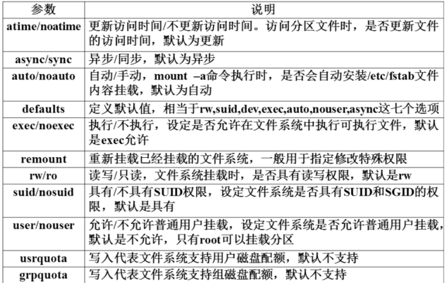

[TOC]

# 1、文件系统管理基本知识

## （1）分区

- 分区类型

  - 主分区：最多只能有4个主分区
  - 扩展分区：用于扩展逻辑分区，扩展分区相当于一个主分区
    - 只能有一个，扩展分区加主分区最多只能四个
    - 扩展分区中还可以划分扩展分区
    - 扩展分区不能存储数据和格式化（格式化就是将文件系统写入分区）
    - 扩展分区必须再划分为逻辑分区才能使用
  - 逻辑分区：逻辑分区是在扩展分区中再划分的
    - IDE硬盘：Linux最多支持59个逻辑分区
    - SCSI硬盘：Linux最多支持11个逻辑分区

- 分区的设备名

  - 主分区：为sda1～4

  - 扩展分区：同主分区

  - 逻辑分区：从sda5开始

  - 例子：假设有两个主分区，一个扩展分区，在扩展分区里有3个逻辑分区，则命名如下

    | 设备      | 设备名    |
    | --------- | --------- |
    | 主分区1   | /dev/sda1 |
    | 主分区2   | /dev/sda2 |
    | 扩展分区  | /dev/sda3 |
    | 逻辑分区1 | /dev/sda5 |
    | 逻辑分区2 | /dev/sda6 |
    | 逻辑分区3 | /dev/sda7 |


## （2）挂载

- 挂载：就是将硬件设备的设备名和挂载点（即盘符，一个目录）连接起来，通过访问挂载点来访问硬件设备
  - Windows中挂载是自动进行的，由系统自动分配盘符
  - Linux中所有存储设备都必须挂载后才能使用（硬盘的挂载是自动进行的）

# 2、df

- 全名：disk free

- 用途：查看文件系统

- 常用选项

  ```shell
  du [选项] [挂载点]
  ```

  - `-a`：显示所有的文件系统，包括特殊文件系统
  - `-h`：同ls的`-h`选项
  - `-T`：显示文件系统类型
  - `-m`：以MB为单位，默认为KB

# 3、du

- 全名：disk usage

- 用途：统计目录或文件大小，一般用ls查看文件大小，du比df目录更消耗资源

- 常用选项

  ```shell
  du [选项] <目录或文件>
  ```

  - `-a`：查看目录下所有文件和子目录大小，默认只显示子目录
  - `-h`
  - `-s`：只显示总大小


- 例子

```shell
[dream@172 test]$ ls
dir1  dir2  dir3  f1  f2
[dream@172 test]$ du
0	./dir1
0	./dir2
0	./dir3
0	.
[dream@172 test]$ du -a				# 也显示文件大小
0	./dir1
0	./dir2
0	./dir3
0	./f1
0	./f2
0	.
[dream@172 test]$ du -sh ~		# 查看指定目录总大小
162M	/home/dream
```


- df和du的区别
  - du（面向文件）查看的占用空间大小只包括文件和目录
  - df（面向文件系统）查看的占用空间大小不仅包括文件和目录，还包括被命令和程序占用的空间，最常见的就是文件已经删除，但是程序没有释放空间
  - 所以df看到的剩余空间才是真正的剩余空间
- 系统长期不重启，会累积大量被进程占用的空间和未释放的空间，导致可用空间减少
- du和df区别如下

```shell
[dream@172 test]$ df -h
文件系统                 容量  已用  可用 已用% 挂载点
/dev/mapper/centos-root  6.2G  4.7G  1.6G   75% /
devtmpfs                 897M     0  897M    0% /dev
tmpfs                    912M     0  912M    0% /dev/shm
tmpfs                    912M  9.1M  903M    1% /run
tmpfs                    912M     0  912M    0% /sys/fs/cgroup
/dev/sda1               1014M  179M  836M   18% /boot
tmpfs                    183M  4.0K  183M    1% /run/user/42
tmpfs                    183M   36K  183M    1% /run/user/1000
[dream@172 test]$ sudo du -sh /
[sudo] dream 的密码：
du: 无法访问"/proc/97543/task/97543/fd/4": 没有那个文件或目录
du: 无法访问"/proc/97543/task/97543/fdinfo/4": 没有那个文件或目录
du: 无法访问"/proc/97543/fd/4": 没有那个文件或目录
du: 无法访问"/proc/97543/fdinfo/4": 没有那个文件或目录
du: 无法访问"/run/user/1000/gvfs": 权限不够
4.6G	/

# 可以看到du查看的大小比df小
```

# 4、mount

## （1）基本使用

- 全名：mount

- 用途：用于挂载设备

- 常用选项

  ```shell
  mount [-t 文件系统] [-L 卷标名] [-o 特殊选项] <设备文件名> <挂载点>
  ```

  - `-t`：指定挂载的类型，可以为ext3、ext4、iso9660等文件系统

  - `-L`：挂载指定卷标的分区，而不是按照设备文件名挂载，也就是给分区起别名

  - `-o`：可以指定挂载的额外选项

    

    - 比较重要的是remount和exec/noexec

- 查看系统已有的挂载点

  ```shell
  dream:~ dream$ mount
  /dev/disk1s1 on / (apfs, local, journaled)
  devfs on /dev (devfs, local, nobrowse)
  /dev/disk1s4 on /private/var/vm (apfs, local, noexec, journaled, noatime, nobrowse)
  map -hosts on /net (autofs, nosuid, automounted, nobrowse)
  map auto_home on /home (autofs, automounted, nobrowse)
  /dev/disk2s1 on /Volumes/NO NAME (msdos, local, nodev, nosuid, noowners)	# u盘
  /dev/disk3s1 on /Volumes/Seagate Expansion Drive (ufsd_NTFS, local, nodev, nosuid, noowners)		# 移动硬盘
  ```

  - 可以看到我电脑的硬盘disk1s1的挂载点是根目录
  - disk2s1是移动硬盘的设备名，可以看到该硬盘的挂载点是`/Volumes/Seagate Expansion Drive`，那么我就可以通过访问这个目录来访问我的移动硬盘

- 依据配置文件/etc/fstab的内容，自动挂载

  ```sh
  mount -a
  ```

- 修改挂载的执行权限，重新挂载设备

  ```shell
  [root@192 boot]$ vim hello.sh
  [root@192 boot]$ chmod 755 hello.sh 
  [root@192 boot]$ ./hello.sh 
  hello
  [root@192 boot]$ mount -o remount,noexec /boot
  [root@192 boot]$ ./hello.sh 
  -bash: ./hello.sh: 权限不够							# 修改挂载的权限后，不能执行可执行文件
  [root@192 boot]$ mount -o remount,exec /boot
  [root@192 boot]$ ./hello.sh 					 # 改回来后，可以执行
  hello
  ```

## （2）挂载u盘和光盘

- 挂载光盘
  - 根目录下有`/mnt` 和`/media`两个目录用于挂载（一般前者用于u盘，后者用于光盘）
  - 挂载点必须是空目录
  - 光盘的设备名是`cdrom\*`或者`sr*`
  - 先创建一个空目录，然后将设备挂载到该目录上即可

- 卸载命令umount

  ```shell
  umount <设备文件名或者挂载点>
  ```

  - Linux下必须卸载后才能正常取出光盘，u盘也是一样

- 挂载u盘

  - 挂载前先使用`fdisk -l`命令查看u盘设备文件名，之后的步骤和挂载光盘一样
  - u盘的设备名为`sd*`，sd后面跟a或b或c······，这要看电脑本身有几块硬盘，先把设备名分给电脑本身的硬盘，之后才给u盘分配设备名
  - 注意u盘的兼容性（虚拟机默认设置是usb2.0）

  ```shell
  [dream@192 ~]$ sudo fdisk -l				# 查看u盘设备名
  ...
  磁盘 /dev/sdb：62.1 GB, 62109253632 字节，121307136 个扇区
  Units = 扇区 of 1 * 512 = 512 bytes
  扇区大小(逻辑/物理)：512 字节 / 512 字节
  I/O 大小(最小/最佳)：512 字节 / 512 字节
  磁盘标签类型：dos
  磁盘标识符：0x00000000
  
     设备 Boot      Start         End      Blocks   Id  System
  /dev/sdb1              32   121307135    60653552    c  W95 FAT32 (LBA)
  [dream@192 ~]$ sudo umount /dev/sdb1			# 我的虚拟机是自动挂载的，我需要先卸载u盘
  [dream@192 ~]$ sudo mount /dev/sdb1 /mnt/sr_dream/
  [dream@192 ~]$ cd /mnt/sr_dream/
  [dream@192 sr_dream]$ ls						# 手动挂载后中文是乱码
  ??    ?????                                   catsoop          System Volume Information
  ??    ??????                                  ??.docx          Ubuntu16.04+NS2.35+NAM+PT.zip
  ??    ????????                                DSP??            vimrcforme
  ???   ??1710-???-17211249-?????????????.pptx  FM?labview?      voicebox
  ????  201911200615.pdf                        JD51??(USB??)    win10??
  ????  ?????.7z                                labview??.rar    WindowsSupport
  ????  ?????.7z                                ?? - ??.mp3      workplacec
  ????  ?????.7z                                ??????????.pptx  ??????.xlsx
  ????  ????AM?FM??.zip                         ??????.pptx      xzj
  ????  C++??                                   Rigol
  [dream@192 ~]$ umount /dev/sdb1				# 卸载，看一下系统自动挂载的挂载点
  [dream@192 ~]$ mount
  ...
  # 可以看到系统自动挂载挂载的是/run/media/dream/025E-CAC1 type vfat
  /dev/sdb1 on /run/media/dream/025E-CAC1 type vfat (rw,nosuid,nodev,relatime,uid=1000,gid=1000,fmask=0022,dmask=0077,codepage=437,iocharset=ascii,shortname=mixed,showexec,utf8,flush,errors=remount-ro,uhelper=udisks2)
  [dream@192 ~]$ cd /run/media/dream/025E-CAC1 type vfat
  [dream@192 025E-CAC1]$ ls						# 系统自动挂载的就是正常的
  201911200615.pdf               歌曲
  catsoop                        红外模块
  C++作业                        课件
  DSP答辩                        模电相关
  FM（labview）                  数电相关
  JD51资料(USB新版)              数据手册
  labview讲义.rar                通信1710-王敬一-17211249-超材料及隐身斗篷技术的研究.pptx
  Rigol                          通信原理研学.pptx
  System Volume Information      通原实验AM和FM材料.zip
  Ubuntu16.04+NS2.35+NAM+PT.zip  图片.docx
  vimrcforme                     未命名文件夹
  voicebox                       研学答辩（趋肤效应）.pptx
  win10文件                      赵雷 - 成都.mp3
  WindowsSupport                 值班室电话表.xlsx
  workplacec                     中期答辩
  xzj                            综合实验二.7z
  陈老师讲义                     综合实验三.7z
  大创相关                       综合实验一.7z
  大三上                         作业
  电子设计竞赛资料
  [dream@192 catsoop]$ cd ~
  [dream@192 ~]$ sudo umount /dev/sdb1
  ```

  - 挂载出现乱码，重新挂载调整一下编码即可

## （3）支持NTFS文件系统

- Linux默认不支持NTFS，解决办法有两个
  - 重新编译内核，加入NTFS驱动
  - 使用第三方软件NTFS-3G，教学视频：[兄弟连Linux教学](https://www.bilibili.com/video/av18156598?p=60)

# 5、tar

- 全名：tar

- 用途：打包、压缩目录

  - 打包：把多个文件或目录打成一个包（即一个文件），方便对这个包进行压缩
               Linux下包的后缀名为`.tar`
  - 压缩：使用某种算法将一个大文件的容量减小，压缩是对文件的操作，在Linux下一般先打包文件，再对 
                包文件进行压缩，

- 常用选项

  ```shell
  tar [选项] <打包或压缩后文件名> <目录>
  ```

  - `-c`：打包
  - `-x`：解包
  - `-z`：和`-c`同时使用时为压缩，和`-x`同时使用为解压缩，压缩包为`.gz`
  - `-j`：和`-c`同时使用时为压缩，和`-x`同时使用为解压缩，压缩包为`bz2`
  - `-f`：指定文件名
  - `-v`：显示详细信息

- 压缩后文件格式：.tar.gz


- tar基本使用，打包和解包

```shell
[dream@172 test]$ ls
t1  t2  t3  t4
[dream@172 test]$ tar -cf t123.tar t1 t2 t3				# 打包t1、t2、t3
[dream@172 test]$ ls
t1  t123.tar  t2  t3  t4
[dream@172 test]$ rm t1 t2 t3
[dream@172 test]$ ls
t123.tar  t4
[dream@172 test]$ tar -xf t123.tar 								# 解包t123.tar
[dream@172 test]$ ls
t1  t123.tar  t2  t3  t4
```

- 先打包，再压缩，注意，命令的选项是有顺序的

```shell
[dream@172 test]$ ls
t1  t2  t3  t4
[dream@172 test]$ tar -zcf t123.tar.gz t1 t2 t3		# 打包并压缩为gz
[dream@172 test]$ ls
t1  t123.tar.gz  t2  t3  t4
[dream@172 test]$ tar -zxf t123_gz
[dream@172 test]$ mkdir t123_gz
[dream@172 t123_gz]$ mv ../t123.tar.gz ./t123.tar.gz
[dream@172 t123_gz]$ ls
t123.tar.gz
[dream@172 t123_gz]$ tar -zxf t123.tar.gz 				# 解压缩并解包
[dream@172 t123_gz]$ ls
t1  t123.tar.gz  t2  t3
```

```shell
[dream@172 test]$ ls
t1  t123_gz  t2  t3  t4
[dream@172 test]$ mkdir t123_bz2
[dream@172 test]$ ls
t1  t123_bz2  t123_gz  t2  t3  t4
[dream@172 test]$ tar -jcf t123.tar.bz2 t1 t2 t3		# 打包并压缩为bz2
[dream@172 test]$ ls
t1  t123_bz2  t123_gz  t123.tar.bz2  t2  t3  t4
[dream@172 test]$ mv t123.tar.bz2 t123_bz2/
[dream@172 test]$ cd t123_bz2/
[dream@172 t123_bz2]$ ls
t123.tar.bz2
[dream@172 t123_bz2]$ tar jxf t123.tar.bz2 					# 解压缩并解包
[dream@172 t123_bz2]$ ls
t1  t123.tar.bz2  t2  t3
```

- 使用tar命令向包里追加文件

```shell
[dream@172 test]$ ls
t123  t123_bz2  t123_gz  t123.tar  
[dream@172 test]$ touch t4
[dream@172 test]$ tar -uf t123.tar t4				# 追加新文件到包里
[dream@172 test]$ ls
t123  t123_bz2  t123_gz  t123.tar  t4
```

- 使用tar命令从.tar包里提取一个包

```shell
[dream@172 test]$ ls
t123.tar.gz
[dream@172 test]$ tar -tvf t123.tar.gz 										# 查看包里的文件
drwxrwxr-x dream/dream       0 2020-02-14 21:45 t123/
-rw-rw-r-- dream/dream       0 2020-02-14 21:18 t123/t1
-rw-rw-r-- dream/dream       0 2020-02-14 21:18 t123/t2
-rw-rw-r-- dream/dream       0 2020-02-14 21:18 t123/t3
-rw-rw-r-- dream/dream       0 2020-02-14 21:55 t4
[dream@172 test]$ tar -zxvf t123.tar.gz t123/t1						# 将t123/t1解压缩并提取出来
t123/t1
[dream@172 test]$ ls																			# 可以看到t123目录也被创建了
t123  t123.tar.gz
```

# 6、gzip

- 全名：GNU zip

- 用途：压缩文件，压缩文件的格式为`.gz`，该命令只能压缩文件，并且压缩文件会覆盖原文件

- 常用选项

  ```shell
  gzip [选项] <file_name>
  ```

  - `-d`：解压缩，相当于gunzip


- 例子，先打包，再压缩

```shell
[dream@172 test]$ ls													# t123为目录
t123  t123_bz2  t123_gz
[dream@172 test]$ tar -cf t123.tar t123				# 先打包
[dream@172 test]$ ls
t123  t123_bz2  t123_gz  t123.tar
[dream@172 test]$ gzip t123.tar 							# 打包后再压缩
[dream@172 test]$ ls
t123  t123_bz2  t123_gz  t123.tar.gz
[dream@172 test]$ gzip -d t123.tar.gz 				# 解压缩，也会覆盖原文件
[dream@172 test]$ ls
t123  t123_bz2  t123_gz  t123.tar
```

# 7、gunzip

- 全名：GNU unzip
- 用途：解压缩gzip文件，作用同`gzip -d <xxx.gzip>`

# 8、zip

- 全名：zip

- 用途：压缩文件或目录，压缩文件的格式为`zip`（在Windows和Linux下均可用）

- 常用选项

  ```shell
  zip [选项] <压缩后文件名> <文件或目录>
  ```

  - `-r`：表示压缩目录


- 例子，压缩目录

```shell
[dream@172 ~]$ ls
LAMP  test  公共  模板  视频  图片  文档  下载  音乐  桌面
[dream@172 ~]$ zip -r test.zip test
  adding: test/ (stored 0%)
  adding: test/t123_gz/ (stored 0%)
  adding: test/t123_gz/t123.tar.gz (deflated 1%)
  adding: test/t123_gz/t1 (stored 0%)
  adding: test/t123_gz/t2 (stored 0%)
  adding: test/t123_gz/t3 (stored 0%)
  adding: test/t123_bz2/ (stored 0%)
  adding: test/t123_bz2/t123.tar.bz2 (stored 0%)
  adding: test/t123_bz2/t1 (stored 0%)
  adding: test/t123_bz2/t2 (stored 0%)
  adding: test/t123_bz2/t3 (stored 0%)
  adding: test/t123/ (stored 0%)
  adding: test/t123/t1 (stored 0%)
  adding: test/t123/t2 (stored 0%)
  adding: test/t123/t3 (stored 0%)
  adding: test/t123.tar (deflated 99%)
```

# 9、unzip

- 全名：unzip
- 用途：解压缩zip压缩包
- cyxx

```shell
unzip <xxx.zip> 
```


- 例子

```shell
[dream@172 ~]$ ls
LAMP  test.zip  公共  模板  视频  图片  文档  下载  音乐  桌面
[dream@172 ~]$ unzip test.zip 
Archive:  test.zip
   creating: test/
   creating: test/t123_gz/
  inflating: test/t123_gz/t123.tar.gz  
 extracting: test/t123_gz/t1         
 extracting: test/t123_gz/t2         
 extracting: test/t123_gz/t3         
   creating: test/t123_bz2/
 extracting: test/t123_bz2/t123.tar.bz2  
 extracting: test/t123_bz2/t1        
 extracting: test/t123_bz2/t2        
 extracting: test/t123_bz2/t3        
   creating: test/t123/
 extracting: test/t123/t1            
 extracting: test/t123/t2            
 extracting: test/t123/t3            
  inflating: test/t123.tar           
[dream@172 ~]$ ls						# 可以看到使用unzip解压缩不会覆盖原文件
LAMP  test  test.zip  公共  模板  视频  图片  文档  下载  音乐  桌面
```

# 10、bzip2

- 全名：bzip2

- 用途：压缩文件，压缩文件的格式为`bz2`，用法同gzip

- 常用选项

  ```shell
  bzip2 [选项] <file_name>
  ```

  - `-k`：保留原文件

# 11、bunzip2

- 全名：

- 用途：解压缩bz2压缩文件
- 常用选项：`-k`，保留原压缩文件


