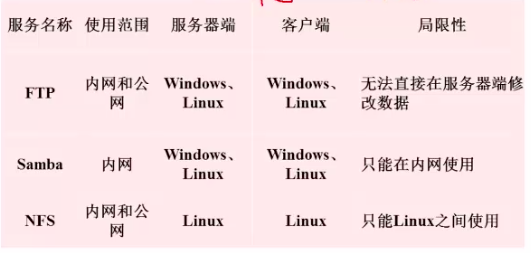

# 一、Samba简介

- samba服务：用于文件共享，是数据共享服务器
- 数据共享的方法
  - Windows：使用“网上邻居”，但是该服务只能在局域网内使用，不能跨网段
  - Linux：使用“NFS”，
  - “网上邻居”和“NFS”不能跨系统共享数据
- samba是基于NetBIOS协议开发（samba只能在局域网范围内使用）
  - NetBIOS协议是局域网内少数计算机进行通信的协议
  - Windows的局域网通信也是使用的NetBIOS协议，所以Linux使用samba服务可以和Windows通信
  - 注意：Windows在局域网内是通过主机名来通信的
- samba主要应用：
  - 文件共享
  - Windows主机名解析

- 几种文件服务器的对比

  

# 二、Samba安装与端口

- 安装samba需要的软件包（CentOS7中略有不同，然后注意是x86还是i686）
  - samba：主服务包
  - samba-client：客户端
  - samba-common：通用工具
  - samba4-libs：库（CentOS7中是samba-test-libs）
  - samba-winband：Windows域映射
  - samba-winband-client：域映射客户端
- samba的守护进程
  - smbd：提供对服务器中文件、打印资源的共享访问
    - 端口：139、445
  - nmbd：提供基于NetBIOS主机名称的解析
    - 端口：137、138
- 启动命令：`service smb start`