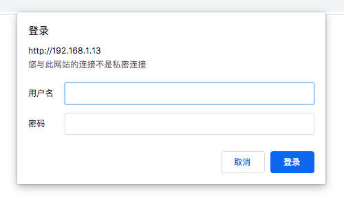

[TOC]

# 一、安装apache

- apache的服务名为httpd
- 安装apache的方法
  - 使用rpm包安装，可以使用yum安装
  - 源码安装，建议使用这个，因为源码安装是用自己的编译器编译的，性能比rpm包安装的要好一点

- 使用源码安装apache：解压缩、配置（配置后会有makefile文件）、编译安装

  1. 安装编译器和必须的软件

     ```shell
     sudo yum install gcc* pcre-devel openssl-devel
     ```

     - gcc为编译器
     - pcre为apache依赖的底层包，用于正则表达式
     - openssl用于搭建https服务的加密

  2. 准备源码包

     - 源码包链接
       - [apache](http://httpd.apache.org/download.cgi#apache24)
       - [apr和apr-util](http://apr.apache.org/download.cgi)

     ```shell
     [dream@172 LAMP]$ ls
     apr-1.7.0.tar.gz  apr-util-1.6.1.tar.gz  httpd-2.4.41.tar.gz
     ```

     - apr和apr-util是apache移植所依赖的底层软件

  3. 解压缩

     - 解压缩

     ```shell
     [dream@172 LAMP]$ tar -zxf apr-1.7.0.tar.gz 
     [dream@172 LAMP]$ tar -zxf apr-util-1.6.1.tar.gz 
     [dream@172 LAMP]$ tar -zxf httpd-2.4.41.tar.gz
     ```

     - 将apr和apr-util放入到httpd的编译目录下

     ```shell
     [dream@172 LAMP]$ cp -r apr-1.7.0 httpd-2.4.41/srclib/apr
     [dream@172 LAMP]$ cp -r apr-util-1.6.1 httpd-2.4.41/srclib/apr-util
     ```

  4. 配置

     - 查看配置

     ```shell
     [dream@172 httpd-2.4.41]$ pwd
     /home/dream/LAMP/httpd-2.4.41
     [dream@172 httpd-2.4.41]$ ./configure  --help				# 查看配置帮助
     `configure' configures this package to adapt to many kinds of systems.
     
     Usage: ./configure [OPTION]... [VAR=VALUE]...
     ...
     ```

     - 进行配置

     ```shell
     [dream@172 httpd-2.4.41]$ ./configure --prefix=/usr/local/apache2 --sysconfdir=/usr/local/apache2/etc --with-include-apr --enable-so --enable-deflate=shared --enable-expires=shared --enable-rewrite=shared --enable-ssl
     ```

     - 配置选项解释
       - `--prefix=/usr/local/apache2`：软件安装目录
       - `--sysconfdir=/usr/local/apache2/etc`：软件配置文件路径
       - `--with-include-apr`：声明附带安装apr和apr-utils
       - `--enable-so`：表示启用DSO支持的Apache核心模块
         - DSO：动态模块的加载，即在apache允许时加载模块
       - 剩下的均为加载的动态模块
         - `--enable-deflate=shared`：提供超文本传输的压缩编码，可以提高访问的速度
         - `--enable-expires=shared`：浏览器cache的一部分，设置cache缓存过期的时间
         - `--enable-rewrite=shared`：地址（URL）重写，即域名跳转
         - `--enable-ssl`：提供加密功能，即https

  5. 编译安装软件

     ```shell
     [dream@172 httpd-2.4.41]$ make
     ```

     - 可能会报错：`xml/apr_xml.c:35:19: 致命错误：expat.h：没有那个文件或目录`，解决办法如下

     ```shell
     [dream@172 httpd-2.4.41]$ sudo yum install -y expat-devel*
     ```

     - 如果apr版本太高，可能会报错如下

     ```sh
     usr/local/apr-util//lib/libaprutil-1.so: undefined reference to `XML_GetErrorCode'  
     /usr/local/apr-util//lib/libaprutil-1.so: undefined reference to `XML_SetEntityDeclHandler'  
     /usr/local/apr-util//lib/libaprutil-1.so: undefined reference to `XML_ParserCre
     
     collect2: error: ld returned 1 exit status
     make[2]: *** [htpasswd] 错误 1
     make[2]: Leaving directory `/usr/local/software/apache/support'
     make[1]: *** [all-recursive] 错误 1
     make[1]: Leaving directory `/usr/local/software/apache/support'
     ```

     - 安装成功

     ```shell
     configure: summary of build options:
     
         Server Version: 2.4.41
         Install prefix: /usr/local/apache2
         C compiler:     gcc -std=gnu99
         CFLAGS:          -g -O2 -pthread  
         CPPFLAGS:        -DLINUX -D_REENTRANT -D_GNU_SOURCE  
         LDFLAGS:           
         LIBS:             
         C preprocessor: gcc -E
     ```

     - 然后

     ```shell
     [dream@172 httpd-2.4.41]$ make install
     ```

  6. 启动apache（由于是使用源码包安装的，需要使用绝对路径）

     ```
     [dream@172 httpd-2.4.41]$ sudo /usr/local/apache2/bin/apachectl start
     [dream@172 httpd-2.4.41]$ netstat -tuln | grep :80 | grep -v grep
     tcp6       0      0 :::80                   :::*                    LISTEN 
     ```

# 二、apache基本配置

- 配置文件
  - 源码包安装：
    - 主配置文件：`/usr/local/apache2/etc/httpd.conf`
    - 扩展配置文件：`/usr/local/apache2/etc/extra`
  - rpm包安装：/etc/httpd/conf/httpd.conf

- 默认网页保存位置（即位置根目录）
  - 源码包安装：`/usr/local/apache2/htdocs/`
  - rpm包安装：`/var/www/html/`
- 日志保存位置
  - 源码包按照：`/usr/local/apache2/logs/`
  - rpm包安装：`/var/log/httpd/`

- 主配置文件讲解
  - 配置文件中主要有以下三种设置
    - 模块设置：apache支持非常多模块，可以在配置文件中设置是否开启该模块，以及配置该模块
      - `#LoadModule authn_dbm_module modules/mod_authn_dbm.so`：去掉#表示开启该模块
      - `<IfModule unixd_module></unixd_module>`：这里面的内容就是对该模块的配置
    - 目录及文件设置：可以在配置文件对指定的目录及文件进行设置
      - `<Directory /></Directory>`：对指定目录的配置（该例子是对/目录的配置）
      - `<Files .ht*></Files>`：指定文件的配置（该例子是对后缀名以ht开头的文件）
  - 下面是apache默认的配置文件

```shell
[root@192 ~]# cat /usr/local/apache2/etc/httpd.conf 
...
# 服务器的apache的根目录
ServerRoot "/usr/local/apache2"			
...
# 服务器监听的IP地址及端口号
#Listen 12.34.56.78:80
Listen 80
...
# 设置apache支持的各种模块
# 开启该模块
LoadModule authn_file_module modules/mod_authn_file.so	
# 不开启该模块
#LoadModule authn_dbm_module modules/mod_authn_dbm.so
...
# 设置一个模块区域，对指定的模块做一些参数设置
<IfModule unixd_module>
User daemon
Group daemon
</IfModule>
...
# 设置管理员邮箱地址
ServerAdmin you@example.com
...
# 配置/目录
<Directory />
		# 设置权限文件的开关，all表示启用当前目录下的权限，none相反
    AllowOverride none
    设置客户端访问权限，这里是设置对/目录的访问控制，granted表示允许，denied相反
    Require all denied
</Directory>
...
# 设置网站服务器默认的首页文件目录
DocumentRoot "/usr/local/apache2/htdocs"
<Directory "/usr/local/apache2/htdocs">
    Options Indexes FollowSymLinks
    AllowOverride None
    Require all granted
</Directory>
...
<IfModule dir_module>
		# 声明网站首页文件名
    DirectoryIndex index.html
</IfModule>
...
# 配置所有后缀名以ht开头的文件
<Files ".ht*">
    Require all denied
</Files>
...
# 设置错误日志文件的目录
ErrorLog "logs/error_log"
# 设置日志记录的级别，如warn表示只记录warn级别及warn以上的级别
LogLevel warn
<IfModule log_config_module>
		# 设置日志的格式
    LogFormat "%h %l %u %t \"%r\" %>s %b \"%{Referer}i\" \"%{User-Agent}i\"" combined
    LogFormat "%h %l %u %t \"%r\" %>s %b" common

    <IfModule logio_module>
      # You need to enable mod_logio.c to use %I and %O
      LogFormat "%h %l %u %t \"%r\" %>s %b \"%{Referer}i\" \"%{User-Agent}i\" %I %O" combinedio
    </IfModule>
		# 设置访问日志的目录
    CustomLog "logs/access_log" common
</IfModule>
...
<IfModule alias_module>
		# 映射一个URL到指定目录下，声明cgi脚本
    ScriptAlias /cgi-bin/ "/usr/local/apache2/cgi-bin/"
</IfModule>
...
<IfModule cgid_module>

</IfModule>
...
<Directory "/usr/local/apache2/cgi-bin">
    AllowOverride None
    Options None
    Require all granted
</Directory>
...
<IfModule headers_module>
    RequestHeader unset Proxy early
</IfModule>
...
<IfModule mime_module>
		# 这个文件声明了应用程序和文件扩展名的关系
    TypesConfig etc/mime.types
		
		# 表示将指定的文件交给相应的模块处理，如下面第二句表示在遇到.gz .tgz的文件时，该由哪个模块处理
    AddType application/x-compress .Z
    AddType application/x-gzip .gz .tgz
</IfModule>
...
# 配置代理
<IfModule proxy_html_module>
Include etc/extra/proxy-html.conf
</IfModule>
...
# 配置ssl
<IfModule ssl_module>
SSLRandomSeed startup builtin
SSLRandomSeed connect builtin
</IfModule>
```

- 补充：

  - `<IfModule>`容器作用于模块；他首先会判断模块是否载入，只有判断结果为真才会执行容器内的指令， 结果为假，则会忽略
    - `<IfModule mpm_netware_module>`   如果载入mpm_netware_module模块则执行容器内的指令       
    - `<IfModule !mpm_winnt_module> `如果载入mpm_winnt_module模块则不执行容器内的指令

  - `<Directory>`容器的作用是让封装的指令在指定的目录及对应的子目录中其作用。但是这个目录必须是一个完整的路径，当然也可以使用通配符“*”，“·”，“？”匹配目录，也可以使用“[]”来确定字符范围，不过无论是“*”，“？”，还是“[]”都不能匹配“/”
  - `<Files>`容器只作用于文件，和`<Directory>`容器一样，也可以使用通配符和"[]" 以及在正则表达式的前面加上"~" 来使用正则表达式进行文件匹配
  - `<Location>`与`<LocationMatch>`容器的作用是对URL进行访问控制

# 三、常规优化

## （1）用户设置

```shell
[root@192 ~]# /usr/local/apache2/bin/apachectl start
[root@192 ~]# ps aux | grep httpd | grep -v grep
root   9795  0.0  0.1  75256  2396 ?    Ss  23:13 0:00 /usr/local/apache2/bin/httpd -k start
daemon 9796  0.1  0.1 366304  2228 ?    Sl  23:13 0:00 /usr/local/apache2/bin/httpd -k start
daemon 9797  0.1  0.1 366304  2224 ?    Sl  23:13 0:00 /usr/local/apache2/bin/httpd -k start
daemon 9798  0.0  0.1 366304  2224 ?    Sl  23:13 0:00 /usr/local/apache2/bin/httpd -k start
```

- 可以看到默认用户是`daemon`用户，这是不安全的，应该修改
- 修改后可以防止黑客攻破daemon用户后，以daemon为跳板登入服务器系统

```shell
[root@192 ~]# cat /etc/group | grep apache
apache:x:1002:
[root@192 ~]# useradd -M -s /sbin/nologin Xzj
[root@192 ~]# usermod -g apache Xzj
```

- 按照apache后会自动创建一个apache用户组
- 还需要创建一个apache的用户
  - `-M`：表示不给该用户创建家目录
  - `-s /sbin/nologin`：指定用户登入后所使用的shell，默认为/bin/bash，这里表示不允许用户登入系统

- 接下来修改配置文件中的用户和用户组

```shell
<IfModule unixd_module>
User Xzj
Group apache
</IfModule>
```

- 重启apache服务

```shell
[root@192 ~]# /usr/local/apache2/bin/apachectl restart
[root@192 ~]# ps aux | grep httpd | grep -v grep
root   9795  0.0  0.1  75256  2976 ?   Ss   23:13 0:00 /usr/local/apache2/bin/httpd -k start
Xzj    10265  0.0  0.2 366304  4208 ?   Sl  23:36 0:00 /usr/local/apache2/bin/httpd -k start
Xzj    10266  0.0  0.2 366304  4208 ?   Sl  23:36 0:00 /usr/local/apache2/bin/httpd -k start
Xzj    10267  0.0  0.2 366304  4208 ?   Sl  23:36 0:00 /usr/local/apache2/bin/httpd -k start
```

## （2）目录及权限设置

- 对于能够上传文件的用户，应该给上传的文件夹或文件设置权限（文件夹一般为755，文件一般为644）

## （3）目录选项

- 当访问被禁止时，使用rpm安装和使用源码包安装的apache报错信息有所不同（rpm安装的会暴露服务器相关信息，如版本号、IP、Port）		

- 如果想要不暴露服务器相关信息，需要在httpd.conf中添加如下两句

  ```shell
  servertokens prod      # prod表示当用户被拒绝时只输出简要信息，full则可以输出完整信息
  serversignature off
  ```

## （4）访问控制 

- 加密某些网页

  - 用户名、密码认证

    - 首先修改一下配置文件

    ```shell
    <Directory "/usr/local/apache2/htdocs">
        Options Indexes FollowSymLinks
        AllowOverride all      # 更改一下，改成all，表示启用权限文件
        Require all granted
    </Directory>
    ```

    - 创建权限文件

    ```shell
    authname "Welcome"  			# 这是提示信息
    authtype basic						# 认证类型，basic即为用户名密码认证
    authuserfile /usr/local/apache2/etc/users.psd   # 用户的用户名和密码文件
    require valid-user				# 只有通过验证的用户才能访问服务器
    ```

    - 使用命令创建用户User1

    ```shell
    [root@192 ~]# cd /usr/local/apache2/bin/
    [root@192 bin]# ./htpasswd -c /usr/local/apache2/etc/users.psd User1
    New password: 
    Re-type new password: 
    Adding password for user User1
    ```

    - 效果如下

    

  - 客户端验证

    - 可以实现只允许特定IP地址访问，或者只拒绝特点IP地址访问
    - 修改配置文件，首先关闭用户名密码验证，然后进行如下配置

    ```shell
    <Directory "/usr/local/apache2/htdocs">
    		Options Indexes FollowSymLinks
    <requireall>
        Require all granted
        require ip 192.168.1.5				# 只允许该ip访问
        require not ip 192.168.1.5		# 只拒绝该ip的访问
    </requireall>
    </Directory>
    ```

    

- 设置管理员登入（即只允许特定用户或IP访问）

## （5）options选项讲解

```
<Directory "/usr/local/apache2/htdocs">
		Options Indexes FollowSymLinks				# 目录选项和符号连接
    Require all granted
</Directory>
```

- 设置为`Indexes`：当访问的文件不存在时（比如没有index.html），会显示目录列表，有一定安全隐患
  								删除该选项，就会禁用目录列表
- 设置为`FollowSymLinks`：使用该选项时apache可以识别符号连接，使网站能够使用软连接（不安全 ）

## （6）虚拟主机

- 虚拟主机即在一台服务器上提供多个网站服务

- 在一台服务器上创建多个网站，分配给不同用户 

  - 基于IP的：不常用
  - 基于端口的：不常用	
  - 基于域名的		

  ```shell
  # 取消httpd.conf下面这句注释，该文件时虚拟主机的配置文件模版
  Include /private/etc/apache2/extra/httpd-vhosts.conf 
  ```

  - httpd-vhosts.conf的主要内容如下

    ```shell
    <VirtualHost *:80>
    #	ServerAdmin webmaster@dummy-host2.example.com
    	DocumentRoot "/usr/local/apache2/htdocs/test"
    	ServerName www.test.com
    #	ErrorLog "/private/var/log/apache2/dummy-host2.example.com-error_log"
    #	CustomLog "/private/var/log/apache2/dummy-host2.example.com-access_log" common
    </VirtualHost>
    ```

    - 上面的修改中，把网页的首页目录设置为`/usr/local/apache2/htdocs/test`，域名修改为了`www.test.com`


# 四、性能优化

## 1、日志优化

- 如果不对日志进行优化，则很快日志文件会因为太大而打不开


# 五、防火墙配置

## （1）