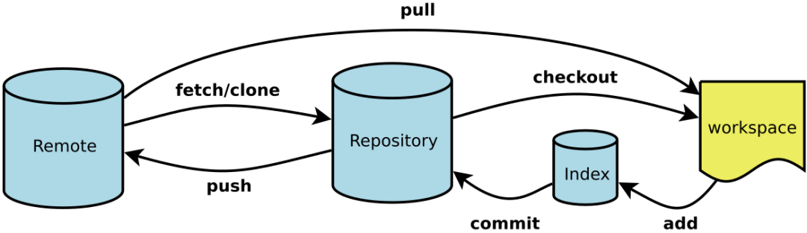
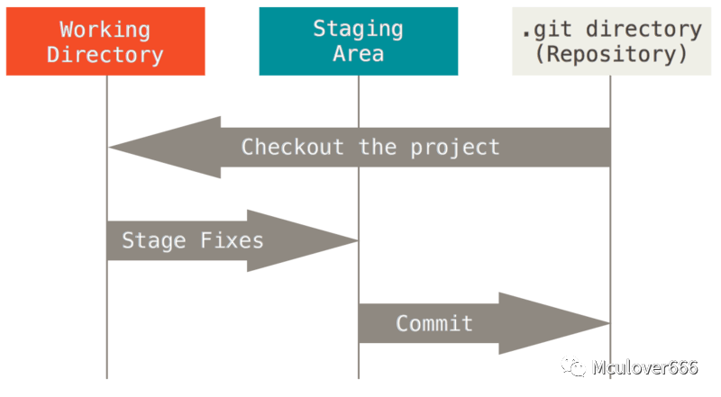
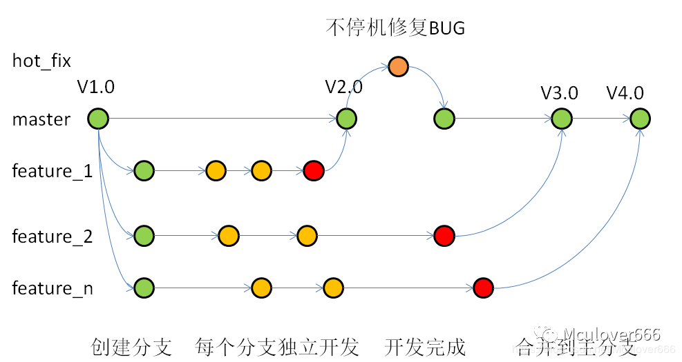

[TOC]

# 一、版本控制

## 1、版本控制介绍

使用版本控制有以下优点：

- 提高代码重用性
- 方便版本回退

使用版本控制软件有以下优点：

- 保存了数据当前状态以及之前每一个提交的历史状态，可以回退到任意一个版本节点；
- 在保存每一个版本的文件信息时不重复保存数据，节约存储空间，提高运行效率；
- 可以清楚到看到不同版本间修改的内容；
- 可以多人协作，团队开发；

## 2、版本控制工具介绍

- SVN：集中式版本控制工具

>集中式版本控制是指版本库是集中放到中央服务器上的，使用集中式版本控制工作时，必须连网（局域网或者互联网）。大致工作流程是先从中央服务器那里得到最新的版本，然后干活，干完后，把自己做完的活再推送到中央服务器。

- Git：分布式版本控制工具

>分布式版本控制系统是没有中央服务器的，每个人的电脑就是一个完整的本地版本库，工作的时候就不需要联网了。如果多个人协作的话，只需要每个人在自己电脑上提交修改到本地版本库，然后互相把各自的修改推送给对方，就可以看到对方的修改了。

# 二、Git基本使用

## 1、git的控制流程

1. 创建一个目录作为本地工作目录
2. 初始化本地仓库，git便会对本地工作目录下的所有文件进行版本控制（可以设置为管理部分文件）
3. 当新建或修改了某些文件时，通过添加到暂存区和提交到版本库保存本次操作（在当前分支上）
4. git还可以回溯到之前的某一版本
5. 使用git可以将自己的文件远程pull给别人，也可以clone别人的文件到自己电脑上

</img>

- workspace：工作区，对项目的某个版本独立提取出来的内容
- Index/Stage：暂存区，保存了下次将提交的文件列表信息
- Repository：本地仓库，Git用来保存项目的元数据和对象数据库的地方
- Remote：远程仓库

## 2、git中文件的状态

- modified：已修改，表示修改了文件，但还没保存到数据库中，对于工作区

- staged：已暂存，对一个已修改文件的当前版本做了标记，使之包含在下次提交的快照中，对应暂存区
- committed：已提交，表示数据已经安全的保存在本地数据库中，对应git仓库

</img>

## 3、git命令使用

| 命令                                   | 效果                                   |
| -------------------------------------- | -------------------------------------- |
| git config --global user.name "用户名" | 设置用户名                             |
| git config --global user.email "邮箱"  | 设置用户邮箱                           |
| git init                               | 初始化该目录，使之可以用git管理        |
| git status                             | 查看工作目录下所有文件的当前状态       |
| git add <文件名>                       | 添加文件到暂存区中                     |
| git commit                             | 把文件提交到仓库                       |
| git diff <文件名>                      | 查看文件何处被修改                     |
| git rm [--cache] <文件名>              | 移除文件                               |
| git log                                | 回顾提交历史                           |
| git reflog                             | 获取每个版本的索引值                   |
| git reset                              | 版本前进或后退                         |
| git checkout -- <文件名>               | 撤销修改或者删除（注意--后面有个空格） |
| git branch <分支名>                    | 创建分支                               |
| git checkout <分支名>                  | 切换分支                               |
| git merge                              | 合并分支                               |

下面是每个命令的详细介绍：

### （1）git init

```shell
dream:test2 dream$ git init
Initialized empty Git repository in /Users/dream/myGitProject/test2/.git/
dream:test2 dream$ ls -a
.	..	.git
```

使用该命令后，会在当前目录下创建一个.git文件夹，这个目录是Git来跟踪管理版本的，不要轻易改这个目录里面的文件，否则，会把git仓库给破坏

### （2）git add \<filename\>

- git add -A：跟踪所有文件
- 支持通配符，并且对目录操作时为递归添加到暂存区

```shell
dream:test2 dream$ touch file.txt
dream:test2 dream$ git add file.txt
```

### （3）git commit

- 提交后，会默认用vim来编辑提交信息，编辑好保存退出即可

- git commit -m "注释"：给这次提交添加信息（不使用vim）
- git -a -m "注释"：跳过暂存区直接提交已跟踪的文件

```shell
dream:test2 dream$ git status											# 查看当前暂存区的状态
On branch master

No commits yet

Changes to be committed:
  (use "git rm --cached <file>..." to unstage)

	new file:   file.txt

dream:test2 dream$ git commit -m "fisrt commit"
[master (root-commit) bcfd7da] fisrt commit
# 		提交分支				 提交校验码	提交到信息				
 1 file changed, 0 insertions(+), 0 deletions(-)
#		改变的文件数		  改变的行数
create mode 100644 file.txt	
 
dream:test2 dream$ git status											# 再次查看当前暂存区的状态
On branch master
nothing to commit, working tree clean							
```

每次提交都是对该项目的一个快照，在以后的任何时候都可以回退到该次状态。

### （4）git status

- git status -s：输出简短信息
- git status只能查看文件是否被修改，不能查看何处被修改

```sh
dream:test2 dream$ git status
On branch master					# 当前分支

No commits yet

Changes to be committed:
  (use "git rm --cached <file>..." to unstage)

	new file:   file.txt		# 待提交的文件

dream:test2 dream$ git status -s
M  file1.txt						# 在左边的M表示文件已被修改，并已放入暂存区
A  file2.txt						# 新添加到暂存区的文件
AM file3.txt						# 右边的M表示文件被修改，未放入暂存区
MM file4.txt						# 修改后放入暂存区，未提交前又在工作区被修改
?? file5.txt						# 未跟踪的新文件
```

### （5）git diff

- git diff --staged：查看已经暂存起来的修改

- 该命令比较工作区和暂存区文件的差异，即：已经修改但还未暂存的内容，最后通过文件补丁的格式表明具体哪些行发生了变化。

```shell
dream:test2 dream$ git diff file4444.txt 
diff --git a/file4444.txt b/file4444.txt
index 9cd30ac..6af61cc 100644
--- a/file4444.txt
+++ b/file4444.txt
@@ -1,2 +1,3 @@
-111111													# 这是被删除的一行
 222
+33															# 这是新添加的一行
```

### （6）git rm

- git rm \<filename\>：从暂存区删除，并且从工作目录删除源文件
- git rm --cacahe \<filename\>：从暂存区删除，保留工作区的源文件

### （7）git log

- -p：按补丁形式显示每个更新之间的差异（即git diff的形式）
- --stat：显示每次更新的文件统计信息
- --shortstat：只显示--stat最后的行数修改添加移除的统计信息
- --name-only：仅显示已修改的文件清单
- ---name-status：显示新增、修改、移除的文件清单
- --grath：显示图形表示的分支合并历史
- --pretty：使用其它格式显示

```shell
dream:test dream$ git log --shortstat
commit 995ee200a4d35fd9886ed0c516c7c760f91f11b7 (HEAD -> master)
Author: ZhijieXiong <18800118477@163.com>
Date:   Thu Jan 9 17:07:10 2020 +0800

    第一次修改

 1 file changed, 1 insertion(+)


commit 223f8bd7e41575408e86251852dfb188f0ea8a3e
Author: ZhijieXiong <18800118477@163.com>
Date:   Thu Jan 9 17:04:14 2020 +0800

    这是testForGit的提交

 1 file changed, 0 insertions(+), 0 deletions(-)

commit 6121085fe9482be3cba9b0c2fb2066879e0e0cd9
Author: ZhijieXiong <18800118477@163.com>
Date:   Sat Sep 28 15:58:53 2019 +0800

    This is first change

 1 file changed, 1 insertion(+)

commit e82171cb9d14d73f80a05ba6cd5cc1ccb773a813
Author: ZhijieXiong <18800118477@163.com>
Date:   Sat Sep 28 15:33:57 2019 +0800

    my first commit

 1 file changed, 2 insertions(+)
 
 
dream:test dream$ git log --pretty=oneline
995ee200a4d35fd9886ed0c516c7c760f91f11b7 (HEAD -> master) 第一次修改
223f8bd7e41575408e86251852dfb188f0ea8a3e 这是testForGit的提交
6121085fe9482be3cba9b0c2fb2066879e0e0cd9 This is first change
e82171cb9d14d73f80a05ba6cd5cc1ccb773a813 my first commit
```

### （8）git reflog

```shell
dream:test dream$ git reflog						# 最前面的数值即索引值，通过索引值可以进行版本回退或前进操作
995ee20 (HEAD -> master) HEAD@{0}: commit: 第一次修改
223f8bd HEAD@{1}: commit: 这是testForGit的提交
6121085 HEAD@{2}: commit: This is first change
e82171c HEAD@{3}: commit (initial): my first commit
```

### （9）git reset

Git版本前进回退的本质是移动`HEAD`指针，即基于索引值

- git reset --hard <索引值>：根据索引值改变版本
- git reset --hard HEAD\^：回退到上一个版本，HEAD\^\^为回退到两个版本之前，依此类推
- git reset --hard HEAD~10：回退到10个版本以前
- --soft：仅移动本地库HEAD指针
- --mixed：移动本地库HEAD指针，重置暂存区
- --hard：移动本地库HEAD指针，重置暂存区，重置工作区

### （10）git checkout -- \<filename\>

- 只要没有把删除操作commit，就可以恢复
- 恢复分为两种情况

> 第一种：修改了，还未添加到暂存区中，则恢复到原来的版本
>
> 第二种：提交到暂存区后修改了，则恢复到刚提交到暂存区时的状态

- git checkout \<filename\>：效果相同

### （11）git branch

在版本控制过程中，使用多条线同时推进多个任务，每一条线就叫做一个Git分支

</img>

使用分支的好处如下：

- 并行推进多个功能的开发，提高开发效率
- 各个分支在开发过程中是独立的，一个分支的失败不会对其他分支产生任何影响
- 分支开发失败后可重新开始

```shell
dream:test dream$ git branch -v			# 查看分支
* master b2acea6 as
dream:test dream$ git branch f1			# 创建分支
dream:test dream$ git branch -v
  f1     b2acea6 as
* master b2acea6 as
```

### （12）git checkout <分支名>

```shell
dream:test dream$ git branch -v
  f1     b2acea6 as
* master b2acea6 as
dream:test dream$ git checkout f1			# 切换分支
Switched to branch 'f1'
dream:test dream$ git branch -v
* f1     b2acea6 as
  master b2acea6 as
```

### （13）git merge

- 首先切换到主分支上
- 然后使用命令：git merge <待合并的分支名>

```shell
dream:test dream$ git checkout master
Switched to branch 'master'
dream:test dream$ git branch -v
  f1     b2acea6 as
* master b2acea6 as
dream:test dream$ git merge f1
Already up to date.


# 另一个例子，合并远程分支的部分文件，例如这里是合并database分支下的src/YouNameItDatabase.java到master分支里
dream:you-name-it dream$ git branch -v
* master 52d8eb4 4
dream:you-name-it dream$ git checkout -b database origin/database  # 创建一个本地分支，连接远程对应分支
Branch 'database' set up to track remote branch 'database' from 'origin'.
Switched to a new branch 'database'
dream:you-name-it dream$ git branch -v
* database 941369c initial commit
  master   4adeebb merge data res/namse-data.txt
dream:you-name-it dream$ git pull origin database  # 拉取远程database分支到本地
From gitee.com:dream135/younameit
 * branch            database   -> FETCH_HEAD
Already up to date.
dream:you-name-it dream$ git checkout master  # 切换到master分支
Switched to branch 'master'
Your branch is up to date with 'origin/master'.
dream:you-name-it dream$ git branch -v
  database 941369c initial commit
* master   4adeebb merge data res/namse-data.txt
dream:you-name-it dream$ git checkout database src/YouNameItDatabase.java  # 合并部分代码
dream:you-name-it dream$ git add .  
dream:you-name-it dream$ git commit -m "merge database src/youNameItDatabase.java"
[master 5e78d41] merge database src/youNameItDatabase.java
 1 file changed, 20 insertions(+)
 create mode 100644 src/YouNameItDatabase.java
dream:you-name-it dream$ git push origin master -u  # 提交master
```

### （14）合并分支后产生的冲突

这里略，详细见[微信公众号：Git&GitHub实用教程](https://mp.weixin.qq.com/s/R7i9RlArbWgGivWj95z1mQ)	[微信公众号：Git使用教程](https://mp.weixin.qq.com/s/M-DoeWWSRI_P5Et6hm0BIw)

# 三、GitHub


SEO


参考资料：

- [微信公众号：Git使用教程](https://mp.weixin.qq.com/s/M-DoeWWSRI_P5Et6hm0BIw)
- [微信公众号：Git&GitHub实用教程](https://mp.weixin.qq.com/s/R7i9RlArbWgGivWj95z1mQ)

- [微信公众号：GitHub教程](https://mp.weixin.qq.com/s/PJ2Nb_s-HhMXqBmEi45KcA)

- [微信公众号：10种git技巧](https://mp.weixin.qq.com/s/s82nyU96e9SODyJQhu9ffQ)