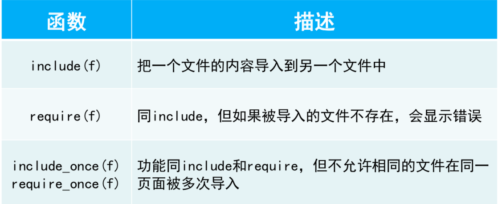
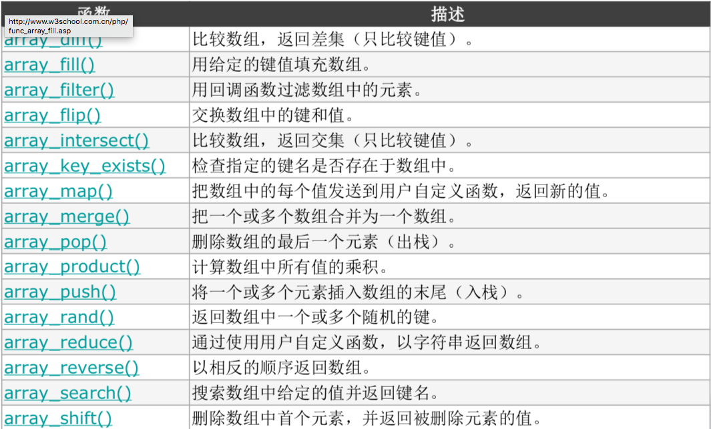
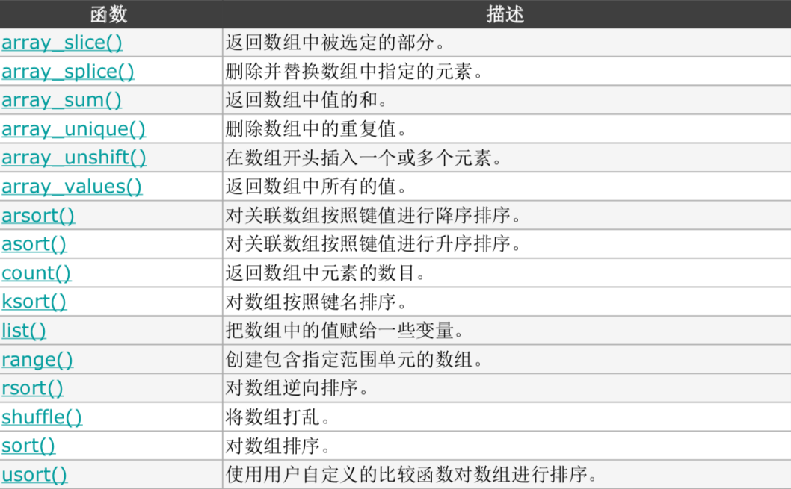
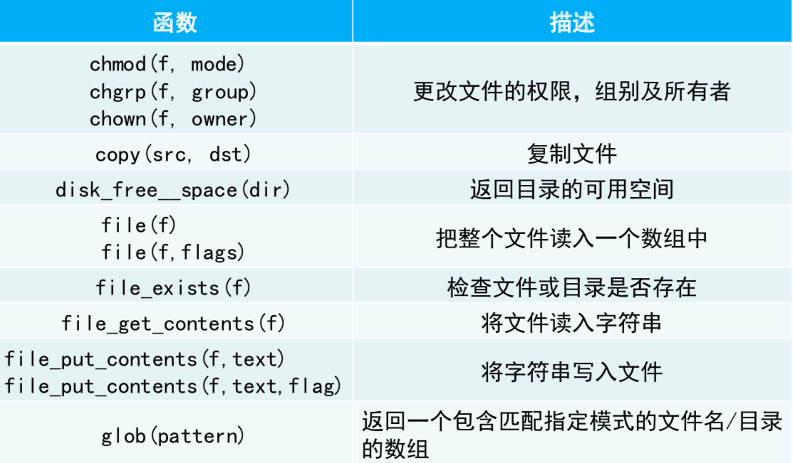
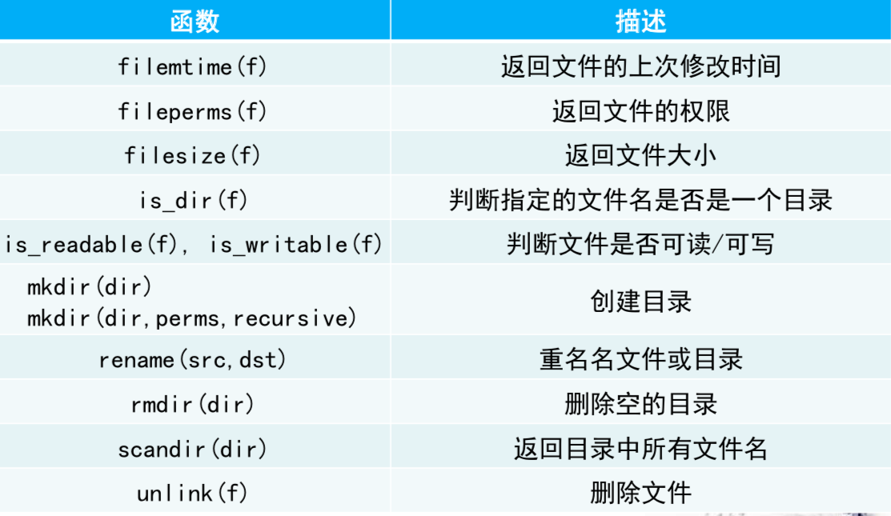

[TOC]

# 一、函数

## 1、函数声明

```php
function func_name($parameter1, $parameter2,...)
{
	func_statements;
	return_statements;		// 没有返回语句为空类型
}
```

- 函数的输入参数可缺省

  ```php
  function func_name($parameter1=value, $parameter2,...)	// 第一个参数可以缺省，默认值为value
  {
  	func_statements;
  	return_statements;		
  }
  ```

## 2、值传递和参数传递

- 类似于c语言的值传递和地址传递，php中的参数传递就是地址传递

- 地址传递的语法如下

  ```php
  function func_name(&$parameter)
  {
  	func_statements;		// $parament里存放的是实参的地址
  }
  ```

## 3、变量作用域

- 全局变量：在函数外声明的变量

  - 在函数内部使用`global`声明全局变量，如

  ```php
  function test()
  {
  	global $num;		// $num是全局变量
  	$num += 1;
  }
  ```

- 局部变量：在函数内部声明的变量为局部变量，局部变量是最小的作用域范围

- 在html中嵌入php语句时，同一页面中变量的作用域开始与结束标记( \<?php......?\>)无关，如下

  ```html
  <?php    $first_name="三";    ?>
  <P>
    <?php    $full_name="张".$first_name;    ?>
    I am <?= $full_name ?>
  </P>
  ```

## 4、php和html注入

- php中的include语句可以将php文件或html文件注入到当前页面

  - html页面会显示到当前页面
  - php文件会被执行，且注入的php文件中的函数和变量仍有效

- php页面包含函数

  

# 二、数组

## 1、声明

- 使用array()函数声明

  ```php
  $a = array([value1, value2, ...]);
  ```

  - php的数组可以存储不同类型的值，并且可以动态增减

    ```php
    $a = array();
    $a[] = 1;     // 追加数组的值
    $a[3] = 2;      // php中的数组索引可以不连续，此时$a=[1, NULL, NULL, 2]
    ```

## 2、常用数组函数

- `count()`：计算数组长度

- `array_pop()`：删除数组中最后一个元素
- `array_push()`：向数组中添加一个函数
- `array_reverse()`：数组倒序排列
- `array_splice()`：从数组中删除指定位置的元素
- `explode()`：将字符串转换为数组
- `implode()`：将数组转换为字符串

```shell
dream:tmp dream$ cat test.php 
#!/usr/local/bin/php

<?php
    $arr = array();
    array_push($arr, "xzj");
    array_push($arr, 100);
    array_push($arr, null);
    printf("length of arr is %d\n", count($arr));
    print_r($arr);
    $arr = implode("**", $arr);
    print_r($arr);
    $arr = explode("**", $arr);
    $arr = array_reverse($arr);
    print_r($arr);
?>

# 下面是输出
dream:tmp dream$ php -f test.php 

length of arr is 3
Array
(
    [0] => xzj
    [1] => 100
    [2] => 
)
xzj**100**
Array
(
    [0] => 
    [1] => 100
    [2] => xzj
)
```

- `list()`：将数组中的值赋给变量（一一对应）

```
php > $a = array(1,2,3,4);
php > list($a1, $a2) = $a;		// list中的参数个数可以小于数组长度
php > print_r($a1);
1
php > print_r($a2);
2
```

## 3、其它数组相关函数





# 三、php文件操作

## 1、文件I/O函数





## 2、常用的文件函数

### （1）读写文件

- 读文件：`file_get_contents(f)`和`file(f[, flag])`
  - 前者是将读取内容存入一个字符串中
  - 后者是将读取的内容默认以行（即\n）为单位存入数组中，可以指定flags（即分隔符）
- 写文件：`file_put_contents(f, text[, flag])`
  - 将字符串存入文件中

```shell
dream:test_php dream$ pwd
/tmp/test_php
dream:test_php dream$ ls
a.txt 
dream:test_php dream$ vim fileTest.php
dream:test_php dream$ cat fileTest.php 
#!/usr/local/bin/php

<?php
    $fname = './a.txt';
    $text = "I am ttt\nWho are you?";
    file_put_contents($fname, $text);
    $new_text1 = file($fname);
    $new_text2 = file_get_contents($fname);
    print_r($new_text1);
    print_r($new_text2);
?>
dream:test_php dream$ php -f fileTest.php 

Array
(
    [0] => I am ttt

    [1] => Who are you?
)
I am ttt
Who are?
```

### （2）其它常用函数

- 检查文件或目录是否存在：`file_exists(f)`
- 判断文件是否可读可写：`is_writable(f)` `is_readable(f)`
- 创建目录：`mkdir(dir)`
- 返回目录下文件：`scandir(dir)`
- 删除文件：`unlink(f)`

```shell
dream:test_php dream$ ls
dream:test_php dream$ vim test.php
dream:test_php dream$ cat test.php 
#!/usr/local/bin/php

<?php
    mkdir('dir_test');
    $text = "aaaaa";
    file_put_contents('./dir_test/a.txt', $text);
    file_put_contents('./dir_test/b.txt', $text);
    $files = scandir('./dir_test');
    print_r($files);
    file_put_contents('./c.txt', $text);
    $files = scandir('.');
    print_r($files);
    unlink('./c.txt');
    $files = scandir('.');
    print_r($files); 
?>
dream:test_php dream$ php -f test.php 

Array
(
    [0] => .					  # scandir还会返回.和..
    [1] => ..
    [2] => a.txt
    [3] => b.txt
)
Array										# 可以看到scandir也会返回目录
(
    [0] => .
    [1] => ..
    [2] => c.txt
    [3] => dir_test
    [4] => test.php
)
Array
(
    [0] => .
    [1] => ..
    [2] => dir_test
    [3] => test.php
)
```

# 四、类和对象

- php类和对象的语法模板如下

  ```php
  class class_name 
  {
  	private $name;        // 类的属性
  	public function _construct(name) 			// 类的构造函数
  	{ 
  		statement;
  	}
  	public function name(parameters) 			// 该类的方法
  	{ 
  		statement;
  	}
  }
  ```

  - 在php中，构建类时，用$this来指代该对象

- 例子如下

  ```shell
  dream:test_php dream$ cat test.php 
  #!/usr/local/bin/php
  
  <?php
      class BankAccount
      {
          private $name;
          private $banlance;
  
          public function __construct($name)
          {
              $this->name = $name;
              $this->banlance = 0.0;
          }
  
          public function getNmae()
          {
              return $this->name;
          }
          public function getBanlance()
          {
              return $this->banlance;
          }
          public function deposit($amount)
          {
              $this->banlance += $amount;
          }
          public function withdraw($amount)
          {
              if ($this->banlance >= $amount)
              {
                  $this->banlance -= $amount;
              }
          }
          public function showInfo()
          {
              printf("{%s  %f}\n", $this->name, $this->banlance);
          }
      }
      
      $account = new BankAccount("xzj");
      $account->showInfo();
      $account->deposit(100.1);
      $account->withdraw(31.2);
      $account->showInfo();
  ?>
  
  dream:test_php dream$ php -f test.php 
  
  {xzj  0.000000}
  {xzj  68.900000}
  
  ```

  