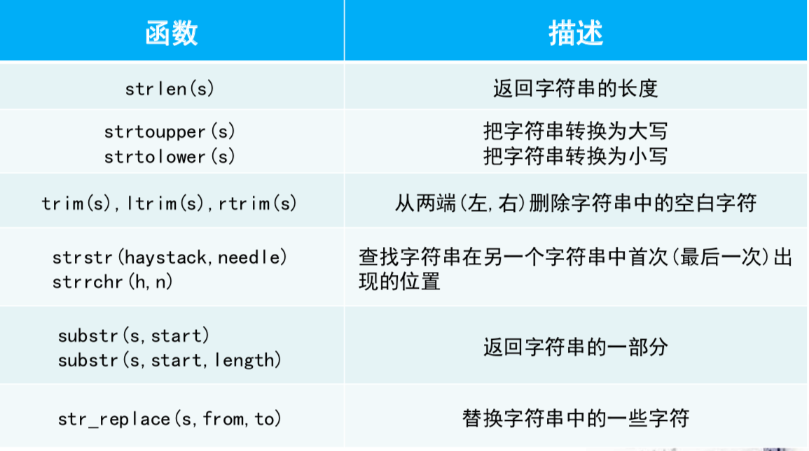

[TOC]

# 一、php介绍

- php是服务端使用的编程语言

- 网页上可以请求php文件

  - 请求html文件：返回的是一个html文件，属于静态请求
  - 请求php文件：服务器接到请求后，先在服务器端执行脚本，生成一个html页面，再返回给客户端，属于
                              动态请求

- php的类型

  - 纯php文件

  ```php
  <?php
  	php_statement;
  ?>
  ```

  - html文件中嵌入php语句

  ```html
  html_statement
  <?php
  	php_statement;
  ?>
  html_statement
  ```

- php文件的运行：需要专门的环境支持，如xampp、wamp

# 二、php基本语法

## 1、print语句

- 语法：

  ```php
  print "text_content";
  ```

  - print也可以用echo替代
  - print语句中，如果使用单引号，则原样输出字符串，如果使用的双引号，则会识别字符串中的变量

- print语句处理html文件中的换行

  - 使用\<p\>标签处理每一段落

  ```php
  <?php
  	print "<p>这是第一行</p>";
  	print "<p>这是第二行</p>";
  ?>
  ```

  - 在换行处使用\<br/\>标签
  - 使用\<pre\>标签输出内容

  ```php
  <?php
  	print "<pre>
  		这是第一行
  		这是第二行
  	</pre>";
  ?>
  ```

## 2、数据类型

- php中有8种数据类型

| 类型名          | 含义     | 例子               |
| --------------- | -------- | ------------------ |
| int             | 整型     | 100                |
| float或者double | 浮点型   | 2.4e-6             |
| boolean或者bool | 布尔型   | TRUE和FALSE        |
| string          | 字符串型 | "hello"或者'hello' |
| array           | 数组     | $array_name[index] |
| object          | 对象     |                    |
| resource        | 资源     |                    |
| NULL            | 空       | 只有NULL           |

- 以下三种情况变量的值为NULL
  - 被赋值为NULL	
  - 只声明了变量，尚未赋值时变量为NULL
  - 被unset()函数处理

## 3、强制类型转换

- 同c语言

## 4、类型相关函数

- `gettype()`：返回参数的数据类型
- `is_string()`：判断参数是否为字符串，返回bool值，其它数据类型同理

## 5、算术运算符

- 有`+` `-` `*` `/` `%`

## 6、数学相关

- 常用数学常量

  - `M_PI`：圆周率
  - `M_E`：自然数e
  - `M_LN2`：log~e~2的值

- 常用数学函数

  

## 7、变量

- php中变量以“$”开头，且对大小写敏感

- php中声明变量时，不必指定变量的类型

  ```php
  <?php
  	$name = "dream";
  	$age = 21;
  ?>
  ```

- 变量相关运算符

  `=` `+=` `-=` `*=` `/=` `%=` `++` `--`

## 8、字符串

- php中字符串用 `''` 或 `""` 扩起来

- 单引号与双引号是有区别的，单引号不识别任何变量，直接原样输出字符串

- 字符串运算符

  - `.`：串接，作用是拼接两个字符串

    ```php
    <?php
    	$t1 = "abc";
    	$t2 = $t1."de";			// $t2="abcde"
    ?>
    ```

  - `.=`：类似于`+=`，先串接再赋值

    ```php
    <?php
    	$t1 = "abc";
    	$t2 = "de";
    	$t2 .= $t1;			// 即$t2 = $t2.$t1，$t2="abcde"
    ?>
    ```

# 三、字符串函数

## 1、所有函数




## 2、字符串补充

- 字符串中变量的解释

  - PHP可以对字符串中出现的变量进行解释，将变量值插入字符串中
  - 对字符串的解释只对" "有效，对' '中变量不做解释当做字符串进行处理
  - 为了避免不必要的麻烦，有时可以借助{ }来封闭变量

  ```php
  <?php
  	$age = 10;
  	print "My age is $age";							// My age is 10
  	print "Today is your $ageth";				// Today is your $ageth
  	print "Today is your {$age}th";			// Today is your 10th
  ?>
  ```

# 四、布尔逻辑

- php中的布尔逻辑如下

  - `==` `!=` `>` `<` `>=` `<=` `&&` `||` `!`
  - `===`：完全等于，会考虑类型，`==`会忽略类型

  ```php
  php > print 2=='2';			
  1
  php > print 2==='2';			// 没有输出表示为假
  ```

  - `!==`：类似于`====`

  ```php
  php > print 2!="2";
  php > print 2!=="2";
  1
  ```

# 五、php控制结构

## 1、if语句

- 和c语言中的if语句类似

```php
php > if ($i>0)
			{
  			print "\$i>0";
			}
			else if ($i==0)
      {
        print "\$i=0";
      }
			else
      {
        print "\$i<0";
      }

$i>0		// 输出
```

## 2、for语句

- 和c语言中的for语句类似

```php
php > for ($i=0; $i<4; $i++) 
			{
  			print "\$i=$i, ";
			}
				
$i=0, $i=1, $i=2, $i=3,
```

## 3、foreach语句

- 和python中for语句类似

```php
php > $a = array(12, "a", 23);
php > foreach ($a as $ele)
			{
  			print "$ele  ";
			}

12  a  23 
```

## 4、while do和do while语句

- 和c语言的while语句类似

```php
php > $i = 0;
php > while ($i < 3)
			{
  			print "$i "; 
        $i += 0.5;
			}
				
0 0.5 1 1.5 2 2.5
php > do 
			{
  			print "$i "; 
  			$i -= 2;
			} 
			while ($i > 0);
			
3 1 
```

## 5、control语句

- control语句可以替代if和while语句

- 语法如下

  ```php
  <?php
  control_type(condition):
    control_statements;
  endcontrol_type;
  ?>
  ```

  ```php
  php > for ($i = 0; $i < 10; $i++): 
  				print "$i squared is " . $i * $i . ".\n"; 
  			endfor;
  0 squared is 0.
  1 squared is 1.
  2 squared is 4.
  3 squared is 9.
  4 squared is 16.
  5 squared is 25.
  6 squared is 36.
  7 squared is 49.
  8 squared is 64.
  9 squared is 81.
  ```

# 六、php和html的关系

- 可以在html代码中嵌入php语句，有以下两张方法

  - php表达式块

  ```html
  <body>
  <?php for ($i=1; $i<=10; $i++) { ?>
  <p class="count"> I can count to <?php print $i; ?>! </p> 
  <?php } ?>	<!--不要忘了花括号-->
  </body>
  ```

  - `<?= expr ?>`，相当于`<?php print expr; ?>`

  ```html
  <body>
  <?php for ($i = 1; $i <= 100; $i++) { ?>
   <p> <?= $i ?> squared is <?= $i * $i ?> </p>
  <?php } ?>
  </body>
  ```

  