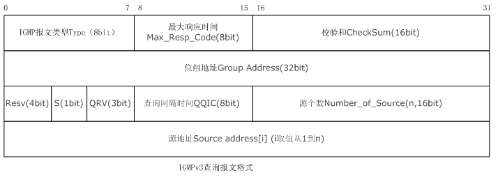

# 1、MLD介绍

- MLD（Multicast Listener Discover），即组播侦听者协议，是用于管理IPv6组播成员的协议，可以理解为IGMP的IPv6版本，二者协议行为相同，只是协议字段有些差别
  
  - 组播（IGMP）的原理见[链接](./IPv6组播地址详细介绍.md)
- MLD属于ICMPv6（类型值为130～132的ICMPv6）

- MLD有两个版本：MLDv1和MLDv2，分别对应IGMPv2和IGMPv3

- MLDv2和MLDv1的差别

  - MLDv1报文中只携带组播组的信息，不携带组播源的信息，主机在加入组播组时无法选择组播源
  - MLDv2报文中添加了组播源的字段，这样成员主机就可以选择接受哪一个组播源的消息

- MLDv2报文格式（和IGMPv3类似）

  

  - 上面是IGMPv3的报文格式，MLDv2报文的格式如下
  - 
    - `type、code、checksum`是ICMPv6的固定格式
      - `type`    区分不同的ICMPv6报文，MLD的类型值为130～132
        - 130：查询报文（包括普遍组查询和特定组查询）
        - 131：成员报告报文
        - 132：成员离开报文
      - `code`    用于区分给定报文类型中的多个报文，字段长度8位
      - `checksum`    存储ICMPv6的校验和，计算校验和的时候，IPv6扩展报头添加到ICMPv6报文之前
    - `max response code`    最大响应时间，该字段仅在查询报文中生效
    - `reserved`    保留字段
    - `multicast address`    IPv6组播地址
    - `number of sources`    组播源的个数
    - `source address`    组播源的IPv6地址

# 2、MLD运行机制

- MLD的行为和IGMP基本一样，下面是一些细节补充

