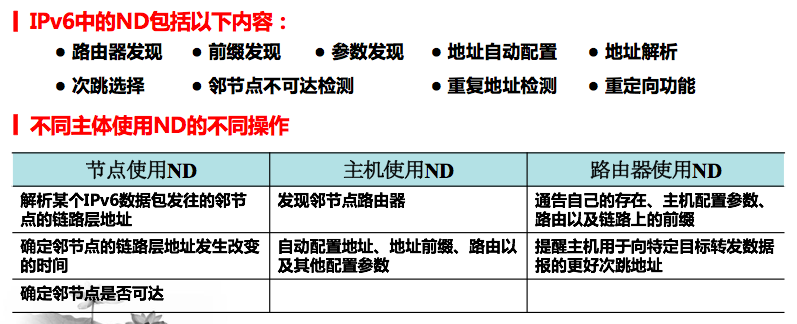
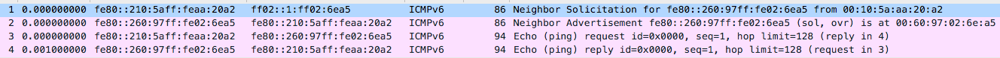
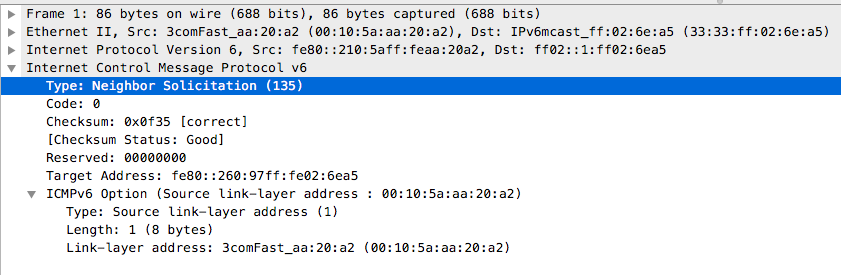
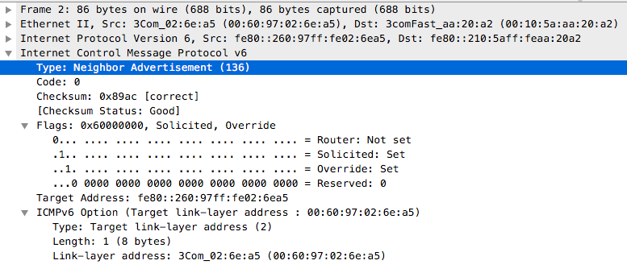

# 1、ND（邻居发现机制）

- ICMPv6中的ND取代了IPv4的arp协议，以及ICMP中的路由器发现和重定向报文

- ND解决了连接在同一条链路上的所有节点（主机、路由器）之间的互操作问题。

- ICMPv6中的ND机制的功能如下

  

# 2、ICMPv6中ND涉及的协议

- ICMPv6报文的结构见[链接](./ICMPv6.md)
- 包含的协议类型：
  - `type=133`    路由器请求报文    
  - `type=134`    路由器通告报文
  - `type=135`    邻居请求报文
  - `type=136`    邻居通告报文
  - `type=137`    重定向报文
- 各个类型的协议的作用
  - 地址解析：用到邻居请求报文和邻居通告报文
  - 邻居可达性检测：用到邻居请求报文和邻居通告报文

# 3、ND用于地址解析

- IPv4中使用arp（Address Resolution Protocol）进行IP地址和MAC地址的解析

## （1）请求节点组播地址

- 请求节点组播地址用于在ICMPv6中的“邻居发现协议”中，用于链路层地址解析时使用
- 请求节点组播地址的作用
  - 发现邻居时作为邻居请求报文的目的IPv6地址
  - 确认邻居的MAC地址时作为邻居请求报文的目的IPv6地址
- 请求节点组播地址组成：前缀`ff02::1:ff00:0/104`加IPv6单播地址后24位
- 例子：假设某节点IPv6单播地址为`fe80::260:99ff:fe02:6ea5`，则其请求节点组播地址  
              为`ff02::1:ff02:6ea5`

## （2）机制

- IPv6中使用ICMPv6中的邻居请求报文和邻居通告报文进行地址解析，机制如下
  1. 主机1发送组播邻居请求报文
  2. 主机2收到请求报文后更新邻居高速缓存
  3. 主机2回发单播邻居通告报文给主机1
  4. 主机1收到邻居通告报文后更新邻居高速缓存
- 当邻居请求报文用于地址解析时，目标IPv6地址是组播地址
- 当邻居请求报文用于地址解析时，目标IPv6地址是单播地址

## （3）例子

- 两台主机通信之前会进行地址解析（或者说确认对方地址），过程如下

  

  - 可以看到两台主机先通过邻居请求报文和邻居通告报文确认对方的MAC地址后在进行通信（ping）

- 邻居请求报文的结构

  

  - 邻居请求报文结构如下：
    - 类型：135
    - 代码：0
    - 校验和
    - 保留字段
    - 目标地址：目标IP地址
      - IPv6数据报中的目标地址是请求节点组播地址
      - 该地址是目标主机的某一个单播地址（之前有过通信，已知IP地址和MAC地址，为了确认IP地址是否改变）
      - 该例子中目标地址是一个链路本地单播地址
    - 源链路层地址选项：当该选项存在时，包含发送方的MAC地址
      - 邻节点请求、路由器请求和路由器公告报文中都有该选项。当ND报文的源地址是未指定地址（`::`）时，不会包含该选项
      - 类型：1，表示为源链路层地址选项
      - 长度：以8字节为一个单位

- 邻居通告报文的结构

  

  - 邻居通告报文结构如下：
    - 类型：136
    - 代码：0
    - 校验和
    - 路由器标志：为1时表示发送方时路由器
    - 请求标志：为1时表示该邻居通告报文是对邻居请求报文的回复
    - 覆盖标志：为1时表示此报文中目标链路层地址选项里的链路层地址应该覆盖接收方高速缓存条目中
                         的已保存的链路层地址
    - 保留字段
    - 目标链路层地址选项：用于表示IPv6包应发送到的邻节点的链路层地址，邻节点公告和重定向报文中
                                            包含该选项
      - 类型：2，表示为目标链路层地址选项
      - 长度：以8个字节为一个单位

- 分析：主机1向主机2发送邻居请求报文，主机2回复主机1邻居通告报文

  - 邻居请求报文
    - 邻居请求报文的链路层目的MAC地址：`33:33:ff:02:6e:a5`
    - 邻居请求报文的IPv6报文的目的IP地址：`ff02::1:ff02:6ea5`
    - 注意目的MAC地址和目标IPv6地址，其中MAC地址为`33:33`加目标主机IPv6单播地址后24位
    - ICMPv6报文（邻居请求报文）中的目标地址：`fe80::260:99ff:fe02:6e5a`
  - 邻居通告报文
    - 主机2回复主机1邻居通告报文时会回复自己的MAC地址
    - 主机1收到邻居通告报文后就确认了主机2的IP地址和MAC地址