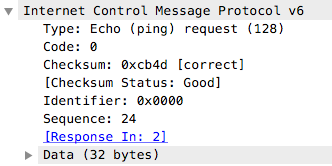

# 1、ICMPv6介绍

- ICMPv6 = ICMP（网际控制管理协议）+ND（邻居发现机制）+MLD（组播侦听发现机制）
- IPv6通信的基础就是ICMPv6，没有ICMPv6就无法使用IPv6进行通信

# 2、ICMPv6报文

- ICMPv6报文是接在IPv6报文的后面的，如下

  

  - 可以看到封装时ICMPv6报文就接到IPv6报文后面

- ICMPv6报文的组成如下

  

  - `type`    类型，8位，0～255
    - 0～127：为ICMPv6错位类型报文
      - 目标不可达：值为1
      - 数据包过大：值为2
      - 超时：值为3
      - 参数问题：值为4
    - 128~255：为ICMPv6信息报文
  - `code`    代码，8位
  - `checksum`    校验和，16位
  - 主体部分：不同的ICMPv6报文主体部分结构不同

# 3、ICMPv6的错误报文

