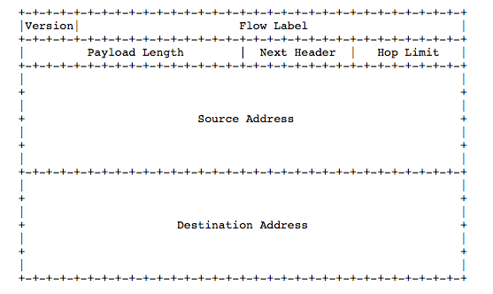

[TOC]

# 1、IPv6和IPv4的区别

- 更大的地址空间：IPv4为32位，IPv6位32位
- 简化了首部结构：IPv4首部长为20～60字节，IPv6首部为固定的40字节，且删去了许多字段
- 协议更易扩展：引入了灵活的扩展首部（即下一个首部字段）
- 更加安全：增加了认证与加密，端到端更安全（IPsec）
- 地址配置更加简单：增加了本地链路地址，可以实现自动配置

# 2、IPv6的组成结构

- IPv6的报文由以下两部分组成

  1. 基本首部：共40字节，有8个字段
  2. 有效载荷：由扩展首部和数据部分组成（最大为65535字节）

- 基本首部的详细组成

  

  1. 版本（`version`）：4位，指明协议版本，如1010表示IPv6

  2. 通信量类（`traffic class`）：8位，指明优先级，类似于IPv4中的`ToS，Type of Service`

     - 位于`version`和`flow label`之间

     - 定义当发生通信量拥塞时分组优先级

     - 当IPv4的报文翻译为IPv6的报文时，traffic class的值是拷贝的ToS的值

  3. 流标号（`flow label`）：20位，用于资源预分配，即标记数据报的流类型

     - 流：互联网上从特定源点到特定终点（单播或多播）的一些列数据报（如视频/音频传输）
     - 流所经过的路径上的路由器都应保证流标号所指明的服务质量（`QoS，Qulity of Service`）
     - 流标号由源节点分配，通过流标号、源地址、目的地址的三元组方式就可以唯一标识一条通信（IPv4是五元组方式：源地址、目的地址、源端口、目的端口和传输层协议号）
  4. 有效载荷长度（`payload length`）：16位，指明IPv6数据报有效载荷的长度
  5. 下一个首部（`next header`）：8位，分为两种情况

     - 当没有扩展首部时，用来指明数据部分应该交给哪个高层协议
     - 当有扩展首部时，用来指明下一个首部的类型
  6. 跳数限制（`hop limit`）：8位，指明该数据报最多能在路由器上中转几次

     - 设定一个初始值，每经过一次路由器中转，该值减1，减到0时丢弃该数据报
     - 有一种欺骗手段就是当数据报经过一个网络时，若修改该数据报的跳数限制，使其不变，则发送方收到回复时，会认为这个网络不存在
  7. 源地址（`src IPv6`）：128位，源IP地址
  8. 目的地址（`dst IPv6`）：128位，目的IP地址

# 3、各字段详细介绍

## （1）flow label

- 流标号通过设计20位中每一位以及位的组合代表的含义划分流所属的类型，从而到达预分配资源的目的
- 比如说从源主机的一个进程到目的主机的一个进程的通信报文，也就是这个“流”有很多的延迟要求与带宽要求，这时可以预先创建流并分配一个流标签。当一个流标签字段为非零的分组出现时，路由器在其内部表中找出它所需的特殊需求并做相应处理
- 关于流标号的统一设置标准还在讨论中，并无定论
- 流标号的一种设定为标签混合应用（由Rahul Banerjee提出）
  - 前3个比特用来定义该流标号，其中`101`定义为一种新的结构，称为`MI`标号
  - 当流标号被定义为MI标号时，剩下17个比特可以用来进行最优设置
    - 第4个比特：设置成了软/硬实时的区分位，0代表软实时，1代表硬实时，软实时应用允许任何数据包存在端到端的延迟；硬实时应用要求最小的滞后和抖动
    - 第5～10比特：用来设置带宽需求
    - 第11～15比特：用来设置缓冲需求
    - 第16～20比特：用来设置延迟需求

## （2）next header

- next header的常见取值如下

  | 取值 |  协议名称   |               全名                |
  | :--: | :---------: | :-------------------------------: |
  |  0   |   HOPOPT    |      IPv6 Hop-by-Hop Option       |
  |  1   |    ICMP     | Internet Control Message Protocol |
  |  2   |    IGMP     |  Internet Group Message Protocol  |
  |  4   |    IPv4     |                                   |
  |  6   |     TCP     |   Transmission Control Protocol   |
  |  17  |     UDP     |      User Datagram Protocol       |
  |  41  |    IPv6     |                                   |
  |  43  | IPv6-Route  |      Routing Header for IPv6      |
  |  44  |  IPv6-Frag  |     Fragment Header for IPv6      |
  |  50  |     ESP     |      Encap Security Payload       |
  |  51  |     AH      |       Authentication Header       |
  |  58  |   ICMPv6    |           ICMP for IPv6           |
  |  59  | ICMP-NoNext |      No Next Header for IPv6      |
  |  60  |  IPv6-Opts  |   Destination Options for IPv6    |

  - `next header = IPv4`    说明是IPv6数据报跨IPv4网络，使用了隧道技术
  - `next header = IPv6`    用于移动网络
  - 路由器不处理除了逐跳选项扩展首部以外的其它所有扩展首部

# 4、IPv6的地址表示

- 一般使用16进制表示，即冒号十六进制记法
  - 例子1：`fe80:0000:0000:0000:0418:f7a6:34b8:5a3a`
  - 例子2：和例子1的地址相同，`fe80:0:0:0:418:f7a6:34b8:5a3a`
    - 当两个冒号之间全为0时，可写成一个0
    - 像`0418`这种前面位0也可以省略，即写成`418`，这样写是不会造成歧义的
  - 例子3：和例子1的地址相同，`fe80::418:f7a6:34b8:5a3a`
    - 允许将一连串0记为一对冒号，称为零压缩，零压缩在一个地址中只能使用一次
- 在IPv6中，仍然允许使用CIDR（Classless Inter-Domain Routing，无类别域间路由）的斜线表示法
  - 例子1：`fe80::418:f7a6:34b8:5a3a/64`
    - 表示前64位为子网前缀，后64位为接口口标识符
  - 例子2：`12ab:0:0:cd30::/60`

# 5、IPv6的地址分类

- IPv6总共有5类地址，分别是未指明地址、环回地址、多播地址、本地链路单播地址、全球单播地址
- 未指明地址：`0:0:0:0:0:0:0:0 | ::/128`
  - 未指明地址是主机还没有配置到一个标准的IP地址时作为源地址使用，该地址不能作为目的地址
- 环回地址：`::1/128`
  - 即IPv4中的127.0.0.1，只向下工作到网络层，常用来测试本机的tcp/ip协议是否正常
- 多播地址：`ff00::/8`
  - 前8位为1的地址为多播地址，总共占全部IPv6地址的1/256
  - 详细介绍见[链接](./IPv6组播地址详细介绍.md)

- 链路本地单播地址：无状态的本地单播地址，不使用DHCP，详细信息见[链接](./IPv6地址自动配置.md)
- 全球单播地址：获取方法
  - 网络管理员手动配置
  - 使用DHCP协议进行有状态的单播地址配置
  - 使用ICMPv6的ND（邻居发现机制）中的协议进行无状态单播地址自动配置，详细信息见[链接](./IPv6地址自动配置.md)

- 参考资料：

  - https://blog.csdn.net/u011784495/article/details/71693296

  - https://wenku.baidu.com/view/4df61d6b25c52cc58bd6be8b.html

  - http://www.iana.org/assignments/protocol-numbers/protocol-numbers.txt

    