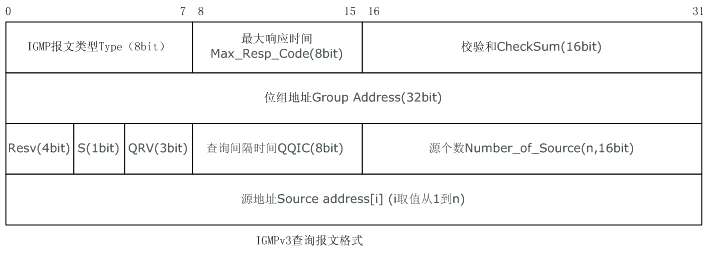
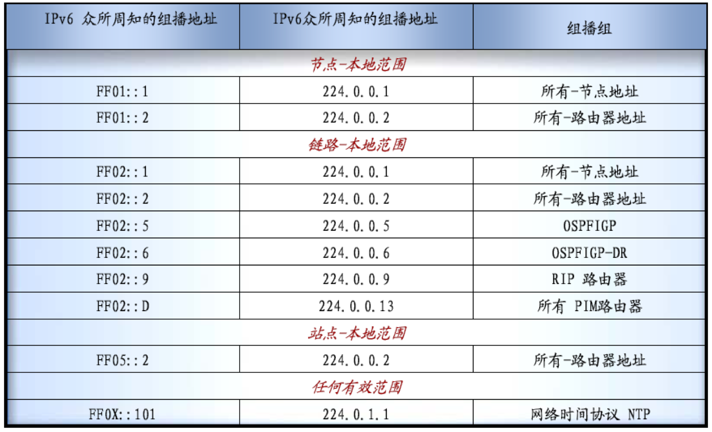

# 1、组播的原理（以IPv4为例）

- IPv4的多播（也就是组播）地址是D类地址（即224.0.0.0～239.255.255.255）

  - 多播地址相同的主机就处于同一个多播组里
  - 多播地址只能用于目的地址

- IP多播的原理：分为互联网范围的多播和局域网范围的多播

  - 局域网范围的多播（事实上互联网范围的多播最后一个阶段也一定是局域网范围的多播）

    - 局域网范围的多播需要使用IGMP（网际组管理协议）

    - IGMP作用：让连接在本地局域网的多播路由器知道是否有主机参加/退出某个多播组

    - 多播路由器：是指具有多播功能（硬件）的路由器，若一个网络上有多个多播路由器，则他们会通过

      ​						某种机制选出一个作为查询主机（即发送查询报文的路由器）

    - 多播路由器只知道在该网络上是否还有某个多播组的成员，而不知道具体是谁

    - IGMPv3的报文格式

      

      - 关于IGMPv3的详细内容见[链接](./ICMPv6--MLD.md)

    - IGMP工作过程：

      - 第一阶段：某台主机加入一个新的多播组时，向该多播组的多播地址发送一个IGMP报文，本地 				   的多播路由器收到后，利用多播路由选择协议把该消息转发给互联网上的其它多播路				   由器
      - 第二阶段：本地的多播路由器会不停的探询（默认125秒一次）本地的主机，即发送IGMP询问报 
                           文，以确定某个多播组在本地网络上是否还有成员，只要还有一个成员在，本地多播
                           路由器就会不停询问，并将这个消息（还有成员在）转发给互联网上其它多播路由器

# 2、IPv6组播地址

- 组播地址范围：前8位为1，即以ff开头，共占全部IPv6地址的1/256

  

  

  - 接口本地：
  - 链路本地：
  - 管理本地：
  - 站点本地：
  - 组织本地：
  - 全局：整个互联网