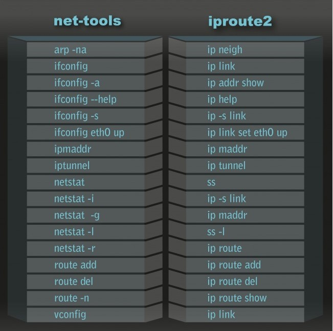

[TOC]

# 1、ip命令的介绍

- ip命令是功能更强大的ifconfig命令，旨在取代ifconfig（net-tools和iproute2是软件包名）

  

  - 查看这两个软件包的内容：

    ```
    
    ```

- ip命令的操作原理是对特定的对象进行指定的动作，所以关键在于对象（object）和动作选项（option）

  ```shell
  [root@192 ~]# ip  # 查看命令的基本语法及可操作的对象
  [root@192 ~]# ip address help  # 查看指定对象的语法
  ```

  - ip命令可操作的对象可以直接输入`ip`进行查看

# 2、ip命令-address对象

## （1）介绍

- 操作address对象可以对主机的IP地址进行操作

  ```shell
  [dream@192 ~]$ ip address help
  Usage: ip address {add|change|replace} IFADDR dev IFNAME [ LIFETIME ]
                                                        [ CONFFLAG-LIST ]
         ip address del IFADDR dev IFNAME [mngtmpaddr]
         ip address {save|flush} [ dev IFNAME ] [ scope SCOPE-ID ]
                              [ to PREFIX ] [ FLAG-LIST ] [ label LABEL ] [up]
         ip address [ show [ dev IFNAME ] [ scope SCOPE-ID ] [ master DEVICE ]
                           [ type TYPE ] [ to PREFIX ] [ FLAG-LIST ]
                           [ label LABEL ] [up] ]
         ip address {showdump|restore}
  IFADDR := PREFIX | ADDR peer PREFIX
            [ broadcast ADDR ] [ anycast ADDR ]
            [ label IFNAME ] [ scope SCOPE-ID ]
  SCOPE-ID := [ host | link | global | NUMBER ]
  FLAG-LIST := [ FLAG-LIST ] FLAG
  FLAG  := [ permanent | dynamic | secondary | primary |
             [-]tentative | [-]deprecated | [-]dadfailed | temporary |
             CONFFLAG-LIST ]
  CONFFLAG-LIST := [ CONFFLAG-LIST ] CONFFLAG
  CONFFLAG  := [ home | nodad | mngtmpaddr | noprefixroute | autojoin ]
  LIFETIME := [ valid_lft LFT ] [ preferred_lft LFT ]
  LFT := forever | SECONDS
  TYPE := { vlan | veth | vcan | dummy | ifb | macvlan | macvtap |
            bridge | bond | ipoib | ip6tnl | ipip | sit | vxlan |
            gre | gretap | ip6gre | ip6gretap | vti | nlmon |
            bond_slave | ipvlan | geneve | bridge_slave | vrf | macsec }
  ```

  - `IFADDR = Interface Address`    网络接口的地址
  - `IFNAME = Interface Name`    网络接口的名字


## （2）例子

### <1>查看网络接口及ip地址

```shell
[dream@192 ~]$ ip address show  # 查看所有网络接口
1: lo: <LOOPBACK,UP,LOWER_UP> mtu 65536 qdisc noqueue state UNKNOWN qlen 1
...
2: ens33: <BROADCAST,MULTICAST,UP,LOWER_UP> mtu 1500 qdisc pfifo_fast state UP qlen 1000
...
3: virbr0: <NO-CARRIER,BROADCAST,MULTICAST,UP> mtu 1500 qdisc noqueue state DOWN qlen 1000
...
4: virbr0-nic: <BROADCAST,MULTICAST> mtu 1500 qdisc pfifo_fast master virbr0 state DOWN qlen ...
[dream@192 ~]$ ip address show lo  # 查看某个网络接口信息
1: lo: <LOOPBACK,UP,LOWER_UP> mtu 65536 qdisc noqueue state UNKNOWN qlen 1
    link/loopback 00:00:00:00:00:00 brd 00:00:00:00:00:00  # mac地址
    inet 127.0.0.1/8 scope host lo  # IPv4信息
       valid_lft forever preferred_lft forever
    inet6 ::1/128 scope host   # IPv6信息
       valid_lft forever preferred_lft forever
```

### <>


# 3、ip命令-neigh对象

## （1）介绍

- neigh对象是指邻居，即同一链路上其它的主机（网络接口）

  - 链路：同一链路指的是在同一网段，且数据链路层相同（比如都是使用以太网，或者802.11wifi等等）

- 操作neigh对象可以查看邻居状态

  ```shell
  [dream@192 ~]$ ip neigh help
  Usage: ip neigh { add | del | change | replace }
                  { ADDR [ lladdr LLADDR ] [ nud STATE ] | proxy ADDR } [ dev DEV ]
         ip neigh { show | flush } [ proxy ] [ to PREFIX ] [ dev DEV ] [ nud STATE ]
  
  STATE := { permanent | noarp | stale | reachable | none |
             incomplete | delay | probe | failed }
  ```

## （2）例子

### <1>查看邻居信息

```shell
[dream@192 ~]$ ip neigh show 
fe80::e7a7:eeb7:f909:4744 dev ens33 lladdr **:**:**:**:**:** STALE
fe80::1 dev ens33 lladdr **:**:**:**:**:** STALE
192.168.1.1 dev ens33 lladdr **:**:**:**:**:** STALE
192.168.1.6 dev ens33 lladdr **:**:**:**:**:** STALE
192.168.1.11 dev ens33 lladdr **:**:**:**:**:** REACHABLE
```

- 输出解释：以`192.168.1.11 dev ens33 lladdr **:**:**:**:**:** REACHABLE`为例
  - `192.168.1.11`    邻居的ip地址
  - `dev ens33`    该邻居和本主机的哪个网络接口在同一链路上
  - `lladdr **:**:**:**:**:**`    邻居的mac地址
  - `REACHABLE`    状态
    - 

### <2>


# 4、ip命令-route对象

## （1）介绍

- route对象可以查看路由表，也可以对路由表进行操作

## （2）例子

### <1>查看路由表

```shell
[dream@192 ~]$ ip route list 
default via 192.168.1.1 dev ens33 proto static metric 100 
192.168.1.0/24 dev ens33 proto kernel scope link src 192.168.1.13 metric 100 
192.168.122.0/24 dev virbr0 proto kernel scope link src 192.168.122.1 
```

- 输出解释：以`192.168.122.0/24 dev virbr0 proto kernel scope link src 192.168.122.1 `为例
  - `192.168.122.0/24`    该路由条目的目的IP地址
  -  `dev virbr0`    该数据包应该交付给哪个网络接口 
  -  `scope link`    该路由条目的范围，这里表示链路，即只能在一个局域网内路由
  -  `src 192.168.122.1`    该路由条目的源IP地址
- 这个路由的信息就是，除了目的IP地址为`192.168.1.0/24  192.168.122.0/24 `的数据包，其余的都会被转发给默认网关`default`处理