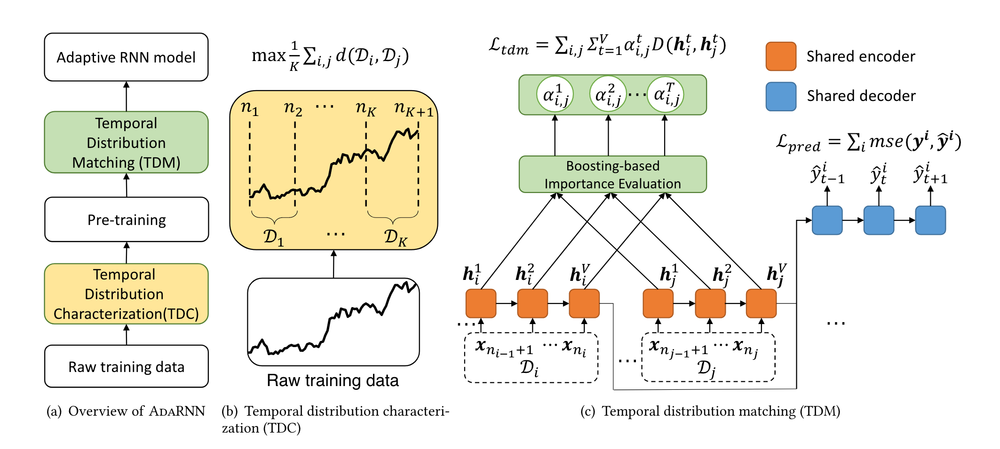

# AdaRNN: Adaptive Learning and Forecasting for Time Series

- 动机

  - 

- 方法

  

  - $\mathcal{L}_{tdm}$中的D是鉴别器的损失函数，$\mathbf{h}_i^t$是域i数据t时刻GRU的输出，$\mathbf{h}_j^t$是域j数据t时刻GRU的输出，鉴别器用于区分数据来自域1还是域2（可分别视为源域和目标域，则D的作用是区分出数据来自源域还是目标域）。D使用的损失函数是BCE，因为这是一个二分类任务，即数据来自源域还是目标域，鉴别器就是一个多层MLP
  - 阶段1：TDC（Temporal distribution characterization）
    - 目的：找到一种分段方式，将数据分成多段，每一段数据都是不同域的
    - 具体实现：指定要分成K个域，将数据均分为N段，选择一种域距离计算方式（如MMD或者CORAL）
    - CORAL：计算两个域的数据的协方差矩阵之差的F范数
    - 如分成3个域数据，数据分成10段
      - 遍历段组合方式，如第1段和第2段为一个域，剩下8个段为域数据，计算距离
      - 找到距离最大的分法，如1～4段为域1，5～10段为域2
      - 在域2的数据中同样找距离最大的分法，如5～9段为域2，10段为域3
  - 阶段2：预训练
    - 目的：对齐源域和目标域
    - 和TDM的区别是在预训练阶段中，$\mathcal{L}_{tdm}$中的权重参数$\alpha_{i,j}^t$为完全根据GRU输出计算。因为此时模型刚开始训练，从GRU中得到的输出（即hedden state）还没有太多意义
    - 具体实现
      - K个train dataloader，每个train dataloader是“同一个”域的数据，不同train dataloader之间可以看成不同域
      - 每个epoch依次选取两个相邻的train dataloader，如所有时间序列数据的第1～4段组成train dataloader 1，第5～9段组成train dataloader 2，第10段数据组成train dataloader 3。那么首先train dataloader 1和train dataloader 2协同训练，然后train dataloader 2和train dataloader 3协同训练。batch的数量根据数据量少的dataloader定
      - 这个阶段的$\alpha_{i,j}^t$是源域数据和目标域数据送入每层GRU，在各个时刻的输出通过计算得出的，它的含义是源域和目标域t时刻数据对域对齐的重要程度权重，该值越大，说明这个时刻数据对域对齐越有帮助（即有助于鉴别器分辨数据来自源域还是目标域），则给它越大的权重，训练时能更好地训练鉴别器和模型
    - 一个batch损失
      - 预测损失：$\mathcal{L}_{pred\_source} + \mathcal{L}_{pred\_target}$
      - 迁移损失：$\mathcal{L}_{tdm}$
      - 模型和鉴别器时同时训练的，$\mathcal{L}_{tdm}$会同时更新模型参数和鉴别器参数，更新模型参数使$\mathcal{L}_{tdm}$增大，即让鉴别器分不出数据来自源域还是目标域；更新鉴别器参数使$\mathcal{L}_{tdm}$减小，即鉴别器要分出数据来自源域还是目标域
  - 阶段3：TDM（Temporal distribution matching）
    - 目的：同阶段2，只是这个阶段$\alpha_{i,j}^t$是根据上一轮epoch的域距离更新的，如果当前epoch，每个时刻源域和目标域的距离（这里距离就是鉴别器损失，损失越大，距离越近）比上一个epoch并没有增大，就不更新$\alpha_{i,j}^t$，反之增大$\alpha_{i,j}^t$，目标是惩罚模型没能拉近源域和目标域距离，被鉴别器识别出来了

- 启发

  - 全局和局部，序列分段，发现段的模式
  - 知识追踪中，样本是知识点索引和做题结果的二元组，即$x=(i_c,r),\ i_c \in \{0,1,2,...,|C|-1\},\ r \in \{0,1\}$
    - 问题1：样本是离散的点，在有知识点结构（如先修关系）和无知识点结构情况下，怎么样使用连续值量化样本。不使用现有模型学习出来的样本embedding，因为模型学习出来的embedding很可能已经破坏了样本的语义信息
    - 问题2：如何定义知识追踪中时间序列的风格，这种风格是否和学校相关
      - 可能的答案：练习知识点的顺序，因为每个学校的教学策略可能不同，这种不同就体现在习题练习的顺序
      - 可能的答案：在每个知识点上的正确率，因为每个学校的教学侧重点不同，这种不同就体现在学生在各个知识点上的表现情况
    - 问题3：