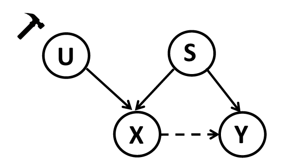
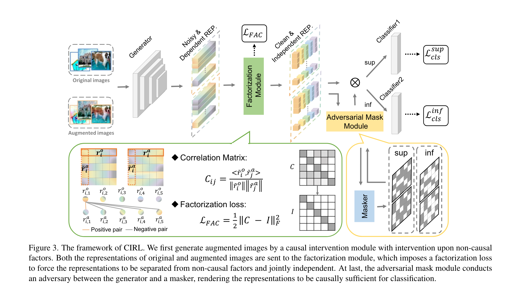

# 1、数据操作

## （1）域随机化

- 从有限的训练样本中生成新样本来模拟复杂的环境
- （图像上）常见操作包括：改变目标的位置和上下文信息、改变目标的形状和数量、改变光亮和相机视角和加不同类型的随机噪声
- 域随机化可以增加样本多样性，从而增强模型的泛化能力。但是因为是随机操作，可能会生成无用的随机样本，通过删除这些无用的样本，能提升效率

## （2）对抗数据增强

- 思想：通过数据增强增加样本多样性同时，保证样本的可靠性
- 对抗数据增强通常有明确的优化目标可以应用于网络

- 和对抗相关的文章
  - `Generalizing across domains via cross-gradient training`
  - It used a Bayesian network to model dependence between label, domain and input instance, and proposed CrossGrad, a cautious data augmentation strategy that perturbs the input along the direction of greatest domain change while changing the class label as little as possible.
  - `Generalizing to unseen domains via adversarial data augmentation`
  - It proposed an iterative procedure that augments the source dataset with examples from a fictitious target domain that is “hard” under the current model, where adversarial examples are appended at each iteration to enable adaptive data augmentation.
  - `Deep domain- adversarial image generation for domain generalisation`
  - adversarially trained a transformation network for data augmentation instead of directly updating the inputs by gradient ascent while they adopted the regularization of weak and strong augmentation in [`Semi-supervised domain gener- alization with stochastic stylematch`, `Fsdr: Frequency space domain randomization for domain generalization`].
  - `Progressive domain expansion network for single domain generalization`
  - It used adversarial training to generate domains instead of samples.
- Mix Up（在特征级别上）的文章
  - `Domain generalization with mixstyle`
  - `A fourier- based framework for domain generalization`
  - `Uncertainty-guided model generalization to unseen domains`

# 2、IRM（理论分析）

- `They did not seek to match the representation distribution of all domains, but to enforce the optimal classifier on top of the representation space to be the same across all domains.`

- 在训练集中引入环境标签$\varepsilon = \{e_1, e_2, ..., e_n\}$

- IRM希望学习一个只依赖$X_i$ (Invariant Feature，与之对应的是Spurious Feature，前者表示目标本质特征，后者表示环境特征)的特征提取器$\Phi(X)$

- 理想中的特征提取器满足$P^{e_i}(Y|\Phi(X)) = P^{e_j}(Y|\Phi(X)), \forall e_i \neq e_j$ 

- 设w是分类器，则如果满足$P(Y|\Phi(X)) = P^{e_i}(Y|\Phi(X)), \forall e_i \in \varepsilon$，可认为此时的特征提取器只依赖$X_i$，$w\cdot\Phi$是IRM的预测器

- IRM的标准数学定义如下
  $$
  \mathop{min}\limits_{\Phi:X \rightarrow H;w \rightarrow Y} \sum_{e \in \varepsilon} R^e(w \circ \Phi) \\
  s.t.\quad w \in \mathop{argmin}\limits_{\bar{w}:H \rightarrow Y}\ R^e(\bar{w} \circ \Phi),\ \forall e \in \varepsilon
  $$

- 论文中的公式是
  $$
  \mathop{min}\limits_{g \in \mathcal{G},\ f \in \cap_{i=1}^M\ \mathop{argmin}\limits_{f' \in \mathcal{F}}\ \epsilon^i(f' \circ g)} \sum_{i=1}^M \epsilon^i(f \circ g)
  $$

- 实际使用的公式

  - 通过合理的线性松弛，IRMv1把分类器固定为dummy linear classifier (chatgpt: `Invariant Risk Minimization (IRM) is a learning framework that aims to find representations that are invariant across different domains or environments. In the context of IRM, a dummy linear classifier is a simple linear model used to evaluate the learned representations' quality. The idea behind using a dummy linear classifier is to keep the evaluation model as simple as possible, so that the focus remains on the quality of the learned representations rather than the complexity of the evaluation model. By using a simple linear classifier, researchers can better assess whether the learned representations are truly invariant and generalizable across domains. In summary, a dummy linear classifier in IRM is a straightforward linear model used to evaluate the quality of learned invariant representations, ensuring that the evaluation process focuses on the representations rather than the complexity of the classifier itself.`) w = 1.0。若想它在各个环境中都达到最优，则此时各个环境中的损失函数$\nabla_w R^e(w \circ \Phi)|_{w=1.0}$的导数都应该为0。将此时的导数作为penalty加入到原来的ERM损失函数中，如下
    $$
    min \sum_{e \in \varepsilon} R^e(\Phi) + \lambda ||\nabla_wR^e(w \circ\Phi)|_{w=1.0}||^2
    $$

  - batch公式：其中$(X_k^{e,i}, Y_k^{e,i}), (X_k^{e,j}, Y_k^{e,j})$是来自不同batch但是同个环境的随机样本
    $$
    \sum_{k=1}^b \nabla_w l(w \circ \Phi(X_k^{e,i}), Y_k^{e,i})|_{w=1.0}\ \cdot\ \nabla_w l(w \circ \Phi(X_k^{e,j}), Y_k^{e,j})|_{w=1.0}
    $$
    

# CIRL：Causality Inspired Representation Learning for Domain Generalization

## 1、摘要

- 域泛化主流方法
  - 利用统计模型来建模数据和标签之间的关系，目的是学习到和域无关的表征
  - 缺陷：统计模型建模的是依赖性而不是对内在因果关系建模（？文章这里表达的是依赖，但是我理解的因果不就是变量a依赖变量b），当测试数据中的依赖关系改变时，模型泛化可能就失效了
- General Structural Causal Model
  - 假设输入由causal factors（和标签的关系是invariant across domains）和non-causal factors（和类别无关的）构成
  - 目标是提取causal factors，reconstruct the invariant causal mechanisms
  - 挑战：理论实践起来是很困难的，因为causal/non-causal factors都是不可观察的
  - 实践理论前提：causal factors要满足3个条件，separated from the non-causal ones, jointly independent, and causally sufficient for the classification
  - 贡献：提出CIRL来强迫表征满足3个条件，然后用学到的表征近似替代causal factors

## 2、介绍

- pipeline
  - For each input, we first exploit a causal intervention module to separate the causal factors S from non-causal factors U via generating new data with perturbed domain-related information. The generated data have different non-causal factors U but the same causal-factors S compared with the original ones, so the representations are enforced to remain invariant.
  - We propose a factorization module that makes each dimension of the representations jointly independent and then can be used to approximate the causal factors.
  - To be causally sufficient towards classification, we design an adversarial mask module which iteratively detects dimensions that contain relatively less causal information and forces them to contain more and novel causal information via adversarial learning between a masker and the representation generator.

## 3、方法

- 因果图模型

  
  
  - 这个因果图和混淆因子还不太一样，混淆因子是说S同时影响X和Y，所以无法判断X和Y是否存在因果关系，因此需要Condition S来看X和Y之间是否有关联
  
  - X指数据，Y指标签。这里的U是指non-causal factors（如数字识别任务中数字的颜色、风格字体），S是指causal facotrs（如数字的形状，S同时影响X和Y，即数字的形状影响数据分布，也影响标签）
  
  - S、X、Y构成一个fork结构，即S是X和Y的共同原因，在不做限制条件下，X和Y有关联，因为它们有共同的祖先节点。根据因果理论，如果Condition S，那么X和Y应该是条件独立的。
  
  - 上述因果图的SCM为
    $$
    X := f(S, U, V_1),\ S \bot \!\!\! \bot U \bot \!\!\! \bot V_1, \\
    Y := h(S, V_2) = h(g(X), V_2),\ V_1 \bot \!\!\! \bot V_2
    $$
  
  - 如果能知道S，那么优化目标就很简单，即
    $$
    h^* = \mathop{arg\ min}\limits_{h}\ \mathbb{E}_P[\ell(h(g(X)),\ Y)] = \mathop{arg\ min}\limits_{h}\ \mathbb{E}_P[\ell(h(S),\ Y)]
    $$

- 模型

  

  - Causal Intervention Module
    - 目的：学习$g(\cdot)$，用于提取causal factors
    - 依据：causal factors本身不能被直接观察，但是可以确定的是causal factors和non-causal factors是独立的，因此对non-causal factors做干预，causal factors应该保持不变。在图像方向，已经证明图像傅立叶变换的幅度谱表示风格信息（low-level statistics），相位谱表示语义信息，因此可以通过对幅度谱操作改变non-causal factors，同时学习到的不变特征就是causal factors
    - （1）对图像做FFT，得到幅度谱和相位谱，即$\mathcal{F}(x^o) = \mathcal{A}(x^o)e^{-j\mathcal{P}(x^o)}$
    - （2）扰动图像的幅度谱，即$\hat{\mathcal{A}}(x^o) = (1-\lambda)\mathcal{A}(x^o) + \lambda\mathcal{A}((x')^o)$，其中$x'$是源域中任意一张图像，$\lambda \sim U(0, \eta)$表示扰动的强度
    - （3）组合原图像的相位谱和扰动后的幅度谱，得到增强后的图像，$\mathcal{F}(x^a) = \hat{\mathcal{A}}(x^o)e^{-j\mathcal{P}(x^o)},\ x^a = \mathcal{F}^{-1}(\mathcal{F}(x^a))$
    - （4）模型中Generator是特征生成器，用$\hat{g}(\cdot)$表示，得到的图像特征为N维，即$r = \hat{g}(x) \in \mathbb{R}^N$，为了保证提取出来的特征为causal factors，强迫其满足条件：对non-causal factors U做干预时，r保持不变（dimension-wise），通过一个相关函数实现，即$\mathop{max}\limits_{\hat{g}} \frac1N \sum\limits_{i=1}^N COR(\tilde{r}^o_i, \tilde{r}^a_i)$，其中$\tilde{r}$是归一化（Z-score，均值为0，标准差为1）后的特征向量，$\tilde{r}^o_i$是一个batch（batch size为B）里所有原始图像归一化特征向量的第i维度组合而成的一个向量（$\tilde{r}^o_i \in \mathbb{R}^B$）
  - Causal Factorization Module
    - 目的：使得提取的特征在各维度独立，即满足jointly independent这个条件
    - 公式：$\mathop{min}\limits_{\hat{g}} \frac{1}{N(N-1)} \sum\limits_{i \neq j}COR(\tilde{r}^o_i, \tilde{r}^a_j)$
    - 为了节省计算资源，只考虑原始图像的特征和增强图像的特征在维度上独立，不考虑原始图像和增强图像本身特征维度无关
  - 为了方便计算，首先计算出原始图像和增强图像的归一化特征，然后计算原始特征和增强特征的相关矩阵（一个batch内），即图中的Correlation Matrix，$C_{ij}$的物理含义是原始特征第i维度和增强特征第j维度的相似度。因此可以得到分解损失$\mathcal{L}_{FAC}$，其物理含义就是$\mathop{max}\limits_{\hat{g}} \frac1N \sum\limits_{i=1}^N COR(\tilde{r}^o_i, \tilde{r}^a_i)$和$\mathop{min}\limits_{\hat{g}} \frac{1}{N(N-1)} \sum\limits_{i \neq j}COR(\tilde{r}^o_i, \tilde{r}^a_j)$
  - Adversarial Mask Module
    - 目的：为了满足第三个条件，即causally sufficient for the classification
    - 依据：直接用特征向量做预测，会导致特征向量中有些维度对于预测能提供的信息有限（即inferior dimensions），这样就不满足因果充分性了。为了强迫所以维度的特征都对分类有贡献，提出一个可学习的mask模块用于特征掩码
    - Mask: $m = Gumbel-Softmax(\hat{w}(r), \kappa N) \in \mathbb{R}^N$
    - $\mathcal{L}_{cls}^{sup} = \ell(\hat{h}_1(r^o \odot m^o),\ y) + \ell(\hat{h}_1(r^a \odot m^a),\ y)$
    - $\mathcal{L}_{cls}^{inf} = \ell(\hat{h}_2(r^o \odot (1-m^o)),\ y) + \ell(\hat{h}_2(r^a \odot (1-m^a)),\ y)$
    - sup：superior，inf：inferior
    - 交替训练：（1）优化mask的网络时，是$min\ \mathcal{L}_{cls}^{sup},\ max\ \mathcal{L}_{cls}^{inf}$，目的是让mask找到inf rep；（2）优化$\hat{g}$时，是$min\ \mathcal{L}_{cls}^{sup},\ min\ \mathcal{L}_{cls}^{inf}$，目的是通过优化mask，提高找到的inf rep里携带的因果信息，从而提高其贡献，同时又保持和sup rep的独立（因为$\mathcal{L}_{FAC}$）