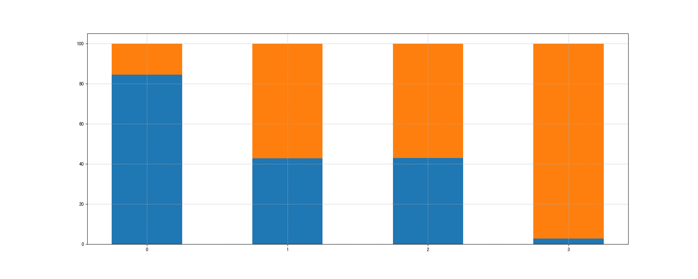
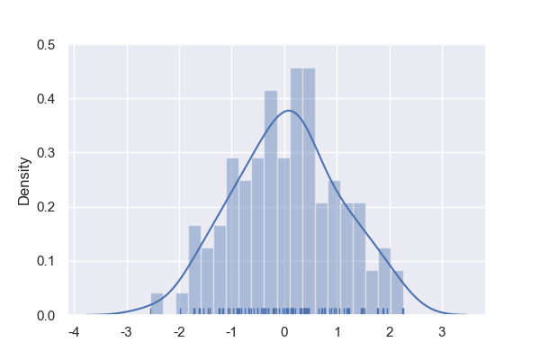

[TOC]

- 直方图

  - 形式为条形图，用于描述数据分布情况，横轴为数据的值，纵轴为数据占比
  - 具体例子见`python绘图库的使用-seaborn-绘制直方图`

- qq图（`quantile-quantile plot`）和pp图

  - https://blog.csdn.net/weixin_43717273/article/details/89104128

  - 作用：检验一组数据是否服从某一分布；检验两个分布是否服从同一分布

  - 原理：qq图通过分位数实现检验，pp通过概率分布实现检验

  - 画qq图

    ```python
    import numpy as np
    import matplotlib.pyplot as plt
    import seaborn as sns
    from scipy import stats
    
    # 准备一个均匀分布的数据（列表）
    data = list(np.random.uniform(0,1,100))
    # 准备两个子图，一个看数据和正态分布的拟合程度，一个看和均匀分布的拟合程度
    plt.figure(figsize=(20, 8))
    # 获取fig以便保存
    fig = plt.gcf()
    ax1 = plt.subplot(1,2,1)
    ax2 = plt.subplot(1,2,2)
    stats.probplot(data, dist="norm", plot=ax1)
    # 或者 stats.probplot(data, dist=stats.norm, plot=ax1) stats下有各种分布
    stats.probplot(data, dist=stats.uniform, plot=ax2)
    fig.savefig('./img/lab2-1.png')
    ```

    - 效果如下图所示

    


# 1、matplotlib

- 注意点：如果出现保存的图片为空白，说明是在`plt.show`之后保存的，解决办法如下
  - 在调用`plt.show`之前保存
  - 使用`fig = plt.gcf()`获取图像对象，保存时使用`fig.savefig()`即可

## （1）导入和设置

- 导入

  ```python
  import matplotlib.pyplot as plt
  import random
  from pylab import mpl
  %matplotlib inline
  ```

- 设置

  ```python
  # 设置显示中文字体和正常显示符号（动态设置）
  mpl.rcParams["font.sans-serif"] = ["SimHei"]
  mpl.rcParams["axes.unicode_minus"] = False
  ```

  - 需要字体库里有这些字体

## （2）绘制一张图中一幅图像

- 代码

  ```python
  x = range(365)
  y = [random.uniform(20, 40) for i in x]
  
  # 创建画布：figsize为长宽比，dpi为清晰度
  plt.figure(figsize=(20, 8), dpi=100)
  
  # 绘制折线图：color选择图线颜色
  plt.plot(x, y)
  # 构造x轴和y轴刻度
  x_ticks_label = ["第{}天".format(i) for i in x[::20]]
  y_ticks = range(40)
  y_ticks_label = ["{}度".format(i) for i in y_ticks[::5]]
  # 修改x轴和y轴刻度显示
  plt.xticks(x[::20], x_ticks_label)
  plt.yticks(y_ticks[::5], y_ticks_label)
  # 添加网格显示：alpha为透明度
  plt.grid(True, linestyle="--", alpha=0.8)
  # 添加描述信息
  plt.title("一年温度变化", fontsize=20)
  plt.xlabel("时间",  fontsize=20)
  plt.ylabel("温度",  fontsize=20)
  # 显示图例：loc选择图例位置
  plt.legend(loc="best")
  
  # 保存图片（必须在show前面）
  # plt.savefig("./img/1.png")
  
  # 显示
  plt.show()
  ```

- 效果

  

## （3）绘制一张图中多幅图像

- 代码

  ```python
  x = range(365)
  y1 = [random.uniform(20, 40) for i in x]
  y2 = [random.uniform(0, 20) for i in x]
  
  # 创建画布：figsize为长宽比，dpi为清晰度
  plt.figure(figsize=(20, 8), dpi=100)
  
  # 绘制折线图：一个plot可绘制多个图像，color选择图线颜色，label为图例参数
  plt.plot(x, y1, label="海南")
  plt.plot(x, y2, color="r", linestyle="--", label="东北")
  # 构造x轴和y轴刻度
  x_ticks_label = ["第{}天".format(i) for i in x[::20]]
  y_ticks = range(40)
  y_ticks_label = ["{}度".format(i) for i in y_ticks[::5]]
  # 修改x轴和y轴刻度显示
  plt.xticks(x[::20], x_ticks_label)
  plt.yticks(y_ticks[::5], y_ticks_label)
  # 添加网格显示：alpha为透明度
  plt.grid(True, linestyle="--", alpha=0.8)
  # 添加描述信息
  plt.title("一年温度变化", fontsize=20)
  plt.xlabel("时间",  fontsize=20)
  plt.ylabel("温度",  fontsize=20)
  # 显示图例：loc选择图例位置
  plt.legend(loc="best")
  
  # 保存图片（必须在show前面）
  # plt.savefig("./img/2.png")
  
  # 显示
  plt.show()
  ```

- 效果

  

## （4）绘制多幅图像

- 代码（方法一）

  ```python
  x = range(365)
  y1 = [random.uniform(20, 40) for i in x]
  y2 = [random.uniform(0, 20) for i in x]
  
  # 创建画布：返回图对象和坐标系，nrows和ncols设置几行几列的坐标系，如1，2表示有一行两列共两个坐标系
  fig, axes = plt.subplots(nrows=1, ncols=2, figsize=(20, 8), dpi=100)
  
  # axes[0]为第一幅图像，axes[1]为第二幅图像
  axes[0].plot(x, y1)
  axes[1].plot(x, y2, color="r", linestyle="--")
  
  # 设置刻度显示
  x_ticks_label = ["第{}天".format(i) for i in x[::20]]
  y_ticks = range(40)
  y_ticks_label = ["{}度".format(i) for i in y_ticks[::5]]
  axes[0].set_xticks(x[::20])
  axes[0].set_xticklabels(x_ticks_label)
  axes[0].set_yticks(y_ticks[::5])
  axes[0].set_yticklabels(y_ticks_label)
  axes[1].set_xticks(x[::20])
  axes[1].set_xticklabels(x_ticks_label)
  axes[1].set_yticks(y_ticks[::5])
  axes[1].set_yticklabels(y_ticks_label)
  
  # 添加网格显示
  axes[0].grid(True, linestyle="--", alpha=0.8)
  axes[1].grid(True, linestyle="--", alpha=0.8)
  
  # 添加描述信息
  axes[0].set_title("一年温度变化（海南）", fontsize=20)
  axes[0].set_xlabel("时间",  fontsize=20)
  axes[0].set_ylabel("温度",  fontsize=20)
  axes[1].set_title("一年温度变化（东北）", fontsize=20)
  axes[1].set_xlabel("时间",  fontsize=20)
  axes[1].set_ylabel("温度",  fontsize=20)
  
  # 添加图例
  axes[0].legend(loc="best")
  axes[1].legend(loc="best")
  
  # 保存
  # plt.savefig('./img/3.png')
  
  plt.show()
  ```

- 效果

  

- 代码（方法二）

  ```python
  # 定于4个子图（两行两列）
  ax = plt.subplot(2, 2, 1)  # 转到第1幅图像
  pass
  ax = plt.subplot(2, 2, 2)  # 转到第2幅图像
  pass
  
  # subplots方法定义
  fig, axs = plt.subplots(2, 2)  # 也是定义4个子图，两行两列
  axs[0][0].plot(...)  # 画第1行第1列图
  axs[0][1].plot(...)  # 画第1行第2列图
  pass
  ```

  

## （5）绘制散点图

- 代码

  ```python
  x = [random.uniform(0, 20) for i in range(20)]
  y = [random.uniform(0, 20) for i in range(20)]
  plt.figure(figsize=(20, 8), dpi=100)
  # 绘制散点图
  plt.scatter(x, y)
  # plt.savefig('./img/4.png')
  plt.show()
  ```

- 效果

  

- 可选参数

  - `plt.scatter(x, y, c='b', marker='o')`
  - `c`：颜色，可选值有`b--blue r--red w--white y--yellow g--green k--black c--cyan m--magenta`或者rgb/rgba数组
  - `marker`：点的样式，常见可选值有
    - `o` 圈
    - `.` 点
    - `x` 叉号
    - `+` 加号

## （6）绘制柱状图（竖直）

- 代码

  ```python
  movie_name = ['雷神', '蜘蛛侠', '钢铁侠', '美国队长']
  x = range(len(movie_name))
  y = [random.uniform(70, 100) for _ in x]
  plt.figure(figsize=(20, 8), dpi=100)
  # 绘制柱状图
  plt.bar(x, y, width=0.5, color=['r', 'g', 'b', 'y'])
  plt.xticks(x, movie_name)
  plt.grid(True, linestyle="--", alpha=0.8)
  plt.title('电影评分')
  plt.savefig('./img/5.png')
  plt.show()
  ```

- 效果

  

- 可选参数
  - `plt.bar(x, height, width=0.8, bottom=None, align='center', color='b')`
  - `x` x轴的值
  - `height` y轴的值
  - `width` 条形的宽度，大小为0～1之间
  - `bottom` y轴的起始位置，默认从0开始
  - `align` 条形的中心位置，可选值有`center edge`
  - `color` 条形的颜色，默认为蓝色

## （7）绘制柱状图（水平）

- 代码

  ```python
  movie_name = ['雷神', '蜘蛛侠', '钢铁侠', '美国队长']
  x = range(len(movie_name))
  y = [random.uniform(70, 100) for _ in x]
  plt.figure(figsize=(20, 8), dpi=100)
  # 绘制柱状图
  plt.barh(x, y)
  plt.yticks(x, movie_name)
  plt.grid(True, linestyle="--", alpha=0.8)
  plt.title('电影评分')
  plt.savefig('./img/6.png')
  plt.show()
  ```

- 效果

  

## （8）绘制叠加柱状图

- 代码

  ```python
  x = range(len(movie_name))
  y1 = [random.uniform(0, 100) for _ in x]
  y2 = [100 - _ for _ in y1]
  plt.figure(figsize=(20, 8), dpi=100)
  # 绘制叠加柱状图
  plt.bar(x, y1, width=0.5)
  # 注意第二个要加bottom
  plt.bar(x, y2, width=0.5, bottom=y1)
  plt.xticks(x, list(x))
  plt.grid(True, linestyle="--", alpha=0.8)
  plt.savefig('./img/7.png')
  plt.show()
  ```

- 效果

  

## （9）绘制饼图

- 代码

  ```python
  # 准备数据
  labels = ["A", "B", "C", "D"]
  fracs = [15, 30, 45, 10]
  exp = [0, 0.1, 0.2, 0]
  
  # 画图，exp用于突出某一部分
  plt.pie(x=fracs, labels=labels, explode=exp, shadow=True, autopct="%0.2f%%")
  
  # 显示图例
  plt.legend()
  plt.savefig('./img/8.png')
  plt.show()
  ```

- 效果

  

## （10）Pandas画图

- `DataFrame`和`Series`数据类型中也有画图的api
  - `DataFrame.plt(kind='line')`
  - `kind`：绘制图形的种类，可选值有`line scatter bar barh pie`

# 2、seaborn

- `seaborn`是在`matplotlib`基础上封装的图形绘制库

## （1）导入

- 需要用到的库

  ```python
  import seaborn as sns
  import numpy as np
  ```

## （2）绘制直方图

- 代码

  ```python
  sns.set()
  np.random.seed(0)
  # 创建正态分布（均值为0，方差为1，长度为100）数组
  arr = np.random.normal(0, 1, 100)
  # 绘制直方图和密度曲线
  ax = sns.distplot(arr, bins=20, rug=True)
  # 保存图片
  # ax.get_figure().savefig('./img/9.png', dpi=100)
  ```

- 效果

  

  - 上图中横轴上的小短线是数组的分布，曲线是分布的密度曲线

- 可选参数

  - `ax = sns.distplot(a, bins=None, hist=True, kde=True, rug=False, fit=None)`
  - `a` 列表、一维数组或者`Series`
  - `bins` 条形的数量
  - `hist` 是否绘制直方图
  - `kde` 是否绘制高斯核密度估计曲线
  - `rug` 是否在横轴上绘制分布情况
  - `fit` 控制拟合的参数分布图形，能够直观地评估它与观察数据的对应关系（黑色线条为确定的分布），如`fit=scipy.stats.norm`表示拟合正态分布

## （3）绘制散点图/二维直方图/核密度图

- 代码

  ```python
  sns.set()
  data = pd.DataFrame({
    'x': np.random.normal(5, 1, 50),
    'y': np.random.normal(10, 1, 50)
  })
  # 绘制散点图
  ax = sns.jointplot(x='x', y='y', data=data)
  # 保存图片
  # ax.savefig('./img/10.png', dpi=100)
  ```

- 效果

  

  - 如上图所示，中间是散点图，上方和右方分别是y值和x值的直方图

- 相关参数

  - `sns.jointplot(x=None, y=None, data=None, kind='scatter', color=None, height=6, ratio=5, space=0.2)`
  - `x` x轴的名字
  - `y` y轴的名字
  - `data` 数据
  - `kind` 图的类型，默认为`scatter`，可选值有`scatter（散点图） hex（二维直方图） kde（核密度等高线）`
  - `color` 散点图的颜色
  - `height` 中间图的大小（正方形）
  - `ratio` 中心图与侧边图的比例大小
  - `space` 设置中心图与侧边图的间隔大小

- 二维直方图

  ```python
  sns.jointplot(x='x', y='y', data=data, kind='hex')
  ```

  

- 核密度图

  ```python
  sns.jointplot(x='x', y='y', data=data, kind='kde')
  ```

  

## （4）绘制多个数据之间散点图

- 代码

  ```python
  # 设置数据集
  data = pd.DataFrame({
    'A': np.random.normal(0, 1, 20),
    'B': np.random.normal(5, 1, 20),
    'C': np.random.normal(10, 1, 20)
  })
  # 绘制数据集中A、B、C三者两两之间的散点图
  ax = sns.pairplot(data)
  # ax.savefig('./img/13.png')
  ```

- 效果

  

## （5）绘制箱形图（box-plot）

- 显示出一组数据的最大值、最小值、中位数及上下四分位数

- 代码

  ```python
  import numpy as np
  import pandas as pd
  import matplotlib.pyplot as plt
  import seaborn as sns
  import random
  %matplotlib inline
  
  data = pd.DataFrame({
    'col1': np.random.uniform(0, 10, 100),
    'col2': np.random.normal(0, 9, 100),
    'type': [0 if _ > 0.5 else 1 for _ in [random.random() for i in range(100)]]
  })
  
  # 绘制均匀分布的箱形图
  plt.figure(figsize=(20, 8))
  fig = plt.gcf()
  sns.boxenplot(data=data, x='col1')
  # fig.savefig('./img/lab14.png')
  
  # 根据type分组绘制col1的箱形图
  plt.figure(figsize=(20, 8))
  fig = plt.gcf()
  sns.boxenplot(data=data, x='type', y='col1')
  # fig.savefig('./img/lab15.png')
  ```

  

  

- 参数：`boxplot(*, x=None, y=None, data=None, orient=None, color=None, width=0.8`

  - `x` 列名，如果不传`data`，也可以传一个列表给`x`
  - `y` 列名
  - `data` `pandas`的`DataFrame`
  - `orient` 水平`h`还是竖直`v`

