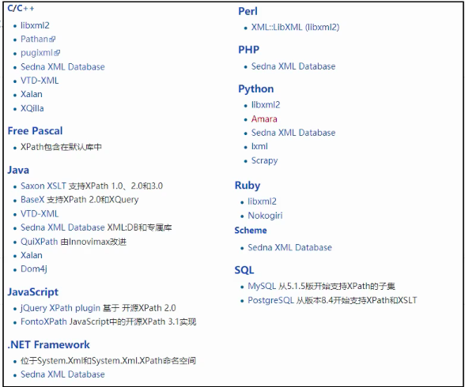

# 1、Xpath是什么

- Xpath是解析XML的一种语言，其广泛用于解析html数据（html是XML的子级）

- 几乎所有语言都能使用Xpath，如下

  

- Xpath的一个非常重要的用途：在Scrapy中用来提取数据
- 浏览器中如何使用Xpath（Chrome）：`Ctrl + F`或者`command + F`（Mac系统）

# 2、基本语法

- Xpath语法基本就三大类，如下

  - 层级：`/`表示直接子级（即严格父子级），`//`表示跳级（如子级的子级，只要满足上下级关系即可）
  - 属性：`@`访问属性（html标签里的属性，如class, id）
  - 函数：常用两个函数是`contains()`和`text()`
    - `contains()`    表示是包含关系，而不是严格等于
    - `text()`    用于提取标签里的内容

- 例子

  - ```
    //div[@class="s-bottom-layer-left"]//a
    ```

    - 最顶级的节点是`document`
    - `[]`是谓语，即限制条件
    - 该语句提取的是`document`的子级节点`div`（该`div`节点属性为`s-bottom-layer-left`，注意：这里是严格等于）下为`a`的子级，且

  - ```
    //div[contains(@class, "c-contain")]/h3//em
    ```

    - 这里用到了`contain()`函数，该函数表示包含关系，而不是严格等于
    - 该语句提取的是`document`的子级节点`div`（该`div`节点属性包含了`c-contain`即可，不需要严格等于）的严格子级`h3`节点下的为`em`的子级
  
- 获取兄弟元素

  - `//h2/following-sibling::p[1]` 表示获取h2后面的第一个兄弟
  - `//h2/preceding-sibling::p[1]` 表示获取h2前面的第一个兄弟

- 与或条件：使用`and/or`

  - `xpath('//div[contains(@class,"a") and contains(@class,"b")]')` 它会取class含有有a和b的元素
  - `//row[cell/data[text()='Alpha'] and cell/data[@type='String']] ` 找孙子结点data 满足type = String 且 inner text = Alpha 的所有的Row结点 

- 提取标签里的属性

  - `//a[@class="lbf-pagination-next "]/@href`

- 官方文档：https://www.w3school.com.cn/xpath/index.asp

- 注意：xpath中不能有tbody