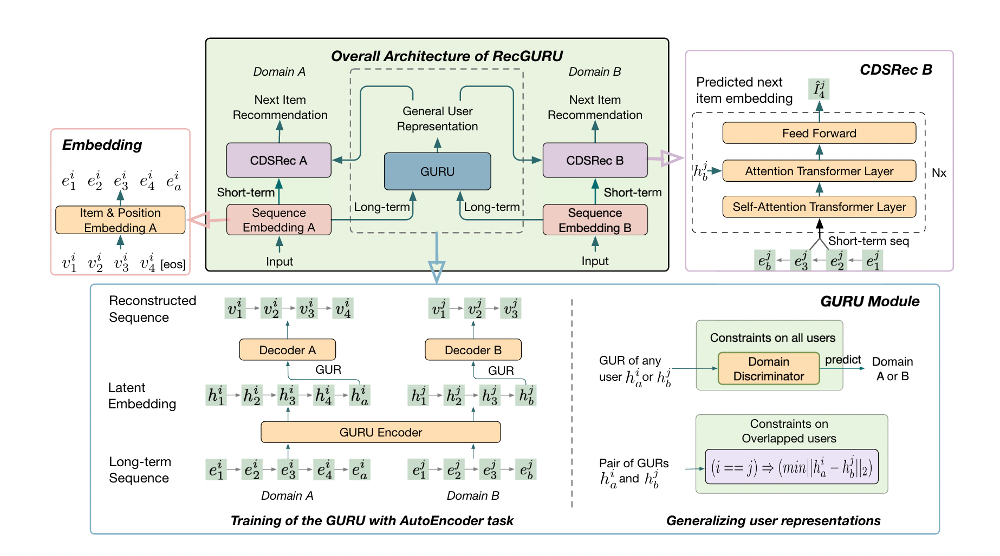
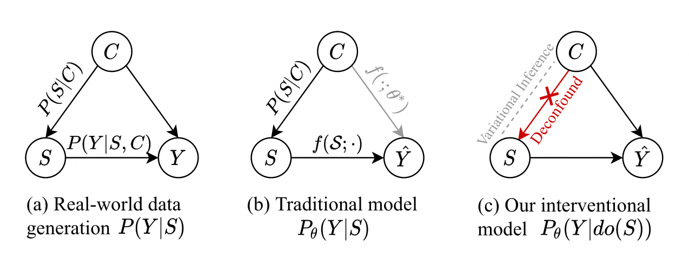

# DAGs with NO TEARS: Continuous Optimization for Structure Learning

- 符号定义
  - $X \in \mathbb{R} ^ {n \times d} = [X_1, X_2, ..., X_d]$，样本矩阵，行是样本，列是特征
  - $\mathbb{D} \in \{0,1\}^{d \times d}$是二元矩阵空间，即n个节点的图的搜索空间，也叫贝叶斯网络
  - $W \in \mathbb{R}^{d \times d} = [w_1\ |\ w_2\ |\ ...\ |\ w_d]$是n个节点的图的加权邻接矩阵，是连续的空间
  - $\mathcal{A}(W) = \{0,1\}^{d \times d} = 1\ if\ (W_{ij} \neq 0)\ else\ 0$ 为有向图$G(W)$的邻接矩阵
  - SEM（structural equation model）：$x_j = w_j^Tx + z_j,\ x=[x_1, x_2, ..., x_d]^T$，其中x是一个d维样本，z是随机噪声
  - GLM（generalized linear model）：$\mathbb{E}(x_j|x_{pa(x_j)}) = f(w_j^Tx)$，例如特征取值为0或1，即$x \in \{0,1\}^{d}$，在给定$x_j$特征的父节点特征后，就可以通过logistic回归对$x_j$进行建模
  - 本文使用least-squares (LS) loss：$l(X;W) = \frac1{2n} ||X-XW||_F^2$
  - 学习稀疏DAG，加上L1正则：$||W||_1 = ||vec(W)||1$，vec表示矩阵向量化
  - 目标：$\mathop{min}\limits_{W \in \mathbb{R}^{d\times d}} F(W) = l(X;W) + \lambda||W||_1 \quad s.t.\ G(W) \in \mathbb{D}$
- 对无环的重新描述
  - 为了能应用“black-box optimization”（我的理解就是使用数值计算，而无需去定义图结构），需要将$G(w) \in \mathbb{D}$替换为$h(W)=0$，并满足以下条件
    - $h(W)=0$当且仅当$G(W)$是无环图
    - $h(W)$的值可以反映“有向无环图的程度”（DAG-ness）
    - h必须是平滑的，即可以计算导数的，这样就可以用一些因果约束机制（machinery for constrained optimization）求解
    - h和它的导数需要是易于计算的
  - 定理1：$W \in \mathbb{R}^{d \times d}$是DAG，当且仅当$h(W) = tr(e^{W \odot W}) - d = 0$，证明如下
    - $tr(W)=0$表示$G(W)$没有自环
    - $W'=W^2 = WW,\ W'_{ij} = \sum\limits_{k=1}^dW_{ik}W_{kj}$，其中$W_{ik}$表示节点i到节点k的连接权重（不为0表示有连接），$W_{kj}$同理，所以$W_{ik}W_{kj}=0$表示节点i不能通过1跳到节点j
    - 同理$({W^p})_{ij}=0$表示节点i不能通过p跳到节点j
    - 所以$tr(W^p)=0$表示p跳内，$G(W)$没有自环（如果W所有元素都为正的话）
    - $W \odot W$用于约束所有元素都为正，设$A = W \odot W$
    - $e^{A} = I + A + \frac1{2!}A^2 + \frac1{3!}A^3 + ...$
    - $tr(e^A) = d + tr(A) + \frac1{2!}tr(A^2) + \frac1{3!}tr(A^3) + ... $
    - $tr(A) + \frac1{2!}tr(A^2) + \frac1{3!}tr(A^3) + ... = 0 \Longleftrightarrow \ $DAG无环
    - $tr(e^{W \odot W}) - d = 0\ \Longleftrightarrow \ $DAG无环
    - $\nabla h(W) = (e^{W \odot W})^T \odot 2W$，证明如下
      - $d(tr(e^{W \odot W})-d) = tr(d(e^{W \odot W})) = tr(e^{W \odot W}d(W \odot W))$
- 有了定理1，就可以得到一个ECP（equality-constrained program）：$\mathop{min}\limits_{W \in \mathbb{R}^{d\times d}} F(W) \quad s.t.\ h(W) = 0$
- 对ECP使用增强对拉格朗日乘子法，其对偶函数为：$D(\alpha) = \mathop{min}\limits_{W \in \mathbb{R}^{d\times d}} L^\rho(W, \alpha) \quad where\ L^\rho(W, \alpha)=F(W) + \frac{\rho}{2}|h(W)|^2 + \alpha h(W)$
  - $\alpha$是拉格朗日乘数
  - 对偶问题是$\mathop{max}\limits_{\alpha \in \mathbb{R}} D(\alpha)$，即$\mathop{max}\limits_{\alpha \in \mathbb{R}} \mathop{min}\limits_{W \in \mathbb{R}^{d\times d}} L^\rho(W, \alpha)$
  - 实际上原问题是$ \mathop{min}\limits_{W \in \mathbb{R}^{d\times d}} \mathop{max}\limits_{\alpha \in \mathbb{R}} L^\rho(W, \alpha)$

# CausPref: Causal Preference Learning for Out-of-Distribution Recommendation

- 论文讲解：https://zhuanlan.zhihu.com/p/597366122

- 摘要关键：现有推荐系统对user和item的分布偏移（在现实场景中非常常见）不敏感，导致测试性能下降，尤其是在只有隐式反馈（用户点击、浏览等二元可观察行为）条件下，因此需要提升推荐系统的性能稳定性。本文从OOD的角度分析了隐式反馈推荐系统存在的问题，提出CausPref框架，引入特定于推荐系统的DAG（Directed-Acyclic-Graph，有向无环图），来学习用户的不变偏好。该框架主要由两部分组成：用户不变偏好的学习以及反用户偏好的负采样。
- 动机
  - 现有推荐算法大都基于I.I.D的假设，这明显不符合现实情况，现实中的分布偏移（distribution shift）主要来源于两个方面：1、用户和物品在地理位置、时间等方面上的异构性，比如沿海地区用户和内陆地区用户的偏好就不一样，或者同一件商品在不同季节受欢迎程度不一样；2、popular bias：由于推荐系统机制造成的偏差，推荐系统推荐受欢迎的商品，使得它们的曝光程度更高，而那些不怎么受欢迎的商品则得不到曝光机会
  - 对于隐式反馈的推荐系统，其OOD问题相比于分类和回归更难处理。因为在这样的系统中，可观察到数据只有隐式正反馈，即用户的点击、浏览行为是否发生，且只能观察到发生了的行为，不能说用户没点击某样商品就认为他不喜欢这商品（可能是该商品没曝光到该用户），同理也不能说用户点击浏览了某商品就认为该用户喜欢这个商品。
- 贡献
  - 将推荐系统的问题表示为估计$P(Y|U,V)^*$，U和V分别表示user和item，Y是user对item的偏好（0或1）。证明了在$P(Y=1|U,V)$不变的条件下，真实的$P(Y|U,V)$也是不变的，即使$P(U,V)$变化（也就是环境变化）。因此提出如何通过学习因果结构（causal structure）来学习不变的用户偏好就是主要贡献，已有的一些工作是利用已知的因果结构，而本文是学出未知的因果结构
  - 设计了一个反用户偏好采样策略（anti-preference negative sampling）来获取负样本，即用户不喜欢的物品，用于学习用户不变偏好
- Problem 1：训练数据是可观察到的数据${(u_i, v_i, 1)\ |\ (u_i, v_i) \sim P(U,V|Y=1)}|_{i=1}^N$，即用户和物品的交互Y=1（交互可以是点击、浏览等行为）的数据，测试数据是和训练数据分布不一致（OOD）的数据${(u_i^*, v_i^*, y_i^*)\ |\ (u_i^*, v_i^*, y_i^*) \sim P^*(U,V,Y)}|_{i=1}^{N^*}$，其中$P(U,V) \neq P^*(U, V)$且$P^*(U=u,V=v) > 0\quad =>\quad P(U=u,V=v) > 0$。分布外隐式推荐系统（out-of-distribution implicit recommendation）的目标就是从训练数据中学习，来预测测试数据中用户对物品的反馈
- Assumption 1：由于在训练数据中只能观察到隐式正反馈（implicit positive feedback P(U, V, Y=1)），所以为了获得在测试数据P^*^(U, V)上的泛化能力，需要做出如下假设，即P(Y|U, V) = P^*^(Y|U, V)，即使P^*^(U, V)和P(U, V)不相等，也就是说用户的喜好不会随环境变化
- Assumption 2：用户的喜好不会随环境发生变化，并且用户不喜欢物品的分布可以由喜欢物品的分布决定（在推荐系统中被广泛采用，通常这二者分布相反），也就是P(V | U, Y=1)不会随着P(U, V)变化而变化，且P(V | U, Y=0) = F(P(V | U, Y=1))
- 公式2到公式3：把P(U | Y=0)和P(U | Y=1)约掉了，个人理解为？？？
- 公式4： $P(Y=1\ |\ U, V) = \frac{P(V\ |\ U, Y=1)}{P(V\ |\ U, Y=1) + C\mathcal{F}(P(V\ |\ U, Y=1))}$，其中$C = \frac{P(Y=0)}{P(Y=1)}$
  - 公式左边就是想求的目标，任意的用户对任意的物品喜欢的概率
  - 公式右边只有一个变量，就是我们的观察数据，即那些用户做出正反馈（点击、浏览）的用户-物品交互数据
  - 于是论文就提出分两步求取目标：
    - 从观察数据${(u_i, v_i, 1)}|_{i=1}^N$学习/估计用户的喜好$P(V|U, Y=1)$
    - 从正样本（$P(V|U, Y=1)$）和负样本（$P(V|U, Y=0)$，根据设计好的策略$\mathcal{F}(P(V\ |\ U, Y=1))$选择）中估计用户对物品的喜好概率$P(Y=1\ |\ U, V)$
- 负采样策略
  - 对一个用户u~i~，首先通过DAG学习其不变的喜好表征$\mathbb{E}(V|U=u_i,Y=1)$
  - 从物品池${v_i}|_{i=1}^N$中随机选K个物品${v_i}'|_{i=1}^K$，计算用户喜好表征和这K个物品表征的相似度（相似度函数用$\tau_1$表示）
  - 按照概率$\{\frac{w_k}{\sum_{i=1}^Kw_i}\}|_{k=1}^K$从中选一个物品v''作为负样本，于是(u~i~, v'')构成一个负样本对
- BPR loss：$\mathcal{L}_0 = -\sum\limits_{i=1}^Nlog\ \sigma (\mu_\Phi (u_i, v_i) - \mu_\Phi (u_i, v_i''))$，其中$\mu_\Phi (\cdot)$是打分网络（论文中用的是neural collaborative filtering），u~i~是学出来的用户不变偏好，这个损失函数的目的是让正样本对（观察到的用户喜好的物品和用户不变偏好）之间的分数比负样本对（未观察到的物品和用户不变偏好）之间的分数高
- 训练使用的损失
  - 对于正样本，同时使用$\mathcal{L}_{dag}^{rs}$和BPR loss训练以学习DAG，这里选择回传BPR loss的梯度是为了增加一些自监督信号，以帮助更好地找到真正的因果结构（在推荐系统场景下）
  - 对于负样本，只使用BPR loss

# Debiasing the Cloze Task in Sequential Recommendation with Bidirectional Transformers

- 动机：目前推荐系统中最好的去除exposure bias的方法是IPS（Inverse Propensity Scoring），但是传统的IPS没有考虑时间因素，所以不能直接扩展到序列推荐上
- 贡献
  - 从理论上提出了Cloze task中存在的exposure bias问题，证明了传统IPS不能直接扩展到序列推荐上
  - 提出了理想的损失函数用于Cloze task
  - 提出了ITPS（Inverse Temporal Propensity Scoring）框架用于去除序列推荐中的exposure bias

- 文中的$S \in I\ \cup\ \{0\}^{|S|\times T}$表示的是$S \in \{I\ \cup\ {0}\}^{|S| \times T}$，其中I是item集合
- 传统loss：$L_{cloze} = \frac{-1}{|S|\cdot|I|\cdot T}\sum\limits_{s=1}^{|S|}\sum\limits_{t=1}^{T}\sum\limits_{i=1}^{|I|} \mathbb{1}_{\{S^m_{s,t}=<mask>\}}\cdot Y_{S_s,I_i,t} \cdot log(softmax(f_{\Omega}(S_{s,t},\ I_i)))$，其中
  - S是序列集合，表示用户，T表示序列长度，I是item集合
  - $\mathbb{1}_{\{S^m_{s,t}=<mask>\}}$是mask（不足T的序列会在前面补mask），为0或1
  - $Y_{S_s,I_i,t}$是ground truth，表示第s个用户在t时刻是否和item i有交互
  - $f_\Omega$是模型，输入是用户s在t时刻之前的历史信息和item i
- 理想的loss：$L_{cloze}^{ideal} = \frac{-1}{|S|\cdot|I|\cdot T}\sum\limits_{s=1}^{|S|}\sum\limits_{t=1}^{T}\sum\limits_{i=1}^{|I|} \mathbb{1}_{\{S^m_{s,t}=<mask>\}}\cdot C_{S_s,I_i,t} \cdot \gamma_{S_s,I_i,t} \cdot log(softmax(f_{\Omega}(S_{s,t},\ I_i)))$
  - 设$C_{S_s,t} \sim Cat(|I|,\ [\gamma_{S_s,I_1,t},\ \gamma_{S_s,I_2,t},\ ...,\ \gamma_{S_s,|I|,t}])$，是一个Categorical分布
  - 和传统loss的区别在于将$Y_{S_s,I_i,t}$替换为$C_{S_s,I_i,t} \cdot \gamma_{S_s,I_i,t}$，定义$C_{S_s,I_i,t}$为$C_{S_s,t}$对于$I_i$的输出
- IPS在序列推荐里的局限性
  - Inadequacy of the interaction random variable representation：论文给出的解释是在IPS框架下，Y=O*R（Y，点击，O，曝光，R，user-item相关度），如果要把IPS推广到序列推荐中，那么每一时刻user会和一个item交互，但是在每一时刻曝光给用户的item有很多，用户只选择了其中一个交互。在传统推荐系统设置下，可以认为用户点击物品，和用户喜欢物品与物品曝光给用户这两个因素相关，即，如果用户接触到item，并且交互了，就认为用户和item相关，如果没有交互，就认为用户和item不相关。但是对于序列推荐系统，用户在一个时刻可能接触到了多个item，但是只能选一个item进行交互，即，如果用户接触到item，并且交互了，就认为用户和item相关，如果没有交互，也不能认为用户和item不相关，因为在那个时刻用户只能选择一个item交互。我认为还有一个关键原因：在之前的设置中，用户的画像是已知的，也就是知道用户的特征，而在序列推荐中是不知道的（不是很确定，好像在IPS中用户和物品的特征也是学出来的）
  - Ignoring the temporal component：传统IPS框架忽略时间因素，即认为item的propensity of exposure是静态的
    - 定义基于逆倾向分数（Inverse Propensity Scoring-Based）的cloze loss函数
    - $L^{IPS}_{cloze} = \frac{-1}{|S|\cdot|I|\cdot T}\sum\limits_{s=1}^{|S|}\sum\limits_{t=1}^{T}\sum\limits_{i=1}^{|I|} \mathbb{1}_{\{S^m_{s,t}=<mask>\}}\cdot \frac{Y_{S_s,I_i,t}}{\theta_{S_s,I_i}} \cdot log(softmax(f_{\Omega}(S_{s,t},\ I_i)))$
    - $\theta_{S_s,I_i}$是对于用户s（由$S_s$定义），$I_i$的曝光概率，即$O_{S_s,I_i} \sim Ber(\theta_{S_s,I_i}),\ \theta_{S_s,I_i}=P(O_{S_s,I_i} = 1)$
    - 对于这个IPS-based Cloze loss，当且仅当满足条件：每个item i对user u的曝光概率（由系统决定）是静态的，即不随时间改变。才有$\mathbb{E}[L^{IPS}_{cloze}]=\mathbb{E}^{ideal}_{cloze}$

- 本文提出的ITPS（Inverse Temporal Propensity Scoring）
  - 解决以上两个问题
    - 第一个问题：建模$Y_{S_s,I_i,t} = C_{S_s,I_i,t}O_{S_s,I_i,t}R_{S_s,I_i,t}$，其中Y是点击变量，O是曝光变量，R是相关变量，C是根据R算出的用户选择变量（C服从Categorical分布）
    - 第二个问题：定义无偏的损失函数$L^{IPS}_{cloze} = \frac{-1}{|S|\cdot|I|\cdot T}\sum\limits_{s=1}^{|S|}\sum\limits_{t=1}^{T}\sum\limits_{i=1}^{|I|} \mathbb{1}_{\{S^m_{s,t}=<mask>\}}\cdot \frac{Y_{S_s,I_i,t}}{\theta_{S_s,I_i,t}} \cdot log(softmax(f_{\Omega}(S_{s,t},\ I_i)))$

# Unbiased Recommender Learning from Missing-Not-At-Random Implicit Feedback

- 动机
  - 隐式反馈推荐系统存在positive-unlabeled问题（即user对item没有interaction不意味着user对这个item没有兴趣，而是可能这个item没能曝光给user）
  - 现有解决positive-unlabeled问题的方法主要是：Previous studies addressed the positive-unlabeled problem by uniformly upweighting the loss for the positive feedback data or estimating the confidence of each data having relevance information via the EM-algorithm.（还不能理解）
  - 这些方法没有解决missing-not-at-random问题，即对于那些系统经常推荐或者非常流行的item，user即使不感兴趣，也可能会与其发生interaction（比如点击、浏览），也就是说存在两种bias：1、user对item没有interaction可能是曝光问题；2、user对有interaction的item可能是受到其它影响，而不是user喜好这个item

- 相关工作
  - WMF（Weighted Matrix Factorization）：对于那些未点击的item，降低它们的权重，让其预测置信度相比于被点击的item的低；但是未点击的item之间对于user来说也不是相同，那些被多次推荐但是user没有点击的，说明这个item和user的相关性就比较低（即user对item的喜好概率低）
  - ExpoMF（Exposure matrix factorization）：使用了曝光信息，引入隐概率模型（曝光概率矩阵$O=[o_{u,i}]_{|U|\times |I|}$和user-item相关矩阵$R=[r_{u,i}]_{|U|\times |I|}$），将user对item的点击率视为o和r的乘积，也就是说ExpoMF增加了那些有高曝光率item的权重，因为它认为user对于曝光率更高的item的反馈（点击或没点击）的置信度更高。但是ExpoMF会降低对那些低曝光率的item对预测准确度

- 贡献
  - 提出了理想的损失函数用于最大化相关性（不是求user最大点击率的item，而是求最大相关性的item），并从理论上证明了现有的方法（WMF和ExpoMF）使用的损失函数存在bias
  - 基于因果推断的技术提出了一个无偏的loss估计量——仅从观测数据中评估
  - 分析了所提出的无偏loss估计量在推荐系统设置下方差可能会非常大，于是提出了截断的估计量（clipped estimator）

- Notation
  - $u \in U, |U| = m;\ i \in I, |I| = n;\ D=U\times I, |D|=m\times n$
  - $Y \in \{0,1\}^{m\times n},\ O \in \{0,1\}^{m\times n},\ R \in \{0,1\}^{m\times n}$，Y是点击矩阵，O是曝光矩阵，R是相关矩阵；$Y_{u,i}, O_{u,i}, R_{u,i}$分别表示user u和item i的点击（1表示点击，0表示未点击）、曝光（1表示u接触过i，0表示未接触过）、相关（1表示i和u相关，即u对i有兴趣，0表示无关）；$Y_{u,i}, R_{u,i}$服从Bernoulli分布，Y是可观测的，O和R不可观测
  - 假设：$(1)\ Y_{u,i} = O_{u,i} \odot R_{u,i};\quad (2)\ P(Y_{u,i}=1) = \theta_{u,i}\cdot \gamma_{u,i},\  \theta_{u,i}=P(O_{u,i} = 1),\ \gamma_{u,i}=P(R_{u,i} = 1)$
  - 等式（1）的含义是user的点击不意外着相关性（即user喜好）
  - 等式（2）将点击率分解为曝光率和相关度，基于这个假设，就可以将曝光率取不同值，来建模MNAR设置（类似因果推断中的无混淆设置，即$O\ \bot\ R|_{u,i}$）

- 评价指标
  - 传统：$R_{click}(\hat{Z}) = \frac{1}{|U|} \sum\limits_{u \in U} \sum\limits_{i \in I} P(Y_{u,i}=1) \cdot c(\hat{Z}_{u,i}),\ \hat{Z} = \{\hat{Z}_{u,i}\}_{(u,i) \in D}$，其中R是总的指标，c(·)是具体的指标（如precision@K、recall@K或者DGC@K），问题在于点击率不能反映相关性
  - 本文提出的：$R_{click}(\hat{Z}) = \frac{1}{|U|} \sum\limits_{u \in U} \sum\limits_{i \in I} P(R_{u,i}=1) \cdot c(\hat{Z}_{u,i})$
  - 使用新的loss来优化指标：$\mathcal{L}_{ideal}(\hat{R}) = \frac{1}{|D|} \sum\limits_{(u,i) \in D} [\gamma_{u,i}\delta^{(1)}(\hat{R}_{u,i}) + (1-\gamma_{u,i})\delta^{(0)}(\hat{R}_{u,i})]$
    - $\hat{R}$是预测矩阵
    - $\delta^{R}, R\in \{0,1\}$是local loss，比如对于一个user-item pair (u, i)，那么$\delta^{(R)}(\hat{R}) = -(R\cdot log(\hat{R}) + (1-R)\cdot log(1-\hat{R}))$
    - 物理含义：$\gamma_{u,i}$是相关性，也就是说从相关性角度算一次交叉熵，从无关性角度再算一次交叉熵，二者加权
  - 后面用$\delta^{(R)}_{u,i}$代替$\delta^{(R)}(\hat{R}_{u,i})$

- WMF：$\mathcal{L}_{WMF}(\hat{R}) = \frac{1}{|D|} \sum\limits_{(u,i) \in D} [cY_{u,i}\delta^{(1)}_{u,i} + (1-Y_{u,i})\delta^{(0)}_{u,i}]$
  - c是大于1的超参数，含义是给clicked的数据更大的权重，也可以理解为置信度
  - 论文中详细证明了这个loss是有偏的，根本原因在于没有考虑positive-unlabeled问题，即Y=0不意味着R=0

- ExpoMF：隐概率模型，假设user特征、item特征、曝光、以及user反馈服从以下分布，其中$\lambda_U^{-1}, \lambda_V^{-1}, \lambda_y^{-1}$是超参数，$\mu_{u,i}$和user-item矩阵是想学习的模型参数

  - $U \sim \mathcal{N} (0, \lambda_U^{-1}I_K)$
  - $V \sim \mathcal{N} (0, \lambda_V^{-1}I_K)$
  - $O_{u,i} \sim Bern(\mu_{u,i})$
  - $(Y_{u,i} | O_{u,i}) = 1 \sim \mathcal{N}(U_u^TV_i, \lambda_y^{-1})$

  - 从论文（Modeling User Exposure in Recommendation）中推导出点击和曝光的联合概率的对数似然如下
    - $log(P(o_{u,i}, y_{u,i}\ |\ u_{u,i}, U_u, V_i, \lambda_y^{-1})) = log(Bern(o_{u,i}|\mu_{u,i})) + o_{u,i} \cdot log(\mathcal{N}(y_{u,i} | U_u^TV_i, \lambda_y^{-1})) + (1-o_{u,i})log\mathcal\delta(y_{u,i}=0)$
    - 其中$(1-o_{u,i})log\mathcal\delta(y_{u,i}=0)$为0，所以$log(P(o_{u,i}, y_{u,i}\ |\ u_{u,i}, U_u, V_i, \lambda_y^{-1})) = log(Bern(o_{u,i}|\mu_{u,i})) + o_{u,i} \cdot log(\mathcal{N}(y_{u,i} | U_u^TV_i, \lambda_y^{-1}))$
    - $o_{u,i} \cdot log(\mathcal{N}(y_{u,i} | U_u^TV_i, \lambda_y^{-1}))$的取值如下
      - o=1, y=1, $\delta^{(1)}_{u,i}$
      - o=1, y=0, $\delta^{(0)}_{u,i}$
      - o=0, 0
      - 该项用于求取user-item矩阵，它充分考虑了曝光情况下user-item的局部损失，因为当item曝光给user时，click就表示相关（喜好）
  - 由于曝光变量${o_{u,i}}$是不可观测的，所以使用EM算法：$\theta^{(t+1)} = \mathop{arg\ max}\limits_{\theta} \int_z logP(x,z|\theta)P(z|x,\theta^{(t)})\,dz$
    - E步：估计出后验曝光，即$\theta'_{u,i} = \mathbb{E}[O_{u,i} | Y_{u,i}]$
    - M步：使用损失函数：$\hat{\mathcal{L}}_{ExpoMF}(\hat{R}) = \frac{1}{|D|}\sum\limits_{(u,i) \in D} \theta'_{u,i}[Y_{u,i}\delta^{(1)}_{u,i} + (1-Y_{u,i})\delta^{(0)}_{u,i}]$，来更新参数
      - 当Y~u,i~=1时，一定有O~u,i~=1
      - 当Y~u,i~=0时，曝光的概率越大，$\theta'_{u,i}$越大
      - 也就是说，$\theta'_{u,i}$可以看作是置信度
        - 当item一定曝光时（也就是Y=1），样本权重最大
        - 当不知道item是否曝光时，用曝光概率作为权重，曝光概率越大，权重越大
  - $\hat{\mathcal{L}}_{ExpoMF}(\hat{R})$也是有偏大，原因如下（证明在论文中）
    - 它增加了曝光概率大的样本的权重，也就是一定程度上缓解了positive-unlabeled问题，但是并没有完全解决，对于那些曝光概率小的item还是有偏差的
    - 没有考虑到用户点击物品不一定是喜欢或偏好，也可能是其它因素（比如诱骗点击或看一下流行物品，但是并不一定喜欢）

# RecGURU

- 动机

  - 序列推荐多数算法主要研究的场景是iid（单域），该场景普遍存在的一个问题是数据稀疏问题——most users may only have a short behavior history in the domain of interest
  - 现有的跨域推荐主要基于重叠的用户数据执行迁移算法（`Recent work on cross-domain recommendation focuses on the transfer learning of user and item information from diverse perspectives. For example, mapping functions have been proposed to map user representations from one domain to another, by learning from the behavior of users that appear in both domains [23].`），现实应用中可能没有满足需要的数据

- 贡献

- 问题定义

  - $U=\{u_1, u_2, ..., u_{|U|}\};\ V=\{v_1, v_2, ..., v_{|V|}\};\ s^i = \{v^i_1, v^i_2, ..., v^i_{s^i}\}$，其中U和V分别是user和item集合，$s^i$是用户i的序列
  - 单域：$p(v^i_{|s^i|+1}=v\ |\ s^i)$，即给定用户历史序列，预测用户下一个交互的item的概率
  - 跨域，有重叠用户数据场景：$p(v^i_{|s^i_A|+1}=v\ |\ s^i_A, s^i_B)$，其中A和B是两个域，用户i在两个域中都有数据，即$u_i \in (U_A \cap U_B)$
  - 跨域，无重叠用户数据场景：$p(v^i_{|s^i_A|+1}=v\ |\ s^i_A,\ info(S_B));\ S_B=\{s_B^j\}, \forall u_j \in U_B$，info是任意的信息/特征提取器

- 模型

  

  - Embedding：包含item embedding和position embedding，输出的是两个embedding之和
  - 类似Transformer，GURU Encoder是双向的，Decoder是单向的
  - Decoder中除了一个self-attention，还有一个multi-head attention layer，用于decoder输入和encoder输出（假设shape为`[128,100,32]`，则128是batch size，100是seq len，32是encoder中V的维度，其中每个`[100,32]`都是一样的向量，为该user的表征，即最后一时刻的V）之间的attention
  - Decoder的逻辑是：（1）先做Q=decoder input，K=decoder input，V=decoder input的self-attention，得到decoder output；（2）再做Q=decoder output，K=encoder input，V=encoder input的cross-attention。最终得到decoder的输出
  - 重构损失：$\mathcal{L}_{rec}(s^i, \hat{s}^i) = -\sum\limits_{t=1}^N log\ p_\theta(\hat{v}^i_t\ |\ \hat{v}^i_{<t}, h^i)$，重构损失中忽略[pad]
  - 泛化用户表征
    - 理想情况：用正则项约束，即$\mathcal{L} = \mathcal{L}_{rec}(S_A, \hat{S}_A) + KL(\rho^A || \rho^B) + \mathcal{L}_{rec}(S_B, \hat{S}_B) + KL(\rho^B || \rho^A)$
    - 实际：用户的特征是有encoder的参数刻画的，所以通过对抗训练策略来隐式地最小化$\rho^A$和$\rho^B$之间的KL散度
    - 具体做法：使用一个域鉴别器，判断h是A域还是B域；和GAN类似，交替训练encoder和域鉴别器，直到不能判断用户表征来自哪个域，鉴别损失记为$\mathcal{L}_{dis}$
    - 对于一些用户数据，如果在两个域中都有记录，那么用L2正则来约束该用户的表征跨域一致（图中Constraints on Overlapped users），记为$\mathcal{L}_{l_2}$
    - 有点像多任务学习（multi-task learning）：域A和域B构成两个任务，任务之间有点相关性，但是不知道这种相关性如何描述，那么简单认为不同任务模型之间的相关性实际上是通过模型参数相互接近来建模的
  - 预测层：单向多头注意力机制和MLP
    - Self-Attention Transformer Layer的输入是用户短期的item交互序列（长度为m）
    - CDSRec输出的是一个向量，该向量和指定item表征做内积可得到一个分数
    - 损失：Bayesian Personalized Ranking (BPR) loss，即$-log \sigma(q^{i,t}I_v)-log(1-\sigma(\frac{1}{|N_s|}\sum\limits_{v' \in N_s}q^{i,t}I_{v'}))$，其中$v$是用户在t时刻选择的item；$N_s$是负item样本，即没有被用户选中的item（根据频率选择）
    - BPR具体计算过程：假设logits形状是`[128,100,31]`，其中负样本数量是30，即将问题看成是多分类（31类），用交叉熵计算损失，标签都是0（因为正样本的logit都放在第一个的位置上）

- 训练策略

  - 阶段一：在单域上预训练，只使用重构损失（重构损失即交叉熵损失，每个batch先后计算两个域，同时优化）

  - 阶段二：仿照GAN，在每次迭代中，首先$min\ \mathcal{L}_{dis}$来更新域鉴别器，然后$min\ \mathcal{L}_{rec} - \mathcal{L}_{dis} + \mathcal{L}_{l_2}$来更新encoder

  - 阶段三：在对应的域上微调，即$min\ \mathcal{L}_{bpr}$来更新CDSRec

  - 算法

    

- 实验设置

  - 固定序列长度为N：对于长度超过N的序列，只考虑最后N个；对于长度小于N的，在前面补[pad]

# AFT

- 域：平台类型，如视频、文章、小程序

- 动机

  - 从用户的multi-domain behaviors中学习用户general and domain-specific的偏好
  - MDR（Multi-domain recommendation）：目的是提高模型在所有域上的性能，常见方法如下
    - `jointly combine multi-domain behaviors as input features, while it cares less about the inter-domain feature interactions`
    - `Multi-task learning (MTL) is also an effective method to jointly make full use of multi-domain information in different domains, where the recommendation in each domain is treated as a task`
  - MDR面临的问题：（1）`the sparsity of user-item pair-wise click behaviors`；（2）`the sparsity of feature interactions within and between different domains`

- 整体框图

  

- 模型

  

  - Multi-domain generator
    - mask：将序列中target domain的item embedding替换为[MASK]
    - Encoder：平均池化
    - Tranformer：$\bar{f}_i = Transformer(f_i)$
    - $h_t = MLP(\sum\limits_{i=1}^n \alpha_i \bar{f}_i)$是user aggregated preference，即用户在target domain上的特征表示
    - $\alpha_i = softmax(\bar{f}_i^T (f_t + d_t)$，其中$d_t$是target domain的特征，$f_t$是target domain序列通过encoder的输出，即平均值
    - 点击率预测$p_g(e_i|u) = sigmoid(h_t^Te_i)$，其中$e_i$是item的embedding
    - 通过$h_t$可以在item池中找到和用户在target domain的preference最契合的item，作为虚假点击的item
  - Multi-domain discriminator
    - 目的：分辨用户交互的真实的item和虚假的item，前者是真实数据，后者是Multi-domain generator生成的fake item
    - domain-level preference：Encoder的输入是$\{d_1', d_2', ..., d_n'\},\ d_i'=\beta_id_i$，其中$d_i$是第i个domain的特征向量，$\beta_i \in [0,1]$是反映用户点击的item数量在domain i中的比例的权重
    - $\bar{d}=concat(\hat{d}_1, \hat{d}_2, ..., \hat{d}_n),\ \hat{d}_i = Transformer(d_i')$
    - 同理$\bar{f}=concat(\hat{f}_1, \hat{f}_2, ..., \hat{f}_n),\ \hat{f}_i = Transformer(f_i)$
    - $ConvE\ Layer$：基于知识表示学习（`In knowledge representation learning, translation-based methods like TransE [2] and convolutionbased methods like ConvE [5] transfer the head entity $e_h$ into the tail entity $e_t$ through the relation r to learn knowledge representations (e.g., in TransE we have $e_h + r \approx e_t$ ).`）中三元组的学习范式，公式是$e_t = ConvE(e_h, r) = Flatten(CNN(f(e_h, r)))W_c$，其中$f(\cdot)$首先将$e_h \in \mathbb{R}^k, r \in \mathbb{R}^k$转换为$\mathbb{R}^{k_w \times k_h}$的矩阵，然后按行拼接，所以$f(e_h, r) \in \mathbb{R}^{k_w \times 2k_h}$，CNN是2D卷积，最终得到的$e_t$是是向量
    - $u_g = ConvE(\bar{f}, \bar{d})$，物理含义是`item-level preference + domain-level preference = user general preference`
    - 使用CNN的目的就是从不同粒度识别用户偏好的模式（`The user general representation consists of both fine-grained itemlevel preference and coarse-grained domain-level preference.`）
    - $u_t = ConvE(u_g, Concat(d_t, f_t)W_d)$，物理含义是`user general preference + domain information = user domain-specific preference`
    - 

# Towards Out-of-Distribution Sequential Event Prediction: A Causal Treatment

- 动机

  

- 困难/待解决的问题

- https://new.qq.com/rain/a/20210819A059BJ00

- **triplet loss**

- 方法

  

  - 图（a）：C是context，如气候；S是历史行为；Y是未来行为（next item）
  - 图（b）：使用传统MLE优化模型（$\theta^* = \mathop{arg\ min}\limits_\theta\ \mathbb{E}_{(S,y) \sim P(S,Y | C = c_{tr})}[l(f(S;\theta), y)]$），模型会学习到C到$\hat{Y}$的关系
  - 如a所示，S中有部分信息对预测有帮助，但是却和C高度相关，而C在现实场景中很可能是变化的（如气候、流行），因此使用MLE学出来的模型在未来的（C的分布和训练数据不一致）预测中会使用S和Y虚假的关联部分，导致性能下降
  - 通过do操作可以切断C到S的路径（也就切断了S到Y的后门路径），这个操作模仿了数据生成过程（S独立于C）
  - $P_\theta(Y|do(S)) = \sum\limits_{i=1}^{|C|}P_\theta(Y|S,C=c_i)P(C=c_i)$不能直接计算，因为C是不可观察甚至未定义的，先验分布$P(C)$也是未知的
  - 使用变分推断估计S和C的关联$Q(C|S)$，ELBO是$log\ P_\theta(Y|do(S)) \ge \mathbb{E}_{c \sim Q(C|S=S)}[log\ P_\theta(Y|S=S,C=c)]-\mathcal{D}_{KL}(Q(C|S=S)\ ||\ P(C))$
  - 实际实现时，KL计算的是$q_t$（代码中是weights）和正样本位置分布的距离
  - 对C选择合适的分布很重要（如果预先定义为简单分布，如均匀分布，可能导致过参数化）
  - 如果使用后验分布的均值，即$P(C) \approx \frac1N \sum\limits_{i=1}^N Q(C|S=S_i)$，会导致非常大的计算量，并且由于训练数据的质量有限（只是一段时间的数据，和测试集分布不一样），得到的分布很可能是有偏的
  - 最终使用的是可学习的高斯混合模型$\hat{P}(C) = \frac1R \sum\limits_{j=1}^R Q(C|S=S_j')$，其中S'是生成的伪序列，并且R远小于N

- 模型

  - 嵌入层：序列元素的embedding是d维
  - Inference Unit: Context-Specific Encoder
    - $[h^2_1, h_2^2, h_3^2, ..., h_t^2] = \Phi([h^1_1, h_2^1, h_3^1, ..., h_t^1], c_{(t)}; \Theta) = \sum\limits_{k=1}^K c_{(t)}[k] \cdot \Phi_k([h^1_1, h_2^1, h_3^1, ..., h_t^1]; \theta_k)$
    - $h^1_t$：t时刻事件的embedding
    - $h^2_t$：t时刻用户的hidden state
    - $c_{(t)}$：t时刻该序列的context，$\mathcal{C} = \{c_k\}_{k=1}^K,\ c_{(t)} \in \mathcal{C}$
    - $\{\Phi_k(\cdot\ ;\ \theta_k)\}_{k=1}^K$：context-specific inference units，encoder $\Phi$的子网络，用于学习context-aware sequence representations，其中$\Phi = \{\theta_k\}_{k=1}^K$
    - $c_{(t)}[k]$：向量第k维的值
    - inference unit：recurrent neural network (RNN) or self-attention (SA)
  - Branching Unit: Dynamic Model Selection
    - 给定序列，用于推理其context
    - $q_t = \Psi(h_t^1; \Omega), q_t \in [0,1]^K$：概率分布，即表示t时刻序列的context分布
    - $w_k \in \mathbb{R}^{d'}, d' = d(d+1)$：context的embedding
    - 定义$W_k = w_k[:d^2].reshape(d,d), a_k = w_k[d^2:d^2+d]$，其中[]表示索引
    - $s_{tk} = <a_k, tanh(W_kh_t)>$：表示t时刻序列context属于第k类的分数（置信度）
    - 整体流程：将序列表征$h_t$投影到新的d维空间，然后用点积计算序列和各context的相似度score；得到score后，通过一个softmax得到$q_t=softmax([s_{tk}]_{k=1}^K; \tau)$，然后使用重参数采样$c \sim Q(C|S)$（Gumbel-Softmax distribution）；最后计算$\sum\limits_{k=1}^K q_{(t)}[k] \cdot \Phi_k([h^1_1, h_2^1, h_3^1, ..., h_t^1]; \theta_k)$
  - CaseQ: a Hierarchical Branching Structure
    - 由于计算资源有限，不能将Context的类型设置为很大；另外Context之间可能也是相互有关联的，如果独立地参数化Context，可能导致过拟合和泛化性能下降

- 实验

  - leave one out：用序列最后G+1个item做测试集，用$|S| - G -2$做训练集，用$|S| - G - 1$做验证集

# A Generic Learning Framework for Sequential Recommendation with Distribution Shifts

- 动机
  - ERM假设训练数据和测试数据同分布，但是实际应用中存在分布偏移（distribution shift），如item的流行分布是随时间变化的，user的偏好也是随时间在变化的
  - debiasing or data augmentation的方法不足之处：
  - Distributionally Robust Optimization（DRO）：根据训练数据得到一个经验分布（对真实分布的一个估计，the nominal distribution），以经验分布为球心，考虑一个 wasserstein 空间球体内的所有分布，这个空间球体的半径为$\mathcal{E}$，真实分布理论上应该不会偏离训练样本集合的分布很远，那么只要$\mathcal{E}$合理，就可以认为真实分布应该包含在 wasserstein 球中，那么我们只要能保证模型在整个球体内效果最差的分布下得到最低的风险，就可以保证这个结果是真实样本分布下的性能的下界。基本思想就是：min-max的非凸的优化问题，就是在合理范围内找到最差的分布，在这个最差的分布上优化模型
  - DRO应用到SeqRec的困难：在域泛化的设置下，无法接触到测试数据，这样就不容易获得the nominal distribution（希望这个分布能尽可能靠近测试分布）；其次现有DRO的方法多数是针对连续数据的，SeqRec是离散问题，应用上存在困难
- nominal distribution
  - 用的还是样本加权方法
  - 样本的权重计算公式（根据频率）：$p(v_i) = (\frac{D_{v_i}}{\sum_j D_{v_j}})^\gamma$
  - 实际计算公式：$p(v_i) = (\frac{D_{v_i} + 1}{\sum_j (D_{v_j} +1)})^\gamma$，防止出现0
- DRO loss
  - $\mathcal{L}_{DRO}'' = \beta_0 log \ \mathbb{E}_{(s,v) \sim \mu_0} [exp(\frac{loss(s,v)}{\beta_0})]$
  - 损失中没有鲁棒半径$\rho$，但是论文证明了$\rho$和$\beta_0$高度相关，具体来说就是$\mathop{lim}\limits_{\beta_0 \rightarrow \infin} \rho_{\beta_0} = 0$
- DRO loss的实际应用公式
  - $\mu_0$由$p(v_i)$决定，即每个样本乘其权重，等价于nominal distribution
  - 
- 实验设置
  - 数据预处理：交互次数低于5次的item被移除，长度小于3的序列被移除；序列长度固定为10（短的补零，长的取最后10个）
  - 数据集：训练：验证：测试=8:1:1
  - the datasets are divided chronologically

# Contrastive Self-supervised Sequential Recommendation with Robust Augmentation

- 动机

  - 当前存在问题是数据稀疏和噪音标签（如用户点击item是因为广告，不是偏好）
  - 将对比自监督学习应用到序列推荐中的困难：（1）数据是离散值，现有的一些数据增强算法是针对连续数据的；（2）随机的数据增强会破坏item之间的关系（序列推荐本质上就是通过数据对item之间的关系进行建模），从而破坏正样本之间相近的程度；（3）数据集中序列的长度分布为长尾分布，现有的数据增强算法对所有序列采用相同的增强，可能也会破坏样本对之间的关系，如短序列对随机打乱顺序更敏感

- 模型

  

  - Transformer：重构损失是$\mathcal{L}_{rec}(u, t) = - log(\sigma(h_u^t \cdot e_{v_{t+1}})) - \sum\limits_{v_j \notin s_u} log(1-\sigma(h_u^t \cdot e_{v_j}))$，其中$h_u = SeqEnc(s_u)$是序列的表征，$v_j$是ground truth $v_{t+1}$的负样本（从item池中随机选择）
  - 对比学习中序列表征：将序列item的embedding拼接起来作为整个序列的表征，然后计算样本相似度，再使用NCE（2分类对比，即正样本为一类，负样本为一类；info NCE是NCE扩展，即多分类，将每个负样本看成一类）计算对比损失

- 实验设置：用的“5-cores”数据集（序列长度大于等于5，交互次数小于5的item被移除），序列长度固定为50

- 知识追踪和序列推荐的不同之处：知识追踪数据集中相似的序列更多，分布外因素更少（如推荐中用户的interaction可能受到各种因素影响，如广告、气候等）

# ContrastVAE: Contrastive Variational AutoEncoder for Sequential Recommendation

- 动机，现有序列推荐系统存在的问题：（1）数据稀疏（user-item interaction）；（2）数据标签有噪音（隐式反馈，与item交互不一定表示对这个item感兴趣，可能是因为随大众）或者说数据的不确定性（如用户对音乐风格的偏好可能随场景变化）；（3）长尾问题
- 贡献：（1）ContrastELBO；（2）ContrastVAE；（3）model augmentation and variational augmentation
- 选择VAE的原因：（1）可以估计不确定性程度（To be more specific, it characterizes the distributions of those hidden representations via an encoder-decoder learning paradigm, which assumes that those representations follow a Gaussian distribution. Hence, the variances in Gaussian distribution can well characterize the uncertainty of the input data. Moreover, the decoder maximizes the expected likelihood of input data conditioned on such latent variables, which can thus reduce the deficiency from unexpected uncertainty.）；（2）可以缓解稀疏问题（Though a sequence contains few items, we can still characterize its distribution from learned prior knowledge and thus generate the next item.）；（3）增强模型鲁棒性（Specifically, if we can ensure the estimated posterior of perturbed input still being in-distribution, the decoder in VAE will tolerate such perturbations and yield correct next-item prediction.）
- 传统VAE存在的问题：（1）[posterior collapse](https://zhuanlan.zhihu.com/p/389295612)；（2）对于稀少类别，VAE可能塌陷为点估计，即简单记住在latent空间中的位置，推荐系统中的稀疏和长尾问题更加加剧了这个问题
- 文章提出的解决VAE问题的办法：使用对比学习，即maximize the mutual information between two views of each sequence in latent space

# Adversarial and Contrastive Variational Autoencoder for Sequential Recommendation

- 动机：基于VAE的模型存在一个普遍问题，即学习到的后验分布表征能力有限，导致生成的样本质量低，尤其是对生成序列来说

  - AVB：降低latent variable各维度之间的相关性
  - CL：让学习到的user表征更个性化和更显著

- AVB和标准VAE的区别，不使用重参数技巧获取latent variable z，而是直接使用神经网络拟合，避免了prior（如标准高斯分布）对infer model的限制

  

- 我的理解
  - VAE是要估计后验分布$P(z|x)$
  - 在序列推荐中，要考虑时序关系，即$P(x_t) = P(x_t|x_{1:t-1})$，所以在这篇论文中是用GRU对时序关系建模，然后使用MLP或者MLP+CNN作为encoder
  - 假设真实数据和假数据的区别在于前者的latent各维度之间无关，后者的latent之间各维度相关，那么传统VAE中计算先验和估计后验的KL散度，即$KL(Q(z|x)||P(z))$，无法区分真实数据和假数据，但是使用鉴别器就能很容易区分开来。所以引入对抗，可以对估计的latent各维度之间进行解耦
  - 深入：原始VAE计算KL散度实际上就是假设先验分布P为高斯分布，拉近后验分布Q和P的距离，但是这样学出来的Q不能保证各维度之间相互无关，即使学出来的Q各维度之间耦合，但满足Q联合分布接近高斯分布，其KL项也会比较小。总之原始KL项虽然可以假设先验分布P是各维度独立的高斯联合分布，但是用KL项优化学出来的Q不能保证Q的各维度之间独立
  - VAE的标准损失是重构损失+KL项，在本文中用对抗鉴别器的损失替代了KL项。具体来说鉴别器的输入是每个时刻的x（观察数据，即item的embedding）和z（x对应的latent，即encoder的输出），然后输出的是一个标量，使其靠近0，其实就是让鉴别器能够判别x和z是一对。代码中使用的MLP+加残差做鉴别器
  - 训练过程
    - 输入：item序列
    - 第一阶段：计算3个损失
      - VAE重构损失：实际用预测损失替代
      - VAE中KL散度：因为使用的是对抗VAE，所以是对抗鉴别器的鉴别损失，这一阶段是想训练对抗鉴别器可以识别出x和其对应的z，具体来说就是输入[x,z]，输出靠近0
      - 对比损失：将x和对应的z打乱，输入到对比鉴别器，训练对比鉴别器使其能够鉴别出来
      - 优化：所有模型都优化
    - 第二阶段：计算对抗鉴别损失
      - 输入到对抗鉴别器的是真实的x和采样的x‘以及x对应的z，混淆对抗鉴别器（具体来说就是输入为[x,z]时，输出靠近1，输入为[x',z]时，输出靠近0，和第一阶段的KL散度相反）
      - 优化：只优化对抗鉴别器

# Debiased Contrastive Learning for Sequential Recommendation

- 生成图
  - Item Transition Graph $\mathcal{G}_t$：item的概率转移矩阵
  - Item Co-Interaction Graph $\mathcal{G}_c$：item的相似矩阵，用协同过滤的方法计算item之间相似度，即对每一个item统计一个向量，假设总共有5个用户，item 0对向量表示为`[1 0 0 1 1]`，表示用户`0 3 4`和item 0有交互，然后计算item之间的预先相似度，并只保留最相似的k个item，构成一个num_item * num_item的矩阵（稀疏矩阵）
- Multi-Channel Conformity Weighting Network
  - 目的：用户的兴趣和追求流行耦合在一起，导致了流行偏差，需要将其解耦，即计算用户每个交互的随大流权重
  - 方法：使用一个加权网络计算每个交互的conformit degree
  - Multi-Channel：User-Specifc Conformity Infuence、Consistency with Other Users、Subgraph Isomorphic Property
  - User-Specifc Conformity Infuence
    - 思想：将一个用户的交互从$\mathcal{G}_t$中去掉，得到增强的邻接矩阵$\bar{A}\mathcal{G}_t$，通过GCN和$A\mathcal{G}_t, \bar{A}\mathcal{G}_t$计算出interaction embedding的余弦相似度，该相似度越大，说明该用户的行为对$\mathcal{G}_t$的影响越小，即用户的行为个性化长度低，也就是随大流
    - 实现：mask掉的是一个batch的用户的边
  - Consistency with Other Users